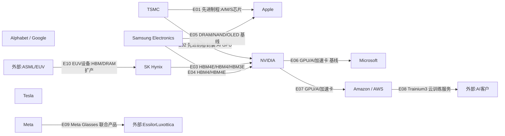

# 周一晨间科技巨头简报
- 覆盖期间：2026-06-22 至 2026-06-28（Asia/Shanghai）
- 生成时间：2026-06-29 09:45（Asia/Shanghai，手动重跑并替换旧版）
- 本期文件：reports/2026-06-29_weekly_morning_brief.md

## 1. 本周最重要的 5-8 件事
1. **Microsoft：2GW 级 Pecos 数据中心园区。** Microsoft 6 月 22 日宣布将在得州 Pecos 建设新数据中心园区，新增约 2GW 全球数据中心容量。重要性：AI 云需求正在进入电力、土地、冷却和建设周期约束阶段。[Microsoft](https://blogs.microsoft.com/blog/2026/06/22/powering-the-next-wave-of-ai-expanding-capacity-with-our-new-datacenter-in-pecos/)
2. **Amazon：追加 130 亿美元印度 AI/云基础设施投资。** Amazon 宣布 2026-2030 年在印度累计投资提高至 480 亿美元，其中新增 130 亿美元用于 AI 和云基础设施。重要性：AWS 在印度的区域容量、AI 芯片和托管 AI 服务扩张确定性提高。[Amazon](https://www.aboutamazon.com/news/company-news/amazon-india-investment)
3. **NVIDIA + AWS：生产级 AI 协作。** NVIDIA 6 月 23 日发布与 AWS 的生产级 AI 协作进展。重要性：AWS 自研 Trainium 路线和 NVIDIA GPU 路线并行，而不是简单替代。[NVIDIA](https://blogs.nvidia.com/blog/nvidia-aws-ai-production-scale/)
4. **Google：Gemini 3.5 Flash 原生支持 computer use。** Google 6 月 24 日把 computer use 作为 Gemini 3.5 Flash 内置工具开放。重要性：浏览器、桌面和移动端 agent 能力进入主力模型，而不是独立实验模型。[Google Blog](https://blog.google/innovation-and-ai/models-and-research/gemini-models/introducing-computer-use-gemini-3-5-flash/)、[Gemini API release notes](https://ai.google.dev/gemini-api/docs/changelog)
5. **Meta：与 EssilorLuxottica 推出 Meta Glasses。** Meta 6 月 23 日发布新 AI 眼镜系列，26 种款式，并从首发起集成 Muse Spark 驱动的 Meta AI。重要性：AI 眼镜从单一 Ray-Ban Meta 扩展到更宽价格和风格矩阵。[Meta](https://about.fb.com/news/2026/06/meta-essilorluxottica-partner-launch-meta-glasses/)、[EssilorLuxottica](https://www.essilorluxottica.com/en/newsroom/press-releases/essilorluxottica-meta-new-wearables-collection/)
6. **SK Hynix：HBM4E 客户验证与 ADR 融资报道成为本周跟踪重点。** 12-high HBM4E 出样公告发生在 6 月 18 日，早于本覆盖周；本周新增变化是 WSJ、FT 等媒体报道其拟通过美国 ADR 融资约 290 亿美元。重要性：HBM4E 与先进封装扩产是下一代 AI 加速器关键瓶颈。[SK Hynix](https://news.skhynix.com/12-layer-hbm4e-sample/)、[PR Newswire](https://www.prnewswire.com/news-releases/sk-hynix-ships-samples-of-12-layer-next-gen-hbm4e-302803714.html)、[WSJ](https://www.wsj.com/livecoverage/stock-market-today-dow-sp-500-nasdaq-06-24-2026/card/XGzboqrIxtaxRTnlNlHT)
7. **媒体称 Apple / Microsoft 终端价格可能受到内存成本冲击。** 多家媒体本周报道 Apple 和 Microsoft 上调部分产品价格，原因指向 AI 数据中心需求推高内存/存储成本。重要性：如果属实，AI 基建成本开始外溢到消费电子和企业终端采购。[CBS News](https://www.cbsnews.com/news/apple-price-hikes-macbook-ipad-2026/)、[Al Jazeera](https://www.aljazeera.com/economy/2026/6/26/apple-microsoft-hike-prices-over-surging-chip-costs)

## 2. 影响力速览
| 公司 | 重大事件数量 | 本周影响判断 | 关键词 |
|---|---:|---|---|
| Apple | 1 | 负面/混合 | 媒体称涨价、内存成本、AI 成本可能外溢 |
| Microsoft | 2 | 正面/混合 | Pecos 2GW、Wisconsin 投产、终端涨价 |
| Alphabet / Google | 2 | 正面/混合 | Gemini computer use、Gemini 3.5 Pro 7月发布报道 |
| Amazon | 3 | 正面/混合 | 印度 AI 云投资、Trainium、EC2 GPU 定价 |
| Meta | 2 | 正面 | Meta Glasses、Altoona 数据中心披露 |
| NVIDIA | 3 | 正面 | AWS 协作、BioNeMo Agent Toolkit、TOP500 |
| Tesla | 1 | 中性 | Q2 交付共识、储能部署共识 |
| Samsung Electronics | 1 | 中性/正面 | 2026 Sustainability Report、HBM4 能效 |
| SK Hynix | 2 | 正面 | HBM4E 出样、ADR 融资报道 |
| TSMC | 1 | 混合/正面 | 先进节点涨价报道、官方本周无新公告 |

## 3. 按公司分组
### Apple
- 日期：2026-06-25 至 2026-06-28
- 事件：媒体报道 Apple 上调部分 MacBook、iPad 等产品价格，原因指向 AI 数据中心需求导致的 DRAM/存储成本上升。
- 影响：如果媒体报道属实，AI 基础设施需求可能通过内存供应链传导到消费电子 BOM；短期对 Apple 毛利率和需求弹性偏负面，对 DRAM/HBM 供应商议价偏正面。
- 可信度：多源媒体报道，未发现 Apple 官方新闻稿；按“媒体报道/待官方确认”处理。
- 来源：[CBS News](https://www.cbsnews.com/news/apple-price-hikes-macbook-ipad-2026/)、[Al Jazeera](https://www.aljazeera.com/economy/2026/6/26/apple-microsoft-hike-prices-over-surging-chip-costs)、[The Guardian](https://www.theguardian.com/technology/2026/jun/25/apple-price-hike)

### Microsoft
- 日期：2026-06-22
- 事件：Microsoft 宣布将在 Texas Pecos 建设新数据中心园区，约新增 2GW 全球数据中心容量。
- 影响：Azure 和 AI 工作负载需求推动数据中心进入 GW 级扩容；供应链影响包括 GPU/服务器、网络、电力、冷却、建筑和天然气/电力配套。
- 可信度：已确认。
- 来源：[Microsoft Official Blog](https://blogs.microsoft.com/blog/2026/06/22/powering-the-next-wave-of-ai-expanding-capacity-with-our-new-datacenter-in-pecos/)

- 日期：2026-06-23
- 事件：Microsoft 宣布 Wisconsin Mount Pleasant 首个数据中心设施完成建设并全面运行；第二个设施仍在建设，计划 2028 年完成。
- 影响：美国本土 AI 算力供应进入投产阶段，缩短从资本开支到收入确认的链条。
- 可信度：已确认。
- 来源：[Microsoft Source](https://news.microsoft.com/source/2026/06/23/microsoft-completes-construction-on-first-datacenter-facility-in-mount-pleasant-wisconsin/)

### Alphabet / Google
- 日期：2026-06-24
- 事件：Google 发布 Gemini 3.5 Flash 内置 computer use 能力；Gemini API release notes 显示 Computer Use public preview 支持浏览器、移动端、桌面环境，并包含 safety policy 和 prompt injection 检测。
- 影响：Google 将 agent 操作能力并入主力 Flash 模型，有利于企业自动化、浏览器任务、移动/桌面工作流和 Gemini Enterprise Agent Platform。
- 可信度：已确认。
- 来源：[Google Blog](https://blog.google/innovation-and-ai/models-and-research/gemini-models/introducing-computer-use-gemini-3-5-flash/)、[Gemini API release notes](https://ai.google.dev/gemini-api/docs/changelog)

- 日期：2026-06-25 至 2026-06-28
- 事件：Business Insider 等媒体称 Gemini 3.5 Pro 发布时间可能在 7 月，原因是 Google 仍在优化长周期 agent 任务和早测反馈；未见 Google 官方确认。
- 影响：短期可能影响市场对 Google frontier model 发布节奏的判断；中期看，若更多测试换来更稳定的长任务能力，对企业采用更重要。
- 可信度：媒体报道，未见 Google 官方确认；按“媒体报道/待官方确认”处理。
- 来源：[Business Insider](https://www.businessinsider.com/google-3-5-pro-july-release-tokens-ai-agents-model-2026-6)

### Amazon
- 日期：2026-06-23
- 事件：Amazon 披露 AWS Trainium 在 AI 初创公司训练 world models 中的采用案例；Odyssey 在 Trainium3 上实现 80% MFU。
- 影响：AWS 自研 AI 芯片路线继续增强，目标是降低客户训练/推理成本，并在部分工作负载上减少对 NVIDIA GPU 的边际依赖。
- 可信度：已确认。
- 来源：[Amazon](https://www.aboutamazon.com/news/aws/why-ai-startups-choose-amazon-trainium-chips)

- 日期：2026-06-25
- 事件：Amazon 宣布 2026-2030 年在印度投资累计提高至 480 亿美元，其中新增 130 亿美元用于 AI 和云基础设施。
- 影响：AWS 印度数据中心、AI 芯片、托管 AI 服务和开发工具扩容，利好本地云生态与数据中心供应链。
- 可信度：已确认。
- 来源：[Amazon](https://www.aboutamazon.com/news/company-news/amazon-india-investment)、[TechCrunch](https://techcrunch.com/2026/06/25/amazon-ups-india-bet-with-fresh-13b-ai-infrastructure-investment/)

- 日期：2026-06-26
- 事件：Business Insider 报道 AWS 将 EC2 Capacity Blocks for ML 价格上调约 20%，7 月生效；该服务用于提前预留 GPU 资源。
- 影响：反映 GPU/HBM 供需紧张和云厂商定价权；对 AI 初创和企业训练预算不利，对云厂商和上游 AI 硬件供应商偏正面。
- 可信度：媒体报道；需以 AWS 官方定价页最终为准。
- 来源：[Business Insider](https://www.businessinsider.com/amazon-raises-ai-cloud-prices-memory-chip-costs-soar-2026-6)、[TheStreet](https://www.thestreet.com/investing/amazon-raises-price-ai-ec2-capacity-blocks)

### Meta
- 日期：2026-06-23
- 事件：Meta 与 EssilorLuxottica 推出 Meta Glasses，首发 26 种款式，并集成 Muse Spark 驱动的 Meta AI。
- 影响：AI 眼镜产品线扩展，涉及镜框/镜片、摄像头、音频、传感器、电池、端侧芯片和零售渠道供应链。
- 可信度：已确认。
- 来源：[Meta](https://about.fb.com/news/2026/06/meta-essilorluxottica-partner-launch-meta-glasses/)、[EssilorLuxottica](https://www.essilorluxottica.com/en/newsroom/press-releases/essilorluxottica-meta-new-wearables-collection/)

- 日期：2026-06-26
- 事件：Meta 发布 Altoona, Iowa 数据中心内部介绍，展示计算服务器和可持续冷却系统。
- 影响：不是新建项目公告，但说明 Meta 继续围绕 AI/社交基础设施披露数据中心能力。
- 可信度：已确认。
- 来源：[Meta](https://about.fb.com/news/2026/06/inside-meta-data-center/)

### NVIDIA
- 日期：2026-06-23
- 事件：NVIDIA 与 AWS 发布生产级 AI 协作进展。
- 影响：强化 NVIDIA GPU、网络、软件和 AWS 云服务的生产部署关系；AWS Trainium 与 NVIDIA GPU 将按工作负载分层共存。
- 可信度：已确认。
- 来源：[NVIDIA](https://blogs.nvidia.com/blog/nvidia-aws-ai-production-scale/)

- 日期：2026-06-23
- 事件：NVIDIA 发布 BioNeMo Agent Toolkit，为生命科学 agent 提供领域工具、模型和工作流能力。
- 影响：NVIDIA 继续从硬件扩展到行业 AI 软件平台，重点覆盖药物发现、基因组、医学影像和实验自动化。
- 可信度：已确认。
- 来源：[NVIDIA Newsroom](https://nvidianews.nvidia.com/news/nvidia-launches-bionemo-agent-toolkit-giving-ai-agents-the-tools-to-accelerate-scientific-discovery)

- 日期：2026-06-23
- 事件：NVIDIA 称其技术运行于 TOP500 中超过 400 台系统，占 81%；376 台 TOP500 系统使用 NVIDIA networking。
- 影响：巩固 NVIDIA 在 HPC/AI 超算中的基础设施地位。
- 可信度：已确认。
- 来源：[NVIDIA Blog](https://blogs.nvidia.com/blog/top500-green500-supercomputers-isc-2026/)、[TOP500](https://top500.org/lists/top500/list/2026/06/)

### Tesla
- 日期：2026-06-26
- 事件：Tesla 发布 Q2 2026 delivery consensus：Q2 total deliveries 共识为 406,024 辆，energy storage deployed 为 13.8GWh。
- 影响：这是公司汇总的卖方共识，不是官方交付实绩；为 7 月初实际交付和储能数据设定基准。
- 可信度：已确认。
- 来源：[Tesla IR](https://ir.tesla.com/press-release/delivery-consensus-second-quarter-2026)

### Samsung Electronics
- 日期：2026-06-26
- 事件：Samsung Electronics 发布 2026 Sustainability Report，强调水资源管理、可持续制造，以及 AI 时代半导体业务的低功耗/能效目标。
- 影响：AI 基础设施客户对 HBM、服务器 SSD 和制造环节的能效/用水要求提高；Samsung 将可持续性作为 DS 部门竞争力的一部分。
- 可信度：已确认。
- 来源：[Samsung Newsroom](https://news.samsung.com/global/samsung-electronics-releases-2026-sustainability-report-expanding-water-replenishment-efforts)、[Samsung Sustainability](https://www.samsung.com/global/sustainability/)

### SK Hynix
- 日期：2026-06-18，本周持续影响
- 事件：SK Hynix 宣布向主要客户出样 12 层 HBM4E，最大速度 16Gbps/pin，并称使用 Advanced MR-MUF 降低热阻。
- 影响：HBM4E 进入客户验证阶段，直接影响 NVIDIA/云 AI 加速器下一代平台的内存供应格局。
- 可信度：已确认；事件日期早于本周，但本周仍是市场和供应链主要跟踪事项。
- 来源：[SK Hynix](https://news.skhynix.com/12-layer-hbm4e-sample/)、[PR Newswire](https://www.prnewswire.com/news-releases/sk-hynix-ships-samples-of-12-layer-next-gen-hbm4e-302803714.html)

- 日期：2026-06-24 至 2026-06-25
- 事件：WSJ、FT、Tom's Hardware 等报道 SK Hynix 拟通过美国 ADR 上市融资约 290 亿美元，资金用于 AI 内存晶圆厂、先进封装和 EUV 设备。
- 影响：若落地，将显著增强 HBM/先进封装产能资金来源；同时表明资本市场对 AI 内存周期定价强。
- 可信度：权威媒体报道，需等待正式监管文件和公司公告确认。
- 来源：[WSJ](https://www.wsj.com/livecoverage/stock-market-today-dow-sp-500-nasdaq-06-24-2026/card/XGzboqrIxtaxRTnlNlHT)、[FT](https://www.ft.com/content/3f052dba-78a4-43bb-af45-9af2f3441fd5)、[Tom's Hardware](https://www.tomshardware.com/tech-industry/sk-hynix-files-to-raise-up-to-29-billion-in-nasdaq-listing)

### TSMC
- 日期：2026-06-24 至 2026-06-25
- 事件：媒体报道 TSMC 将对 2nm、3nm、5nm、7nm 等先进节点提价，影响 NVIDIA、Apple、AMD、Qualcomm、Broadcom、MediaTek 等客户；TSMC 官方最新新闻页本周未见对应确认公告。
- 影响：若确认，TSMC 先进制程定价权继续增强；客户成本可能向 GPU、AI ASIC、手机 SoC 和终端价格传导。
- 可信度：媒体报道/待官方确认。
- 来源：[Tom's Hardware](https://www.tomshardware.com/tech-industry/semiconductors/tsmc-is-reportedly-hiking-prices-for-all-advanced-nodes-accounting-for-74-percent-of-the-companys-wafer-business-nvidia-amd-apple-qualcomm-and-others-will-face-higher-wafer-costs)、[TSMC Latest News](https://pr.tsmc.com/english/latest-news)

## 4. 跨公司与产业链观察
1. **AI 数据中心的瓶颈正在从 GPU 扩散到电力、内存和价格。** Microsoft 的 2GW Pecos、Amazon 的印度 AI/云投资、AWS GPU 预留价格报道共同指向算力需求仍强。
2. **HBM/DRAM 紧缺开始影响终端品牌。** Apple/Microsoft 价格报道、SK Hynix HBM4E、Samsung Sustainability Report 中的 AI/能效叙事都说明内存已经从 commodity 转为战略瓶颈。
3. **云厂商自研芯片不是 NVIDIA 的简单替代。** AWS Trainium/Graviton 与 NVIDIA-AWS 协作同周出现，说明 hyperscaler 会按成本、可用性、软件生态和工作负载分层采购。
4. **Agent 能力进入主流产品。** Google Gemini computer use、NVIDIA BioNeMo Agent Toolkit、Meta Glasses 都是“模型能力进入具体工作流/设备/行业工具”的例子。
5. **先进制程成本上升可能继续传导。** TSMC 提价报道若确认，将影响 Apple、NVIDIA 和云 ASIC 客户的长期成本结构。

## 5. 下周需关注
1. Tesla Q2 2026 实际交付与储能部署是否高于 406,024 辆和 13.8GWh 共识。
2. SK Hynix ADR 融资是否出现正式 SEC/交易所文件，资金用途是否确认指向 HBM4E、Yongin、Cheongju 和 EUV。
3. TSMC 先进节点提价报道是否被公司、客户或供应链进一步确认。
4. AWS EC2 Capacity Blocks for ML 的新价格是否在官方 pricing 页面落地，其他云厂商是否跟进。
5. Microsoft Pecos 项目的电力、天然气、用水、许可和社区审批进度。

## 6. 十家公司供应关系图谱与周度变化
### 6.1 本周供应关系可视化

### 6.2 供应关系明细表
| Edge ID | 供应方 | 客户/使用方 | 具体产品/服务 | 关系类型 | 本周证据 | 长期基线证据/限制 | 本周状态 | 来源链接 |
|---|---|---|---|---|---|---|---|---|
| E01 | TSMC | Apple | A/M/S 系列芯片先进制程代工 | 代工 | 本周 TSMC 涨价报道列 Apple 为受影响客户；无官方新公告 | 长期核心关系，但本周证据是媒体报道的价格风险，不是新供货确认 | 延续/风险 | [Tom's Hardware](https://www.tomshardware.com/tech-industry/semiconductors/tsmc-is-reportedly-hiking-prices-for-all-advanced-nodes-accounting-for-74-percent-of-the-companys-wafer-business-nvidia-amd-apple-qualcomm-and-others-will-face-higher-wafer-costs) |
| E02 | TSMC | NVIDIA | AI GPU 先进制程与封装 | 代工/封装 | TSMC 涨价报道列 NVIDIA 为受影响客户；NVIDIA AI 基础设施需求本周继续强 | 具体订单/封装份额本周无官方新披露 | 延续/风险 | [Tom's Hardware](https://www.tomshardware.com/tech-industry/semiconductors/tsmc-is-reportedly-hiking-prices-for-all-advanced-nodes-accounting-for-74-percent-of-the-companys-wafer-business-nvidia-amd-apple-qualcomm-and-others-will-face-higher-wafer-costs)、[NVIDIA](https://blogs.nvidia.com/blog/top500-green500-supercomputers-isc-2026/) |
| E03 | SK Hynix | NVIDIA/AI 加速器客户 | HBM4E/HBM4/HBM3E | 内存供应 | HBM4E 出样为覆盖周外事件；本周 ADR 融资报道指向 HBM/先进封装扩产 | 客户名单和订单规模需等待公司或客户进一步披露 | 增强/媒体报道 | [SK Hynix](https://news.skhynix.com/12-layer-hbm4e-sample/)、[PR Newswire](https://www.prnewswire.com/news-releases/sk-hynix-ships-samples-of-12-layer-next-gen-hbm4e-302803714.html)、[WSJ](https://www.wsj.com/livecoverage/stock-market-today-dow-sp-500-nasdaq-06-24-2026/card/XGzboqrIxtaxRTnlNlHT) |
| E04 | Samsung Electronics | NVIDIA/AI 加速器客户 | HBM4/HBM4E | 内存供应 | Samsung 2026 Sustainability Report 强调 AI 时代半导体低功耗/能效；本周无新客户奖项 | 作为 HBM 竞争格局基线保留，不能解读为本周新增订单 | 延续/无本周新增证据 | [Samsung Newsroom](https://news.samsung.com/global/samsung-electronics-releases-2026-sustainability-report-expanding-water-replenishment-efforts) |
| E05 | Samsung Electronics | Apple | DRAM/NAND/OLED 等零部件 | 供应 | Apple 价格报道显示内存/存储成本压力；具体供应商份额未在本周确认 | 长期零部件供应关系基线，当前只支持“成本风险”判断 | 风险/基线不足 | [CBS News](https://www.cbsnews.com/news/apple-price-hikes-macbook-ipad-2026/) |
| E06 | NVIDIA | Microsoft | GPU/AI 加速卡、网络与软件生态 | 供应 | Microsoft 2GW Pecos 和 Wisconsin 投产说明 AI 算力需求延续；具体采购未披露 | 作为 AI 数据中心供应链基线保留，不标记为本周新采购 | 延续/基线不足 | [Microsoft](https://blogs.microsoft.com/blog/2026/06/22/powering-the-next-wave-of-ai-expanding-capacity-with-our-new-datacenter-in-pecos/) |
| E07 | NVIDIA | Amazon / AWS | GPU/AI 基础设施与软件栈 | 供应/合作 | NVIDIA 与 AWS 本周发布生产级 AI 协作进展 | 这是本周最直接的供应/合作证据之一 | 增强 | [NVIDIA-AWS](https://blogs.nvidia.com/blog/nvidia-aws-ai-production-scale/) |
| E08 | Amazon / AWS | AI 初创企业/客户 | Trainium3、Bedrock、云训练服务 | 云服务/竞争替代 | Amazon 披露 Odyssey 等 AI startup 使用 Trainium | 该边不是十家公司内部关系，但解释 AWS 自研芯片对 NVIDIA 的替代压力 | 增强 | [Amazon Trainium](https://www.aboutamazon.com/news/aws/why-ai-startups-choose-amazon-trainium-chips) |
| E09 | Meta | EssilorLuxottica | Meta Glasses 镜框、镜片、渠道与 AI 眼镜产品 | 合作 | 双方本周正式发布 Meta Glasses | 本周新增、证据直接 | 新增 | [Meta](https://about.fb.com/news/2026/06/meta-essilorluxottica-partner-launch-meta-glasses/)、[EssilorLuxottica](https://www.essilorluxottica.com/en/newsroom/press-releases/essilorluxottica-meta-new-wearables-collection/) |
| E10 | ASML/EUV | SK Hynix | EUV 设备用于 HBM/DRAM 扩产 | 设备供应 | SK Hynix ADR 融资报道提及 EUV 设备和先进制造投资 | 外部设备节点；媒体报道，需等待正式融资文件确认 | 增强/媒体报道 | [Tom's Hardware](https://www.tomshardware.com/tech-industry/sk-hynix-files-to-raise-up-to-29-billion-in-nasdaq-listing) |

### 6.3 与上周的区别
因 `reports/latest.md` 和 `state/supply_graph_baseline.json` 此前不存在，本次为首次正式基线；以下对比基于公开来源重建，上周基线不足的关系已在表格中标注。

- 新增关系：
  - Meta 与 EssilorLuxottica 的 Meta Glasses 联合产品关系本周正式新增，产品为 Meta Adventurer、Meta Fury、Meta Glasses by Kylie 等 AI 眼镜款式。

- 强化关系：
  - NVIDIA 与 AWS：本周 NVIDIA 官方发布双方生产级 AI 协作，关系从“长期合作”强化为“生产部署叙事”。
  - Microsoft 与 AI 基础设施供应链：Pecos 2GW 和 Wisconsin 投产强化其对 GPU、服务器、电力、冷却和建筑供应链的需求。
  - SK Hynix 与 AI 加速器客户：HBM4E 样品属于覆盖周外事件，但本周 ADR 融资报道强化了 HBM 扩产/验证逻辑。
  - Amazon 自研芯片路线：Trainium3 客户案例强化 AWS 自研 silicon 在 AI 训练中的定位。

- 弱化或风险关系：
  - Apple 与内存/存储供应链：媒体称 DRAM/NAND 成本压力可能已经传导到终端价格，但缺少 Apple 官方确认。
  - AWS AI 云客户：EC2 Capacity Blocks for ML 涨价报道显示 GPU/HBM 稀缺成本向客户传导。
  - TSMC 客户群：先进节点涨价报道若确认，将增加 Apple、NVIDIA、Amazon、Google 等客户成本。

- 无明显变化但关键关系：
  - TSMC 对 Apple、NVIDIA 和云 ASIC 客户的先进制程地位仍是核心瓶颈。
  - Samsung 与 SK Hynix 在 HBM/DRAM/NAND 中的议价能力仍受 AI 服务器需求支撑。
  - NVIDIA 对 Microsoft、AWS 等 hyperscaler 的 AI 训练/推理基础设施影响仍未被自研芯片完全替代；Google、Meta、Tesla 本周没有足够直接证据进入主图。

## 7. 本期自检
- 日期范围已限定为 2026-06-22 至 2026-06-28；SK Hynix HBM4E 出样发生在 6 月 18 日，但本周继续构成供应链主要跟踪事项，已明确标注。
- 10 家公司均已覆盖；无官方确认的事项均标注为“媒体报道/待官方确认”或“基线不足”。
- 每条事件均附来源链接，优先使用公司公告、官方博客、IR 页面和权威媒体。
- Mermaid 使用 `flowchart LR` 和 ASCII 节点 ID，包含全部 10 家覆盖公司。
- 图中所有关系边均能在 6.2 表格中找到相同 Edge ID 的证据或风险标注；无本周直接证据的边已从主图删除或降级为基线说明。
- GitHub 同步：上一版已完成，commit: 761a42b，branch: main；本审查修正版将在校验通过后追加提交。
