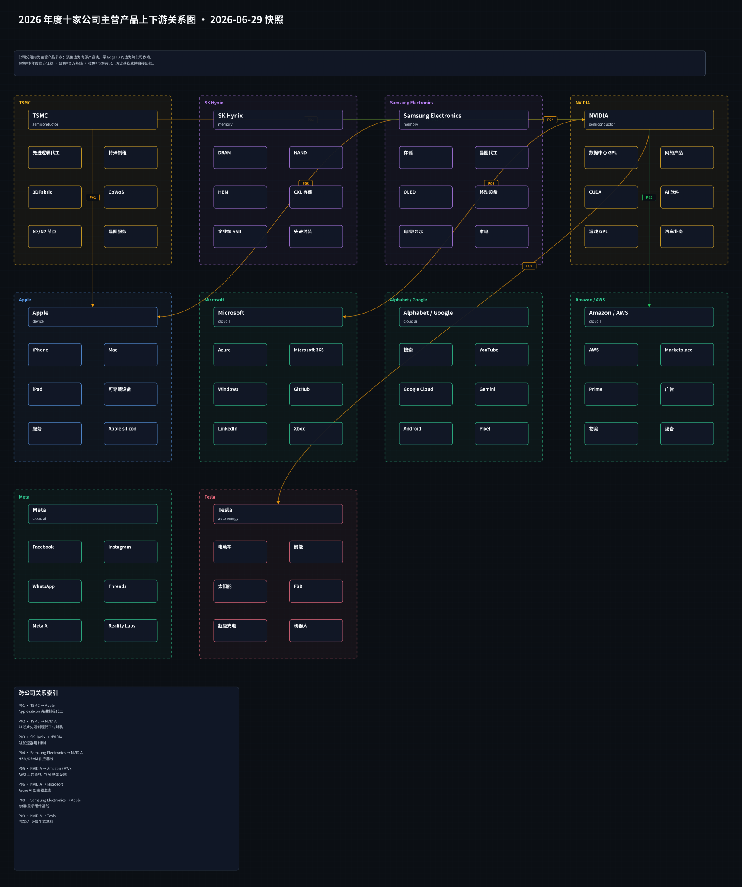
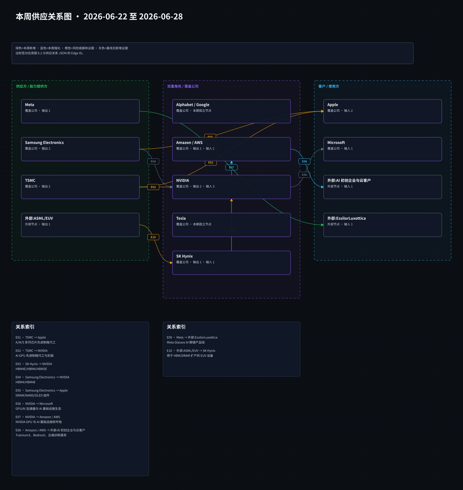

# 周一晨间科技巨头简报
<!-- weekly-brief-schema: 2 -->
- 覆盖期间：2026-06-22 至 2026-06-28（Asia/Shanghai）
- 生成时间：2026-06-29 17:05（Asia/Shanghai，本轮自动化复核）
- 本期文件：reports/2026-06-29_weekly_morning_brief.md

## 1. 本周最重要的 10 件事
1. **Microsoft：2GW 级 Pecos 数据中心园区。** Microsoft 6 月 22 日宣布将在得州 Pecos 建设新数据中心园区，新增约 2GW 全球数据中心容量。重要性：AI 云需求正在进入电力、土地、冷却和建设周期约束阶段。[Microsoft](https://blogs.microsoft.com/blog/2026/06/22/powering-the-next-wave-of-ai-expanding-capacity-with-our-new-datacenter-in-pecos/)
2. **Amazon：追加 130 亿美元印度 AI/云基础设施投资。** Amazon 宣布 2026-2030 年在印度累计投资提高至 480 亿美元，其中新增 130 亿美元用于 AI 和云基础设施。重要性：AWS 在印度的区域容量、AI 芯片和托管 AI 服务扩张确定性提高。[Amazon](https://www.aboutamazon.com/news/company-news/amazon-india-investment)
3. **NVIDIA + AWS：生产级 AI 协作。** NVIDIA 6 月 23 日发布与 AWS 的生产级 AI 协作进展。重要性：AWS 自研 Trainium 路线和 NVIDIA GPU 路线并行，而不是简单替代。[NVIDIA](https://blogs.nvidia.com/blog/nvidia-aws-ai-production-scale/)
4. **Google：Gemini 3.5 Flash 原生支持“计算机使用”（computer use）。** Google 6 月 24 日把计算机使用能力作为 Gemini 3.5 Flash 内置工具开放。重要性：浏览器、桌面和移动端 agent 能力进入主力模型，而不是独立实验模型。[Google 官方博客](https://blog.google/innovation-and-ai/models-and-research/gemini-models/introducing-computer-use-gemini-3-5-flash/)、[Gemini API 版本说明](https://ai.google.dev/gemini-api/docs/changelog)
5. **Meta：与 EssilorLuxottica 推出 Meta Glasses。** Meta 6 月 23 日发布新 AI 眼镜系列，26 种款式，并从首发起集成 Muse Spark 驱动的 Meta AI。重要性：AI 眼镜从单一 Ray-Ban Meta 扩展到更宽价格和风格矩阵。[Meta](https://about.fb.com/news/2026/06/meta-essilorluxottica-partner-launch-meta-glasses/)、[EssilorLuxottica](https://www.essilorluxottica.com/en/newsroom/press-releases/essilorluxottica-meta-new-wearables-collection/)
6. **SK Hynix：HBM4E 客户验证与 ADR 融资报道成为本周跟踪重点。** 12-high HBM4E 出样公告发生在 6 月 18 日，早于本覆盖周；本周新增变化是 WSJ、FT 等媒体报道其拟通过美国 ADR 融资约 290 亿美元。重要性：HBM4E 与先进封装扩产是下一代 AI 加速器关键瓶颈。[SK Hynix](https://news.skhynix.com/en/12-layer-hbm4e-sample-1/)、[PR Newswire](https://www.prnewswire.com/news-releases/sk-hynix-ships-samples-of-12-layer-next-gen-hbm4e-302803714.html)、[WSJ](https://www.wsj.com/livecoverage/stock-market-today-dow-sp-500-nasdaq-06-24-2026/card/XGzboqrIxtaxRTnlNlHT)
7. **媒体称 Apple / Microsoft 终端价格可能受到内存成本冲击。** 多家媒体本周报道 Apple 和 Microsoft 上调部分产品价格，原因指向 AI 数据中心需求推高内存/存储成本。重要性：如果属实，AI 基建成本开始外溢到消费电子和企业终端采购。[CBS News](https://www.cbsnews.com/news/apple-price-hikes-macbook-ipad-2026/)、[Al Jazeera](https://www.aljazeera.com/economy/2026/6/26/apple-microsoft-hike-prices-over-surging-chip-costs)
8. **Microsoft：Microsoft 宣布 Wisconsin Mount Pleasant 首个数据中心设施完成建设并全面运行；第二个设施仍在建设，计划 2028 年完成。** 重要性：美国本土 AI 算力供应进入投产阶段，缩短从资本开支到收入确认的链条。[Microsoft Source](https://news.microsoft.com/source/2026/06/23/microsoft-completes-construction-on-first-datacenter-facility-in-mount-pleasant-wisconsin/)
9. **Alphabet / Google：Business Insider 等媒体称 Gemini 3.5 Pro 发布时间可能在 7 月，原因是 Google 仍在优化长周期 agent 任务和早测反馈；未见 Google 官方确认。** 重要性：短期可能影响市场对 Google frontier model 发布节奏的判断；中期看，若更多测试换来更稳定的长任务能力，对企业采用更重要。[Business Insider](https://www.businessinsider.com/google-3-5-pro-july-release-tokens-ai-agents-model-2026-6)
10. **Meta：Meta 发布 Altoona, Iowa 数据中心内部介绍，展示计算服务器和可持续冷却系统。** 重要性：不是新建项目公告，但说明 Meta 继续围绕 AI/社交基础设施披露数据中心能力。[Meta](https://about.fb.com/news/2026/06/inside-meta-data-center/)

## 2. 投资判断速览
| 公司 | 本周变化 | 影响指标 | 预期差 | 判断 | 验证条件 |
|---|---|---|---|---|---|
| Apple | 媒体报道 Apple 上调部分 MacBook、iPad 等产品价格，原因指向 AI 数据中心需求导致的 DRAM/存储成本上升 | ASP、毛利率、销量与成本传导 | 存在交易预期但缺少官方确认，按低置信度折价 | 负面 | 等待 Apple 官方公告、监管文件或财报确认 |
| Microsoft | Microsoft 宣布将在 Texas Pecos 建设新数据中心园区，约新增 2GW 全球数据中心容量 | 资本开支、算力上线量与利用率 | 新增量化基线，需与后续指引及一致预期比较 | 混合 | 跟踪资本开支执行、产能上线、具名客户与订单披露 |
| Alphabet / Google | Google 发布 Gemini 3.5 Flash 内置计算机使用（computer use）能力；Gemini API 版本说明显示该能力的公开… | 活跃用户、API 调用量、付费转化与推理成本 | 新增量化基线，需与后续指引及一致预期比较 | 混合 | 跟踪正式可用范围、定价、活跃使用、付费转化及第三方基准 |
| Amazon / AWS | 未发现可确认重大事件 | 沿用上期关键经营指标 | 无新增预期差 | 无重大变化 | 等待 Amazon / AWS 官方公告或下次财报 |
| Meta | Meta 与 EssilorLuxottica 推出 Meta Glasses，首发 26 种款式，并集成 Muse Spark 驱动的 Meta… | 产品出货量、ASP、毛利率与客户采用 | 新增量化基线，需与后续指引及一致预期比较 | 正面 | 跟踪正式上市范围、出货量、ASP、毛利率与渠道库存 |
| NVIDIA | NVIDIA 与 AWS 发布生产级 AI 协作进展 | 云收入增速、积压订单、资本开支与利润率 | 新增事实方向明确，幅度是否超出一致预期仍待量化 | 正面 | 等待 NVIDIA 后续公告或下次财报给出可量化证据 |
| Tesla | Tesla 发布 2026 年第二季度交付共识数据：二季度总交付量共识为 406,024 辆，储能部署共识为 13.8GWh | 交付量、汽车毛利率、储能部署与库存 | 新增量化基线，需与后续指引及一致预期比较 | 中性 | 跟踪季度交付、库存、价格、毛利率与监管许可 |
| Samsung Electronics | Samsung Electronics 发布 2026 可持续发展报告，强调水资源管理、可持续制造，以及 AI 时代半导体业务的低功耗/能效目标 | 能耗、水耗、单位产出成本与客户认证 | 新增量化基线，需与后续指引及一致预期比较 | 正面 | 跟踪单位能耗、水耗、客户认证与制造成本变化 |
| SK Hynix | SK Hynix 宣布向主要客户出样 12 层 HBM4E，最大速度 16Gbps/pin，并称使用 Advanced MR-MUF 降低热阻 | 出货量、ASP、良率与产能利用率 | 方向偏正面；幅度是否高于一致预期仍需财报量化 | 正面 | 跟踪资本开支执行、产能上线、具名客户与订单披露 |
| TSMC | 媒体报道 TSMC 将对 2nm、3nm、5nm、7nm 等先进节点提价，影响 NVIDIA、Apple、AMD、Qualcomm、Broadcom… | ASP、毛利率、销量与成本传导 | 存在交易预期但缺少官方确认，按低置信度折价 | 混合 | 等待 TSMC 官方公告、监管文件或财报确认 |

## 3. 发生变化的公司

### 3.1 Apple
- 日期：2026-06-25 至 2026-06-28
- 事件：媒体报道 Apple 上调部分 MacBook、iPad 等产品价格，原因指向 AI 数据中心需求导致的 DRAM/存储成本上升。
- 投资影响：如果媒体报道属实，AI 基础设施需求可能通过内存供应链传导到消费电子 BOM；短期对 Apple 毛利率和需求弹性偏负面，对 DRAM/HBM 供应商议价偏正面。
- 影响指标：ASP、毛利率、销量与成本传导
- 预期差：存在交易预期但缺少官方确认，按低置信度折价
- 验证条件：等待 Apple 官方公告、监管文件或财报确认
- 可信度：多源媒体报道，未发现 Apple 官方新闻稿；按“媒体报道/待官方确认”处理。
- 来源：[CBS News](https://www.cbsnews.com/news/apple-price-hikes-macbook-ipad-2026/)、[Al Jazeera](https://www.aljazeera.com/economy/2026/6/26/apple-microsoft-hike-prices-over-surging-chip-costs)、[The Guardian](https://www.theguardian.com/technology/2026/jun/25/apple-price-hike)

### 3.2 Microsoft
- 日期：2026-06-22
- 事件：Microsoft 宣布将在 Texas Pecos 建设新数据中心园区，约新增 2GW 全球数据中心容量。
- 投资影响：Azure 和 AI 工作负载需求推动数据中心进入 GW 级扩容；供应链影响包括 GPU/服务器、网络、电力、冷却、建筑和天然气/电力配套。
- 影响指标：资本开支、算力上线量与利用率
- 预期差：新增量化基线，需与后续指引及一致预期比较
- 验证条件：跟踪资本开支执行、产能上线、具名客户与订单披露
- 可信度：已确认。
- 来源：[Microsoft Official Blog](https://blogs.microsoft.com/blog/2026/06/22/powering-the-next-wave-of-ai-expanding-capacity-with-our-new-datacenter-in-pecos/)

- 日期：2026-06-23
- 事件：Microsoft 宣布 Wisconsin Mount Pleasant 首个数据中心设施完成建设并全面运行；第二个设施仍在建设，计划 2028 年完成。
- 投资影响：美国本土 AI 算力供应进入投产阶段，缩短从资本开支到收入确认的链条。
- 影响指标：资本开支、算力上线量与利用率
- 预期差：新增量化基线，需与后续指引及一致预期比较
- 验证条件：跟踪资本开支执行、产能上线、具名客户与订单披露
- 可信度：已确认。
- 来源：[Microsoft Source](https://news.microsoft.com/source/2026/06/23/microsoft-completes-construction-on-first-datacenter-facility-in-mount-pleasant-wisconsin/)

### 3.3 Alphabet / Google
- 日期：2026-06-24
- 事件：Google 发布 Gemini 3.5 Flash 内置计算机使用（computer use）能力；Gemini API 版本说明显示该能力的公开预览支持浏览器、移动端、桌面环境，并包含安全策略和提示词注入检测。
- 投资影响：Google 将 agent 操作能力并入主力 Flash 模型，有利于企业自动化、浏览器任务、移动/桌面工作流和 Gemini Enterprise Agent Platform。
- 影响指标：活跃用户、API 调用量、付费转化与推理成本
- 预期差：新增量化基线，需与后续指引及一致预期比较
- 验证条件：跟踪正式可用范围、定价、活跃使用、付费转化及第三方基准
- 可信度：已确认。
- 来源：[Google 官方博客](https://blog.google/innovation-and-ai/models-and-research/gemini-models/introducing-computer-use-gemini-3-5-flash/)、[Gemini API 版本说明](https://ai.google.dev/gemini-api/docs/changelog)

### 3.4 Meta
- 日期：2026-06-23
- 事件：Meta 与 EssilorLuxottica 推出 Meta Glasses，首发 26 种款式，并集成 Muse Spark 驱动的 Meta AI。
- 投资影响：AI 眼镜产品线扩展，涉及镜框/镜片、摄像头、音频、传感器、电池、端侧芯片和零售渠道供应链。
- 影响指标：产品出货量、ASP、毛利率与客户采用
- 预期差：新增量化基线，需与后续指引及一致预期比较
- 验证条件：跟踪正式上市范围、出货量、ASP、毛利率与渠道库存
- 可信度：已确认。
- 来源：[Meta](https://about.fb.com/news/2026/06/meta-essilorluxottica-partner-launch-meta-glasses/)、[EssilorLuxottica](https://www.essilorluxottica.com/en/newsroom/press-releases/essilorluxottica-meta-new-wearables-collection/)

### 3.5 NVIDIA
- 日期：2026-06-23
- 事件：NVIDIA 与 AWS 发布生产级 AI 协作进展。
- 投资影响：强化 NVIDIA GPU、网络、软件和 AWS 云服务的生产部署关系；AWS Trainium 与 NVIDIA GPU 将按工作负载分层共存。
- 影响指标：云收入增速、积压订单、资本开支与利润率
- 预期差：新增事实方向明确，幅度是否超出一致预期仍待量化
- 验证条件：等待 NVIDIA 后续公告或下次财报给出可量化证据
- 可信度：已确认。
- 来源：[NVIDIA](https://blogs.nvidia.com/blog/nvidia-aws-ai-production-scale/)

### 3.6 Tesla
- 日期：2026-06-26
- 事件：Tesla 发布 2026 年第二季度交付共识数据：二季度总交付量共识为 406,024 辆，储能部署共识为 13.8GWh。
- 投资影响：这是公司汇总的卖方共识，不是官方交付实绩；为 7 月初实际交付和储能数据设定基准。
- 影响指标：交付量、汽车毛利率、储能部署与库存
- 预期差：新增量化基线，需与后续指引及一致预期比较
- 验证条件：跟踪季度交付、库存、价格、毛利率与监管许可
- 可信度：已确认。
- 来源：[Tesla IR](https://ir.tesla.com/press-release/delivery-consensus-second-quarter-2026)

### 3.7 Samsung Electronics
- 日期：2026-06-26
- 事件：Samsung Electronics 发布 2026 可持续发展报告，强调水资源管理、可持续制造，以及 AI 时代半导体业务的低功耗/能效目标。
- 投资影响：AI 基础设施客户对 HBM、服务器 SSD 和制造环节的能效/用水要求提高；Samsung 将可持续性作为 DS 部门竞争力的一部分。
- 影响指标：能耗、水耗、单位产出成本与客户认证
- 预期差：新增量化基线，需与后续指引及一致预期比较
- 验证条件：跟踪单位能耗、水耗、客户认证与制造成本变化
- 可信度：已确认。
- 来源：[Samsung Newsroom](https://news.samsung.com/global/samsung-electronics-releases-2026-sustainability-report-expanding-water-replenishment-efforts)、[Samsung Sustainability](https://www.samsung.com/global/sustainability/)

### 3.8 SK Hynix
- 日期：2026-06-18，本周持续影响
- 事件：SK Hynix 宣布向主要客户出样 12 层 HBM4E，最大速度 16Gbps/pin，并称使用 Advanced MR-MUF 降低热阻。
- 投资影响：HBM4E 进入客户验证阶段，直接影响 NVIDIA/云 AI 加速器下一代平台的内存供应格局。
- 影响指标：出货量、ASP、良率与产能利用率
- 预期差：方向偏正面；幅度是否高于一致预期仍需财报量化
- 验证条件：跟踪资本开支执行、产能上线、具名客户与订单披露
- 可信度：已确认；事件日期早于本周，但本周仍是市场和供应链主要跟踪事项。
- 来源：[SK Hynix](https://news.skhynix.com/en/12-layer-hbm4e-sample-1/)、[PR Newswire](https://www.prnewswire.com/news-releases/sk-hynix-ships-samples-of-12-layer-next-gen-hbm4e-302803714.html)

### 3.9 TSMC
- 日期：2026-06-24 至 2026-06-25
- 事件：媒体报道 TSMC 将对 2nm、3nm、5nm、7nm 等先进节点提价，影响 NVIDIA、Apple、AMD、Qualcomm、Broadcom、MediaTek 等客户；TSMC 官方最新新闻页本周未见对应确认公告。
- 投资影响：若确认，TSMC 先进制程定价权继续增强；客户成本可能向 GPU、AI ASIC、手机 SoC 和终端价格传导。
- 影响指标：ASP、毛利率、销量与成本传导
- 预期差：存在交易预期但缺少官方确认，按低置信度折价
- 验证条件：等待 TSMC 官方公告、监管文件或财报确认
- 可信度：媒体报道/待官方确认。
- 来源：[Tom's Hardware](https://www.tomshardware.com/tech-industry/semiconductors/tsmc-is-reportedly-hiking-prices-for-all-advanced-nodes-accounting-for-74-percent-of-the-companys-wafer-business-nvidia-amd-apple-qualcomm-and-others-will-face-higher-wafer-costs)、[TSMC 新闻](https://pr.tsmc.com/english/latest-news)

### 3.10 无重大变化公司
- Amazon / AWS：未发现可确认重大事件；沿用上期基线，不写成新增事实。

## 4. 跨公司与产业链判断
1. **AI 数据中心的瓶颈正在从 GPU 扩散到电力、内存和价格。** Microsoft 的 2GW Pecos、Amazon 的印度 AI/云投资、AWS GPU 预留价格报道共同指向算力需求仍强。
2. **HBM/DRAM 紧缺开始影响终端品牌。** Apple/Microsoft 价格报道、SK Hynix HBM4E、Samsung 可持续发展报告中的 AI/能效叙事都说明内存已经从大宗商品转为战略瓶颈。
3. **云厂商自研芯片不是 NVIDIA 的简单替代。** AWS Trainium/Graviton 与 NVIDIA-AWS 协作同周出现，说明超大规模云厂商会按成本、可用性、软件生态和工作负载分层采购。
4. **Agent 能力进入主流产品。** Google Gemini 计算机使用、NVIDIA BioNeMo Agent Toolkit、Meta Glasses 都是“模型能力进入具体工作流/设备/行业工具”的例子。
5. **先进制程成本上升可能继续传导。** TSMC 提价报道若确认，将影响 Apple、NVIDIA 和云 ASIC 客户的长期成本结构。

## 5. 下周催化与验证条件
1. **Tesla Q2 2026 实际交付与储能部署是否高于 406,024 辆和 13.8GWh 共识。** 触发条件：Tesla Q2 2026 实际交付与储能部署是否高于 406,024 辆和 13.8GWh 共识。 可能影响：交付量、汽车毛利率、储能部署与库存可能重新定价。
2. **SK Hynix ADR 融资是否出现正式 SEC/交易所文件，资金用途是否确认指向 HBM4E、Yongin、Cheongju 和 EUV。** 触发条件：SK Hynix ADR 融资是否出现正式 SEC/交易所文件，资金用途是否确认指向 HBM4E、Yongin、Cheongju 和 EUV。 可能影响：出货量、ASP、良率与产能利用率可能重新定价。
3. **TSMC 先进节点提价报道是否被公司、客户或供应链进一步确认。** 触发条件：TSMC 先进节点提价报道是否被公司、客户或供应链进一步确认。 可能影响：ASP、毛利率、销量与成本传导可能重新定价。
4. **AWS EC2 Capacity Blocks for ML 的新价格是否在官方定价页面落地，其他云厂商是否跟进。** 触发条件：AWS EC2 Capacity Blocks for ML 的新价格是否在官方定价页面落地，其他云厂商是否跟进。 可能影响：ASP、毛利率、销量与成本传导可能重新定价。
5. **Microsoft Pecos 项目的电力、天然气、用水、许可和社区审批进度。** 触发条件：Microsoft Pecos 项目的电力、天然气、用水、许可和社区审批进度。 可能影响：相关业务收入、毛利率与市场份额可能重新定价。

## 6. 研究附录：产业链与图谱

### 6.1 图谱更新状态与可视化
- 产品图：本期更新（没有可沿用的历史产品图）。
- 供应图：本期更新（没有可沿用的历史供应图）。

[打开产品关系 Canvas](../assets/2026-06-29_product_relationships.canvas)

[打开供应关系 Canvas](../assets/2026-06-29_supply_relationships.canvas)

### 6.2 本周供应关系变化表
| Edge ID | 供应方 | 客户/使用方 | 具体产品/服务 | 本周变化 | 证据与限制 | 来源 |
|---|---|---|---|---|---|---|
| E01 | TSMC | Apple | A/M/S 系列芯片先进制程代工 | risk | 证据日 2026-06-24/2026-06-25；可信度 medium；报道支持先进制程客户面临价格压力，但不是新的官方供货确认。 | [来源1](https://www.tomshardware.com/tech-industry/semiconductors/tsmc-is-reportedly-hiking-prices-for-all-advanced-nodes-accounting-for-74-percent-of-the-companys-wafer-business-nvidia-amd-apple-qualcomm-and-others-will-face-higher-wafer-costs) |
| E02 | TSMC | NVIDIA | AI GPU 先进制程代工与封装 | risk | 证据日 2026-06-24/2026-06-25；可信度 medium；涨价报道点名 NVIDIA 为受影响客户；本周没有官方订单或封装产能分配披露。 | [来源1](https://www.tomshardware.com/tech-industry/semiconductors/tsmc-is-reportedly-hiking-prices-for-all-advanced-nodes-accounting-for-74-percent-of-the-companys-wafer-business-nvidia-amd-apple-qualcomm-and-others-will-face-higher-wafer-costs)、[来源2](https://blogs.nvidia.com/blog/top500-green500-supercomputers-isc-2026/) |
| E03 | SK Hynix | NVIDIA 与 AI 加速器客户 | HBM4E/HBM4/HBM3E | strengthened_media_reported | 证据日 2026-06-18 and 2026-06-24/2026-06-25；可信度 medium_high；HBM4E 样品为官方消息但早于覆盖周；ADR 融资和资本开支用途是覆盖周内媒体报道。 | [来源1](https://news.skhynix.com/en/12-layer-hbm4e-sample-1/)、[来源2](https://www.prnewswire.com/news-releases/sk-hynix-ships-samples-of-12-layer-next-gen-hbm4e-302803714.html) |
| E05 | Samsung Electronics | Apple | DRAM/NAND/OLED 组件 | risk | 证据日 2026-06-25/2026-06-28；可信度 low_medium；Apple 涨价报道支持存储成本压力判断，但未确认三星本周供应份额。 | [来源1](https://www.cbsnews.com/news/apple-price-hikes-macbook-ipad-2026/) |
| E06 | NVIDIA | Microsoft | GPU/AI 加速器与 AI 基础设施生态 | demand_context_strengthened | 证据日 2026-06-22/2026-06-23；可信度 medium；Microsoft 披露 AI 产能扩张，但未披露具体 NVIDIA 采购。 | [来源1](https://blogs.microsoft.com/blog/2026/06/22/powering-the-next-wave-of-ai-expanding-capacity-with-our-new-datacenter-in-pecos/) |
| E07 | NVIDIA | Amazon / AWS | NVIDIA GPU 与 AI 基础设施软件栈 | strengthened | 证据日 2026-06-23；可信度 high；NVIDIA 在覆盖周内发布明确的 AWS 生产级 AI 协作更新。 | [来源1](https://blogs.nvidia.com/blog/nvidia-aws-ai-production-scale/) |
| E08 | Amazon / AWS | AI 初创企业与云客户 | Trainium3、Bedrock、云端训练服务 | strengthened | 证据日 2026-06-23；可信度 high；Amazon 在覆盖周内披露了具体 Trainium 客户采用案例。 | [来源1](https://www.aboutamazon.com/news/aws/why-ai-startups-choose-amazon-trainium-chips) |
| E09 | Meta | EssilorLuxottica | Meta Glasses AI 眼镜产品线 | new | 证据日 2026-06-23；可信度 high；双方在覆盖周内共同宣布该产品线。 | [来源1](https://about.fb.com/news/2026/06/meta-essilorluxottica-partner-launch-meta-glasses/)、[来源2](https://www.essilorluxottica.com/en/newsroom/press-releases/essilorluxottica-meta-new-wearables-collection/) |
| E10 | ASML/EUV | SK Hynix | 用于 HBM/DRAM 扩产的 EUV 设备 | strengthened_media_reported | 证据日 2026-06-24/2026-06-25；可信度 medium；媒体报道将拟议 ADR 募资与 EUV 及先进制造投资相联系；尚无正式文件。 | [来源1](https://www.tomshardware.com/tech-industry/sk-hynix-files-to-raise-up-to-29-billion-in-nasdaq-listing) |

### 6.3 与上周的区别
- 新增关系：E09 Meta→EssilorLuxottica：Meta Glasses AI 眼镜产品线
- 强化关系：E03 SK Hynix→NVIDIA 与 AI 加速器客户：HBM4E/HBM4/HBM3E；E06 NVIDIA→Microsoft：GPU/AI 加速器与 AI 基础设施生态；E07 NVIDIA→Amazon / AWS：NVIDIA GPU 与 AI 基础设施软件栈；E08 Amazon / AWS→AI 初创企业与云客户：Trainium3、Bedrock、云端训练服务；E10 ASML/EUV→SK Hynix：用于 HBM/DRAM 扩产的 EUV 设备
- 弱化或风险关系：E01 TSMC→Apple：A/M/S 系列芯片先进制程代工；E02 TSMC→NVIDIA：AI GPU 先进制程代工与封装；E05 Samsung Electronics→Apple：DRAM/NAND/OLED 组件
- 基线修订/上周基线不足：无。
- 无明显变化但关键关系：E04 Samsung Electronics→NVIDIA 与 AI 加速器客户：HBM4/HBM4E
- 对比限制：首期归档无仓库内上期基线，关系按当期公开来源重建。

## 7. 本期自检
- 日期范围：基线覆盖 2026-06-22 至 2026-06-28，与报告周一的上一完整自然周一致。
- 公司覆盖：完整覆盖当期 10 家公司；未把后续新增研究对象倒灌至早期报告。
- 事件与投资判断：10 条头条均保留 HTTPS 来源；详细事件补充影响指标、预期差和验证条件。
- 图谱策略：产品图 generate，供应图 generate；Canvas/SVG 均由对应历史 JSON 快照生成或沿用。
- 证据边界：无直接证据的关系未标为新增或强化；媒体报道和未确认事项保留原可信度限制。
- GitHub 同步：历史正文不回写可变同步状态，以本文件所在 Git 提交与远端记录为准。
