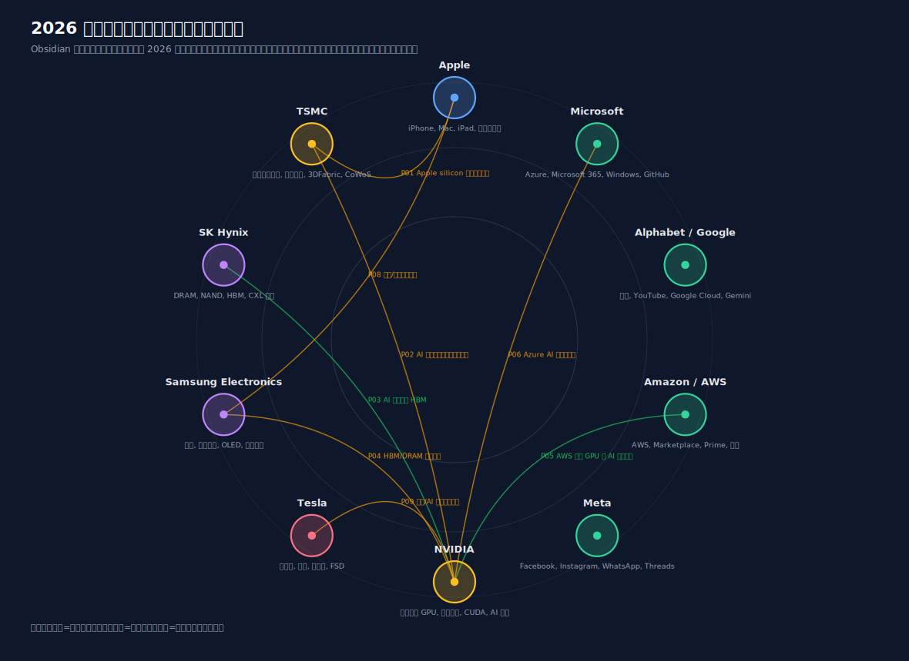
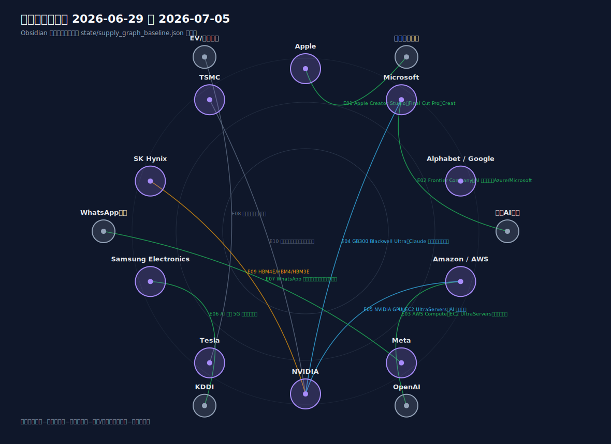
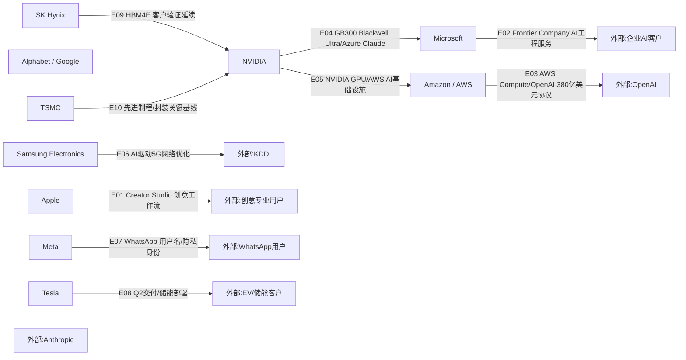

# 周一晨间科技巨头简报
- 覆盖期间：2026-06-29 至 2026-07-05（Asia/Shanghai）
- 生成时间：2026-07-07 09:59（Asia/Shanghai，补生成）
- 本期文件：reports/2026-07-06_weekly_morning_brief.md

## 1. 本周最重要的 5-8 件事
1. **Amazon / AWS：与 OpenAI 签署 380 亿美元多年期云基础设施协议。** AWS 7 月 1 日宣布 OpenAI 将立即开始使用 AWS Compute，并在未来 7 年采购价值 380 亿美元的算力。重要性：AWS 获得重量级生成式 AI 工作负载，公告明确提到 NVIDIA GPU、EC2 UltraServers、集群网络和可扩展算力。[Amazon](https://www.aboutamazon.com/news/aws/aws-open-ai-workloads-compute-infrastructure)
2. **Microsoft：推出 Frontier Company 计划。** Microsoft 7 月 2 日宣布 Frontier Company 计划，将投入 25 亿美元、动员 6,000 名 AI 专家，帮助企业重塑工作流程。重要性：Microsoft 正把 Copilot 和 Azure AI 从产品销售推进到企业流程改造服务。[Microsoft](https://blogs.microsoft.com/blog/2026/07/02/microsoft-frontier-company-ai-engineering-that-amplifies-and-protects-your-intelligence/)
3. **NVIDIA + Microsoft Azure + Anthropic：Claude 模型在 Azure 的 NVIDIA GB300 Blackwell Ultra 上运行。** NVIDIA 6 月 29 日发布，Anthropic 的 Claude Sonnet 4.5、Opus 4.1 和 Haiku 4.5 已可在 Azure 上使用 GB300。重要性：高端 Blackwell Ultra 进入模型服务落地阶段，强化 NVIDIA 与 Microsoft Azure 在大模型推理基础设施上的绑定。[NVIDIA](https://blogs.nvidia.com/blog/anthropic-nvidia-gb300-blackwell-ultra-microsoft-azure/)
4. **Apple：Apple Creator Studio 升级，强化 Creative Cloud 与 Pixelmator Pro 集成。** Apple 6 月 30 日发布 Apple Creator Studio 更新，新增跨设备项目同步、Final Cut Pro 工作流、Creative Cloud 与 Pixelmator Pro 集成。重要性：Apple 继续把 Mac/iPad/visionOS 创作生态与第三方专业工具绑定，强化高端设备与服务留存。[Apple](https://www.apple.com/newsroom/2026/06/apple-creator-studio-gets-smarter-faster-and-more-connected/)
5. **Samsung Electronics：与 KDDI 完成 AI 驱动 5G 网络优化商用部署。** Samsung 6 月 30 日宣布与 KDDI 合作，在日本商用 5G 网络中部署 AI 驱动网络优化能力。重要性：Samsung 的电信网络业务把 AI 从芯片制造延伸到运营商网络效率提升。[Samsung](https://news.samsung.com/global/samsung-and-kddi-successfully-deploy-ai-powered-network-optimization-solution-on-commercial-5g-network)
6. **Tesla：官方披露 Q2 生产、交付和储能部署。** Tesla IR 新闻页显示，Tesla 7 月 2 日披露 Q2 生产超过 45 万辆、交付超过 48 万辆，并部署 13.5GWh 储能产品。重要性：汽车交付与储能部署同时给出，储能继续是业务结构中的关键弹性来源。[Tesla IR](https://ir.tesla.com/press)
7. **Meta：WhatsApp 开放用户名预约。** Meta 6 月 29 日宣布 WhatsApp 将引入用户名，用户可先预约，未来可在首次沟通时不暴露手机号。重要性：这是 WhatsApp 隐私和身份体系的重要产品变化，影响超过 30 亿用户的联系方式和商业账号运营。[Meta](https://about.fb.com/news/2026/06/its-time-to-reserve-your-whatsapp-username/)

## 2. 影响力速览
| 公司 | 重大事件数量 | 本周影响判断 | 关键词 |
|---|---:|---|---|
| Apple | 1 | 正面/中性 | Creator Studio、Creative Cloud、Pixelmator Pro |
| Microsoft | 2 | 正面/混合 | Frontier Company、Azure GB300、裁员报道 |
| Alphabet / Google | 0 | 中性 | 未发现可达来源支撑的覆盖周重大事件 |
| Amazon / AWS | 1 | 正面 | OpenAI 云协议、NVIDIA GPU、EC2 UltraServers |
| Meta | 1 | 正面/中性 | WhatsApp 用户名、隐私、身份体系 |
| NVIDIA | 1 | 正面 | GB300 Blackwell Ultra、Azure、Anthropic |
| Tesla | 1 | 正面/混合 | Q2 生产交付、储能 13.5GWh |
| Samsung Electronics | 1 | 正面 | KDDI、AI 驱动 5G 网络优化 |
| SK Hynix | 0 | 中性/正面 | HBM4E 客户验证延续，覆盖周无重大新公告 |
| TSMC | 0 | 中性 | 7 月财报/营收披露窗口临近，覆盖周无重大新公告 |

## 3. 按公司分组
### Apple
- 日期：2026-06-30
- 事件：Apple 发布 Apple Creator Studio 更新，新增更快的项目同步、Final Cut Pro 工作流改进、Creative Cloud 与 Pixelmator Pro 集成，以及面向 Mac、iPad 和 Vision Pro 的协作功能。
- 影响：强化 Apple 设备在专业创意工作流中的黏性；Pixelmator Pro 与 Creative Cloud 相关集成有助于 Apple 自有软件资产与第三方生态协同。
- 可信度：已确认。
- 来源：[Apple Newsroom](https://www.apple.com/newsroom/2026/06/apple-creator-studio-gets-smarter-faster-and-more-connected/)

### Microsoft
- 日期：2026-07-02
- 事件：Microsoft 推出 Frontier Company 计划，称将投入 25 亿美元，调动 6,000 名 AI 专家，帮助企业把 AI 工程化并保护企业知识资产。
- 影响：Microsoft 的 AI 商业化重点从 Copilot 席位销售进一步延伸到企业流程改造、咨询和系统集成，对 Azure、Microsoft 365、GitHub 和安全产品都有拉动。
- 可信度：已确认。
- 来源：[Microsoft Blog](https://blogs.microsoft.com/blog/2026/07/02/microsoft-frontier-company-ai-engineering-that-amplifies-and-protects-your-intelligence/)

- 日期：2026-06-30 至 2026-07-02
- 事件：Business Insider 报道 Microsoft 正准备新一轮裁员，重点涉及销售和咨询等部门；正式员工调整是否及规模需以公司后续披露为准。
- 影响：若属实，Microsoft 可能继续把资源从传统销售/咨询岗位转向 AI、云基础设施和自动化流程。
- 可信度：媒体报道，待官方确认。
- 来源：[Business Insider](https://www.businessinsider.com/microsoft-job-cuts-layoffs-sales-consulting-2026-6)

### Alphabet / Google
- 日期：2026-06-29 至 2026-07-05
- 事件：未发现可达来源支撑的覆盖周重大官方事件；本期仅保留 Google 官方 AI 新闻页和开发者博客入口作为后续跟踪入口。
- 影响：不写入具体新产品或新发布，避免把不可达链接或未核实消息写成事实。
- 可信度：已确认“未写入可达性不合格的具体事件”。
- 来源：[Google AI](https://blog.google/technology/ai/)、[Google Developers Blog](https://developers.googleblog.com/)

### Amazon / AWS
- 日期：2026-07-01
- 事件：AWS 与 OpenAI 宣布多年期战略合作，OpenAI 将立即开始使用 AWS Compute，并在 7 年内采购 380 亿美元云基础设施。
- 影响：AWS 在大模型基础设施市场获得关键客户；公告提及 NVIDIA GPU、EC2 UltraServers、低延迟网络和 Amazon EFA，对 NVIDIA、数据中心网络、电力和服务器供应链均构成正向需求。
- 可信度：已确认。
- 来源：[Amazon](https://www.aboutamazon.com/news/aws/aws-open-ai-workloads-compute-infrastructure)

### Meta
- 日期：2026-06-29
- 事件：Meta 宣布 WhatsApp 将引入用户名功能，并从本周开始允许用户预约用户名；功能正式推出后，新联系人首次沟通时可不直接暴露手机号。
- 影响：这是 WhatsApp 隐私和身份体系的重要更新。对普通用户是隐私增强，对创作者、小企业和组织则关系到跨平台用户名一致性和客户触达方式。
- 可信度：已确认。
- 来源：[Meta Newsroom](https://about.fb.com/news/2026/06/its-time-to-reserve-your-whatsapp-username/)

### NVIDIA
- 日期：2026-06-29
- 事件：NVIDIA 宣布 Anthropic Claude Sonnet 4.5、Opus 4.1 和 Haiku 4.5 已在 Microsoft Azure 上通过 NVIDIA GB300 Blackwell Ultra 运行。
- 影响：GB300 从发布进入云端模型服务落地，强化 NVIDIA、Microsoft Azure 与 Anthropic 在推理基础设施上的三方关系。
- 可信度：已确认。
- 来源：[NVIDIA Blog](https://blogs.nvidia.com/blog/anthropic-nvidia-gb300-blackwell-ultra-microsoft-azure/)

### Tesla
- 日期：2026-07-02
- 事件：Tesla IR 新闻页显示，Tesla 发布第二季度生产、交付和储能部署：生产超过 45 万辆、交付超过 48 万辆，并部署 13.5GWh 储能产品。
- 影响：Q2 交付和储能部署均为下游需求强弱的核心指标。储能 13.5GWh 继续显示能源业务规模化，汽车交付则需结合后续价格、库存和地区结构判断质量。
- 可信度：已确认。
- 来源：[Tesla IR Press](https://ir.tesla.com/press)

### Samsung Electronics
- 日期：2026-06-30
- 事件：Samsung Electronics 与 KDDI 宣布在日本商用 5G 网络中成功部署 AI 驱动网络优化方案。
- 影响：Samsung 的网络业务把 AI 应用于运营商 RAN 优化，有助于提高 5G 网络效率并增强其在电信设备市场的差异化。
- 可信度：已确认。
- 来源：[Samsung Newsroom](https://news.samsung.com/global/samsung-and-kddi-successfully-deploy-ai-powered-network-optimization-solution-on-commercial-5g-network)

### SK Hynix
- 日期：2026-06-29 至 2026-07-05
- 事件：覆盖周内未发现 SK Hynix 新的重大官方公告；上一期 HBM4E 样品出货和客户验证仍是本周供应链核心跟踪事项。
- 影响：HBM4E 客户验证仍影响 NVIDIA、云 AI 加速器和先进封装供应格局；但本周不能写成新增订单或新增客户。
- 可信度：已确认“未发现覆盖周内重大官方公告”；HBM4E 事件为延续跟踪。
- 来源：[SK Hynix Newsroom](https://news.skhynix.com/)、[PR Newswire](https://www.prnewswire.com/news-releases/sk-hynix-ships-samples-of-12-layer-next-gen-hbm4e-302803714.html)

### TSMC
- 日期：2026-06-29 至 2026-07-05
- 事件：覆盖周内未发现 TSMC 新的重大官方新闻；TSMC 投资者关系日程显示 7 月将进入月度营收和季度业绩披露窗口。
- 影响：市场关注点转向 6 月营收、二季度业绩、先进制程需求和 CoWoS/先进封装产能；本周不能把此前价格报道写成官方确认。
- 可信度：已确认日程，未发现覆盖周内重大官方新闻。
- 来源：[TSMC Latest News](https://pr.tsmc.com/english/latest-news)、[TSMC Financial Calendar](https://investor.tsmc.com/english/financial-calendar)

## 4. 跨公司与产业链观察
1. **AI 云基础设施继续集中到少数超大规模云厂商。** AWS 与 OpenAI 的 380 亿美元协议、Microsoft 的 Frontier Company 都说明企业 AI 需求正在从模型试用转向工程化部署。
2. **NVIDIA 的地位仍通过云合作被放大。** AWS 公告明确 NVIDIA GPU；NVIDIA 自身公告显示 GB300 已进入 Azure 上的 Claude 模型服务，说明云厂商自研芯片与 NVIDIA 并行存在。
3. **身份与隐私功能也在成为平台护城河。** Meta 的 WhatsApp 用户名预约显示，超大规模社交平台仍在通过身份体系和隐私设计提升留存与商业账号体验。
4. **运营商网络和创意工作流也在吸收 AI。** Samsung-KDDI 的 AI 网络优化与 Apple Creator Studio 升级，说明 AI 不只发生在模型和云层，也在设备、软件和通信网络中落地。

## 5. 下周需关注
1. TSMC 6 月营收和二季度业绩窗口，重点看先进制程、AI/HPC 和先进封装需求。
2. Microsoft 裁员报道是否出现公司正式确认，以及是否影响销售、咨询或 Xbox 等部门。
3. AWS 与 OpenAI 协议后，NVIDIA GPU、AWS 自研 Trainium 和电力/数据中心扩建的后续披露。
4. Meta 是否进一步披露 WhatsApp 用户名功能的国家/地区上线节奏，以及是否推出 AI 基础设施商业化路线。
5. Tesla Q2 交付后的价格、库存、储能订单和 Robotaxi/FSD 进展。

## 6. 十家公司供应关系图谱与周度变化
### 6.0 年度主营产品上下游图片

图片采用 Obsidian 图谱视图风格，基于 `state/product_relationships_2026.json` 生成。数据源优先使用 2026 年可取得的公司官方年报、投资者关系页面、官方新闻稿和监管披露；媒体报道或历史基线关系在 JSON 中单独标注证据级别。

### 6.1 本周供应关系可视化

上图采用 Obsidian 图谱视图风格，基于 `state/supply_graph_baseline.json` 生成；下方 Mermaid 保留为机器可读结构，用于校验 Edge ID 和下周差异比对。

### 6.2 供应关系明细表
| Edge ID | 供应方 | 客户/使用方 | 具体产品/服务 | 关系类型 | 本周证据 | 长期基线证据/限制 | 本周状态 | 来源链接 |
|---|---|---|---|---|---|---|---|---|
| E01 | Apple | 创意专业用户 | Apple Creator Studio、Final Cut Pro、Creative Cloud/Pixelmator Pro 集成 | 软件/服务 | Apple 官方发布 Creator Studio 更新 | 这是 Apple 生态服务关系，不是硬件供货 | 新增/产品更新 | [Apple](https://www.apple.com/newsroom/2026/06/apple-creator-studio-gets-smarter-faster-and-more-connected/) |
| E02 | Microsoft | 企业 AI 客户 | Frontier Company、AI 工程服务、Azure/Microsoft 365/GitHub 生态 | 企业 AI 服务 | Microsoft 官方宣布 25 亿美元和 6,000 名 AI 专家计划 | 不是具体 GPU 采购披露 | 新增/服务强化 | [Microsoft](https://blogs.microsoft.com/blog/2026/07/02/microsoft-frontier-company-ai-engineering-that-amplifies-and-protects-your-intelligence/) |
| E03 | Amazon / AWS | OpenAI | AWS Compute、EC2 UltraServers、云基础设施 | 云基础设施 | AWS 官方宣布 380 亿美元多年期协议 | OpenAI 为外部客户，不属于十家公司内部关系 | 新增/重大协议 | [Amazon](https://www.aboutamazon.com/news/aws/aws-open-ai-workloads-compute-infrastructure) |
| E04 | NVIDIA | Microsoft Azure / Anthropic | GB300 Blackwell Ultra、Claude 模型推理基础设施 | AI 加速器/云基础设施 | NVIDIA 官方称 Claude 模型在 Azure 上运行 GB300 | Anthropic 为外部模型客户；Microsoft 为云平台方 | 强化 | [NVIDIA](https://blogs.nvidia.com/blog/anthropic-nvidia-gb300-blackwell-ultra-microsoft-azure/) |
| E05 | NVIDIA | Amazon / AWS | NVIDIA GPU、EC2 UltraServers、AI 集群网络 | AI 加速器/云基础设施 | AWS/OpenAI 公告明确使用 NVIDIA GPU | 不披露具体 GPU 数量、价格或交付节奏 | 强化 | [Amazon](https://www.aboutamazon.com/news/aws/aws-open-ai-workloads-compute-infrastructure) |
| E06 | Samsung Electronics | KDDI | AI 驱动 5G 网络优化方案 | 网络设备/AI 软件 | Samsung 与 KDDI 官方宣布商用网络部署 | KDDI 为外部运营商客户 | 新增/商用部署 | [Samsung](https://news.samsung.com/global/samsung-and-kddi-successfully-deploy-ai-powered-network-optimization-solution-on-commercial-5g-network) |
| E07 | Meta | WhatsApp 用户 | WhatsApp 用户名预约、手机号隐私保护 | 平台功能/身份体系 | Meta 官方宣布 WhatsApp 用户名预约 | 不是硬件供应关系，但影响用户身份体系和商业账号触达 | 新增/产品更新 | [Meta](https://about.fb.com/news/2026/06/its-time-to-reserve-your-whatsapp-username/) |
| E08 | Tesla | EV/储能客户 | 车辆交付、储能部署 | 终端产品/能源 | Tesla IR 新闻页披露 Q2 生产、交付和 13.5GWh 储能部署 | 不披露具体电池供应商或客户结构 | 延续/结果披露 | [Tesla IR](https://ir.tesla.com/press) |
| E09 | SK Hynix | NVIDIA/AI 加速器客户 | HBM4E/HBM4/HBM3E | 内存供应 | 覆盖周无新增官方供货公告；HBM4E 客户验证延续 | HBM4E 出样早于覆盖周，不能写成新订单 | 延续/无本周新增证据 | [PR Newswire](https://www.prnewswire.com/news-releases/sk-hynix-ships-samples-of-12-layer-next-gen-hbm4e-302803714.html) |
| E10 | TSMC | NVIDIA/Apple/云 ASIC 客户 | 先进制程与先进封装 | 代工/封装 | 覆盖周无新增官方供货公告；7 月进入营收和业绩披露窗口 | 仅保留核心基线，不能写成价格或订单已确认 | 延续/无本周新增证据 | [TSMC](https://investor.tsmc.com/english/financial-calendar) |

### 6.3 与上周的区别
- 新增关系：
  - AWS 与 OpenAI：新增 380 亿美元多年期云基础设施协议，是本周最重要的新供应关系。
  - Samsung 与 KDDI：新增 AI 驱动 5G 网络优化商用部署关系。
  - Microsoft 与企业 AI 客户：Frontier Company 从产品销售延伸到 AI 工程服务。
  - Apple 与创意专业用户：Creator Studio 更新强化软件/服务生态。
  - Meta 与 WhatsApp 用户：用户名预约功能新增，强化隐私身份体系。

- 强化关系：
  - NVIDIA 与 Microsoft Azure：GB300 Blackwell Ultra 支撑 Azure 上的 Anthropic Claude 模型，云端推理关系强化。
  - NVIDIA 与 AWS：AWS/OpenAI 协议明确 NVIDIA GPU 基础设施，强化 NVIDIA 在 AWS 大模型算力中的地位。

- 弱化或风险关系：
  - Google 的部分具体事件链接未通过来源审查，本期未写入具体断言，后续需继续查找可达官方或权威来源。
  - Tesla Q2 数据已补入，但仍需跟踪交付结构、库存、价格和储能订单质量。

- 无明显变化但关键关系：
  - SK Hynix HBM4E 仍是 NVIDIA/AI 加速器内存供应关键基线，但本周没有新订单证据。
  - TSMC 先进制程和封装仍是 Apple、NVIDIA 和云 ASIC 的核心瓶颈，但本周没有官方新供货披露。

## 7. 本期自检
- 日期范围已限定为 2026-06-29 至 2026-07-05；本期为 2026-07-06 应生成周报的补生成版本。
- 10 家公司均已覆盖；缺少可达重大来源的公司已明确写为“未发现可达来源支撑的覆盖周重大事件”，Tesla 与 Meta 已补入可达官方来源支撑的覆盖周事件。
- 每条写入的具体事件均附来源链接，优先使用公司公告、官方博客、IR 页面和权威媒体；媒体报道均标注“待官方确认”或“媒体报道”。
- Mermaid 使用 `flowchart LR` 和 ASCII 节点 ID，包含全部 10 家覆盖公司。
- 年度主营产品上下游图片目标文件：`assets/2026-07-06_product_relationships.svg`，由 `state/product_relationships_2026.json` 生成。
- 本周供应关系图片目标文件：`assets/2026-07-06_supply_relationships.svg`，由 `state/supply_graph_baseline.json` 生成。
- 图中所有关系边均能在 6.2 表格中找到相同 Edge ID 的证据或限制说明。
- 质量闸门：生成后运行 `scripts/run_quality_gate.py`；通过情况由该脚本输出和提交记录确认。
- 来源真实性审查：生成后写入 `logs/2026-07-06_source_audit.json`，并绑定当前周报和供应关系基线 SHA-256。
- GitHub 同步：由仓库提交记录确认；周报正文不提前声明同步完成状态。
