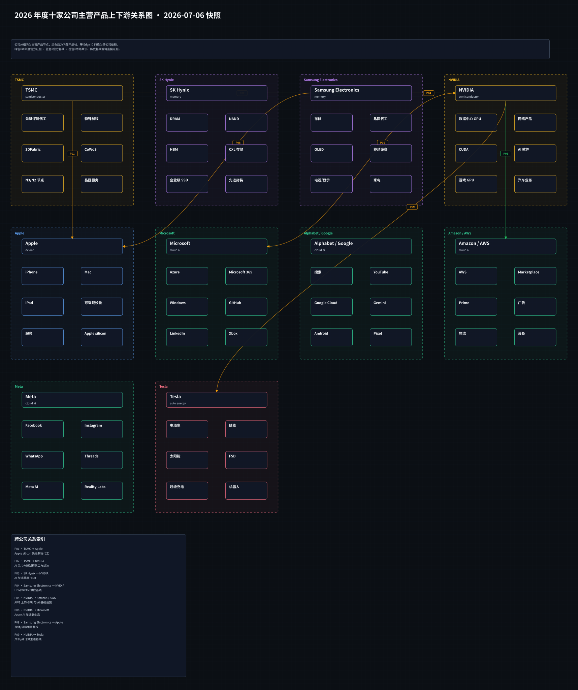
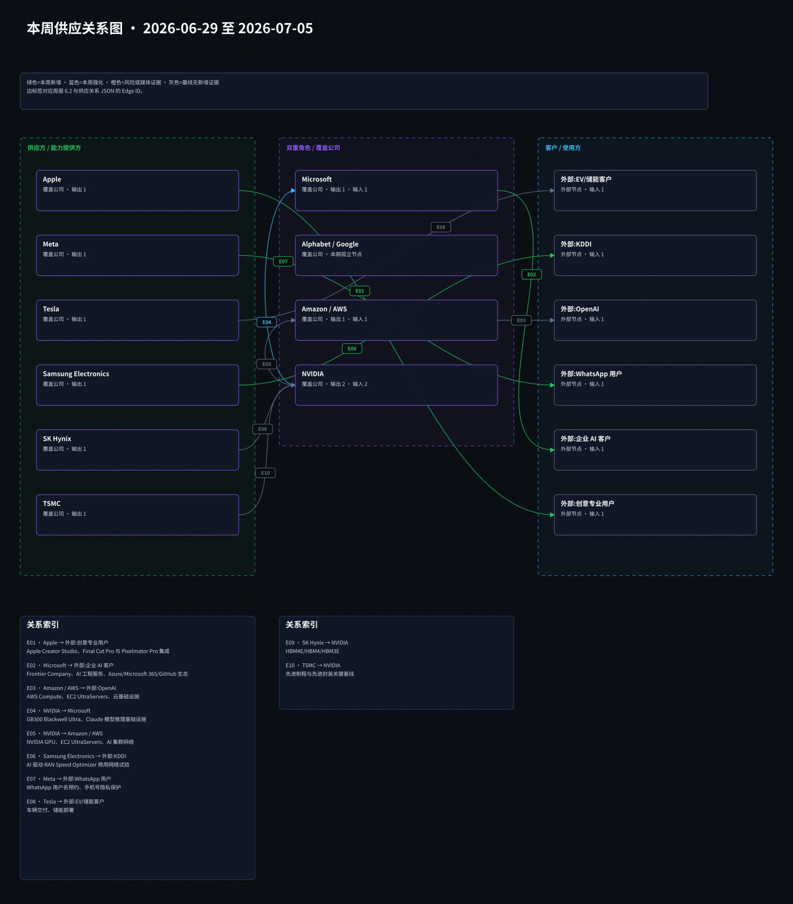

# 周一晨间科技巨头简报
<!-- weekly-brief-schema: 2 -->
<!-- report-vintage: revised -->
- 覆盖期间：2026-06-29 至 2026-07-05（Asia/Shanghai）；排他截止：2026-07-06 00:00。
- 生成时间：2026-09-07 11:46:04（Asia/Shanghai，事后纠错重生成；不是原周一实时版本）。
- 本期文件：reports/2026-07-06_weekly_morning_brief.md
- 原版自述生成时间：2026-07-07 09:59；首次 Git 留痕及后续迁移见[版本记录](../docs/historical_report_versions.md)。当前修订版禁止作为原周一已可用的回测输入。
- 本次仅保留原报告候选中重新获得直接证据支持的 6 件事项，不凑数；检索不足不等于当周没有其他新闻。旧文、原图及原审查日志已[独立归档](../archives/2026-09-07_before_correction.tar.gz)。

## 1. 本周最重要的 6 件事
1. **Microsoft：宣布 Frontier Company 企业 AI 工程业务，计划投入 25 亿美元并配置 6,000 名专家。** 重要性：投资重点从工具席位进一步延伸到客户流程改造，仍须验证项目收入与交付成本。[Microsoft](https://blogs.microsoft.com/blog/2026/07/02/microsoft-frontier-company-ai-engineering-that-amplifies-and-protects-your-intelligence/)
2. **NVIDIA / Microsoft：Claude 在 Azure 的 GB300 Blackwell Ultra 平台正式可用。** 重要性：模型、云平台与加速器形成实际服务入口，但公告不等于披露采购金额。[NVIDIA](https://blogs.nvidia.com/blog/anthropic-nvidia-gb300-blackwell-ultra-microsoft-azure/)
3. **Tesla：Q2 生产 451,758 辆、交付 480,126 辆，储能部署 13.5GWh。** 重要性：形成汽车和储能需求基线，不能仅凭交付推定利润或现金流。[Tesla 固定公告](https://ir.tesla.com/press-release/tesla-second-quarter-2026-production-deliveries-and-deployments)
4. **Apple：更新 Creator Studio，增强 Final Cut Pro 与 Pixelmator Pro 等应用的协作。** 重要性：提高创作工作流黏性；原文不支持旧报所写的 Adobe Creative Cloud 集成。[Apple](https://www.apple.com/newsroom/2026/06/apple-creator-studio-gets-smarter-faster-and-more-connected/)
5. **Samsung Electronics：与 KDDI 完成商用 5G SA 网络优化试验。** 重要性：公司披露高峰时段平均下行吞吐提升 31%、密集城区最高提升 52%；试验效果不等于全面部署或确定订单。[Samsung](https://news.samsung.com/global/samsung-and-kddi-successfully-complete-ai-powered-network-optimization-trial-on-commercial-5g-standalone-network-in-japan)
6. **Meta：WhatsApp 开放用户名预约。** 重要性：为后续隐藏手机号的新联系人沟通提供身份入口；当时只是预约，正式功能仍待推出。[Meta](https://about.fb.com/news/2026/06/its-time-to-reserve-your-whatsapp-username/)

## 2. 投资判断速览
| 公司 | 本周变化 | 影响指标 | 预期差 | 判断 | 验证条件 |
|---|---|---|---|---|---|
| Apple | Creator Studio 更新 | 软件订阅、留存与设备协同 | 缺同期一致预期，不判超预期 | 正面，待变现 | 后续订阅、续费与使用披露 |
| Microsoft | Frontier Company；Azure 上 Claude/GB300 可用 | 企业项目收入、云用量、交付成本 | 缺同期一致预期 | 正面，执行待验 | 后续客户项目及单位交付成本 |
| Alphabet / Google | 本次复核未纳入重大增量 | 保留原研究范围 | 无新增判断 | 无重大变化，非穷尽认证 | 等待可核验的当期披露 |
| Amazon / AWS | 撤销误列的本周 OpenAI 新协议 | 不据旧公告新增订单预测 | 原增量判断撤销 | 中性 | 新的具名客户或交付公告 |
| Meta | WhatsApp 用户名预约 | 激活、留存、功能覆盖 | 缺同期一致预期 | 正面，待上线 | 后续正式上线范围 |
| NVIDIA | Claude/GB300 在 Azure 可用 | 推理用量、实例利用率 | 缺同期一致预期 | 正面 | 后续容量、客户和用量披露 |
| Tesla | Q2 交付与储能部署 | 交付、价格、毛利率与现金流 | 本版未重建同期一致预期 | 需求有量化基线，盈利待验 | 已公告的 7 月 22 日财报 |
| Samsung Electronics | KDDI 网络优化试验 | 吞吐、试验复现、商用转化 | 缺同期一致预期 | 正面，非订单确认 | 后续扩大部署或合同 |
| SK Hynix | 本次复核未纳入重大增量 | 保留原研究范围 | 无新增判断 | 无重大变化，非穷尽认证 | 新的具名客户或产品证据 |
| TSMC | 本次复核未纳入重大增量 | 保留原研究范围 | 无新增判断 | 无重大变化，非穷尽认证 | 后续收入、订单或产能披露 |

## 3. 发生变化的公司
### 3.1 Apple
- 日期：2026-06-30（原公告日期；未公开精确时分，本版不虚构上海小时）
- 事件：Creator Studio 更新增强 Final Cut Pro 的 AI 编辑工具，并可将图像或视频帧交给 Pixelmator Pro 编辑；不再沿用无原文支持的 Creative Cloud、跨设备项目同步和 Vision Pro 协作说法。
- 投资影响：改善 Apple 自有创作应用之间的工作流，商业影响是分析判断，不是已披露新增收入。
- 影响指标：软件订阅、留存及专业设备需求。
- 预期差：没有重建同期一致预期，不判定超预期。
- 验证条件：后续财报或产品披露中的使用量、订阅和续费。
- 可信度：官方公告支持功能更新；收入影响待验证。
- 来源：[Apple 原公告](https://www.apple.com/newsroom/2026/06/apple-creator-studio-gets-smarter-faster-and-more-connected/)

### 3.2 Microsoft
- 日期：2026-07-02（公告元数据 12:59:05 UTC，上海 20:59:05）
- 事件：Microsoft 宣布新的 Frontier Company 业务，计划投入 25 亿美元，配置 6,000 名行业及工程专家，为企业客户共同设计、部署和持续改进 AI 系统。
- 投资影响：服务交付能力可能推动云与企业软件需求，同时增加工程投入；不能把投资计划直接计为收入。
- 影响指标：企业项目收入、云用量、交付成本与续约。
- 预期差：金额是计划口径，无同期一致预期比较。
- 验证条件：后续具名客户项目、交付规模与成本披露。
- 可信度：已宣布；回报尚未实现。
- 来源：[Microsoft 原公告](https://blogs.microsoft.com/blog/2026/07/02/microsoft-frontier-company-ai-engineering-that-amplifies-and-protects-your-intelligence/)

### 3.3 Meta
- 日期：2026-06-30（公告 2026-06-29 16:00:06 UTC 折算上海）
- 事件：WhatsApp 开放用户名预约，计划在当年稍后推出可不向新联系人显示手机号的用户名功能。
- 投资影响：可能改善隐私与商业账号识别体验；本周不能按正式功能全面上线计算活跃或收入增量。
- 影响指标：预约转化、功能覆盖、留存与商用账号使用。
- 预期差：无可核对的同期量化预期。
- 验证条件：后续地区开放、正式上线及实际使用数据。
- 可信度：预约已公布，正式功能属于计划。
- 来源：[Meta 原公告](https://about.fb.com/news/2026/06/its-time-to-reserve-your-whatsapp-username/)

### 3.4 NVIDIA
- 日期：2026-06-30（公告 2026-06-29 17:00:19 UTC 折算上海）
- 事件：NVIDIA 宣布 Microsoft Foundry 中的 Claude 模型在 Azure 的 GB300 Blackwell Ultra 基础设施上正式可用。本版不保留该公告未直接列出的 Claude 具体版本号。
- 投资影响：强化 NVIDIA 与 Azure 的模型服务合作，但可用性公告不是具体 GPU 采购合同。
- 影响指标：推理使用量、实例利用率与客户采用。
- 预期差：无同期一致预期和采购量基线。
- 验证条件：后续容量、客户采用与单位推理成本披露。
- 可信度：官方支持可用性；订单金额未知。
- 来源：[NVIDIA 原公告](https://blogs.nvidia.com/blog/anthropic-nvidia-gb300-blackwell-ultra-microsoft-azure/)

### 3.5 Tesla
- 日期：2026-07-02（公告原文日期）
- 事件：Q2 2026 生产 451,758 辆、交付 480,126 辆，储能部署 13.5GWh。数据来自固定公告，不再仅引用滚动新闻目录。
- 投资影响：汽车及能源需求获得量化基线；公司提示交付和储能部署不能单独代表季度财务表现。
- 影响指标：交付、平均售价、毛利率、库存与现金流。
- 预期差：本次不加入未经重新核验的分析师预期。
- 验证条件：已公告 7 月 22 日盘后发布财报；不得提前填入利润或现金流结果。
- 可信度：已披露运营数字；财务结果当时尚待公布。
- 来源：[Tesla 固定公告](https://ir.tesla.com/press-release/tesla-second-quarter-2026-production-deliveries-and-deployments)

### 3.6 Samsung Electronics
- 日期：2026-06-30（公告元数据 21:00 韩国时间，上海 20:00）
- 事件：与 KDDI 完成日本商用 5G SA 网络的 RAN Speed Optimizer 试验；公司称高峰时段全试验区平均下行吞吐提升 31%，密集城区最高提升 52%。
- 投资影响：提供 AI 网络优化效果证据；局部试验结果不能外推为全部网络效果或已签订单。
- 影响指标：可复现吞吐、部署范围与商用合同。
- 预期差：没有同期一致预期；最高值与平均值分别保留。
- 验证条件：后续更大范围验证、部署决定或合同公告。
- 可信度：官方披露试验，不是全面商用部署认证。
- 来源：[Samsung 原公告](https://news.samsung.com/global/samsung-and-kddi-successfully-complete-ai-powered-network-optimization-trial-on-commercial-5g-standalone-network-in-japan)

### 3.7 无重大变化公司
- Alphabet / Google、Amazon / AWS、SK Hynix、TSMC：本次原候选复核未保留可确认重大增量；不是穷尽全网后的无新闻认证。

## 4. 跨公司与产业链判断
1. **企业 AI 落地应区分工程服务与算力服务。** Frontier Company 是投入与交付计划，Claude/GB300 是云服务可用性；二者均不能直接折算成确定新增采购额。
2. **设备、软件及通信网络的 AI 变现仍需后验指标。** Apple 工作流更新与 Samsung 网络试验提供能力证据，订阅和合同转化仍待验证。
3. **产品状态与盈利状态不能混用。** WhatsApp 预约不等于全面上线，Tesla 交付不等于利润兑现；投资判断应等待各自后续指标。

## 5. 下周催化与验证条件
1. **企业 AI 客户落地。** 触发条件：后续一周出现 Frontier Company 客户案例或 Azure 实际使用披露；没有公告则不假设兑现。可能影响：云用量与服务交付成本。
2. **WhatsApp 功能开放。** 触发条件：后续一周出现正式地区上线说明；官方没有承诺必在下周发生。可能影响：预约转化与隐私功能采用。
3. **Tesla 需求质量。** 触发条件：新的价格、库存或业务公告；7 月 22 日财报是更远验证点，不列作下周必发事件。可能影响：汽车毛利率与现金流判断。

## 6. 研究附录：产业链与图谱
### 6.1 图谱更新状态与可视化
- 产品图：沿用 2026-07-06 的冻结展示图；本版未扩充年度关系，图中弱证据不视为订单或历史可得性认证。
- 供应图：本期更新为纠错图；撤销 E03/E05 当周新增或强化，背景和运营结果不再混入变化表。

[打开产品关系 Canvas](../assets/2026-07-06_product_relationships.canvas)

[打开供应关系 Canvas](../assets/2026-07-06_supply_relationships.canvas)

### 6.2 本周供应关系变化表
| Edge ID | 供应方 | 客户/使用方 | 产品或服务 | 当周披露 | 证据与限制 | 来源 |
|---|---|---|---|---|---|---|
| E01 | Apple | 创意专业用户 | Apple Creator Studio、Final Cut Pro 与 Pixelmator Pro 集成 | new | Apple 官方发布 Creator Studio 更新。 官方正文支持 Apple 应用内集成，不支持旧文的 Adobe Creative Cloud 集成；不是硬件供货。 | [来源1](https://www.apple.com/newsroom/2026/06/apple-creator-studio-gets-smarter-faster-and-more-connected/) |
| E02 | Microsoft | 企业 AI 客户 | Frontier Company、AI 工程服务、Azure/Microsoft 365/GitHub 生态 | new | Microsoft 官方宣布 Frontier Company 计划。 该边代表企业 AI 服务关系，不代表具体 GPU 采购。 | [来源1](https://blogs.microsoft.com/blog/2026/07/02/microsoft-frontier-company-ai-engineering-that-amplifies-and-protects-your-intelligence/) |
| E04 | NVIDIA | Microsoft | GB300 Blackwell Ultra、Claude 模型推理基础设施 | strengthened | NVIDIA 官方说明 Anthropic Claude 模型在 Microsoft Azure 上使用 GB300。 公告时间 2026-06-29T17:00:19Z，上海为 6 月 30 日；只确认 Claude 在 GB300 上的可用性，不沿用缺少该文支持的具体模型版本号。 | [来源1](https://blogs.nvidia.com/blog/anthropic-nvidia-gb300-blackwell-ultra-microsoft-azure/) |
| E06 | Samsung Electronics | KDDI | AI 驱动 RAN Speed Optimizer 商用网络试验 | new | Samsung 官方披露与 KDDI 完成商用 5G SA 网络优化试验。 KDDI 是外部运营商试验合作方；官方来源未确认全面商业部署。 | [来源1](https://news.samsung.com/global/samsung-and-kddi-successfully-complete-ai-powered-network-optimization-trial-on-commercial-5g-standalone-network-in-japan) |
| E07 | Meta | WhatsApp 用户 | WhatsApp 用户名预约、手机号隐私保护 | new | Meta 官方宣布 WhatsApp 用户名预约。 公告时间 2026-06-29T16:00:06Z，上海为 6 月 30 日；当时开放预约，正式功能仍待推出。 | [来源1](https://about.fb.com/news/2026/06/its-time-to-reserve-your-whatsapp-username/) |

### 6.3 与上周的区别
- 新增披露：E01 创作软件更新、E02 企业 AI 服务计划、E06 网络试验、E07 用户名预约；不是全部对应新增采购订单。
- 强化披露：E04 Claude/GB300 在 Azure 正式可用。
- 无当周新增证据：E03/E05 只保留 2025 年协议背景，E09/E10 仍为弱背景；E08 是运营结果，不是新增供应关系。
- 旧期 Edge ID 曾重排，不能仅用相同编号推断关系变化；本版按当期来源判断，不虚构可比上期订单基线。

## 7. 本期自检
- 原覆盖周和当期 10 家研究对象保持不变；6 件不同事项，不补足十件。
- AWS/OpenAI 协议首次公告为 2025-11-03，已从当周头条、判断、事件、催化和变化边中撤除；不否认协议本身存在。
- 逐项目标与更正证据见本期 correction_evidence 日志；未核验的媒体裁员报道及重复头条不纳入。
- 本次是事后纠错展示版。来源访问、结构和图谱校验不等于全量历史时点认证；仍为 legacy_unverified，禁止冒充原周一实时回测样本。
