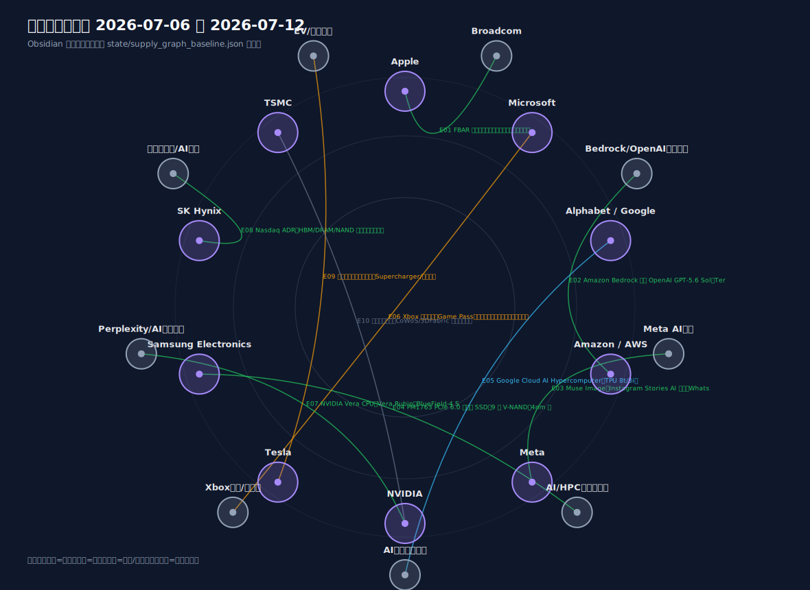
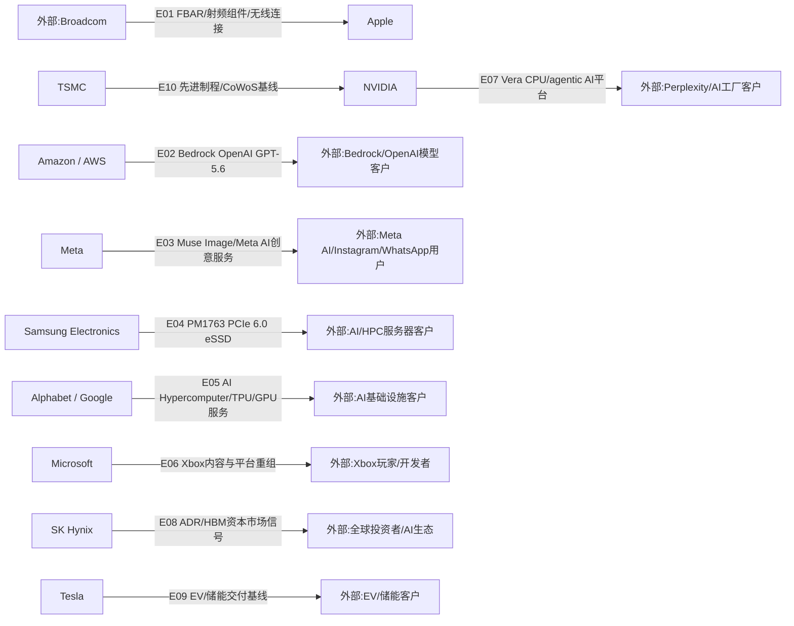

# 周一晨间科技巨头简报
- 覆盖期间：2026-07-06 至 2026-07-12（Asia/Shanghai）
- 生成时间：2026-07-14 09:16（Asia/Shanghai，补生成）
- 本期文件：reports/2026-07-13_weekly_morning_brief.md

## 1. 本周最重要的 5-8 件事
1. **Apple：与 Broadcom 扩大美国芯片供应承诺。** Apple 7 月 8 日宣布与 Broadcom 达成新的多年期承诺，预计金额超过 300 亿美元，将生产超过 150 亿颗美国制造芯片，重点包括 Fort Collins 工厂的 FBAR 滤波器、先进射频组件和无线连接技术。重要性：这是本周最清晰的硬件供应链事件，直接关系到 Apple 终端产品的无线连接组件和美国本土制造布局。[Apple](https://www.apple.com/newsroom/2026/07/apple-to-increase-spend-with-broadcom-to-produce-billions-more-us-chips/)
2. **Amazon / AWS：OpenAI GPT-5.6 系列在 Amazon Bedrock GA。** Amazon 7 月 9 日更新称，OpenAI GPT-5.6 Sol、Terra、Luna 已在 Amazon Bedrock 正式可用，支持 Bedrock 企业控制、区域内数据处理、硬件级安全和提示缓存折扣。重要性：AWS 把 OpenAI 前沿模型纳入统一企业模型平台，强化其与 Azure、Google Cloud 的 AI 平台竞争。[Amazon](https://www.aboutamazon.com/news/aws/bedrock-openai-models)
3. **Meta：发布 Muse Image，并在争议功能上快速回退。** Meta 7 月 7 日发布 Muse Image，称其为 Meta Superintelligence Labs 首个图像生成模型，并用于 Meta AI、Instagram、WhatsApp 等场景；7 月 10 日更新称，因反馈移除 @mention 公共 Instagram 账号引用功能。重要性：Meta 在消费级 AI 生成内容上推进很快，但隐私和内容授权风险同步上升。[Meta](https://about.fb.com/news/2026/07/introducing-muse-image-meta-ai/)
4. **Samsung Electronics：PM1763 PCIe 6.0 企业级 SSD 量产。** Samsung 7 月 8 日宣布 PM1763 量产，面向下一代 AI 和 HPC 服务器，采用 PCIe 6.0、9 代 V-NAND、4nm 控制器，并提供 4TB/8TB/16TB 容量。重要性：AI 服务器瓶颈不只在 GPU/HBM，也在高速存储、液冷适配和数据吞吐。[Samsung](https://news.samsung.com/global/samsung-begins-mass-production-of-pm1763-ssd-optimized-for-next-generation-ai-infrastructure)
5. **Alphabet / Google：Google Cloud 强调 AI Infrastructure 领导地位。** Google Cloud 7 月 9 日称其被列为 2026 Gartner AI Infrastructure 魔力象限 Leader，并强调 AI Hypercomputer、TPU 8t/8i、GKE Inference Gateway、Google Cloud Managed Lustre、Virgo 网络，以及与 NVIDIA 的 GPU 服务合作。重要性：Google 的 AI 基础设施叙事从 TPU 扩展到完整云端系统栈和异构加速器选择。[Google Cloud](https://cloud.google.com/blog/topics/ai-infrastructure/google-is-a-leader-in-gartner-magic-quadrant-for-ai-infra)
6. **Microsoft：Xbox 进行重大重组。** Xbox Wire 7 月 6 日发布内部信，称 FY27 将缩减约 3,200 个岗位，当日约 1,600 个岗位受影响，部分工作室转向新管理，平台层级和供应商支出也将压缩。重要性：这不是 AI 供应链利好，而是 Microsoft 游戏业务的结构性风险；Game Pass、多平台、内容组合和开发者生态都会受影响。[Xbox Wire](https://news.xbox.com/en-us/2026/07/06/resetting-xbox/)
7. **NVIDIA：Vera CPU 面向 agentic AI 工作负载。** NVIDIA 7 月 7 日称 Vera 是面向 AI agent 循环的高单线程性能数据中心 CPU，并提到 Perplexity 等 AI 创新者的测试/采用信号。重要性：NVIDIA 正把 AI 工厂产品栈从 GPU 扩展到 CPU、互联和存储处理器，目标是减少 GPU 等待 CPU 侧任务的时间。[NVIDIA](https://blogs.nvidia.com/blog/nvidia-vera-max-single-threaded-cpu-at-scale/)
8. **SK Hynix：官方 ADR/Nasdaq 条目存在，但内容访问受限。** 本期只记录其为资本市场可获得性信号，不把它扩写为新增 HBM 订单或新增客户。重要性：SK Hynix 的 HBM 供应地位仍关键，但覆盖周内没有可读官方正文支撑具体新供货关系。[SK Hynix](https://news.skhynix.com/skhynix-lists-adrs-on-nasdaq/)

## 2. 影响力速览
| 公司 | 重大事件数量 | 本周影响判断 | 关键词 |
|---|---:|---|---|
| Apple | 1 | 正面 | Broadcom、FBAR、射频组件、美国制造 |
| Microsoft | 1 | 负面/混合 | Xbox 重组、岗位缩减、供应商支出 |
| Alphabet / Google | 1 | 正面/中性 | AI Hypercomputer、TPU 8t/8i、NVIDIA GPU |
| Amazon / AWS | 1 | 正面 | Bedrock、OpenAI GPT-5.6、企业模型服务 |
| Meta | 1 | 正面/风险并存 | Muse Image、Meta AI、Instagram、WhatsApp |
| NVIDIA | 1 | 正面 | Vera CPU、agentic AI、Perplexity |
| Tesla | 0 | 中性 | 覆盖周无重大官方新事件 |
| Samsung Electronics | 1 | 正面 | PM1763、PCIe 6.0、AI/HPC 服务器 SSD |
| SK Hynix | 1 | 中性/需复核 | ADR、Nasdaq、HBM 基线 |
| TSMC | 0 | 中性 | 覆盖周无重大官方新供货披露 |

## 3. 按公司分组
### Apple
- 日期：2026-07-08
- 事件：Apple 宣布与 Broadcom 的新多年期承诺，预计超过 300 亿美元，Broadcom 将在 Fort Collins 生产先进射频组件、FBAR 滤波器和无线连接技术。
- 影响：这是本期最强供应链事件。Apple 把关键无线组件供应进一步绑定 Broadcom，并把制造地点与美国本土供应链政策绑定。
- 可信度：已确认。
- 来源：[Apple Newsroom](https://www.apple.com/newsroom/2026/07/apple-to-increase-spend-with-broadcom-to-produce-billions-more-us-chips/)

### Microsoft
- 日期：2026-07-06
- 事件：Xbox 发布重组信，称 FY27 将缩减约 3,200 人，当日约 1,600 个岗位受影响，部分工作室转向新管理；平台层面将减少管理层级，并把供应商支出降低 50%。
- 影响：游戏业务进入成本与组织效率重置期。对玩家和开发者的影响主要体现在内容组合、工作室归属、Game Pass 重点和平台工具整合。
- 可信度：已确认。
- 来源：[Xbox Wire](https://news.xbox.com/en-us/2026/07/06/resetting-xbox/)

### Alphabet / Google
- 日期：2026-07-09
- 事件：Google Cloud 称其被列为 2026 Gartner AI Infrastructure 魔力象限 Leader，并重点展示 AI Hypercomputer、TPU 8t/8i、NVIDIA GPU 服务、GKE Inference Gateway 和大规模网络/存储能力。
- 影响：Google 的 AI 竞争重点从模型能力扩展到端到端基础设施，意图承接训练、推理和 agentic workload。
- 可信度：已确认；Gartner 评价属于第三方研究，不能直接等同于新增订单。
- 来源：[Google Cloud Blog](https://cloud.google.com/blog/topics/ai-infrastructure/google-is-a-leader-in-gartner-magic-quadrant-for-ai-infra)

### Amazon / AWS
- 日期：2026-07-09
- 事件：Amazon 更新称 OpenAI GPT-5.6 Sol、Terra、Luna 已在 Amazon Bedrock 正式可用，并支持企业安全、区域内数据处理和提示缓存折扣。
- 影响：AWS 进一步把 OpenAI 模型纳入 Bedrock 模型市场和企业治理体系，增强其在企业 AI 模型分发层的竞争力。
- 可信度：已确认。
- 来源：[Amazon](https://www.aboutamazon.com/news/aws/bedrock-openai-models)

### Meta
- 日期：2026-07-07，2026-07-10 更新
- 事件：Meta 发布 Muse Image，用于 Meta AI 图像生成和 Instagram/WhatsApp 创意体验；随后因反馈移除 @mention 公共 Instagram 账号引用功能。
- 影响：Meta 在消费级 AI 图像生成上增加入口，但用户内容授权、公开资料引用和广告创意使用边界需要继续跟踪。
- 可信度：已确认。
- 来源：[Meta Newsroom](https://about.fb.com/news/2026/07/introducing-muse-image-meta-ai/)

### NVIDIA
- 日期：2026-07-07
- 事件：NVIDIA 发布 Vera CPU 说明，称其面向 AI agent 循环和高单线程性能，Perplexity 测试真实编码工作流约 1.5 倍更快、并发 sandbox 启动最高 1.9 倍更快。
- 影响：NVIDIA 继续把 AI 工厂从 GPU 延展到 CPU、内存带宽、数据处理和整机架构；这会影响未来云厂商和 AI 原生企业采购结构。
- 可信度：已确认；性能数据来自 NVIDIA 官方披露，需等待第三方基准和正式采购披露。
- 来源：[NVIDIA Blog](https://blogs.nvidia.com/blog/nvidia-vera-max-single-threaded-cpu-at-scale/)

### Tesla
- 日期：2026-07-06 至 2026-07-12
- 事件：覆盖周内未发现 Tesla 新的重大官方公告；本期不重复上一期 Q2 生产、交付和储能部署数据作为“本周新增事件”。
- 影响：短期跟踪重点转向 Q2 数据后的价格、库存、储能订单、FSD/Robotaxi 进展和后续监管披露。
- 可信度：已确认“未写入覆盖周外事件”。
- 来源：[Tesla IR Press](https://ir.tesla.com/press)

### Samsung Electronics
- 日期：2026-07-08
- 事件：Samsung 宣布 PM1763 PCIe 6.0 企业级 SSD 量产，面向 AI 和 HPC 服务器，采用 9 代 V-NAND 和 4nm 控制器，16TB 版本顺序读取/写入最高 28,400/21,900 MB/s。
- 影响：AI/HPC 服务器对高速数据加载、低延迟和液冷适配的要求提升，Samsung 在 HBM 之外强化企业级 SSD 产品线。
- 可信度：已确认；审计脚本对页面返回访问受限，但网页正文可读并属于官方域名。
- 来源：[Samsung Newsroom](https://news.samsung.com/global/samsung-begins-mass-production-of-pm1763-ssd-optimized-for-next-generation-ai-infrastructure)

### SK Hynix
- 日期：2026-07-06 至 2026-07-12
- 事件：SK Hynix 官方 ADR/Nasdaq 新闻链接存在但内容访问受限。本期只将其作为资本市场可获得性信号，未写成新增 HBM 订单、新客户或产能确认。
- 影响：SK Hynix 的 HBM/DRAM/NAND 仍是 AI 半导体供应链关键变量；但本周没有可读官方正文支撑新的供应关系变化。
- 可信度：中等；需人工复核官方正文或补充监管/交易所来源。
- 来源：[SK Hynix Newsroom](https://news.skhynix.com/skhynix-lists-adrs-on-nasdaq/)

### TSMC
- 日期：2026-07-06 至 2026-07-12
- 事件：覆盖周内未发现 TSMC 新的重大官方供货披露；7 月 13 日营收披露属于下期跟踪窗口。
- 影响：先进制程和先进封装仍是 Apple、NVIDIA 和云 ASIC 的核心瓶颈，但本期不能把覆盖周外营收数据或市场传闻写成已确认事件。
- 可信度：已确认“未写入覆盖周外事件”。
- 来源：[TSMC Latest News](https://pr.tsmc.com/english/latest-news)、[TSMC Financial Calendar](https://investor.tsmc.com/english/financial-calendar)

## 4. 跨公司与产业链观察
1. **硬件供应链最明确的新增关系来自 Apple-Broadcom。** 这条边具备金额、产品、地点和制造计划四个要素，是本期可信度最高的供应关系。
2. **AI 云平台继续把模型分发层做成统一入口。** AWS 通过 Bedrock 纳入 OpenAI GPT-5.6；Google 强调 AI Hypercomputer 和多加速器基础设施；两者都在争夺企业 AI 工作负载入口。
3. **AI 基础设施瓶颈正在扩展。** NVIDIA 强调 CPU 对 agentic AI 的重要性，Samsung 推出 PCIe 6.0 eSSD，说明 AI 工厂不再只由 GPU/HBM 决定。
4. **消费级 AI 的合规压力更明显。** Meta Muse Image 的 @mention 功能快速回退，显示平台把公开社交内容用于生成式 AI 时会遇到用户授权和隐私边界问题。
5. **Microsoft 游戏业务是本期主要风险源。** Xbox 重组会影响内容供应、开发者合作和供应商支出；这类事件不应被解读为 AI 主线利好。

## 5. 下周需关注
1. TSMC 7 月 13 日披露的 6 月营收和后续业绩会，重点看 AI/HPC、先进封装和客户集中度。
2. Apple-Broadcom 协议后，是否出现 Broadcom 资本开支、产能扩建或供应链配套披露。
3. AWS Bedrock 上 OpenAI GPT-5.6 的企业客户、区域可用性和价格执行情况。
4. Meta Muse Image 在 Instagram/WhatsApp 的地区上线节奏，以及广告创意工具是否扩展。
5. Samsung PM1763 是否进入具体服务器平台或云厂商验证清单。
6. Xbox 重组后，第一方游戏、Game Pass、开发工具和供应商支出变化是否影响 Microsoft 游戏生态。

## 6. 十家公司供应关系图谱与周度变化
### 6.0 年度主营产品上下游图片

图片采用 Obsidian 图谱视图风格，基于 `state/product_relationships_2026.json` 生成。数据源优先使用 2026 年可取得的公司官方年报、投资者关系页面、官方新闻稿和监管披露；媒体报道或历史基线关系在 JSON 中单独标注证据级别。

### 6.1 本周供应关系可视化

上图采用 Obsidian 图谱视图风格，基于 `state/supply_graph_baseline.json` 生成；下方 Mermaid 保留为机器可读结构，用于校验 Edge ID 和下周差异比对。

### 6.2 供应关系明细表
| Edge ID | 供应方 | 客户/使用方 | 具体产品/服务 | 关系类型 | 本周证据 | 长期基线证据/限制 | 本周状态 | 来源链接 |
|---|---|---|---|---|---|---|---|---|
| E01 | Broadcom | Apple | FBAR 滤波器、先进射频组件、无线连接技术 | 组件供应 | Apple 官方披露超过 300 亿美元多年期承诺 | 未披露逐年采购节奏 | 新增/重大供应承诺 | [Apple](https://www.apple.com/newsroom/2026/07/apple-to-increase-spend-with-broadcom-to-produce-billions-more-us-chips/) |
| E02 | Amazon / AWS | Bedrock/OpenAI 模型客户 | OpenAI GPT-5.6 Sol、Terra、Luna | 云端 AI 模型服务 | Amazon 官方称 GPT-5.6 系列在 Bedrock GA | 代表 AWS 向企业客户提供模型服务，不代表硬件供货 | 新增/GA | [Amazon](https://www.aboutamazon.com/news/aws/bedrock-openai-models) |
| E03 | Meta | Meta AI/Instagram/WhatsApp 用户 | Muse Image、Instagram Stories AI 效果、WhatsApp 图像生成 | 消费级 AI 服务 | Meta 官方发布 Muse Image，并更新移除争议 @mention 能力 | 存在隐私和内容授权风险 | 新增/产品更新 | [Meta](https://about.fb.com/news/2026/07/introducing-muse-image-meta-ai/) |
| E04 | Samsung Electronics | AI/HPC 服务器客户 | PM1763 PCIe 6.0 eSSD、9 代 V-NAND、4nm 控制器 | 存储供应 | Samsung 官方宣布 PM1763 量产 | 页面审计返回访问受限，但网页正文可读；未披露客户名单 | 新增/量产 | [Samsung](https://news.samsung.com/global/samsung-begins-mass-production-of-pm1763-ssd-optimized-for-next-generation-ai-infrastructure) |
| E05 | Alphabet / Google | AI 基础设施客户 | AI Hypercomputer、TPU 8t/8i、GKE Inference Gateway、NVIDIA GPU 服务 | 云端 AI 基础设施 | Google Cloud 官方发布 Gartner AI Infrastructure Leader 说明 | 第三方研究评价不是新增订单 | 强化/定位提升 | [Google Cloud](https://cloud.google.com/blog/topics/ai-infrastructure/google-is-a-leader-in-gartner-magic-quadrant-for-ai-infra) |
| E06 | Microsoft | Xbox 玩家/开发者 | Xbox 内容组合、Game Pass、多平台发行、共享服务 | 平台内容服务 | Xbox Wire 官方披露重组、岗位缩减、供应商支出降低 50% | 这是风险事件，不是新增供应合同 | 风险/重组 | [Xbox Wire](https://news.xbox.com/en-us/2026/07/06/resetting-xbox/) |
| E07 | NVIDIA | Perplexity/AI 工厂客户 | NVIDIA Vera CPU、Vera Rubin、BlueField-4 STX | AI 计算平台 | NVIDIA 官方披露 Vera 面向 agentic AI，并提到 Perplexity 测试/采用信号 | 未披露具体采购金额 | 新增/采用信号 | [NVIDIA](https://blogs.nvidia.com/blog/nvidia-vera-max-single-threaded-cpu-at-scale/) |
| E08 | SK Hynix | 全球投资者/AI 生态 | Nasdaq ADR、HBM/DRAM/NAND 资本市场可获得性 | 资本市场可获得性 | 官方新闻链接存在但内容访问受限 | 不能写成新增 HBM 订单或新增客户 | 新增/需人工复核 | [SK Hynix](https://news.skhynix.com/skhynix-lists-adrs-on-nasdaq/) |
| E09 | Tesla | EV/储能客户 | 电动车交付、储能部署、能源生态 | 终端产品基线 | 覆盖周无重大官方新事件 | 不能重复上一期 Q2 数据作为本周新增事件 | 延续/无本周新增证据 | [Tesla IR](https://ir.tesla.com/press) |
| E10 | TSMC | NVIDIA | 先进逻辑制程、CoWoS/3DFabric 先进封装 | 代工/封装基线 | 覆盖周无重大官方新供货披露 | 7 月 13 日营收属于下期跟踪；不能写成新增订单 | 延续/无本周新增证据 | [TSMC News](https://pr.tsmc.com/english/latest-news)、[TSMC Calendar](https://investor.tsmc.com/english/financial-calendar) |

### 6.3 与上周的区别
- 新增关系：
  - Broadcom -> Apple：新增超过 300 亿美元多年期无线组件供应承诺，本期最重要供应链变化。
  - Amazon / AWS -> Bedrock/OpenAI 模型客户：新增 GPT-5.6 系列在 Amazon Bedrock GA。
  - Meta -> Meta AI/Instagram/WhatsApp 用户：新增 Muse Image，但 @mention 功能被回退。
  - Samsung Electronics -> AI/HPC 服务器客户：新增 PM1763 PCIe 6.0 eSSD 量产。
  - NVIDIA -> Perplexity/AI 工厂客户：新增 Vera CPU 面向 agentic AI 的采用/测试信号。
  - SK Hynix -> 全球投资者/AI 生态：新增 ADR/Nasdaq 官方条目，但内容访问受限，必须降级处理。

- 强化关系：
  - Alphabet / Google -> AI 基础设施客户：通过 AI Hypercomputer、TPU 和 NVIDIA GPU 服务强化云端 AI 基础设施定位。

- 弱化或风险关系：
  - Microsoft -> Xbox 玩家/开发者：Xbox 重组、岗位缩减、工作室转出和供应商支出下降构成平台服务风险。
  - Meta -> Meta AI 用户：Muse Image 的 @mention 功能回退显示内容授权和隐私边界风险。

- 无明显变化但关键关系：
  - Tesla -> EV/储能客户：覆盖周无重大官方新事件，继续跟踪 Q2 数据后的价格、库存、储能订单和 FSD/Robotaxi。
  - TSMC -> NVIDIA/Apple/云 ASIC 客户：先进制程与先进封装基线不变，7 月 13 日营收进入下期观察。

## 7. 本期自检
- 日期范围已限定为 2026-07-06 至 2026-07-12；本期为 2026-07-13 应生成周报的补生成版本。
- 10 家公司均已覆盖；Tesla 与 TSMC 因覆盖周无重大官方新事件，明确降级为延续跟踪。
- 每条写入的具体事件均附来源链接，优先使用公司公告、官方博客、IR 页面和官方新闻稿。
- 访问受限来源已单独标注：Samsung 页面由网页正文人工复核，SK Hynix 页面只保留为中等可信度资本市场信号。
- Mermaid 使用 `flowchart LR` 和 ASCII 节点 ID，包含全部 10 家覆盖公司。
- 年度主营产品上下游图片目标文件：`assets/2026-07-13_product_relationships.svg`，由 `state/product_relationships_2026.json` 生成。
- 本周供应关系图片目标文件：`assets/2026-07-13_supply_relationships.svg`，由 `state/supply_graph_baseline.json` 生成。
- E01-E10 在 Mermaid、6.2 表格和 `state/supply_graph_baseline.json` 中保持一致。
- 来源真实性审查：生成后写入 `logs/2026-07-13_source_audit.json`，并绑定当前周报和供应关系基线 SHA-256。
