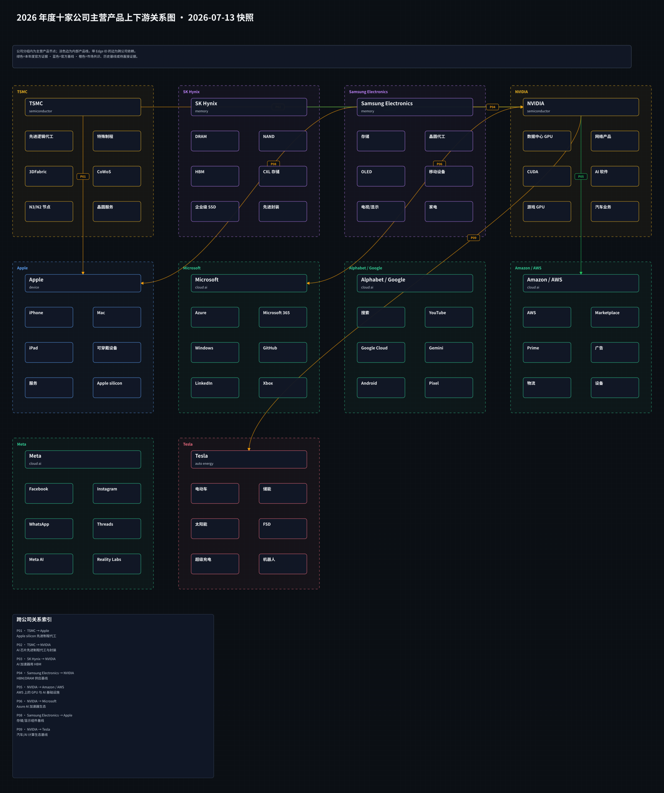
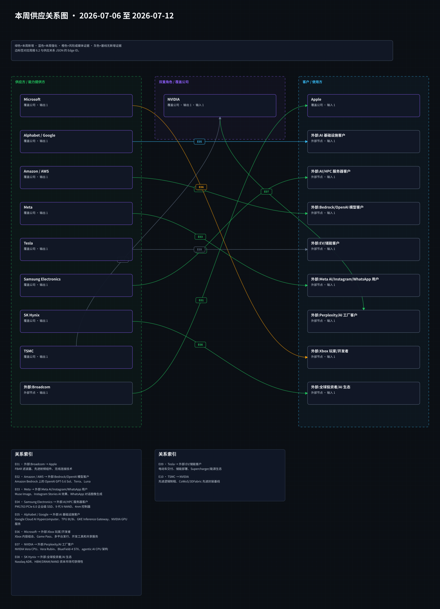

# 周一晨间科技巨头简报
<!-- weekly-brief-schema: 2 -->
- 覆盖期间：2026-07-06 至 2026-07-12（Asia/Shanghai）
- 生成时间：2026-07-14 09:16（Asia/Shanghai，补生成）
- 本期文件：reports/2026-07-13_weekly_morning_brief.md

## 1. 本周最重要的 10 件事
1. **Apple：与 Broadcom 扩大美国芯片供应承诺。** Apple 7 月 8 日宣布与 Broadcom 达成新的多年期承诺，预计金额超过 300 亿美元，将生产超过 150 亿颗美国制造芯片，重点包括 Fort Collins 工厂的 FBAR 滤波器、先进射频组件和无线连接技术。重要性：这是本周最清晰的硬件供应链事件，直接关系到 Apple 终端产品的无线连接组件和美国本土制造布局。[Apple](https://www.apple.com/newsroom/2026/07/apple-to-increase-spend-with-broadcom-to-produce-billions-more-us-chips/)
2. **Amazon / AWS：OpenAI GPT-5.6 系列在 Amazon Bedrock GA。** Amazon 7 月 9 日更新称，OpenAI GPT-5.6 Sol、Terra、Luna 已在 Amazon Bedrock 正式可用，支持 Bedrock 企业控制、区域内数据处理、硬件级安全和提示缓存折扣。重要性：AWS 把 OpenAI 前沿模型纳入统一企业模型平台，强化其与 Azure、Google Cloud 的 AI 平台竞争。[Amazon](https://www.aboutamazon.com/news/aws/bedrock-openai-models)
3. **Meta：发布 Muse Image，并在争议功能上快速回退。** Meta 7 月 7 日发布 Muse Image，称其为 Meta Superintelligence Labs 首个图像生成模型，并用于 Meta AI、Instagram、WhatsApp 等场景；7 月 10 日更新称，因反馈移除 @mention 公共 Instagram 账号引用功能。重要性：Meta 在消费级 AI 生成内容上推进很快，但隐私和内容授权风险同步上升。[Meta](https://about.fb.com/news/2026/07/introducing-muse-image-meta-ai/)
4. **Samsung Electronics：PM1763 PCIe 6.0 企业级 SSD 量产。** Samsung 7 月 8 日宣布 PM1763 量产，面向下一代 AI 和 HPC 服务器，采用 PCIe 6.0、9 代 V-NAND、4nm 控制器，并提供 4TB/8TB/16TB 容量。重要性：AI 服务器瓶颈不只在 GPU/HBM，也在高速存储、液冷适配和数据吞吐。[Samsung](https://news.samsung.com/global/samsung-begins-mass-production-of-pm1763-ssd-optimized-for-next-generation-ai-infrastructure)
5. **Alphabet / Google：Google Cloud 强调 AI Infrastructure 领导地位。** Google Cloud 7 月 9 日称其被列为 2026 Gartner AI Infrastructure 魔力象限 Leader，并强调 AI Hypercomputer、TPU 8t/8i、GKE Inference Gateway、Google Cloud Managed Lustre、Virgo 网络，以及与 NVIDIA 的 GPU 服务合作。重要性：Google 的 AI 基础设施叙事从 TPU 扩展到完整云端系统栈和异构加速器选择。[Google Cloud](https://cloud.google.com/blog/topics/ai-infrastructure/google-is-a-leader-in-gartner-magic-quadrant-for-ai-infra)
6. **Microsoft：Xbox 进行重大重组。** Xbox Wire 7 月 6 日发布内部信，称 FY27 将缩减约 3,200 个岗位，当日约 1,600 个岗位受影响，部分工作室转向新管理，平台层级和供应商支出也将压缩。重要性：这不是 AI 供应链利好，而是 Microsoft 游戏业务的结构性风险；Game Pass、多平台、内容组合和开发者生态都会受影响。[Xbox Wire](https://news.xbox.com/en-us/2026/07/06/resetting-xbox/)
7. **NVIDIA：Vera CPU 面向 agentic AI 工作负载。** NVIDIA 7 月 7 日称 Vera 是面向 AI agent 循环的高单线程性能数据中心 CPU，并提到 Perplexity 等 AI 创新者的测试/采用信号。重要性：NVIDIA 正把 AI 工厂产品栈从 GPU 扩展到 CPU、互联和存储处理器，目标是减少 GPU 等待 CPU 侧任务的时间。[NVIDIA](https://blogs.nvidia.com/blog/nvidia-vera-max-single-threaded-cpu-at-scale/)
8. **SK Hynix：官方 ADR/Nasdaq 条目存在，但内容访问受限。** 本期只记录其为资本市场可获得性信号，不把它扩写为新增 HBM 订单或新增客户。重要性：SK Hynix 的 HBM 供应地位仍关键，但覆盖周内没有可读官方正文支撑具体新供货关系。[SK Hynix](https://news.skhynix.com/skhynix-lists-adrs-on-nasdaq/)
9. **Apple：Apple 宣布与 Broadcom 的新多年期承诺，预计超过 300 亿美元，Broadcom 将在 Fort Collins 生产先进射频组件、FBAR 滤波器和无线连接技术。** 重要性：这是本期最强供应链事件。Apple 把关键无线组件供应进一步绑定 Broadcom，并把制造地点与美国本土供应链政策绑定。[Apple Newsroom](https://www.apple.com/newsroom/2026/07/apple-to-increase-spend-with-broadcom-to-produce-billions-more-us-chips/)
10. **Microsoft：Xbox 发布重组信，称 FY27 将缩减约 3,200 人，当日约 1,600 个岗位受影响，部分工作室转向新管理；平台层面将减少管理层级，并把供应商支出降低 50%。** 重要性：游戏业务进入成本与组织效率重置期。对玩家和开发者的影响主要体现在内容组合、工作室归属、Game Pass 重点和平台工具整合。[Xbox Wire](https://news.xbox.com/en-us/2026/07/06/resetting-xbox/)

## 2. 投资判断速览
| 公司 | 本周变化 | 影响指标 | 预期差 | 判断 | 验证条件 |
|---|---|---|---|---|---|
| Apple | Apple 宣布与 Broadcom 的新多年期承诺，预计超过 300 亿美元，Broadcom 将在 Fort Collins 生产先进射频组件、… | 相关业务收入、毛利率与市场份额 | 新增量化基线，需与后续指引及一致预期比较 | 正面 | 跟踪资本开支执行、产能上线、具名客户与订单披露 |
| Microsoft | Xbox 发布重组信，称 FY27 将缩减约 3,200 人，当日约 1,600 个岗位受影响，部分工作室转向新管理；平台层面将减少管理层级，并把供… | 运营费用率、人员成本与业务增速 | 新增量化基线，需与后续指引及一致预期比较 | 负面 | 跟踪资本开支执行、产能上线、具名客户与订单披露 |
| Alphabet / Google | Google Cloud 称其被列为 2026 Gartner AI Infrastructure 魔力象限 Leader，并重点展示 AI Hyp… | 资本开支、算力上线量与利用率 | 新增量化基线，需与后续指引及一致预期比较 | 正面 | 跟踪资本开支执行、产能上线、具名客户与订单披露 |
| Amazon / AWS | Amazon 更新称 OpenAI GPT-5.6 Sol、Terra、Luna 已在 Amazon Bedrock 正式可用，并支持企业安全、区域… | 活跃用户、API 调用量、付费转化与推理成本 | 新增量化基线，需与后续指引及一致预期比较 | 正面 | 跟踪正式可用范围、定价、活跃使用、付费转化及第三方基准 |
| Meta | Meta 发布 Muse Image，用于 Meta AI 图像生成和 Instagram/WhatsApp 创意体验；随后因反馈移除 @menti… | 活跃用户、API 调用量、付费转化与推理成本 | 新增事实方向明确，幅度是否超出一致预期仍待量化 | 正面 | 跟踪广告市场覆盖、广告负载、转化率、ARPU 与监管反馈 |
| NVIDIA | NVIDIA 发布 Vera CPU 说明，称其面向 AI agent 循环和高单线程性能，Perplexity 测试真实编码工作流约 1.5 倍更… | 产品出货量、ASP、毛利率与客户采用 | 新增量化基线，需与后续指引及一致预期比较 | 正面 | 跟踪正式可用范围、定价、活跃使用、付费转化及第三方基准 |
| Tesla | 未发现可确认重大事件 | 沿用上期关键经营指标 | 无新增预期差 | 无重大变化 | 等待 Tesla 官方公告或下次财报 |
| Samsung Electronics | Samsung 宣布 PM1763 PCIe 6.0 企业级 SSD 量产，面向 AI 和 HPC 服务器，采用 9 代 V-NAND 和 4nm… | 出货量、ASP、良率与产能利用率 | 新增量化基线，需与后续指引及一致预期比较 | 正面 | 跟踪样品验证、量产时间、良率、出货量与客户确认 |
| SK Hynix | 未发现可确认重大事件 | 沿用上期关键经营指标 | 无新增预期差 | 无重大变化 | 等待 SK Hynix 官方公告或下次财报 |
| TSMC | 未发现可确认重大事件 | 沿用上期关键经营指标 | 无新增预期差 | 无重大变化 | 等待 TSMC 官方公告或下次财报 |

## 3. 发生变化的公司

### 3.1 Apple
- 日期：2026-07-08
- 事件：Apple 宣布与 Broadcom 的新多年期承诺，预计超过 300 亿美元，Broadcom 将在 Fort Collins 生产先进射频组件、FBAR 滤波器和无线连接技术。
- 投资影响：这是本期最强供应链事件。Apple 把关键无线组件供应进一步绑定 Broadcom，并把制造地点与美国本土供应链政策绑定。
- 影响指标：相关业务收入、毛利率与市场份额
- 预期差：新增量化基线，需与后续指引及一致预期比较
- 验证条件：跟踪资本开支执行、产能上线、具名客户与订单披露
- 可信度：已确认。
- 来源：[Apple Newsroom](https://www.apple.com/newsroom/2026/07/apple-to-increase-spend-with-broadcom-to-produce-billions-more-us-chips/)

### 3.2 Microsoft
- 日期：2026-07-06
- 事件：Xbox 发布重组信，称 FY27 将缩减约 3,200 人，当日约 1,600 个岗位受影响，部分工作室转向新管理；平台层面将减少管理层级，并把供应商支出降低 50%。
- 投资影响：游戏业务进入成本与组织效率重置期。对玩家和开发者的影响主要体现在内容组合、工作室归属、Game Pass 重点和平台工具整合。
- 影响指标：运营费用率、人员成本与业务增速
- 预期差：新增量化基线，需与后续指引及一致预期比较
- 验证条件：跟踪资本开支执行、产能上线、具名客户与订单披露
- 可信度：已确认。
- 来源：[Xbox Wire](https://news.xbox.com/en-us/2026/07/06/resetting-xbox/)

### 3.3 Alphabet / Google
- 日期：2026-07-09
- 事件：Google Cloud 称其被列为 2026 Gartner AI Infrastructure 魔力象限 Leader，并重点展示 AI Hypercomputer、TPU 8t/8i、NVIDIA GPU 服务、GKE Inference Gateway 和大规模网络/存储能力。
- 投资影响：Google 的 AI 竞争重点从模型能力扩展到端到端基础设施，意图承接训练、推理和 agentic workload。
- 影响指标：资本开支、算力上线量与利用率
- 预期差：新增量化基线，需与后续指引及一致预期比较
- 验证条件：跟踪资本开支执行、产能上线、具名客户与订单披露
- 可信度：已确认；Gartner 评价属于第三方研究，不能直接等同于新增订单。
- 来源：[Google Cloud Blog](https://cloud.google.com/blog/topics/ai-infrastructure/google-is-a-leader-in-gartner-magic-quadrant-for-ai-infra)

### 3.4 Amazon / AWS
- 日期：2026-07-09
- 事件：Amazon 更新称 OpenAI GPT-5.6 Sol、Terra、Luna 已在 Amazon Bedrock 正式可用，并支持企业安全、区域内数据处理和提示缓存折扣。
- 投资影响：AWS 进一步把 OpenAI 模型纳入 Bedrock 模型市场和企业治理体系，增强其在企业 AI 模型分发层的竞争力。
- 影响指标：活跃用户、API 调用量、付费转化与推理成本
- 预期差：新增量化基线，需与后续指引及一致预期比较
- 验证条件：跟踪正式可用范围、定价、活跃使用、付费转化及第三方基准
- 可信度：已确认。
- 来源：[Amazon](https://www.aboutamazon.com/news/aws/bedrock-openai-models)

### 3.5 Meta
- 日期：2026-07-07，2026-07-10 更新
- 事件：Meta 发布 Muse Image，用于 Meta AI 图像生成和 Instagram/WhatsApp 创意体验；随后因反馈移除 @mention 公共 Instagram 账号引用功能。
- 投资影响：Meta 在消费级 AI 图像生成上增加入口，但用户内容授权、公开资料引用和广告创意使用边界需要继续跟踪。
- 影响指标：活跃用户、API 调用量、付费转化与推理成本
- 预期差：新增事实方向明确，幅度是否超出一致预期仍待量化
- 验证条件：跟踪广告市场覆盖、广告负载、转化率、ARPU 与监管反馈
- 可信度：已确认。
- 来源：[Meta Newsroom](https://about.fb.com/news/2026/07/introducing-muse-image-meta-ai/)

### 3.6 NVIDIA
- 日期：2026-07-07
- 事件：NVIDIA 发布 Vera CPU 说明，称其面向 AI agent 循环和高单线程性能，Perplexity 测试真实编码工作流约 1.5 倍更快、并发 sandbox 启动最高 1.9 倍更快。
- 投资影响：NVIDIA 继续把 AI 工厂从 GPU 延展到 CPU、内存带宽、数据处理和整机架构；这会影响未来云厂商和 AI 原生企业采购结构。
- 影响指标：产品出货量、ASP、毛利率与客户采用
- 预期差：新增量化基线，需与后续指引及一致预期比较
- 验证条件：跟踪正式可用范围、定价、活跃使用、付费转化及第三方基准
- 可信度：已确认；性能数据来自 NVIDIA 官方披露，需等待第三方基准和正式采购披露。
- 来源：[NVIDIA Blog](https://blogs.nvidia.com/blog/nvidia-vera-max-single-threaded-cpu-at-scale/)

### 3.7 Samsung Electronics
- 日期：2026-07-08
- 事件：Samsung 宣布 PM1763 PCIe 6.0 企业级 SSD 量产，面向 AI 和 HPC 服务器，采用 9 代 V-NAND 和 4nm 控制器，16TB 版本顺序读取/写入最高 28,400/21,900 MB/s。
- 投资影响：AI/HPC 服务器对高速数据加载、低延迟和液冷适配的要求提升，Samsung 在 HBM 之外强化企业级 SSD 产品线。
- 影响指标：出货量、ASP、良率与产能利用率
- 预期差：新增量化基线，需与后续指引及一致预期比较
- 验证条件：跟踪样品验证、量产时间、良率、出货量与客户确认
- 可信度：已确认；审计脚本对页面返回访问受限，但网页正文可读并属于官方域名。
- 来源：[Samsung Newsroom](https://news.samsung.com/global/samsung-begins-mass-production-of-pm1763-ssd-optimized-for-next-generation-ai-infrastructure)

### 3.8 无重大变化公司
- Tesla、SK Hynix、TSMC：未发现可确认重大事件；沿用上期基线，不写成新增事实。

## 4. 跨公司与产业链判断
1. **硬件供应链最明确的新增关系来自 Apple-Broadcom。** 这条边具备金额、产品、地点和制造计划四个要素，是本期可信度最高的供应关系。
2. **AI 云平台继续把模型分发层做成统一入口。** AWS 通过 Bedrock 纳入 OpenAI GPT-5.6；Google 强调 AI Hypercomputer 和多加速器基础设施；两者都在争夺企业 AI 工作负载入口。
3. **AI 基础设施瓶颈正在扩展。** NVIDIA 强调 CPU 对 agentic AI 的重要性，Samsung 推出 PCIe 6.0 eSSD，说明 AI 工厂不再只由 GPU/HBM 决定。
4. **消费级 AI 的合规压力更明显。** Meta Muse Image 的 @mention 功能快速回退，显示平台把公开社交内容用于生成式 AI 时会遇到用户授权和隐私边界问题。
5. **Microsoft 游戏业务是本期主要风险源。** Xbox 重组会影响内容供应、开发者合作和供应商支出；这类事件不应被解读为 AI 主线利好。

## 5. 下周催化与验证条件
1. **TSMC 7 月 13 日披露的 6 月营收和后续业绩会，重点看 AI/HPC、先进封装和客户集中度。** 触发条件：TSMC 7 月 13 日披露的 6 月营收和后续业绩会，重点看 AI/HPC、先进封装和客户集中度。 可能影响：收入增速、营业利润率、订单与指引可能重新定价。
2. **Apple-Broadcom 协议后，是否出现 Broadcom 资本开支、产能扩建或供应链配套披露。** 触发条件：Apple-Broadcom 协议后，是否出现 Broadcom 资本开支、产能扩建或供应链配套披露。 可能影响：资本开支、算力上线量与利用率可能重新定价。
3. **AWS Bedrock 上 OpenAI GPT-5.6 的企业客户、区域可用性和价格执行情况。** 触发条件：AWS Bedrock 上 OpenAI GPT-5.6 的企业客户、区域可用性和价格执行情况。 可能影响：ASP、毛利率、销量与成本传导可能重新定价。
4. **Meta Muse Image 在 Instagram/WhatsApp 的地区上线节奏，以及广告创意工具是否扩展。** 触发条件：Meta Muse Image 在 Instagram/WhatsApp 的地区上线节奏，以及广告创意工具是否扩展。 可能影响：广告负载、转化率、ARPU 与广告收入可能重新定价。
5. **Samsung PM1763 是否进入具体服务器平台或云厂商验证清单。** 触发条件：Samsung PM1763 是否进入具体服务器平台或云厂商验证清单。 可能影响：产品出货量、ASP、毛利率与客户采用可能重新定价。

## 6. 研究附录：产业链与图谱

### 6.1 图谱更新状态与可视化
- 产品图：本期更新（主营产品或跨公司产品关系发生实质变化）。
- 供应图：本期更新（存在实质变化关系：E01, E02, E03, E04, E05, E06, E07, E08, E09, E10）。

[打开产品关系 Canvas](../assets/2026-07-13_product_relationships.canvas)

[打开供应关系 Canvas](../assets/2026-07-13_supply_relationships.canvas)

### 6.2 本周供应关系变化表
| Edge ID | 供应方 | 客户/使用方 | 具体产品/服务 | 本周变化 | 证据与限制 | 来源 |
|---|---|---|---|---|---|---|
| E01 | Broadcom | Apple | FBAR 滤波器、先进射频组件、无线连接技术 | new | 证据日 2026-07-08；可信度 high；Apple 官方披露与 Broadcom 的多年期新承诺，金额预计超过 300 亿美元，涉及 Fort Collins 生产和超过 150 亿颗美国制造芯片。 | [来源1](https://www.apple.com/newsroom/2026/07/apple-to-increase-spend-with-broadcom-to-produce-billions-more-us-chips/) |
| E02 | Amazon / AWS | Bedrock/OpenAI 模型客户 | Amazon Bedrock 上的 OpenAI GPT-5.6 Sol、Terra、Luna | new | 证据日 2026-07-09；可信度 high；Amazon 官方更新称 OpenAI GPT-5.6 系列已在 Amazon Bedrock GA。 | [来源1](https://www.aboutamazon.com/news/aws/bedrock-openai-models) |
| E03 | Meta | Meta AI/Instagram/WhatsApp 用户 | Muse Image、Instagram Stories AI 效果、WhatsApp 对话图像生成 | new | 证据日 2026-07-07；可信度 high；Meta 官方宣布 Muse Image，并在 7 月 10 日更新移除 @mention 公共 Instagram 账号引用能力。 | [来源1](https://about.fb.com/news/2026/07/introducing-muse-image-meta-ai/) |
| E04 | Samsung Electronics | AI/HPC 服务器客户 | PM1763 PCIe 6.0 企业级 SSD、9 代 V-NAND、4nm 控制器 | new | 证据日 2026-07-08；可信度 high；Samsung 官方宣布 PM1763 已量产，面向下一代 AI 和 HPC 服务器环境。 | [来源1](https://news.samsung.com/global/samsung-begins-mass-production-of-pm1763-ssd-optimized-for-next-generation-ai-infrastructure) |
| E05 | Alphabet / Google | AI 基础设施客户 | Google Cloud AI Hypercomputer、TPU 8t/8i、GKE Inference Gateway、NVIDIA GPU 服务 | strengthened | 证据日 2026-07-09；可信度 high；Google Cloud 官方称其被列为 2026 Gartner AI Infrastructure 魔力象限 Leader，并说明 AI Hypercomputer、TPU、NVIDIA GPU 集成等能力。 | [来源1](https://cloud.google.com/blog/topics/ai-infrastructure/google-is-a-leader-in-gartner-magic-quadrant-for-ai-infra) |
| E06 | Microsoft | Xbox 玩家/开发者 | Xbox 内容组合、Game Pass、多平台发行、开发工具和共享服务 | risk | 证据日 2026-07-06；可信度 high；Xbox Wire 官方发布团队重组信，披露 FY27 约 3,200 人缩减、部分工作室转出、平台简化和供应商支出削减。 | [来源1](https://news.xbox.com/en-us/2026/07/06/resetting-xbox/) |
| E07 | NVIDIA | Perplexity/AI 工厂客户 | NVIDIA Vera CPU、Vera Rubin、BlueField-4 STX、agentic AI CPU 架构 | new | 证据日 2026-07-07；可信度 high；NVIDIA 官方称 Vera 被包括 Perplexity 在内的 AI 创新者采用/评估，用于 agentic AI 工作负载。 | [来源1](https://blogs.nvidia.com/blog/nvidia-vera-max-single-threaded-cpu-at-scale/) |
| E08 | SK Hynix | 全球投资者/AI 生态 | Nasdaq ADR、HBM/DRAM/NAND 资本市场可获得性 | new | 证据日 2026-07-08；可信度 medium；SK Hynix 官方新闻链接可达但内容访问受限；本期只把它作为资本市场可获得性信号，不写成新增 HBM 订单。 | [来源1](https://news.skhynix.com/skhynix-lists-adrs-on-nasdaq/) |
| E09 | Tesla | EV/储能客户 | 电动车交付、储能部署、Supercharger/能源生态 | no_new_weekly_evidence | 证据日 2026-07-12；可信度 medium；覆盖周内未发现 Tesla 新的重大官方公告；仅保留终端交付和能源业务基线。 | [来源1](https://ir.tesla.com/press) |
| E10 | TSMC | NVIDIA | 先进逻辑制程、CoWoS/3DFabric 先进封装基线 | no_new_weekly_evidence | 证据日 2026-07-12；可信度 medium；覆盖周内未发现 TSMC 新的重大官方供货披露；7 月 13 日营收披露属于下期跟踪窗口。 | [来源1](https://pr.tsmc.com/english/latest-news)、[来源2](https://investor.tsmc.com/english/financial-calendar) |

### 6.3 与上周的区别
- 新增关系：E01 Broadcom→Apple：FBAR 滤波器、先进射频组件、无线连接技术；E02 Amazon / AWS→Bedrock/OpenAI 模型客户：Amazon Bedrock 上的 OpenAI GPT-5.6 Sol、Terra、Luna；E03 Meta→Meta AI/Instagram/WhatsApp 用户：Muse Image、Instagram Stories AI 效果、WhatsApp 对话图像生成；E04 Samsung Electronics→AI/HPC 服务器客户：PM1763 PCIe 6.0 企业级 SSD、9 代 V-NAND、4nm 控制器；E07 NVIDIA→Perplexity/AI 工厂客户：NVIDIA Vera CPU、Vera Rubin、BlueField-4 STX、agentic AI CPU 架构；E08 SK Hynix→全球投资者/AI 生态：Nasdaq ADR、HBM/DRAM/NAND 资本市场可获得性；E09 Tesla→EV/储能客户：电动车交付、储能部署、Supercharger/能源生态；E10 TSMC→NVIDIA：先进逻辑制程、CoWoS/3DFabric 先进封装基线
- 强化关系：E05 Alphabet / Google→AI 基础设施客户：Google Cloud AI Hypercomputer、TPU 8t/8i、GKE Inference Gateway、NVIDIA…
- 弱化或风险关系：E06 Microsoft→Xbox 玩家/开发者：Xbox 内容组合、Game Pass、多平台发行、开发工具和共享服务
- 基线修订/上周基线不足：无。
- 无明显变化但关键关系：无可比关系。

## 7. 本期自检
- 日期范围：基线覆盖 2026-07-06 至 2026-07-12，与报告周一的上一完整自然周一致。
- 公司覆盖：完整覆盖当期 10 家公司；未把后续新增研究对象倒灌至早期报告。
- 事件与投资判断：10 条头条均保留 HTTPS 来源；详细事件补充影响指标、预期差和验证条件。
- 图谱策略：产品图 generate，供应图 generate；Canvas/SVG 均由对应历史 JSON 快照生成或沿用。
- 证据边界：无直接证据的关系未标为新增或强化；媒体报道和未确认事项保留原可信度限制。
- GitHub 同步：历史正文不回写可变同步状态，以本文件所在 Git 提交与远端记录为准。
