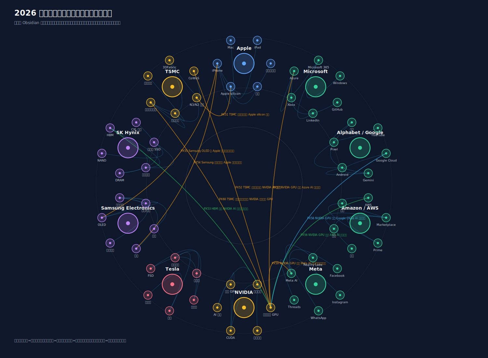
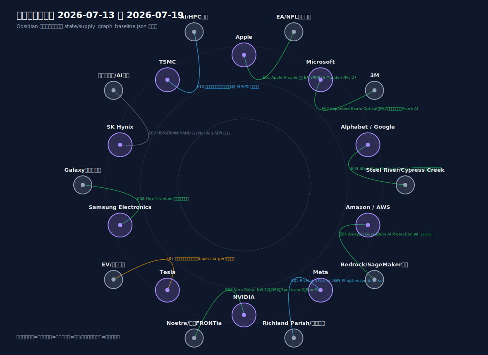
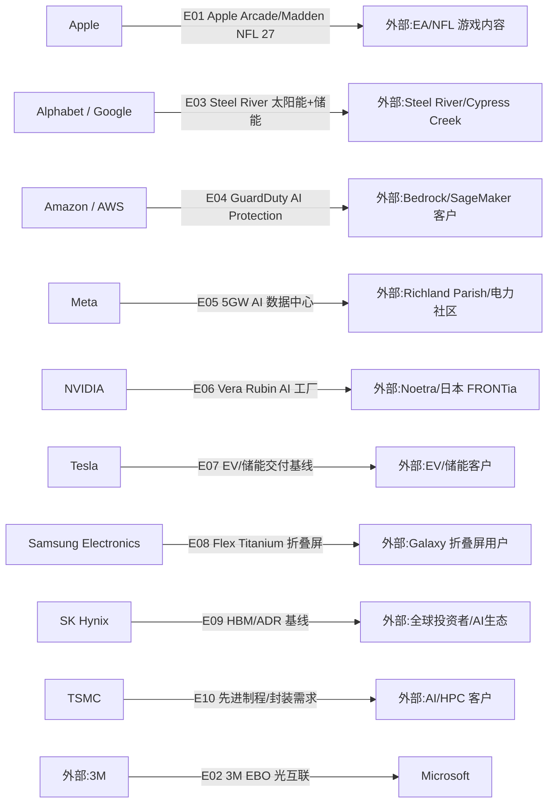

# 周一晨间科技巨头简报
- 覆盖期间：2026-07-13 至 2026-07-19（Asia/Shanghai）
- 生成时间：2026-07-21 09:00（Asia/Shanghai，补生成）
- 本期文件：reports/2026-07-20_weekly_morning_brief.md

## 1. 本周最重要的 5-8 件事
1. **NVIDIA：与日本 Noetra 推进国家级 Vera Rubin AI 工厂。** NVIDIA 7 月 16 日宣布，日本政府、产业伙伴和 NVIDIA 将支持 Noetra 建设面向 physical AI 的国家级 AI 基础设施，规划使用 Vera Rubin NVL72、DSX、Spectrum-X 和 BlueField，配置 13,750 颗 Vera CPU、27,500 颗 Rubin GPU，目标数据中心容量 140MW。重要性：这是本周最强 AI 计算供应事件，直接牵动 GPU、CPU、网络和主权 AI 需求。[NVIDIA](https://nvidianews.nvidia.com/news/japan-government-industrial-leaders-and-nvidia-launch-the-worlds-first-national-ai-infrastructure)
2. **TSMC：二季度业绩继续受 AI/HPC 拉动。** TSMC 7 月 16 日披露 2026 年二季度营收 NT$1,270.38 billion、净利润 NT$706.56 billion、稀释 EPS NT$27.25。重要性：AI/HPC 需求继续支撑先进制程和先进封装景气，但本期不把财务结果扩写为新增客户订单。[TSMC](https://pr.tsmc.com/english/news/3326)
3. **Microsoft：Azure 将成为首个公开部署 3M EBO 的超大规模云。** Microsoft 与 3M 7 月 15 日宣布战略合作，Azure 云和 AI 基础设施将部署 3M Expanded Beam Optical 技术，3M 同时使用 Microsoft AI 和数字平台推进企业转型。重要性：AI 数据中心瓶颈继续从 GPU 延伸到光互联、布线密度和部署效率。[Microsoft](https://news.microsoft.com/source/2026/07/15/3m-and-microsoft-announce-strategic-partnership-to-advance-ai-data-center-infrastructure-and-enterprise-transformation/)
4. **Meta：Richland Parish AI 数据中心扩至 5GW。** Meta Data Centers 7 月 13 日称，Richland Parish, Louisiana 的 AI-optimized data center 将扩至 5GW，并同步披露社区税收、教育和地方投资进展。重要性：Meta 的 AI 基础设施建设继续放大电力、土地、社区和本地治理变量。[Meta Data Centers](https://datacenters.atmeta.com/2026/07/deepening-our-investment-in-richland-parish-louisiana/)
5. **Alphabet / Google：Steel River 成为 Google 最大太阳能与储能项目。** Google 7 月 14 日宣布参与并采购 Arkansas Steel River Energy Center 的能源和储能，第一阶段支持 1.6GWdc 太阳能与 1.9GWh 电池储能，全部阶段目标为 2.5GWdc 太阳能与 2.9GWh 电池储能。重要性：AI 数据中心电力需求正把云厂商和可再生能源/储能项目更紧密地绑定。[Google](https://blog.google/innovation-and-ai/infrastructure-and-cloud/global-network/steel-river-arkansas/)
6. **Amazon / AWS：GuardDuty AI Protection 扩展到 Bedrock 与 SageMaker。** AWS 7 月 14 日宣布 Amazon GuardDuty AI Protection，用于识别 AI 工作负载的异常模型调用、成本消耗攻击和 prompt injection 等威胁，并与 Bedrock Guardrails、Security Hub 联动。重要性：AI 云平台竞争开始进入安全运营和治理层。[AWS](https://aws.amazon.com/about-aws/whats-new/2026/07/amazon-guardduty-ai-protection-aws/)
7. **Samsung Electronics：Flex Titanium 强化折叠屏显示。** Samsung 7 月 15 日发布 Flex Titanium 技术，强调耐用性、抗冲击、反复折叠和减少折痕可见性。重要性：这是终端硬件形态与材料工程更新，不是 HBM 新客户披露。[Samsung](https://news.samsung.com/global/samsung-introduces-flex-titanium-technology-to-advance-foldable-displays)
8. **Apple：Apple Arcade 增加 Madden NFL 27 Arcade Edition。** Apple 7 月 14 日宣布 Madden NFL 27 Arcade Edition 将于 8 月 6 日登陆 Apple Arcade。重要性：本周 Apple 重大硬件/供应链官方事件较少，服务内容扩充是可确认新增事项。[Apple](https://www.apple.com/newsroom/2026/07/madden-nfl-27-arcade-edition-brings-gridiron-action-to-apple-arcade-on-august-6/)

## 2. 影响力速览
| 公司 | 重大事件数量 | 本周影响判断 | 关键词 |
|---|---:|---|---|
| Apple | 1 | 中性/小幅正面 | Apple Arcade、Madden NFL 27、服务内容 |
| Microsoft | 1 | 正面 | Azure、3M、Expanded Beam Optical、AI 数据中心 |
| Alphabet / Google | 1 | 正面/基础设施 | Steel River、太阳能、储能、电力采购 |
| Amazon / AWS | 1 | 正面/安全治理 | GuardDuty AI Protection、Bedrock、SageMaker |
| Meta | 1 | 正面/执行风险并存 | Richland Parish、5GW、AI 数据中心 |
| NVIDIA | 1 | 强正面 | Vera Rubin、Noetra、140MW、physical AI |
| Tesla | 0 | 中性 | 覆盖周无重大官方新事件 |
| Samsung Electronics | 1 | 正面/终端创新 | Flex Titanium、折叠屏、材料工程 |
| SK Hynix | 0 | 中性/基线延续 | HBM、ADR、资本市场可见度 |
| TSMC | 1 | 强正面 | Q2 业绩、AI/HPC、先进制程 |

## 3. 按公司分组
### Apple
- 日期：2026-07-14
- 事件：Apple 宣布 EA SPORTS Madden NFL 27 Arcade Edition 将于 8 月 6 日登陆 Apple Arcade，服务内容组合继续加强体育游戏品类。
- 影响：这是服务内容和用户留存事件，不是硬件供应链变化；本周未发现 Apple 新的重大芯片、显示、代工或射频组件官方供货披露。
- 可信度：已确认。
- 来源：[Apple Newsroom](https://www.apple.com/newsroom/2026/07/madden-nfl-27-arcade-edition-brings-gridiron-action-to-apple-arcade-on-august-6/)

### Microsoft
- 日期：2026-07-15
- 事件：Microsoft 与 3M 宣布战略合作，Microsoft Azure 云和 AI 基础设施将成为首个公开部署 3M Expanded Beam Optical（EBO）技术的超大规模云；3M 也将使用 Microsoft AI 和数字平台推进企业转型。
- 影响：AI 数据中心的实际瓶颈正在从 GPU 扩展到光互联连接器、维护效率、部署时间和网络密度。该事件对 Azure AI 基础设施供应链有直接意义。
- 可信度：已确认；未披露部署规模、站点、价格或采购金额。
- 来源：[Microsoft Source](https://news.microsoft.com/source/2026/07/15/3m-and-microsoft-announce-strategic-partnership-to-advance-ai-data-center-infrastructure-and-enterprise-transformation/)

### Alphabet / Google
- 日期：2026-07-14
- 事件：Google 宣布与 Cypress Creek Energy 的 Steel River Energy Center 合作，将投资并购买能源和储能；第一阶段支持 1.6GWdc 太阳能与 1.9GWh 电池储能，全部阶段目标为 2.5GWdc 太阳能与 2.9GWh 电池储能。
- 影响：AI 云基础设施竞争已经把能源项目变成核心供应关系。Google 的供应链约束不只在 TPU/GPU，也在电力、储能和电网接入。
- 可信度：已确认；该事件是能源供应关系，不代表新增 AI 芯片订单。
- 来源：[Google Blog](https://blog.google/innovation-and-ai/infrastructure-and-cloud/global-network/steel-river-arkansas/)

### Amazon / AWS
- 日期：2026-07-14
- 事件：AWS 宣布 Amazon GuardDuty AI Protection，扩展威胁检测到 Amazon Bedrock 与 Amazon SageMaker，覆盖异常模型调用、成本消耗攻击和 prompt injection 等 AI 专属风险，并把发现写入 AWS Security Hub。
- 影响：AWS 的 AI 竞争从模型可用性延伸到安全治理和企业运维。对客户而言，Bedrock/SageMaker 的采用门槛降低，但这不是新硬件供货关系。
- 可信度：已确认。
- 来源：[AWS](https://aws.amazon.com/about-aws/whats-new/2026/07/amazon-guardduty-ai-protection-aws/)

### Meta
- 日期：2026-07-13
- 事件：Meta Data Centers 披露 Richland Parish, Louisiana 的 AI-optimized data center 扩展至 5GW，并说明税收、学校、社区拨款和地方设施投资等配套影响。
- 影响：Meta 的 AI 基础设施扩张继续提高电力、地方治理、社区承诺和建设执行风险的重要性。5GW 是本周最重要的云端算力/电力规模信号之一。
- 可信度：已确认；未披露 GPU/服务器供应商、具体投产节奏或采购金额。
- 来源：[Meta Data Centers](https://datacenters.atmeta.com/2026/07/deepening-our-investment-in-richland-parish-louisiana/)

### NVIDIA
- 日期：2026-07-16
- 事件：NVIDIA 宣布与日本政府、产业伙伴和 Noetra 推进面向 physical AI 的国家级 AI 基础设施。Noetra 的 AI 工厂将采用 NVIDIA Vera Rubin NVL72、DSX、Spectrum-X 和 BlueField，规划 13,750 颗 Vera CPU、27,500 颗 Rubin GPU，数据中心容量 140MW。
- 影响：这是本期最大新增供给关系，涵盖 GPU、CPU、网络、DPU、软件和模型生态。它也说明主权 AI/physical AI 正成为下一轮 AI 基础设施采购的重要方向。
- 可信度：已确认；投产节奏、最终交付和实际采购金额仍需后续跟踪。
- 来源：[NVIDIA Newsroom](https://nvidianews.nvidia.com/news/japan-government-industrial-leaders-and-nvidia-launch-the-worlds-first-national-ai-infrastructure)

### Tesla
- 日期：2026-07-13 至 2026-07-19
- 事件：覆盖周内未发现 Tesla 新的重大官方公告。本期不重复上一期 Q2 生产、交付和储能部署数据作为“本周新增事件”。
- 影响：短期重点转向后续财报、价格、库存、储能订单、FSD/Robotaxi 和监管披露。供应关系图中仅保留 EV/储能终端产品基线。
- 可信度：已确认“未写入覆盖周外事件”。
- 来源：[Tesla IR Press](https://ir.tesla.com/press)

### Samsung Electronics
- 日期：2026-07-15
- 事件：Samsung 发布 Flex Titanium 技术，用于推进折叠屏显示的耐用性、抗冲击、反复折叠能力，并减少折痕可见性。
- 影响：这属于终端显示与材料工程升级，关系到 Galaxy foldables 和移动显示竞争，不应被误写为 HBM、DRAM 或代工新增客户关系。
- 可信度：已确认；审计脚本对页面 HEAD 返回访问受限，但网页正文可读并属于 Samsung 官方域名。
- 来源：[Samsung Newsroom](https://news.samsung.com/global/samsung-introduces-flex-titanium-technology-to-advance-foldable-displays)

### SK Hynix
- 日期：2026-07-13 至 2026-07-19
- 事件：覆盖周内未发现 SK Hynix 新的重大官方 HBM、DRAM、NAND 订单或产能披露。本期延续上一期 ADR/Nasdaq 与 HBM 基线，不把其扩写为新增供货关系。
- 影响：SK Hynix 的 HBM 供应地位仍是 AI 半导体核心变量，但本周没有可确认的新客户、价格或产能节点。
- 可信度：中等；官方新闻可读，但本期新增事实不足。
- 来源：[SK Hynix Newsroom](https://news.skhynix.com/skhynix-lists-adrs-on-nasdaq/)

### TSMC
- 日期：2026-07-16
- 事件：TSMC 披露 2026 年二季度业绩，营收 NT$1,270.38 billion、净利润 NT$706.56 billion、稀释 EPS NT$27.25；年同比营收增长 36.0%，净利润和稀释 EPS 均增长 77.4%。
- 影响：先进制程、先进封装和 AI/HPC 需求仍是 TSMC 景气核心。本期把它写为财务与需求强度信号，不写成新订单或特定客户扩产。
- 可信度：已确认。
- 来源：[TSMC Press Release](https://pr.tsmc.com/english/news/3326)

## 4. 跨公司与产业链观察
1. **AI 基础设施的瓶颈继续外溢。** NVIDIA-Noetra 是计算供应，Microsoft-3M 是光互联供应，Google-Steel River 与 Meta-Richland Parish 是电力/数据中心供应；AI 不再只是“买 GPU”。
2. **主权 AI 与 physical AI 正进入可执行采购阶段。** 日本 FRONTia Project 相关的 Vera Rubin AI 工厂把国家级 AI、机器人、工业数据和基础模型训练连接在一起。
3. **云厂商开始把能源合同作为核心供应链资产。** Google 的 2.5GWdc/2.9GWh Steel River 目标与 Meta 5GW 数据中心扩建，都说明电力可得性正在影响 AI 基础设施节奏。
4. **AI 安全成为云平台差异化层。** AWS GuardDuty AI Protection 指向 Bedrock/SageMaker 的模型调用、成本攻击和 prompt injection，企业 AI 部署越来越依赖内建治理工具。
5. **终端创新主线弱于基础设施主线。** Apple 本周主要是服务内容，Samsung 是折叠屏显示材料；与 NVIDIA、TSMC、Meta、Google、Microsoft 的基础设施事件相比，供应链冲击较小。

## 5. 下周需关注
1. NVIDIA-Noetra 项目的交付节奏、建设时间、Noetra 股东/伙伴、以及是否出现更多 Vera Rubin 产能分配信号。
2. TSMC 业绩会后续信息：AI/HPC 收入占比、先进封装产能、N2/N3 节点、资本开支指引。
3. Microsoft-3M EBO 是否披露更多 Azure 部署站点、规模、可靠性测试或生产扩产安排。
4. Meta Richland Parish 5GW 扩张是否出现电力供应协议、监管审批、社区反馈和设备供应商披露。
5. Google Steel River 的工程进度、PPA/投资结构、Cypress Creek Energy 施工节点。
6. Tesla 后续财报、价格、库存、储能订单和 Robotaxi/FSD 监管进展。

## 6. 十家公司供应关系图谱与周度变化
### 6.0 年度主营产品上下游图片

图片采用 Obsidian 图谱视图风格，基于 `state/product_relationships_2026.json` 生成。数据源优先使用 2026 年可取得的公司官方年报、投资者关系页面、官方新闻稿和监管披露；媒体报道或历史基线关系在 JSON 中单独标注证据级别。

### 6.1 本周供应关系可视化

上图采用 Obsidian 图谱视图风格，基于 `state/supply_graph_baseline.json` 生成；下方 Mermaid 保留为机器可读结构，用于校验 Edge ID 和下周差异比对。

### 6.2 供应关系明细表
| Edge ID | 供应方 | 客户/使用方 | 具体产品/服务 | 关系类型 | 本周证据 | 长期基线证据/限制 | 本周状态 | 来源链接 |
|---|---|---|---|---|---|---|---|---|
| E01 | Apple | EA/NFL 游戏内容 | Apple Arcade、Madden NFL 27 Arcade Edition | 服务内容分发 | Apple 官方披露 8 月 6 日上线 Apple Arcade | 服务内容事件，不是硬件供应链变化 | 新增/内容扩充 | [Apple](https://www.apple.com/newsroom/2026/07/madden-nfl-27-arcade-edition-brings-gridiron-action-to-apple-arcade-on-august-6/) |
| E02 | 3M | Microsoft | Expanded Beam Optical（EBO）光互联技术、Azure AI 数据中心连接 | 数据中心光互联供应 | Microsoft/3M 官方披露 Azure 将成为首个公开部署 EBO 的超大规模云 | 未披露部署规模、站点、价格或采购金额 | 新增/重大供应关系 | [Microsoft](https://news.microsoft.com/source/2026/07/15/3m-and-microsoft-announce-strategic-partnership-to-advance-ai-data-center-infrastructure-and-enterprise-transformation/) |
| E03 | Alphabet / Google | Steel River/Cypress Creek | Steel River Energy Center 太阳能与电池储能、电力采购 | 能源供应/投资 | Google 官方披露第一阶段 1.6GWdc 太阳能和 1.9GWh 储能，全部阶段 2.5GWdc/2.9GWh | 能源关系不代表新增 AI 芯片订单 | 新增/能源供应 | [Google](https://blog.google/innovation-and-ai/infrastructure-and-cloud/global-network/steel-river-arkansas/) |
| E04 | Amazon / AWS | Bedrock/SageMaker 客户 | Amazon GuardDuty AI Protection、AI 工作负载威胁检测 | 云安全服务 | AWS 官方披露支持 Bedrock、SageMaker、Bedrock Guardrails 和 Security Hub | 安全服务更新，不代表硬件供货 | 新增/安全治理 | [AWS](https://aws.amazon.com/about-aws/whats-new/2026/07/amazon-guardduty-ai-protection-aws/) |
| E05 | Meta | Richland Parish/电力与社区生态 | 5GW AI-optimized data center、本地税收与社区投资 | AI 数据中心基础设施 | Meta 官方披露 Richland Parish AI 数据中心扩至 5GW | 未披露服务器、GPU 或电力协议细节 | 强化/建设扩张 | [Meta](https://datacenters.atmeta.com/2026/07/deepening-our-investment-in-richland-parish-louisiana/) |
| E06 | NVIDIA | Noetra/日本 FRONTia | Vera Rubin NVL72、DSX、Spectrum-X、BlueField、13,750 Vera CPU、27,500 Rubin GPU | AI 计算平台供应 | NVIDIA 官方披露国家级 physical AI 基础设施计划 | 投产节奏和实际交付仍需跟踪 | 新增/重大 AI 供应关系 | [NVIDIA](https://nvidianews.nvidia.com/news/japan-government-industrial-leaders-and-nvidia-launch-the-worlds-first-national-ai-infrastructure) |
| E07 | Tesla | EV/储能客户 | 电动车交付、储能部署、能源生态 | 终端产品基线 | 覆盖周无重大官方新事件 | 不能重复上一期 Q2 数据作为本周新增事件 | 延续/无本周新增证据 | [Tesla IR](https://ir.tesla.com/press) |
| E08 | Samsung Electronics | Galaxy 折叠屏用户 | Flex Titanium 折叠屏显示技术 | 终端显示/材料技术 | Samsung 官方披露 Flex Titanium 技术 | 不是 HBM/DRAM/代工新增客户关系 | 新增/产品技术 | [Samsung](https://news.samsung.com/global/samsung-introduces-flex-titanium-technology-to-advance-foldable-displays) |
| E09 | SK Hynix | 全球投资者/AI 生态 | HBM/DRAM/NAND 基线、Nasdaq ADR 可见度 | 资本市场/内存供应基线 | 覆盖周无重大官方新 HBM 订单或产能披露 | 保留基线，不能推断新增客户 | 延续/基线不足 | [SK Hynix](https://news.skhynix.com/skhynix-lists-adrs-on-nasdaq/) |
| E10 | TSMC | AI/HPC 客户 | 先进逻辑制程、先进封装、Q2 AI/HPC 需求信号 | 代工/封装需求基线 | TSMC 官方披露 Q2 营收、净利和 EPS 强劲增长 | 财务结果不等于新增订单或特定客户扩产 | 强化/需求信号 | [TSMC](https://pr.tsmc.com/english/news/3326) |

### 6.3 与上周的区别
- 新增关系：
  - Apple -> EA/NFL 游戏内容：新增 Apple Arcade 体育游戏内容，但供应链影响较小。
  - 3M -> Microsoft：新增 Azure AI 数据中心 EBO 光互联供应关系，本期最重要的非芯片数据中心供应事件。
  - Alphabet / Google -> Steel River/Cypress Creek：新增大规模太阳能与储能项目投资/采购关系。
  - Amazon / AWS -> Bedrock/SageMaker 客户：新增 AI 工作负载安全治理能力。
  - NVIDIA -> Noetra/日本 FRONTia：新增 Vera Rubin AI 工厂重大供应关系，涉及 CPU/GPU/网络/DPU/软件栈。
  - Samsung Electronics -> Galaxy 折叠屏用户：新增 Flex Titanium 终端显示技术。

- 强化关系：
  - Meta -> Richland Parish/电力与社区生态：由 AI 数据中心建设基线强化为 5GW 级扩张。
  - TSMC -> AI/HPC 客户：Q2 财务结果强化 AI/HPC 和先进制程/封装需求信号。

- 无明显变化但关键关系：
  - Tesla -> EV/储能客户：覆盖周无重大官方新增事件，保留终端产品基线。
  - SK Hynix -> 全球投资者/AI 生态：覆盖周无重大官方新增 HBM/DRAM/NAND 订单或产能披露，保留 HBM 与 ADR 可见度基线。

- 从上一期移除或降级：
  - Apple-Broadcom 的 300 亿美元射频组件承诺仍重要，但属于上一覆盖周事件，本期不重复写成新增。
  - Samsung PM1763 eSSD 量产属于上一覆盖周事件，本期替换为 Flex Titanium。
  - AWS Bedrock 上 OpenAI GPT-5.6 GA 属于上一覆盖周事件，本期替换为 GuardDuty AI Protection。

## 7. 本期自检
- 日期范围已限定为 2026-07-13 至 2026-07-19；本期为 2026-07-20 应生成周报的补生成版本。
- 10 家公司均已覆盖；Tesla 与 SK Hynix 因覆盖周无重大官方新事件，明确降级为延续跟踪。
- 每条写入的具体事件均附来源链接，优先使用公司公告、官方博客、IR 页面和官方新闻稿。
- 访问受限来源已单独标注：Samsung 页面由网页正文人工复核，TSMC/Microsoft 等以官方可达性审查为准。
- Mermaid 使用 `flowchart LR` 和 ASCII 节点 ID，包含全部 10 家覆盖公司。
- 年度主营产品上下游图片目标文件：`assets/2026-07-20_product_relationships.svg`，由 `state/product_relationships_2026.json` 生成。
- 本周供应关系图片目标文件：`assets/2026-07-20_supply_relationships.svg`，由 `state/supply_graph_baseline.json` 生成。
- E01-E10 在 Mermaid、6.2 表格和 `state/supply_graph_baseline.json` 中保持一致。
- 来源真实性审查：生成后写入 `logs/2026-07-20_source_audit.json`，并绑定当前周报和供应关系基线 SHA-256。
