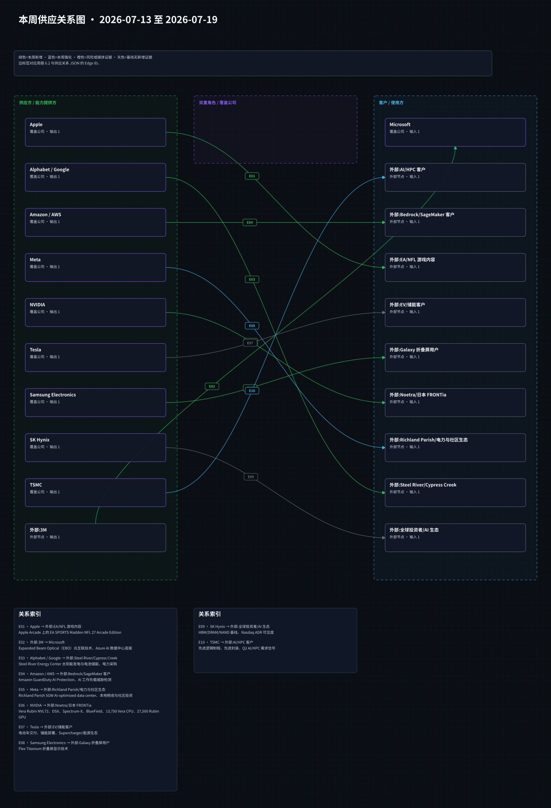

# 周一晨间科技巨头简报
<!-- weekly-brief-schema: 2 -->
- 覆盖期间：2026-07-13 至 2026-07-19（Asia/Shanghai）
- 生成时间：2026-07-21 09:00（Asia/Shanghai，补生成）
- 本期文件：reports/2026-07-20_weekly_morning_brief.md

## 1. 本周最重要的 10 件事
1. **NVIDIA：与日本 Noetra 推进国家级 Vera Rubin AI 工厂。** NVIDIA 7 月 16 日宣布，日本政府、产业伙伴和 NVIDIA 将支持 Noetra 建设面向 physical AI 的国家级 AI 基础设施，规划使用 Vera Rubin NVL72、DSX、Spectrum-X 和 BlueField，配置 13,750 颗 Vera CPU、27,500 颗 Rubin GPU，目标数据中心容量 140MW。重要性：这是本周最强 AI 计算供应事件，直接牵动 GPU、CPU、网络和主权 AI 需求。[NVIDIA](https://nvidianews.nvidia.com/news/japan-government-industrial-leaders-and-nvidia-launch-the-worlds-first-national-ai-infrastructure)
2. **TSMC：二季度业绩继续受 AI/HPC 拉动。** TSMC 7 月 16 日披露 2026 年二季度营收 NT$1,270.38 billion、净利润 NT$706.56 billion、稀释 EPS NT$27.25。重要性：AI/HPC 需求继续支撑先进制程和先进封装景气，但本期不把财务结果扩写为新增客户订单。[TSMC](https://pr.tsmc.com/english/news/3326)
3. **Microsoft：Azure 将成为首个公开部署 3M EBO 的超大规模云。** Microsoft 与 3M 7 月 15 日宣布战略合作，Azure 云和 AI 基础设施将部署 3M Expanded Beam Optical 技术，3M 同时使用 Microsoft AI 和数字平台推进企业转型。重要性：AI 数据中心瓶颈继续从 GPU 延伸到光互联、布线密度和部署效率。[Microsoft](https://news.microsoft.com/source/2026/07/15/3m-and-microsoft-announce-strategic-partnership-to-advance-ai-data-center-infrastructure-and-enterprise-transformation/)
4. **Meta：Richland Parish AI 数据中心扩至 5GW。** Meta Data Centers 7 月 13 日称，Richland Parish, Louisiana 的 AI-optimized data center 将扩至 5GW，并同步披露社区税收、教育和地方投资进展。重要性：Meta 的 AI 基础设施建设继续放大电力、土地、社区和本地治理变量。[Meta Data Centers](https://datacenters.atmeta.com/2026/07/deepening-our-investment-in-richland-parish-louisiana/)
5. **Alphabet / Google：Steel River 成为 Google 最大太阳能与储能项目。** Google 7 月 14 日宣布参与并采购 Arkansas Steel River Energy Center 的能源和储能，第一阶段支持 1.6GWdc 太阳能与 1.9GWh 电池储能，全部阶段目标为 2.5GWdc 太阳能与 2.9GWh 电池储能。重要性：AI 数据中心电力需求正把云厂商和可再生能源/储能项目更紧密地绑定。[Google](https://blog.google/innovation-and-ai/infrastructure-and-cloud/global-network/steel-river-arkansas/)
6. **Amazon / AWS：GuardDuty AI Protection 扩展到 Bedrock 与 SageMaker。** AWS 7 月 14 日宣布 Amazon GuardDuty AI Protection，用于识别 AI 工作负载的异常模型调用、成本消耗攻击和 prompt injection 等威胁，并与 Bedrock Guardrails、Security Hub 联动。重要性：AI 云平台竞争开始进入安全运营和治理层。[AWS](https://aws.amazon.com/about-aws/whats-new/2026/07/amazon-guardduty-ai-protection-aws/)
7. **Samsung Electronics：Flex Titanium 强化折叠屏显示。** Samsung 7 月 15 日发布 Flex Titanium 技术，强调耐用性、抗冲击、反复折叠和减少折痕可见性。重要性：这是终端硬件形态与材料工程更新，不是 HBM 新客户披露。[Samsung](https://news.samsung.com/global/samsung-introduces-flex-titanium-technology-to-advance-foldable-displays)
8. **Apple：Apple Arcade 增加 Madden NFL 27 Arcade Edition。** Apple 7 月 14 日宣布 Madden NFL 27 Arcade Edition 将于 8 月 6 日登陆 Apple Arcade。重要性：本周 Apple 重大硬件/供应链官方事件较少，服务内容扩充是可确认新增事项。[Apple](https://www.apple.com/newsroom/2026/07/madden-nfl-27-arcade-edition-brings-gridiron-action-to-apple-arcade-on-august-6/)
9. **Apple：Apple 宣布 EA SPORTS Madden NFL 27 Arcade Edition 将于 8 月 6 日登陆 Apple Arcade，服务内容组合继续加强体育游戏品类。** 重要性：这是服务内容和用户留存事件，不是硬件供应链变化；本周未发现 Apple 新的重大芯片、显示、代工或射频组件官方供货披露。[Apple Newsroom](https://www.apple.com/newsroom/2026/07/madden-nfl-27-arcade-edition-brings-gridiron-action-to-apple-arcade-on-august-6/)
10. **Microsoft：Microsoft 与 3M 宣布战略合作，Microsoft Azure 云和 AI 基础设施将成为首个公开部署 3M Expanded Beam Optical（EBO）技术的超大规模云；3M 也将使用 Microsoft AI 和数字平台推进企业转型。** 重要性：AI 数据中心的实际瓶颈正在从 GPU 扩展到光互联连接器、维护效率、部署时间和网络密度。该事件对 Azure AI 基础设施供应链有直接意义。[Microsoft Source](https://news.microsoft.com/source/2026/07/15/3m-and-microsoft-announce-strategic-partnership-to-advance-ai-data-center-infrastructure-and-enterprise-transformation/)

## 2. 投资判断速览
| 公司 | 本周变化 | 影响指标 | 预期差 | 判断 | 验证条件 |
|---|---|---|---|---|---|
| Apple | Apple 宣布 EA SPORTS Madden NFL 27 Arcade Edition 将于 8 月 6 日登陆 Apple Arcade，… | 活跃用户、API 调用量、付费转化与推理成本 | 新增量化基线，需与后续指引及一致预期比较 | 正面 | 跟踪正式可用范围、定价、活跃使用、付费转化及第三方基准 |
| Microsoft | Microsoft 与 3M 宣布战略合作，Microsoft Azure 云和 AI 基础设施将成为首个公开部署 3M Expanded Beam… | 资本开支、算力上线量与利用率 | 新增量化基线，需与后续指引及一致预期比较 | 正面 | 跟踪资本开支执行、产能上线、具名客户与订单披露 |
| Alphabet / Google | Google 宣布与 Cypress Creek Energy 的 Steel River Energy Center 合作，将投资并购买能源和储能… | 资本开支、算力上线量与利用率 | 新增量化基线，需与后续指引及一致预期比较 | 正面 | 跟踪资本开支执行、产能上线、具名客户与订单披露 |
| Amazon / AWS | AWS 宣布 Amazon GuardDuty AI Protection，扩展威胁检测到 Amazon Bedrock 与 Amazon Sage… | 活跃用户、API 调用量、付费转化与推理成本 | 新增事实方向明确，幅度是否超出一致预期仍待量化 | 正面 | 跟踪正式可用范围、定价、活跃使用、付费转化及第三方基准 |
| Meta | Meta Data Centers 披露 Richland Parish, Louisiana 的 AI-optimized data center… | 资本开支、算力上线量与利用率 | 新增量化基线，需与后续指引及一致预期比较 | 正面 | 跟踪资本开支执行、产能上线、具名客户与订单披露 |
| NVIDIA | NVIDIA 宣布与日本政府、产业伙伴和 Noetra 推进面向 physical AI 的国家级 AI 基础设施。Noetra 的 AI 工厂将采… | 资本开支、算力上线量与利用率 | 方向偏正面；幅度是否高于一致预期仍需财报量化 | 正面 | 跟踪资本开支执行、产能上线、具名客户与订单披露 |
| Tesla | 未发现可确认重大事件 | 沿用上期关键经营指标 | 无新增预期差 | 无重大变化 | 等待 Tesla 官方公告或下次财报 |
| Samsung Electronics | Samsung 发布 Flex Titanium 技术，用于推进折叠屏显示的耐用性、抗冲击、反复折叠能力，并减少折痕可见性 | 产品出货量、ASP、毛利率与客户采用 | 新增事实方向明确，幅度是否超出一致预期仍待量化 | 正面 | 跟踪正式上市范围、出货量、ASP、毛利率与渠道库存 |
| SK Hynix | 未发现可确认重大事件 | 沿用上期关键经营指标 | 无新增预期差 | 无重大变化 | 等待 SK Hynix 官方公告或下次财报 |
| TSMC | TSMC 披露 2026 年二季度业绩，营收 NT$1,270.38 billion、净利润 NT$706.56 billion、稀释 EPS NT… | 收入增速、营业利润率、订单与指引 | 新增量化基线，需与后续指引及一致预期比较 | 正面 | 下次财报核对收入、利润率、指引与管理层口径 |

## 3. 发生变化的公司

### 3.1 Apple
- 日期：2026-07-14
- 事件：Apple 宣布 EA SPORTS Madden NFL 27 Arcade Edition 将于 8 月 6 日登陆 Apple Arcade，服务内容组合继续加强体育游戏品类。
- 投资影响：这是服务内容和用户留存事件，不是硬件供应链变化；本周未发现 Apple 新的重大芯片、显示、代工或射频组件官方供货披露。
- 影响指标：活跃用户、API 调用量、付费转化与推理成本
- 预期差：新增量化基线，需与后续指引及一致预期比较
- 验证条件：跟踪正式可用范围、定价、活跃使用、付费转化及第三方基准
- 可信度：已确认。
- 来源：[Apple Newsroom](https://www.apple.com/newsroom/2026/07/madden-nfl-27-arcade-edition-brings-gridiron-action-to-apple-arcade-on-august-6/)

### 3.2 Microsoft
- 日期：2026-07-15
- 事件：Microsoft 与 3M 宣布战略合作，Microsoft Azure 云和 AI 基础设施将成为首个公开部署 3M Expanded Beam Optical（EBO）技术的超大规模云；3M 也将使用 Microsoft AI 和数字平台推进企业转型。
- 投资影响：AI 数据中心的实际瓶颈正在从 GPU 扩展到光互联连接器、维护效率、部署时间和网络密度。该事件对 Azure AI 基础设施供应链有直接意义。
- 影响指标：资本开支、算力上线量与利用率
- 预期差：新增量化基线，需与后续指引及一致预期比较
- 验证条件：跟踪资本开支执行、产能上线、具名客户与订单披露
- 可信度：已确认；未披露部署规模、站点、价格或采购金额。
- 来源：[Microsoft Source](https://news.microsoft.com/source/2026/07/15/3m-and-microsoft-announce-strategic-partnership-to-advance-ai-data-center-infrastructure-and-enterprise-transformation/)

### 3.3 Alphabet / Google
- 日期：2026-07-14
- 事件：Google 宣布与 Cypress Creek Energy 的 Steel River Energy Center 合作，将投资并购买能源和储能；第一阶段支持 1.6GWdc 太阳能与 1.9GWh 电池储能，全部阶段目标为 2.5GWdc 太阳能与 2.9GWh 电池储能。
- 投资影响：AI 云基础设施竞争已经把能源项目变成核心供应关系。Google 的供应链约束不只在 TPU/GPU，也在电力、储能和电网接入。
- 影响指标：资本开支、算力上线量与利用率
- 预期差：新增量化基线，需与后续指引及一致预期比较
- 验证条件：跟踪资本开支执行、产能上线、具名客户与订单披露
- 可信度：已确认；该事件是能源供应关系，不代表新增 AI 芯片订单。
- 来源：[Google Blog](https://blog.google/innovation-and-ai/infrastructure-and-cloud/global-network/steel-river-arkansas/)

### 3.4 Amazon / AWS
- 日期：2026-07-14
- 事件：AWS 宣布 Amazon GuardDuty AI Protection，扩展威胁检测到 Amazon Bedrock 与 Amazon SageMaker，覆盖异常模型调用、成本消耗攻击和 prompt injection 等 AI 专属风险，并把发现写入 AWS Security Hub。
- 投资影响：AWS 的 AI 竞争从模型可用性延伸到安全治理和企业运维。对客户而言，Bedrock/SageMaker 的采用门槛降低，但这不是新硬件供货关系。
- 影响指标：活跃用户、API 调用量、付费转化与推理成本
- 预期差：新增事实方向明确，幅度是否超出一致预期仍待量化
- 验证条件：跟踪正式可用范围、定价、活跃使用、付费转化及第三方基准
- 可信度：已确认。
- 来源：[AWS](https://aws.amazon.com/about-aws/whats-new/2026/07/amazon-guardduty-ai-protection-aws/)

### 3.5 Meta
- 日期：2026-07-13
- 事件：Meta Data Centers 披露 Richland Parish, Louisiana 的 AI-optimized data center 扩展至 5GW，并说明税收、学校、社区拨款和地方设施投资等配套影响。
- 投资影响：Meta 的 AI 基础设施扩张继续提高电力、地方治理、社区承诺和建设执行风险的重要性。5GW 是本周最重要的云端算力/电力规模信号之一。
- 影响指标：资本开支、算力上线量与利用率
- 预期差：新增量化基线，需与后续指引及一致预期比较
- 验证条件：跟踪资本开支执行、产能上线、具名客户与订单披露
- 可信度：已确认；未披露 GPU/服务器供应商、具体投产节奏或采购金额。
- 来源：[Meta Data Centers](https://datacenters.atmeta.com/2026/07/deepening-our-investment-in-richland-parish-louisiana/)

### 3.6 NVIDIA
- 日期：2026-07-16
- 事件：NVIDIA 宣布与日本政府、产业伙伴和 Noetra 推进面向 physical AI 的国家级 AI 基础设施。Noetra 的 AI 工厂将采用 NVIDIA Vera Rubin NVL72、DSX、Spectrum-X 和 BlueField，规划 13,750 颗 Vera CPU、27,500 颗 Rubin GPU，数据中心容量 140MW。
- 投资影响：这是本期最大新增供给关系，涵盖 GPU、CPU、网络、DPU、软件和模型生态。它也说明主权 AI/physical AI 正成为下一轮 AI 基础设施采购的重要方向。
- 影响指标：资本开支、算力上线量与利用率
- 预期差：方向偏正面；幅度是否高于一致预期仍需财报量化
- 验证条件：跟踪资本开支执行、产能上线、具名客户与订单披露
- 可信度：已确认；投产节奏、最终交付和实际采购金额仍需后续跟踪。
- 来源：[NVIDIA Newsroom](https://nvidianews.nvidia.com/news/japan-government-industrial-leaders-and-nvidia-launch-the-worlds-first-national-ai-infrastructure)

### 3.7 Samsung Electronics
- 日期：2026-07-15
- 事件：Samsung 发布 Flex Titanium 技术，用于推进折叠屏显示的耐用性、抗冲击、反复折叠能力，并减少折痕可见性。
- 投资影响：这属于终端显示与材料工程升级，关系到 Galaxy foldables 和移动显示竞争，不应被误写为 HBM、DRAM 或代工新增客户关系。
- 影响指标：产品出货量、ASP、毛利率与客户采用
- 预期差：新增事实方向明确，幅度是否超出一致预期仍待量化
- 验证条件：跟踪正式上市范围、出货量、ASP、毛利率与渠道库存
- 可信度：已确认；审计脚本对页面 HEAD 返回访问受限，但网页正文可读并属于 Samsung 官方域名。
- 来源：[Samsung Newsroom](https://news.samsung.com/global/samsung-introduces-flex-titanium-technology-to-advance-foldable-displays)

### 3.8 TSMC
- 日期：2026-07-16
- 事件：TSMC 披露 2026 年二季度业绩，营收 NT$1,270.38 billion、净利润 NT$706.56 billion、稀释 EPS NT$27.25；年同比营收增长 36.0%，净利润和稀释 EPS 均增长 77.4%。
- 投资影响：先进制程、先进封装和 AI/HPC 需求仍是 TSMC 景气核心。本期把它写为财务与需求强度信号，不写成新订单或特定客户扩产。
- 影响指标：收入增速、营业利润率、订单与指引
- 预期差：新增量化基线，需与后续指引及一致预期比较
- 验证条件：下次财报核对收入、利润率、指引与管理层口径
- 可信度：已确认。
- 来源：[TSMC Press Release](https://pr.tsmc.com/english/news/3326)

### 3.9 无重大变化公司
- Tesla、SK Hynix：未发现可确认重大事件；沿用上期基线，不写成新增事实。

## 4. 跨公司与产业链判断
1. **AI 基础设施的瓶颈继续外溢。** NVIDIA-Noetra 是计算供应，Microsoft-3M 是光互联供应，Google-Steel River 与 Meta-Richland Parish 是电力/数据中心供应；AI 不再只是“买 GPU”。
2. **主权 AI 与 physical AI 正进入可执行采购阶段。** 日本 FRONTia Project 相关的 Vera Rubin AI 工厂把国家级 AI、机器人、工业数据和基础模型训练连接在一起。
3. **云厂商开始把能源合同作为核心供应链资产。** Google 的 2.5GWdc/2.9GWh Steel River 目标与 Meta 5GW 数据中心扩建，都说明电力可得性正在影响 AI 基础设施节奏。
4. **AI 安全成为云平台差异化层。** AWS GuardDuty AI Protection 指向 Bedrock/SageMaker 的模型调用、成本攻击和 prompt injection，企业 AI 部署越来越依赖内建治理工具。
5. **终端创新主线弱于基础设施主线。** Apple 本周主要是服务内容，Samsung 是折叠屏显示材料；与 NVIDIA、TSMC、Meta、Google、Microsoft 的基础设施事件相比，供应链冲击较小。

## 5. 下周催化与验证条件
1. **NVIDIA-Noetra 项目的交付节奏、建设时间、Noetra 股东/伙伴、以及是否出现更多 Vera Rubin 产能分配信号。** 触发条件：NVIDIA-Noetra 项目的交付节奏、建设时间、Noetra 股东/伙伴、以及是否出现更多 Vera Rubin 产能分配信号。 可能影响：资本开支、算力上线量与利用率可能重新定价。
2. **TSMC 业绩会后续信息：AI/HPC 收入占比、先进封装产能、N2/N3 节点、资本开支指引。** 触发条件：TSMC 业绩会后续信息：AI/HPC 收入占比、先进封装产能、N2/N3 节点、资本开支指引。 可能影响：收入增速、营业利润率、订单与指引可能重新定价。
3. **Microsoft-3M EBO 是否披露更多 Azure 部署站点、规模、可靠性测试或生产扩产安排。** 触发条件：Microsoft-3M EBO 是否披露更多 Azure 部署站点、规模、可靠性测试或生产扩产安排。 可能影响：资本开支、算力上线量与利用率可能重新定价。
4. **Meta Richland Parish 5GW 扩张是否出现电力供应协议、监管审批、社区反馈和设备供应商披露。** 触发条件：Meta Richland Parish 5GW 扩张是否出现电力供应协议、监管审批、社区反馈和设备供应商披露。 可能影响：资本开支、算力上线量与利用率可能重新定价。
5. **Google Steel River 的工程进度、PPA/投资结构、Cypress Creek Energy 施工节点。** 触发条件：Google Steel River 的工程进度、PPA/投资结构、Cypress Creek Energy 施工节点。 可能影响：相关业务收入、毛利率与市场份额可能重新定价。

## 6. 研究附录：产业链与图谱

### 6.1 图谱更新状态与可视化
- 产品图：本期更新（主营产品或跨公司产品关系发生实质变化）。
- 供应图：本期更新（存在实质变化关系：E01, E02, E03, E04, E05, E06, E07, E08, E09, E10）。

[打开产品关系 Canvas](../assets/2026-07-20_product_relationships.canvas)

[打开供应关系 Canvas](../assets/2026-07-20_supply_relationships.canvas)

### 6.2 本周供应关系变化表
| Edge ID | 供应方 | 客户/使用方 | 具体产品/服务 | 本周变化 | 证据与限制 | 来源 |
|---|---|---|---|---|---|---|
| E01 | Apple | EA/NFL 游戏内容 | Apple Arcade 上的 EA SPORTS Madden NFL 27 Arcade Edition | new | 证据日 2026-07-14；可信度 high；Apple 官方披露 Madden NFL 27 Arcade Edition 将于 8 月 6 日登陆 Apple Arcade；这是服务内容事件，不是硬件供应链变化。 | [来源1](https://www.apple.com/newsroom/2026/07/madden-nfl-27-arcade-edition-brings-gridiron-action-to-apple-arcade-on-august-6/) |
| E02 | 3M | Microsoft | Expanded Beam Optical（EBO）光互联技术、Azure AI 数据中心连接 | new | 证据日 2026-07-15；可信度 high；Microsoft/3M 官方披露 Azure 云和 AI 基础设施将成为首个公开部署 3M EBO 技术的超大规模云。 | [来源1](https://news.microsoft.com/source/2026/07/15/3m-and-microsoft-announce-strategic-partnership-to-advance-ai-data-center-infrastructure-and-enterprise-transformation/) |
| E03 | Alphabet / Google | Steel River/Cypress Creek | Steel River Energy Center 太阳能发电与电池储能、电力采购 | new | 证据日 2026-07-14；可信度 high；Google 官方披露将投资并采购 Steel River Energy Center 的能源和储能；第一阶段支持 1.6GWdc 太阳能与 1.9GWh 储能，全部阶段目标为 2.5GWdc/2.9GWh。 | [来源1](https://blog.google/innovation-and-ai/infrastructure-and-cloud/global-network/steel-river-arkansas/) |
| E04 | Amazon / AWS | Bedrock/SageMaker 客户 | Amazon GuardDuty AI Protection、AI 工作负载威胁检测 | new | 证据日 2026-07-14；可信度 high；AWS 官方披露 Amazon GuardDuty AI Protection 扩展到 AWS AI 服务，包括 Amazon Bedrock 与 Amazon SageMaker。 | [来源1](https://aws.amazon.com/about-aws/whats-new/2026/07/amazon-guardduty-ai-protection-aws/) |
| E05 | Meta | Richland Parish/电力与社区生态 | Richland Parish 5GW AI-optimized data center、本地税收与社区投资 | strengthened | 证据日 2026-07-13；可信度 high；Meta Data Centers 官方披露 Richland Parish, Louisiana 的 AI-optimized data center 扩至 5GW。 | [来源1](https://datacenters.atmeta.com/2026/07/deepening-our-investment-in-richland-parish-louisiana/) |
| E06 | NVIDIA | Noetra/日本 FRONTia | Vera Rubin NVL72、DSX、Spectrum-X、BlueField、13,750 Vera CPU、27,500 Rubin GPU | new | 证据日 2026-07-16；可信度 high；NVIDIA 官方披露与日本政府、产业伙伴和 Noetra 推进国家级 physical AI 基础设施，规划 13,750 Vera CPU、27,500 Rubin GPU 与 140MW 数据中心容量。 | [来源1](https://nvidianews.nvidia.com/news/japan-government-industrial-leaders-and-nvidia-launch-the-worlds-first-national-ai-infrastructure) |
| E07 | Tesla | EV/储能客户 | 电动车交付、储能部署、Supercharger/能源生态 | no_new_weekly_evidence | 证据日 2026-07-19；可信度 medium；覆盖周内未发现 Tesla 新的重大官方公告；仅保留终端交付和能源业务基线，不能把上一期 Q2 数据写成新增事件。 | [来源1](https://ir.tesla.com/press) |
| E08 | Samsung Electronics | Galaxy 折叠屏用户 | Flex Titanium 折叠屏显示技术 | new | 证据日 2026-07-15；可信度 high；Samsung 官方披露 Flex Titanium 技术，用于提升折叠屏耐用性、抗冲击、反复折叠能力并减少折痕可见性。 | [来源1](https://news.samsung.com/global/samsung-introduces-flex-titanium-technology-to-advance-foldable-displays) |
| E09 | SK Hynix | 全球投资者/AI 生态 | HBM/DRAM/NAND 基线、Nasdaq ADR 可见度 | no_new_weekly_evidence | 证据日 2026-07-19；可信度 medium；覆盖周内未发现 SK Hynix 新的重大官方 HBM、DRAM、NAND 订单或产能披露；仅保留 HBM 与 ADR 可见度基线，不能推断新增客户。 | [来源1](https://news.skhynix.com/skhynix-lists-adrs-on-nasdaq/) |
| E10 | TSMC | AI/HPC 客户 | 先进逻辑制程、先进封装、Q2 AI/HPC 需求信号 | strengthened | 证据日 2026-07-16；可信度 high；TSMC 官方披露 Q2 营收、净利和 EPS 强劲增长；这是财务与需求信号，不等于新增订单或特定客户扩产。 | [来源1](https://pr.tsmc.com/english/news/3326) |

### 6.3 与上周的区别
- 新增关系：E01 Apple→EA/NFL 游戏内容：Apple Arcade 上的 EA SPORTS Madden NFL 27 Arcade Edition；E02 3M→Microsoft：Expanded Beam Optical（EBO）光互联技术、Azure AI 数据中心连接；E03 Alphabet / Google→Steel River/Cypress Creek：Steel River Energy Center 太阳能发电与电池储能、电力采购；E04 Amazon / AWS→Bedrock/SageMaker 客户：Amazon GuardDuty AI Protection、AI 工作负载威胁检测；E06 NVIDIA→Noetra/日本 FRONTia：Vera Rubin NVL72、DSX、Spectrum-X、BlueField、13,750 Vera CPU、27,500 Rubi…；E07 Tesla→EV/储能客户：电动车交付、储能部署、Supercharger/能源生态；E08 Samsung Electronics→Galaxy 折叠屏用户：Flex Titanium 折叠屏显示技术；E09 SK Hynix→全球投资者/AI 生态：HBM/DRAM/NAND 基线、Nasdaq ADR 可见度
- 强化关系：E05 Meta→Richland Parish/电力与社区生态：Richland Parish 5GW AI-optimized data center、本地税收与社区投资；E10 TSMC→AI/HPC 客户：先进逻辑制程、先进封装、Q2 AI/HPC 需求信号
- 弱化或风险关系：无。
- 基线修订/上周基线不足：无。
- 无明显变化但关键关系：无可比关系。

## 7. 本期自检
- 日期范围：基线覆盖 2026-07-13 至 2026-07-19，与报告周一的上一完整自然周一致。
- 公司覆盖：完整覆盖当期 10 家公司；未把后续新增研究对象倒灌至早期报告。
- 事件与投资判断：10 条头条均保留 HTTPS 来源；详细事件补充影响指标、预期差和验证条件。
- 图谱策略：产品图 generate，供应图 generate；Canvas/SVG 均由对应历史 JSON 快照生成或沿用。
- 证据边界：无直接证据的关系未标为新增或强化；媒体报道和未确认事项保留原可信度限制。
- GitHub 同步：历史正文不回写可变同步状态，以本文件所在 Git 提交与远端记录为准。
