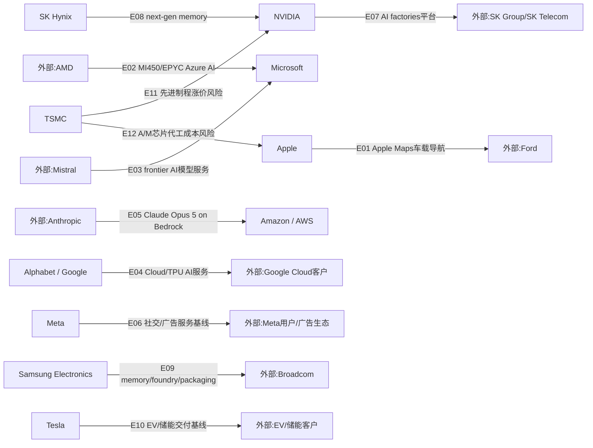

# 周一晨间科技巨头简报
- 覆盖期间：2026-07-20 至 2026-07-26（Asia/Shanghai）
- 生成时间：2026-07-27 09:58（Asia/Shanghai）
- 本期文件：reports/2026-07-27_weekly_morning_brief.md

## 1. 本周最重要的 5-8 件事
1. **Samsung Electronics + Broadcom：签署价值超过 2000 亿美元的 AI 芯片战略合作。** Samsung 7 月 25 日宣布与 Broadcom 扩大存储、代工和先进封装合作。重要性：这是本周最直接的半导体供应链大单信号，直接影响 HBM、定制 AI 芯片、先进封装和 TSMC 竞争格局。[Samsung](https://news.samsung.com/global/samsung-electronics-and-broadcom-expand-strategic-collaboration-across-memory-and-foundry-technologies)
2. **SK Group + NVIDIA：扩大 AI 工厂和下一代内存合作。** NVIDIA 7 月 24 日宣布与 SK Group 在 AI factories、SK Telecom 2GW AI infrastructure 以及 SK Hynix next-generation memory 上扩大合作。重要性：HBM/AI 内存与主权/企业 AI 工厂被放在同一条供应链叙事里。[NVIDIA](https://nvidianews.nvidia.com/news/sk-group-and-nvidia-expand-strategic-partnership-across-ai-factories-and-next-generation-memory)
3. **Alphabet：Q2 业绩和 AI 资本开支继续强化。** Alphabet 7 月 23 日披露 Q2 收入 119.8 billion 美元，Google Cloud 收入 15.6 billion 美元；因 AI 需求提高全年资本支出预期至约 85 billion 美元。重要性：云/AI 增长强劲，但资本密集度继续上升。[Alphabet](https://abc.xyz/assets/5d/f4/15f364a84a6c9b70a59f9f38d3a1/2026q2-alphabet-earnings-release.pdf)
4. **Tesla：Q2 财报显示汽车业务压力仍在。** Tesla 7 月 23 日发布 Q2 2026 业绩，收入、盈利能力和自由现金流承压，同时继续推进储能、AI、FSD/Robotaxi 与 Optimus。重要性：市场关注点从单季交付转向价格、毛利、库存和 AI/能源业务兑现速度。[Tesla](https://ir.tesla.com/press-release/tesla-releases-second-quarter-2026-financial-results)
5. **Microsoft：Azure 同周强化 AMD 与 Mistral 两条 AI 基础设施路线。** Microsoft 7 月 20 日宣布用 AMD Instinct MI450/EPYC 打造 Azure AI/HPC 基础设施，7 月 21 日又与 Mistral 扩大战略合作。重要性：hyperscaler 正在用多供应商算力和可控模型服务降低单一路线依赖。[Microsoft-AMD](https://news.microsoft.com/source/2026/07/20/microsoft-expands-azure-ai-and-hpc-infrastructure-with-amd/)、[Microsoft-Mistral](https://news.microsoft.com/source/2026/07/21/microsoft-and-mistral-expand-strategic-partnership-to-give-enterprises-and-regulated-industries-frontier-ai-they-can-control/)
6. **Amazon / AWS：Claude Opus 5 登陆 Amazon Bedrock。** AWS 7 月 24 日宣布 Anthropic Claude Opus 5 可在 Bedrock 使用。重要性：AWS 继续把第三方 frontier model 变成托管 AI 平台能力，与自研 Trainium/Bedrock 安全治理形成组合。[AWS](https://aws.amazon.com/blogs/machine-learning/introducing-claude-opus-5-on-aws-anthropics-most-capable-opus-model/)
7. **Apple：Apple Maps 将为 Ford UEV 平台提供导航体验。** Apple 7 月 21 日宣布 Apple Maps 将支持 Ford Universal EV Platform 的导航体验。重要性：Apple 服务能力继续进入车载场景，但本周未发现 Apple 新的重大芯片或硬件供应链公告。[Apple](https://www.apple.com/newsroom/2026/07/apple-maps-to-power-navigation-experience-for-ford-uev-platform/)
8. **TSMC：媒体称先进制程 2027 年可能继续涨价。** Barron's/Nikkei Asia 本周报道 TSMC 计划上调先进制程价格；TSMC 官方本周未确认。重要性：若属实，AI/HPC 和手机 SoC 客户成本压力将继续上升，但不能写成已确认新合同。[Barron's](https://www.barrons.com/articles/tsmc-stock-ai-chips-price-hike-0a2bb9f8)

## 2. 影响力速览
| 公司 | 重大事件数量 | 本周影响判断 | 关键词 |
|---|---:|---|---|
| Apple | 1 | 中性/小幅正面 | Apple Maps、Ford UEV、车载服务 |
| Microsoft | 2 | 正面 | Azure AI/HPC、AMD MI450、Mistral、可控 AI |
| Alphabet / Google | 1 | 正面/资本开支压力 | Q2 业绩、Google Cloud、AI capex、TPU |
| Amazon / AWS | 1 | 正面 | Claude Opus 5、Bedrock、frontier model |
| Meta | 0 | 中性 | 覆盖周无重大可确认事件、下周财报 |
| NVIDIA | 2 | 强正面 | SK Group、SK Hynix、AI factories、HBM、Korea AI |
| Tesla | 1 | 混合/偏负面 | Q2 财报、汽车毛利、储能、FSD/Robotaxi |
| Samsung Electronics | 1 | 强正面 | Broadcom、HBM、foundry、advanced packaging |
| SK Hynix | 1 | 强正面 | NVIDIA、next-generation memory、HBM、SK Group |
| TSMC | 1 | 混合/正面 | 先进制程涨价报道、客户成本、定价权 |

## 3. 按公司分组
### Apple
- 日期：2026-07-21
- 事件：Apple 宣布 Apple Maps 将为 Ford Universal EV Platform 提供导航体验，包括 EV 路线规划、电量和充电相关体验。
- 影响：Apple 的服务和地图能力继续进入车载软件场景；对 Apple 而言是服务生态延伸，对 Ford 是车载数字体验补强。本周未发现 Apple 新的重大芯片、显示、代工或射频组件官方供应链披露。
- 可信度：已确认。
- 来源：[Apple Newsroom](https://www.apple.com/newsroom/2026/07/apple-maps-to-power-navigation-experience-for-ford-uev-platform/)

### Microsoft
- 日期：2026-07-20
- 事件：Microsoft 宣布与 AMD 扩展 Azure AI/HPC 基础设施，采用 AMD Instinct MI450 GPU、EPYC CPU、Pensando networking、Ultra Accelerator Link over Ethernet 与液冷机架级系统。
- 影响：Azure 正在强化 NVIDIA 之外的加速计算供应路线，并把 AI training/inference 与 HPC 统一到更开放的机架和网络架构中；对 AMD、液冷、网络和数据中心电力供应链有直接意义。
- 可信度：已确认；未披露采购金额和部署节奏。
- 来源：[Microsoft Source](https://news.microsoft.com/source/2026/07/20/microsoft-expands-azure-ai-and-hpc-infrastructure-with-amd/)

- 日期：2026-07-21
- 事件：Microsoft 与 Mistral 扩大战略合作，面向企业和受监管行业提供可控 frontier AI，并强化欧洲 AI 训练与部署能力。
- 影响：Microsoft 的 AI 平台策略并不只绑定 OpenAI；Mistral 提供欧洲主权、行业控制和模型多元化选项，有助于 Azure 在监管敏感行业扩张。
- 可信度：已确认。
- 来源：[Microsoft Source](https://news.microsoft.com/source/2026/07/21/microsoft-and-mistral-expand-strategic-partnership-to-give-enterprises-and-regulated-industries-frontier-ai-they-can-control/)

### Alphabet / Google
- 日期：2026-07-23
- 事件：Alphabet 发布 Q2 2026 业绩，收入 119.8 billion 美元、经营利润 37.2 billion 美元、Google Cloud 收入 15.6 billion 美元，并将全年资本支出预期提高至约 85 billion 美元。
- 影响：搜索、YouTube 和 Cloud 增长仍强，但 AI 资本开支继续上台阶；公司还强调 TPU pod 已部署到客户数据中心，说明 Google 正把自研 AI 基础设施能力外溢到云客户。
- 可信度：已确认。
- 来源：[Alphabet Q2 2026 earnings release](https://abc.xyz/assets/5d/f4/15f364a84a6c9b70a59f9f38d3a1/2026q2-alphabet-earnings-release.pdf)

### Amazon / AWS
- 日期：2026-07-24
- 事件：AWS 宣布 Anthropic Claude Opus 5 可通过 Amazon Bedrock 使用。
- 影响：AWS 继续扩充 Bedrock 的 frontier model 货架，把 Anthropic 模型、Bedrock 企业治理和 AWS 算力服务打包给企业客户；这强化 AWS 作为多模型托管平台，而不是单一自研模型供应商。
- 可信度：已确认。
- 来源：[AWS Machine Learning Blog](https://aws.amazon.com/blogs/machine-learning/introducing-claude-opus-5-on-aws-anthropics-most-capable-opus-model/)、[Anthropic](https://www.anthropic.com/news/claude-opus-5)

### Meta
- 日期：2026-07-20 至 2026-07-26
- 事件：覆盖周内未发现 Meta 新的、可确认的重大财报、AI 基础设施、芯片、并购或监管事件。本期不把小功能更新或下周财报预告写成重大事件。
- 影响：短期重点转向下周 Q2 业绩、AI capex、Llama/Meta AI 使用量、广告增长、Reality Labs 和数据中心供电披露。
- 可信度：已确认“未写入覆盖周外事件”。
- 来源：[Meta Investor Relations](https://investor.atmeta.com/)

### NVIDIA
- 日期：2026-07-24
- 事件：NVIDIA 宣布与 SK Group 扩大战略合作，覆盖 AI factories、SK Telecom 面向 2GW AI infrastructure 的计划，以及 SK Hynix next-generation memory。
- 影响：这是本周最重要的 AI 基础设施与内存耦合事件之一。NVIDIA 的计算平台、SK Telecom 的 AI 工厂需求和 SK Hynix 的 HBM/下一代内存形成更紧密闭环。
- 可信度：已确认；具体 HBM 代际、价格和出货节奏仍需后续披露。
- 来源：[NVIDIA Newsroom](https://nvidianews.nvidia.com/news/sk-group-and-nvidia-expand-strategic-partnership-across-ai-factories-and-next-generation-memory)

- 日期：2026-07-24
- 事件：NVIDIA、NAVER 与 Brookfield 宣布扩大韩国国家 AI factory 基础设施建设，目标 200MW AI factory，并使用 NVIDIA AI infrastructure。
- 影响：韩国主权/产业 AI 基础设施继续扩容，利好 GPU、网络、液冷、电力和本地云生态。
- 可信度：已确认；实际建设与采购节奏仍需跟踪。
- 来源：[NVIDIA Newsroom](https://nvidianews.nvidia.com/news/naver-nvidia-and-brookfield-to-expand-koreas-national-ai-factory-infrastructure-buildout)

### Tesla
- 日期：2026-07-23
- 事件：Tesla 发布 Q2 2026 财务结果，汽车业务盈利能力和自由现金流继续承压，同时继续强调储能、FSD/Robotaxi、AI 和 Optimus。
- 影响：Tesla 的投资逻辑继续从传统汽车交付转向“汽车毛利能否企稳 + 能源/AI 能否兑现”。短期需关注价格、库存、监管与 robotaxi 地理扩张节奏。
- 可信度：已确认。
- 来源：[Tesla IR](https://ir.tesla.com/press-release/tesla-releases-second-quarter-2026-financial-results)

### Samsung Electronics
- 日期：2026-07-25
- 事件：Samsung Electronics 宣布与 Broadcom 扩大战略合作，合作总价值超过 2000 亿美元，覆盖 memory、foundry、advanced packaging 和 AI semiconductor technologies。
- 影响：Samsung 试图用一体化 memory + foundry + advanced packaging 方案争取定制 AI 芯片客户；对 TSMC 先进代工、SK Hynix HBM 和 AI ASIC 供应链格局都有影响。
- 可信度：已确认；具体节点、封装路线、出货节奏和年度收入确认仍需跟踪。
- 来源：[Samsung Newsroom](https://news.samsung.com/global/samsung-electronics-and-broadcom-expand-strategic-collaboration-across-memory-and-foundry-technologies)

### SK Hynix
- 日期：2026-07-24
- 事件：NVIDIA 官方宣布 SK Group 与 NVIDIA 扩大战略合作，其中明确包括 SK Hynix next-generation memory。
- 影响：SK Hynix 在 HBM/AI memory 的战略地位继续强化；该事件不是单独披露新 HBM 订单金额，但从 NVIDIA 官方口径确认其下一代内存仍是 AI factory 生态的关键环节。
- 可信度：已确认；客户、代际、价格和产能分配细节待后续公告。
- 来源：[NVIDIA Newsroom](https://nvidianews.nvidia.com/news/sk-group-and-nvidia-expand-strategic-partnership-across-ai-factories-and-next-generation-memory)

### TSMC
- 日期：2026-07-22 至 2026-07-25
- 事件：Barron's/Nikkei Asia 报道 TSMC 计划对 2027 年先进制程涨价，涉及 AI/HPC 与先进手机 SoC 客户；TSMC 官方本周未确认。
- 影响：若报道属实，TSMC 先进节点定价权继续增强，但 NVIDIA、Apple、Broadcom、AMD、Qualcomm 等客户成本压力上升。因缺少官方确认，本期仅写为媒体报道和成本风险。
- 可信度：媒体报道待确认。
- 来源：[Barron's](https://www.barrons.com/articles/tsmc-stock-ai-chips-price-hike-0a2bb9f8)

## 4. 跨公司与产业链观察
1. **AI 基础设施进入“GPU + HBM + 封装 + 电力 + 主权部署”的组合竞争。** NVIDIA-SK、Samsung-Broadcom、Microsoft-AMD 和 NAVER/Brookfield 韩国 AI factory 共同说明，AI 基建采购已经从单点 GPU 扩展为整机架、内存、网络、能源和本地数据主权。
2. **HBM 与先进封装仍是最关键的供应链变量。** SK Hynix 被 NVIDIA 口径纳入 next-generation memory，Samsung 则用 Broadcom 大单强化 memory/foundry/packaging 一体化能力。
3. **Hyperscaler 正在多路线降低依赖。** Microsoft 采用 AMD AI/HPC 路线并扩大 Mistral 合作；AWS 上架 Claude Opus 5；Google 强调 TPU 客户部署。云厂商正在同时使用 NVIDIA、AMD、自研 TPU/Trainium 和第三方模型。
4. **AI 资本开支继续推升财报分化。** Alphabet Cloud 和 AI capex 强劲，Tesla 汽车主业承压且 AI/Robotaxi 兑现仍需时间，投资者会更严格区分“AI 需求受益者”和“AI 转型承诺者”。
5. **先进制程成本有继续上行风险。** TSMC 涨价报道和 Samsung-Broadcom 合作同时出现，说明先进节点供需和定价仍是 2027 年 AI ASIC/GPU/手机 SoC 毛利的重要变量。

## 5. 下周需关注
1. Microsoft、Meta、Amazon、Apple 等后续财报是否继续上调 AI capex 或披露更多 GPU/自研芯片供应安排。
2. Samsung-Broadcom 合作是否披露具体代工节点、HBM 代际、先进封装路线和收入确认节奏。
3. NVIDIA-SK 合作是否出现 SK Hynix HBM4/HBM4E 认证、订单或产能分配的进一步细节。
4. TSMC 涨价报道是否获得公司、客户或供应链进一步确认。
5. Tesla Q2 后续电话会和监管披露中，Robotaxi/FSD 地域扩张、储能毛利和汽车库存是否出现更清晰指引。

## 6. 十家公司供应关系图谱与周度变化
### 6.1 本周供应关系可视化

### 6.2 供应关系明细表
| Edge ID | 供应方 | 客户/使用方 | 具体产品/服务 | 关系类型 | 本周证据 | 长期基线证据/限制 | 本周状态 | 来源链接 |
|---|---|---|---|---|---|---|---|---|
| E01 | Apple | Ford | Apple Maps、EV 路线规划和车载导航体验 | 车载软件/服务 | Apple 官方披露 Apple Maps 将为 Ford UEV 平台提供导航体验 | 服务关系，不是 Apple 硬件供应链新增 | 新增/服务扩展 | [Apple](https://www.apple.com/newsroom/2026/07/apple-maps-to-power-navigation-experience-for-ford-uev-platform/) |
| E02 | AMD | Microsoft | AMD Instinct MI450、EPYC、Pensando networking、Azure AI/HPC 基础设施 | AI/HPC 加速计算供应 | Microsoft 官方披露 Azure AI/HPC 基础设施采用 AMD 新平台 | 未披露采购金额、站点和出货节奏 | 新增/重大基础设施供应 | [Microsoft](https://news.microsoft.com/source/2026/07/20/microsoft-expands-azure-ai-and-hpc-infrastructure-with-amd/) |
| E03 | Mistral | Microsoft | Mistral frontier AI、欧洲训练和受监管行业可控部署 | 模型/AI 平台合作 | Microsoft 官方披露与 Mistral 扩大战略合作 | 不代表 Microsoft 减少 OpenAI 或其他模型合作 | 强化/模型多元化 | [Microsoft](https://news.microsoft.com/source/2026/07/21/microsoft-and-mistral-expand-strategic-partnership-to-give-enterprises-and-regulated-industries-frontier-ai-they-can-control/) |
| E04 | Alphabet / Google | Google Cloud 客户 | Google Cloud AI 服务、TPU pods、云基础设施 | 云/AI 基础设施服务 | Alphabet Q2 披露 Google Cloud 增长、capex 上调和 TPU 客户部署 | 财报信号不等于单一新增订单 | 强化/需求信号 | [Alphabet](https://abc.xyz/assets/5d/f4/15f364a84a6c9b70a59f9f38d3a1/2026q2-alphabet-earnings-release.pdf) |
| E05 | Anthropic | Amazon / AWS | Claude Opus 5 on Amazon Bedrock | 第三方模型托管 | AWS 官方披露 Claude Opus 5 可在 Bedrock 使用 | 模型可用性不代表独占供应 | 新增/模型平台供给 | [AWS](https://aws.amazon.com/blogs/machine-learning/introducing-claude-opus-5-on-aws-anthropics-most-capable-opus-model/)、[Anthropic](https://www.anthropic.com/news/claude-opus-5) |
| E06 | Meta | Meta 用户/广告生态 | Facebook、Instagram、Threads、WhatsApp 服务与广告系统 | 数字服务基线 | 覆盖周未发现 Meta 重大可确认新增事件 | 保留业务基线，不能写成本周新增供应关系 | 延续/无本周新增证据 | [Meta IR](https://investor.atmeta.com/) |
| E07 | NVIDIA | SK Group / SK Telecom | NVIDIA AI infrastructure、AI factories、SK Telecom 2GW AI infrastructure | AI 计算平台供应 | NVIDIA 官方披露与 SK Group 扩大战略合作 | 具体交付节奏和采购金额待跟踪 | 新增/重大 AI 基础设施 | [NVIDIA](https://nvidianews.nvidia.com/news/sk-group-and-nvidia-expand-strategic-partnership-across-ai-factories-and-next-generation-memory) |
| E08 | SK Hynix | NVIDIA | next-generation memory、HBM/AI memory 生态 | 内存供应/生态合作 | NVIDIA 官方公告把 SK Hynix next-generation memory 纳入合作重点 | 未披露 HBM 代际、价格或出货时间表 | 强化/官方确认 | [NVIDIA](https://nvidianews.nvidia.com/news/sk-group-and-nvidia-expand-strategic-partnership-across-ai-factories-and-next-generation-memory) |
| E09 | Samsung Electronics | Broadcom | memory、foundry、advanced packaging、AI semiconductor technologies | 存储/代工/先进封装 | Samsung 官方披露与 Broadcom 超过 2000 亿美元合作 | 具体节点、封装路线和年度收入确认待披露 | 新增/重大供应关系 | [Samsung](https://news.samsung.com/global/samsung-electronics-and-broadcom-expand-strategic-collaboration-across-memory-and-foundry-technologies) |
| E10 | Tesla | EV/储能客户 | 电动车、储能部署、能源生态 | 终端产品交付基线 | Tesla Q2 财报披露汽车与能源业务状态 | 财报不等于新增供货关系；本周更多是需求和利润率信号 | 延续/经营压力 | [Tesla](https://ir.tesla.com/press-release/tesla-releases-second-quarter-2026-financial-results) |
| E11 | TSMC | NVIDIA | AI GPU/AI ASIC 先进制程代工成本 | 代工/价格风险 | 媒体报道 TSMC 2027 年先进制程涨价，可能影响 AI/HPC 客户 | TSMC 官方本周未确认；不能写成新订单 | 风险/媒体报道待确认 | [Barron's](https://www.barrons.com/articles/tsmc-stock-ai-chips-price-hike-0a2bb9f8) |
| E12 | TSMC | Apple | A/M 系列芯片先进制程代工成本 | 代工/价格风险 | 同一涨价报道可能影响先进手机 SoC 客户 | 长期代工基线；本周证据是媒体报道价格风险 | 风险/媒体报道待确认 | [Barron's](https://www.barrons.com/articles/tsmc-stock-ai-chips-price-hike-0a2bb9f8) |

### 6.3 与上周的区别
- 新增关系：
  - Apple -> Ford：Apple Maps 进入 Ford UEV 平台车载导航体验。
  - AMD -> Microsoft：Azure AI/HPC 明确采用 AMD MI450/EPYC/Pensando 路线。
  - Anthropic -> Amazon / AWS：Claude Opus 5 登陆 Amazon Bedrock。
  - NVIDIA -> SK Group / SK Telecom：新增 AI factories 和 2GW AI infrastructure 合作。
  - Samsung Electronics -> Broadcom：新增超过 2000 亿美元 memory/foundry/advanced packaging 战略合作。

- 强化关系：
  - Mistral -> Microsoft：从既有战略合作强化为面向受监管行业的可控 frontier AI 方案。
  - Alphabet / Google -> Google Cloud 客户：Q2 业绩和 capex 上调强化 AI 云需求信号。
  - SK Hynix -> NVIDIA：NVIDIA 官方把 SK Hynix next-generation memory 纳入 SK 合作重点。

- 弱化或风险关系：
  - TSMC -> NVIDIA、Apple：媒体称 2027 年先进制程价格可能上涨，若确认将提高 GPU、AI ASIC 和手机 SoC 成本。
  - Tesla -> EV/储能客户：Q2 财报显示汽车业务利润率和现金流压力仍需跟踪。

- 无明显变化但关键关系：
  - Meta -> 用户/广告生态：本周无重大可确认新增事件，但下周 Q2 财报将决定 AI capex、广告增长和 Reality Labs 损失的市场预期。
  - 上周 Microsoft-3M EBO、Google-Steel River、Meta-Richland Parish、NVIDIA-Noetra 和 TSMC Q2 业绩仍是重要基线，但本周没有新的同等级确认进展。

## 7. 本期自检
- 日期范围已限定为 2026-07-20 至 2026-07-26，符合 2026-07-27 周一晨报的上一完整自然周口径。
- 10 家公司均已覆盖；Meta 因覆盖周无重大可确认事件，明确写为“未发现可确认重大事件”并保留下周关注。
- 每条写入的重大事件均附来源链接；媒体报道和未获官方确认的 TSMC 涨价事项已标注为待确认。
- Mermaid 使用 `flowchart LR` 和 ASCII 节点 ID，包含全部 10 家覆盖公司；E01-E12 在 Mermaid、6.2 表格和 JSON 基线中保持一致。
- 质量闸门：本文件保存后运行 `scripts/validate_weekly_brief.py`，校验 JSON、日期、latest 链接、Mermaid/Table/JSON Edge ID 一致性和低置信度标注。
- GitHub 同步：质量闸门通过后完成远端同步；提交哈希以 Git 历史为准。
