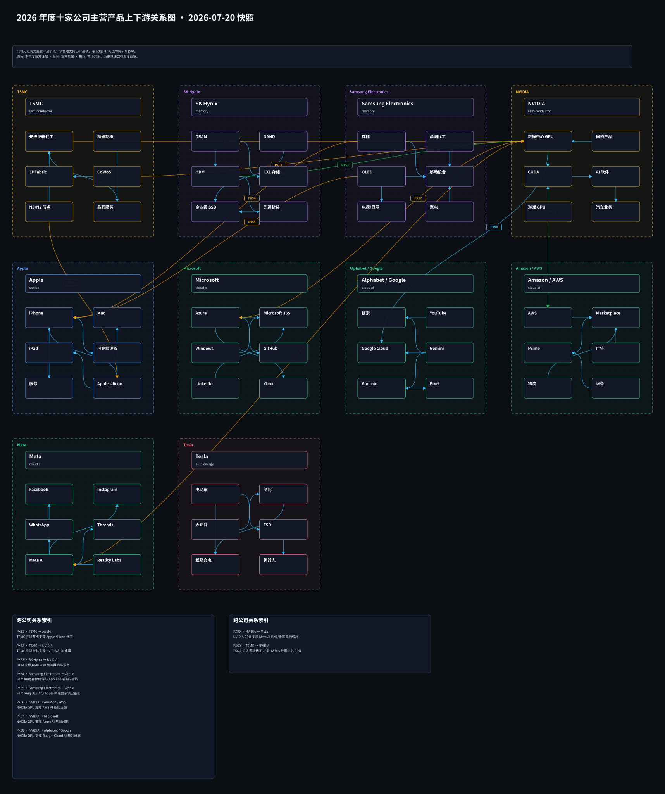
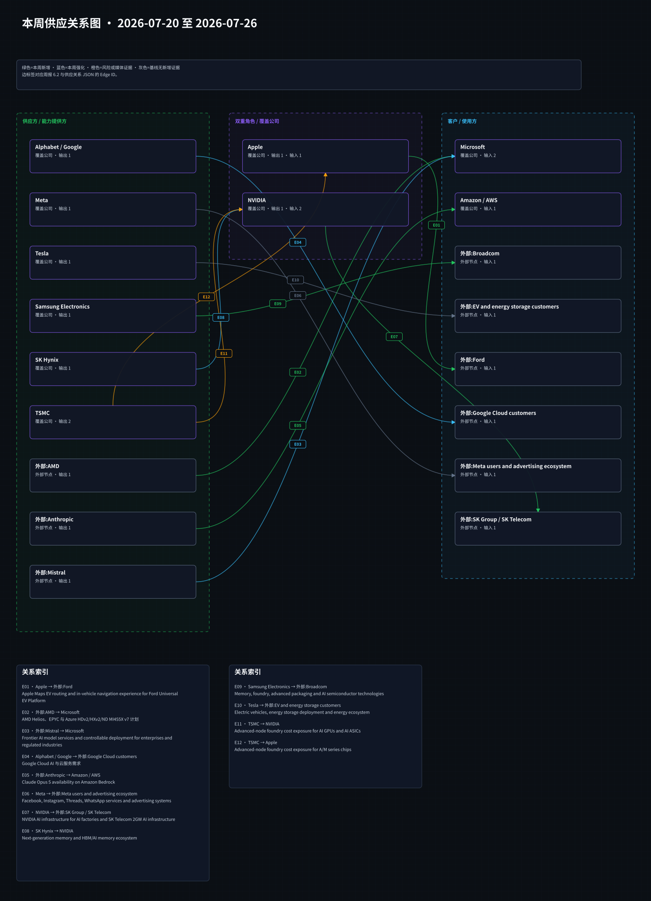

# 周一晨间科技巨头简报
<!-- weekly-brief-schema: 2 -->
<!-- report-vintage: revised -->
- 覆盖期间：2026-07-20 至 2026-07-26（Asia/Shanghai）；排他截止：2026-07-27 00:00。
- 生成时间：2026-09-07 11:46:04（Asia/Shanghai，事后纠错重生成；不是原周一实时版本）。
- 本期文件：reports/2026-07-27_weekly_morning_brief.md
- 当前版与原始版本分开，禁止作为原周一已可用的回测输入；见[版本记录](../docs/historical_report_versions.md)及[替换前归档](../archives/2026-09-07_before_correction.tar.gz)。
- 本次重核原候选后保留 9 件不同事项，不凑数。原文可得性不足的报道排除，不以排除推定当周不存在该事件。

## 1. 本周最重要的 9 件事
1. **Alphabet：Q2 2026 收入 1197.96 亿美元、经营利润 407.70 亿美元，Google Cloud 收入 247.68 亿美元。** 重要性：Cloud 增长与资本投入必须同时看；不能将 2025 年资本开支指引当作 2026 年新指引。[SEC 原财报](https://www.sec.gov/Archives/edgar/data/1652044/000165204426000066/googexhibit991q22026.htm)
2. **Samsung / Broadcom：签署内存、代工及先进封装合作 MOU。** 重要性：超过 2000 亿美元是至 2030 年五年合作规模估计，不是已实现收入或确定采购额。[Samsung](https://news.samsung.com/global/samsung-electronics-and-broadcom-expand-strategic-collaboration-across-memory-and-foundry-technologies)
3. **NVIDIA / SK Group：公布 AI 工厂和下一代内存合作意向。** 重要性：最高 2GW 的项目与 HBM 合作提供需求方向，但容量仍是计划，不能作为已投产算力。[NVIDIA](https://nvidianews.nvidia.com/news/sk-group-and-nvidia-expand-strategic-partnership-across-ai-factories-and-next-generation-memory)
4. **Tesla：Q2 收入增长，但经营利润率和自由现金流承压。** 重要性：营收与现金回报分化，投资判断不能仅依据交付增长。[SEC 财报附件](https://www.sec.gov/Archives/edgar/data/1318605/000162828026049213/exhibit991.htm)
5. **Microsoft / AMD：公布 Azure HDv2、HXv2 与 ND MI455X v7 路线。** 重要性：扩充 NVIDIA 之外的计算选择，但原文称 upcoming，不能写成全面上线。[Microsoft](https://blogs.microsoft.com/blog/2026/07/20/microsoft-expands-azure-ai-and-hpc-infrastructure-with-amd/)
6. **Microsoft / Mistral：扩大欧洲算力与模型合作。** 重要性：增加企业和受监管行业的部署选择，仍需验证使用量与投入回报。[Microsoft](https://news.microsoft.com/source/2026/07/21/microsoft-and-mistral-expand-strategic-partnership-to-give-enterprises-and-regulated-industries-frontier-ai-they-can-control/)
7. **AWS：Claude Opus 5 在 Bedrock 可用。** 重要性：扩充模型分发入口，不等于独家合作或已披露客户收入。[AWS](https://aws.amazon.com/blogs/machine-learning/introducing-claude-opus-5-on-aws-anthropics-most-capable-opus-model/)
8. **NVIDIA / NAVER / Brookfield：计划将韩国初始 AI 工厂扩至 200MW。** 重要性：目标时间为 2028 年，项目融资和建设进度比远期容量数字更能验证兑现。[NVIDIA](https://nvidianews.nvidia.com/news/naver-nvidia-and-brookfield-to-expand-koreas-national-ai-factory-infrastructure-buildout)
9. **Apple：公布 Ford UEV 平台的 Apple Maps 导航合作。** 重要性：属于车载服务计划，不是新硬件供货合同；公告原日期为 7 月 23 日。[Apple](https://www.apple.com/newsroom/2026/07/apple-maps-to-power-navigation-experience-for-ford-uev-platform/)

## 2. 投资判断速览
| 公司 | 本周变化 | 影响指标 | 预期差 | 判断 | 验证条件 |
|---|---|---|---|---|---|
| Apple | Ford 地图导航合作 | 车型覆盖、地图使用与服务收入 | 无同期一致预期 | 正面，待落地 | 后续车型交付与功能可用 |
| Microsoft | AMD 产品路线；Mistral 合作 | 云使用、算力利用率、交付成本 | 无同期一致预期 | 正面，执行待验 | 正式可用范围和客户采用 |
| Alphabet / Google | Q2 Cloud 收入 247.68 亿美元 | Cloud 增长、经营利润、资本开支与现金流 | 不将旧版数字与实际差额当成市场预期差 | 增长强，现金投入压力并存 | 后续 Cloud 增长与资本回报 |
| Amazon / AWS | Bedrock 上架 Claude Opus 5 | 模型用量、推理收入与成本 | 无同期一致预期 | 正面，待变现 | 后续客户采用及单位成本 |
| Meta | 本次复核未纳入重大增量 | 保留原研究范围 | 无新增判断 | 无重大变化，非穷尽认证 | 可核验的当期披露 |
| NVIDIA | SK 与 NAVER 基础设施计划 | 订单转化、设备交付、产能上线 | 计划规模不等于当期订单 | 正面，兑现待验 | 正式合同、建设和交付 |
| Tesla | Q2 经营利润率 1.4%，自由现金流为负 | 价格、成本、运营费用、资本开支 | 无同期一致预期比较 | 收入增长与盈利承压并存 | 后续费用与现金转化 |
| Samsung Electronics | Broadcom 合作 MOU | 良率、产能与订单转化 | 估计合作额非确定订单额 | 正面，合同待验 | 具体采购、认证和收入确认 |
| SK Hynix | NVIDIA 下一代 AI 内存合作 | HBM 认证、出货、价格及产能 | 缺采购数量与同期预期 | 正面，兑现待验 | 后续客户认证与供货披露 |
| TSMC | 原涨价报道因版本和全文不足排除 | 不据该报道增加毛利预测 | 证据不足，不给方向判断 | 无重大变化，非穷尽认证 | 公司或可核验同期原文 |

## 3. 发生变化的公司
### 3.1 Apple
- 日期：2026-07-23（原公告日期；时分未公开）
- 事件：Apple 公布 Apple Maps 为 Ford Universal EV Platform 提供导航体验的合作，涉及电动车路线与充电体验；不再沿用 7 月 21 日的错误日期。
- 投资影响：车载服务的潜在分发延伸，不据此推断 Apple 硬件新订单。
- 影响指标：车型覆盖、实际使用与服务变现。
- 预期差：没有重建同期一致预期。
- 验证条件：后续车型、功能交付及可用范围。
- 可信度：官方支持合作；当前页面后来修改过，未取得完整同期网页快照。
- 来源：[Apple 7 月 23 日公告](https://www.apple.com/newsroom/2026/07/apple-maps-to-power-navigation-experience-for-ford-uev-platform/)

### 3.2 Microsoft
- 日期：2026-07-20（公告元数据 13:00:02 UTC，上海 21:00:02）
- 事件：Microsoft 公布采用 AMD Helios 与下一代 EPYC 的 HDv2、HXv2 和 ND MI455X v7 三类即将推出的 Azure 服务。删除旧文无该来源支持的 MI450/Pensando 组合。
- 投资影响：计算平台选择增加；需求转化取决于实际可用、客户采用与成本。
- 影响指标：实例利用率、推理成本、客户部署。
- 预期差：无采购金额或同期一致预期。
- 验证条件：后续正式可用公告和客户案例。
- 可信度：官方产品路线；不写成已全面上线。
- 来源：[Microsoft 原公告](https://blogs.microsoft.com/blog/2026/07/20/microsoft-expands-azure-ai-and-hpc-infrastructure-with-amd/)
- 日期：2026-07-21（公告元数据 12:30:12 UTC，上海 20:30:12）
- 事件：Microsoft 与 Mistral 扩大欧洲 AI 算力、模型分发和可控部署合作。
- 投资影响：增加云端、连接云及完全断开环境的部署选择；不意味着其他模型合作减少。
- 影响指标：客户采用、模型用量、算力成本。
- 预期差：缺少可核对的一致预期。
- 验证条件：后续客户、区域容量和模型使用披露。
- 可信度：官方宣布合作，后续收益待验证。
- 来源：[Microsoft/Mistral 原公告](https://news.microsoft.com/source/2026/07/21/microsoft-and-mistral-expand-strategic-partnership-to-give-enterprises-and-regulated-industries-frontier-ai-they-can-control/)

### 3.3 Alphabet / Google
- 日期：2026-07-23（美国 7 月 22 日盘后财报及当日电话会；上海次日）
- 事件：Q2 2026 合并收入 1197.96 亿美元、GAAP 经营利润 407.70 亿美元；Google Cloud 收入 247.68 亿美元、分部经营利润 88.14 亿美元。季度购置物业与设备现金支出 449.24 亿美元，非 GAAP 自由现金流为 -58.55 亿美元；均为截至 6 月 30 日的单季口径。
- 投资影响：Cloud 需求增长与现金投入并存。本版删除“2026 全年 capex 提高到 850 亿美元”和来源不足的 TPU 客户部署说法，不虚填另一全年指引。
- 影响指标：Cloud 增长、分部利润、资本支出、自由现金流与折旧。
- 预期差：旧版错误数值不是市场一致预期，不把纠错幅度写成超预期。
- 验证条件：后续财报核对云增长与资本回报；全年指引须另找同年度当期电话会原文。
- 可信度：SEC Exhibit 99.1 原表；单位由百万美元换算为亿美元，单季与累计分开。
- 来源：[SEC Q2 2026 原表](https://www.sec.gov/Archives/edgar/data/1652044/000165204426000066/googexhibit991q22026.htm)

### 3.4 Amazon / AWS
- 日期：2026-07-24（AWS 公告原日期）
- 事件：AWS 宣布 Claude Opus 5 在 Amazon Bedrock 和 Claude Platform on AWS 可用。
- 投资影响：模型分发渠道增加，实际收入取决于客户使用；不推断独家供应或已取得具体订单。
- 影响指标：调用量、付费使用、推理成本。
- 预期差：没有同期一致预期。
- 验证条件：后续正式区域范围、客户采用与单位成本。
- 可信度：官方可用性公告；不采用当前文档中的后来新增功能。
- 来源：[AWS 7 月 24 日公告](https://aws.amazon.com/blogs/machine-learning/introducing-claude-opus-5-on-aws-anthropics-most-capable-opus-model/)

### 3.5 NVIDIA
- 日期：2026-07-24（原公告日期）
- 事件：NVIDIA 与 SK Group 公布合作意向，涵盖 SK Telecom 最高 2GW AI 工厂计划及 SK Hynix 下一代 AI 内存合作；已签的是意向书，不把容量或总计划额写成已执行订单。
- 投资影响：提供潜在计算与 HBM 需求方向，仍需项目、合同及交付落地。
- 影响指标：合同转化、设备交付、建设与利用率。
- 预期差：没有可核实的当期采购量比较。
- 验证条件：后续正式合同、融资与一期上线进度。
- 可信度：官方合作意向；远期容量未实现。
- 来源：[NVIDIA/SK 原公告](https://nvidianews.nvidia.com/news/sk-group-and-nvidia-expand-strategic-partnership-across-ai-factories-and-next-generation-memory)
- 日期：2026-07-24（原公告日期）
- 事件：NAVER、NVIDIA 与 Brookfield 宣布拟扩建韩国 AI 工厂，目标到 2028 年将初始项目扩至 200MW。
- 投资影响：潜在算力需求扩容，但远期规划不能直接计入本季度 GPU 收入。
- 影响指标：融资、开工、设备交付与可用容量。
- 预期差：缺少项目执行与订单基线。
- 验证条件：后续融资、许可、施工及投产公告。
- 可信度：官方计划，未实现结果。
- 来源：[NVIDIA/NAVER/Brookfield 原公告](https://nvidianews.nvidia.com/news/naver-nvidia-and-brookfield-to-expand-koreas-national-ai-factory-infrastructure-buildout)

### 3.6 Tesla
- 日期：2026-07-23（美国 7 月 22 日盘后公布，上海次日）
- 事件：Q2 2026 收入 282.36 亿美元、GAAP 经营利润 3.98 亿美元，经营利润率 1.4%；经营现金流 46.97 亿美元、资本开支 57.89 亿美元，非 GAAP 自由现金流 -10.92 亿美元。均为单季美元口径。
- 投资影响：收入增长没有同步转化为经营利润和自由现金流，须分别观察售价、费用及资本开支。
- 影响指标：毛利率、运营费用、资本开支及现金转化。
- 预期差：不引入未经核验的同期一致预期。
- 验证条件：下一期财报中的费用率、毛利和现金流；不将已举行电话会列为下周催化。
- 可信度：SEC 财报附件第 4 页原表；自由现金流为公司定义的非 GAAP 指标。
- 来源：[SEC Q2 2026 Update](https://www.sec.gov/Archives/edgar/data/1318605/000162828026049213/exhibit991.htm)

### 3.7 Samsung Electronics
- 日期：2026-07-25（原公告日期）
- 事件：Samsung 与 Broadcom 签署合作 MOU，覆盖内存、代工和先进封装。公司估计至 2030 年五年合作规模超过 2000 亿美元。
- 投资影响：潜在订单空间扩大，但估计合作额不是确定采购承诺、已确认收入或年度收入指引。
- 影响指标：良率、认证、实际订单、产能与收入确认。
- 预期差：缺少确定采购额，不据总计划额计算当期业绩增量。
- 验证条件：后续合同、工艺认证、采购数量和收入确认披露。
- 可信度：官方 MOU 与估计，执行未确认。
- 来源：[Samsung 原公告](https://news.samsung.com/global/samsung-electronics-and-broadcom-expand-strategic-collaboration-across-memory-and-foundry-technologies)

### 3.8 SK Hynix
- 日期：2026-07-24（NVIDIA 原公告日期）
- 事件：与 NVIDIA 的长期 AI 内存合作涵盖 HBM 等下一代内存的共同开发与优化；这是同一 SK 合作事件的公司视角，不另计一条头条。
- 投资影响：强化潜在合作基础，不据此假定具体采购数量、价格或已分配全部产能。
- 影响指标：客户认证、出货、ASP、良率与产能。
- 预期差：采购量和同期预期不足，暂不量化。
- 验证条件：后续产品认证、具名供货及出货披露。
- 可信度：官方合作方向，具体执行待验证。
- 来源：[NVIDIA/SK 原公告](https://nvidianews.nvidia.com/news/sk-group-and-nvidia-expand-strategic-partnership-across-ai-factories-and-next-generation-memory)

### 3.9 无重大变化公司
- Meta、TSMC：本次原候选复核未纳入可确认重大增量；不等于当周无任何新闻。TSMC 原涨价报道全文及版本不足，已排除。

## 4. 跨公司与产业链判断
1. **经营增长与现金回报应分开。** Alphabet 的云增长和 Tesla 的收入增长均需与资本开支、费用及现金流一起看，不用计划投资替代实现利润。
2. **合作公告须分层。** Samsung/Broadcom MOU、NVIDIA/SK 意向书与 AWS 模型可用性是不同阶段，不能统称为已经落地的大订单。
3. **平台选择增加不等于供应商份额已改变。** AMD 路线和 Mistral 合作增加 Microsoft 的选择；份额变化仍要等待实际部署与用量。

## 5. 下周催化与验证条件
1. **计划向合同转化。** 触发条件：后续一周有 Samsung/Broadcom 或 NVIDIA/SK 新的正式协议与建设披露；未承诺必在下周发生。可能影响：订单能见度与资本开支。
2. **云端实际可用与采用。** 触发条件：新发布的 Azure 实例可用信息或 Opus 5 客户使用数据。可能影响：云使用与推理成本。
3. **资本回报验证。** 触发条件：后续公司正式指引或财务披露；没有新材料则不更新数值。可能影响：Cloud 增长、自由现金流与估值假设。

## 6. 研究附录：产业链与图谱
### 6.1 图谱更新状态与可视化
- 产品图：沿用 2026-07-20 冻结图，本版不倒灌现行年度关系；弱证据不作历史订单认证。
- 供应图：本期更新为纠错图；更正 E01/E02/E04/E07-E10 的日期、产品或承诺性质，E06/E11/E12 不进入当周变化表。

[打开产品关系 Canvas](../assets/2026-07-20_product_relationships.canvas)

[打开供应关系 Canvas](../assets/2026-07-27_supply_relationships.canvas)

### 6.2 本周供应关系变化表
| Edge ID | 供应方 | 客户/使用方 | 产品或服务 | 当周披露 | 证据与限制 | 来源 |
|---|---|---|---|---|---|---|
| E01 | Apple | Ford | Apple Maps EV routing and in-vehicle navigation experience for Ford Universal EV Platform | new | Apple officially disclosed Apple Maps support for Ford Universal EV Platform navigation. Apple 公告日期为 7 月 23 日；导航合作是已公布计划，不是新硬件订单。页面后改，历史完整网页版本未认证。 | [来源1](https://www.apple.com/newsroom/2026/07/apple-maps-to-power-navigation-experience-for-ford-uev-platform/) |
| E02 | AMD | Microsoft | AMD Helios、EPYC 与 Azure HDv2/HXv2/ND MI455X v7 计划 | new | Microsoft 7 月 20 日公告支持即将推出的三类 VM，不支持旧文 MI450/Pensando 组合。 产品路线已宣布，不将 upcoming 写成已全面上线；未披露采购金额。 | [来源1](https://news.microsoft.com/source/2026/07/20/microsoft-expands-azure-ai-and-hpc-infrastructure-with-amd/) |
| E03 | Mistral | Microsoft | Frontier AI model services and controllable deployment for enterprises and regulated industries | strengthened | Microsoft officially announced an expanded strategic partnership with Mistral. Does not imply reduced OpenAI or other model relationships. | [来源1](https://news.microsoft.com/source/2026/07/21/microsoft-and-mistral-expand-strategic-partnership-to-give-enterprises-and-regulated-industries-frontier-ai-they-can-control/) |
| E04 | Alphabet / Google | Google Cloud customers | Google Cloud AI 与云服务需求 | strengthened | Q2 2026 Cloud 收入 24768 百万美元；合并经营利润 40770 百万美元；财务需求信号不是新客户订单。 删除错误的 2026 年 850 亿美元 capex 指引与该来源未直接支持的 TPU 客户部署说法。 | [来源1](https://www.sec.gov/Archives/edgar/data/1652044/000165204426000066/googexhibit991q22026.htm) |
| E05 | Anthropic | Amazon / AWS | Claude Opus 5 availability on Amazon Bedrock | new | AWS announced Claude Opus 5 availability on Amazon Bedrock and Anthropic announced the model. Model availability does not imply exclusive supply. | [来源1](https://aws.amazon.com/blogs/machine-learning/introducing-claude-opus-5-on-aws-anthropics-most-capable-opus-model/)、[来源2](https://www.anthropic.com/news/claude-opus-5) |
| E07 | NVIDIA | SK Group / SK Telecom | NVIDIA AI infrastructure for AI factories and SK Telecom 2GW AI infrastructure | new | 7 月 24 日官方公告支持签署意向书及最高 2GW AI 工厂计划，不是已投产或已确认全部订单。 一期计划 2027 年上线；保留计划语气，金额不视为已实现收入。 | [来源1](https://nvidianews.nvidia.com/news/sk-group-and-nvidia-expand-strategic-partnership-across-ai-factories-and-next-generation-memory) |
| E08 | SK Hynix | NVIDIA | Next-generation memory and HBM/AI memory ecosystem | strengthened | 官方公告支持 HBM 等下一代 AI 内存长期合作与共同开发方向。 项目提及 HBM4；具体采购数量、价格与逐期产能分配未核实，不据此计算确定订单。 | [来源1](https://nvidianews.nvidia.com/news/sk-group-and-nvidia-expand-strategic-partnership-across-ai-factories-and-next-generation-memory) |
| E09 | Samsung Electronics | Broadcom | Memory, foundry, advanced packaging and AI semiconductor technologies | new | Samsung/Broadcom 签署 MOU；超过 2000 亿美元是至 2030 年五年合作规模估计，不是确定已签采购额。 官方提及 2nm 及以下与先进封装；收入确认、产能和落地订单仍待验证。 | [来源1](https://news.samsung.com/global/samsung-electronics-and-broadcom-expand-strategic-collaboration-across-memory-and-foundry-technologies) |

### 6.3 与上周的区别
- 新增披露：E01 地图合作、E02 云产品路线、E05 模型可用、E07 基础设施意向、E09 MOU；均保留各自承诺阶段。
- 强化披露：E03 模型合作、E04 云需求信号、E08 内存合作，不把财报信号写成新订单。
- 无当周新增证据：E06 背景、E11/E12 未核验报道；E10 是财务结果，不是新供应关系。
- 旧期 Edge ID 曾重排，上期编号不能证明同一关系的连续变化；按来源核实披露，不补造可比订单基线。

## 7. 本期自检
- 保留原覆盖周及当期 10 家研究对象；9 件不同事项，不凑数。
- Alphabet 使用正确年度、季度、分部和单位；850 亿美元属于 2025 年指引，未作为 2026 年指引重写。
- 本次更正和排除证据见本期 correction_evidence 日志；未补造历史首次公开时间或网页快照。
- 当前是事后修订展示版，仍为 legacy_unverified。来源、结构和图谱检查不构成全量历史时点认证，禁止作为原周一实时回测样本。
