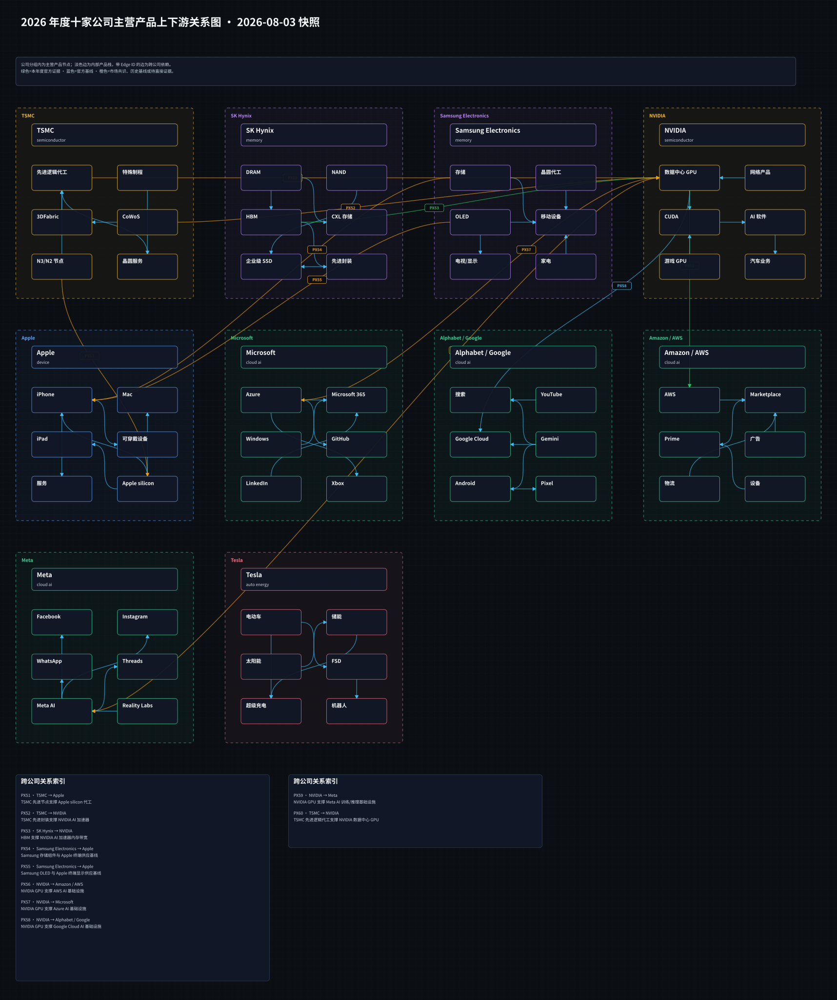
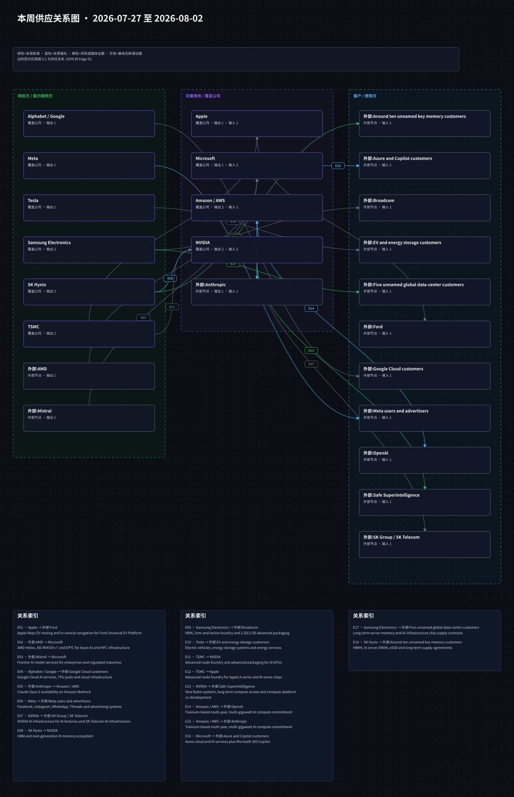
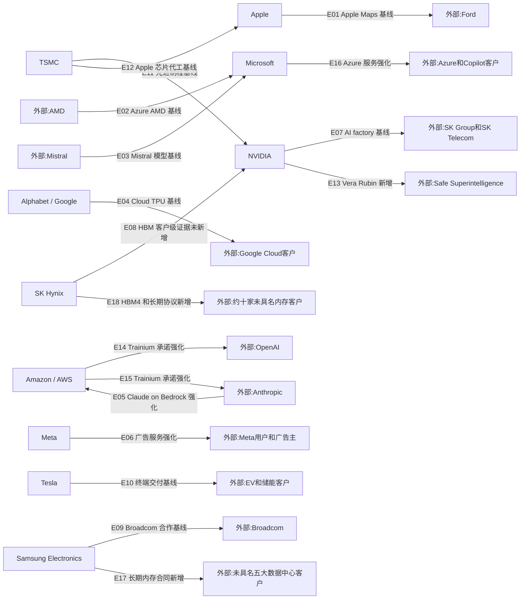

# 周一晨间科技巨头简报
- 覆盖期间：2026-07-27 至 2026-08-02（Asia/Shanghai）
- 生成时间：2026-08-03 11:24（Asia/Shanghai）
- 本期文件：reports/2026-08-03_weekly_morning_brief.md

## 1. 本周最重要的 5-8 件事
1. **SK Hynix：Q2 收入与经营利润创纪录，HBM4 已开始量产出货。** 公司披露收入 79.32 万亿韩元、经营利润 60.54 万亿韩元，并称已与约 10 家关键客户签署长期协议。重要性：AI 内存供需正从年度订单转向多年锁量，HBM4 放量和先进封装产能成为下一阶段竞争核心。[SK Hynix](https://news.skhynix.com/en/q2-2026-business-results/)
2. **Samsung Electronics：Q2 经营利润创纪录，AI 服务器内存成为主要驱动。** 公司官方材料显示 Q2 销售额 171.5 万亿韩元、经营利润 89.5 万亿韩元；管理层同时披露已与未具名全球数据中心客户签署长期芯片供应合同。重要性：Samsung 正以 HBM、服务器 DRAM、代工和封装能力争夺 AI 基建份额，但客户身份与合同结构尚未披露。[Samsung IR](https://images.samsung.com/is/content/samsung/assets/global/ir/docs/2026_2Q_conference_eng.pdf)、[AP](https://apnews.com/article/samsung-ai-profit-memory-chips-10c2c548a392988862d8c7bd3f6fae05)
3. **Amazon / AWS：AWS 增速升至 37%，Trainium 获 OpenAI 与 Anthropic 多年、多吉瓦承诺。** AWS Q2 销售额 422 亿美元、经营利润 166 亿美元；Amazon 同时披露 AI 和芯片业务年化收入均超过 250 亿美元。重要性：自研芯片和云服务正在形成可量化收入，但 AI 资产投入使过去 12 个月自由现金流转为 76 亿美元流出。[Amazon](https://ir.aboutamazon.com/news-release/news-release-details/2026/Amazon-com-Announces-Second-Quarter-Results/default.aspx)
4. **Meta：广告增长强劲，但 AI 资本开支和费用显著压低利润率。** Q2 收入 608 亿美元、同比增长 28%，但经营利润同比下降 8%，全年资本开支区间收窄至 1300 亿至 1450 亿美元。重要性：AI 对广告效率的贡献已兑现，投资者关注点转向巨额基础设施投入能否持续转化为利润和自由现金流。[Meta](https://investor.atmeta.com/investor-news/press-release-details/2026/Meta-Reports-Second-Quarter-2026-Results/)
5. **Microsoft：Azure 增长 43%，年度 Azure 收入首次超过 1000 亿美元。** Q4 收入 900 亿美元、Microsoft Cloud 收入 593 亿美元，商业剩余履约义务增至 6780 亿美元。重要性：云与 AI 需求仍强，但投资收益和重组项目对 GAAP 利润的影响需要与核心经营表现分开评估。[Microsoft](https://www.microsoft.com/en-us/Investor/earnings/FY-2026-Q4/press-release-webcast)
6. **Apple：创下历年最强六月季度，关税退款对利润有可量化贡献。** Q3 收入 1094 亿美元、同比增长 16%，EPS 增长 29%；毛利率包含约 2 个百分点的关税退款正面影响。重要性：iPhone、Mac 与服务保持韧性，但剔除一次性关税因素后评估利润质量更关键。[Apple](https://www.apple.com/newsroom/2026/07/apple-reports-third-quarter-results/)
7. **NVIDIA：投资 Safe Superintelligence，并提供 Vera Rubin 算力平台。** 双方称 SSI 的算力将提升一个数量级，投资金额未由公司披露。重要性：NVIDIA 继续用资本和下一代系统绑定前沿模型客户，但也提高了对客户融资与算力承诺回报的审视需求。[NVIDIA](https://nvidianews.nvidia.com/news/ilya-sutskevers-safe-superintelligence-inc-and-nvidia-announce-long-term-strategic-partnership)

## 2. 影响力速览
| 公司 | 重大事件数量 | 本周影响判断 | 关键词 |
|---|---:|---|---|
| Apple | 1 | 正面 | Q3 财报、iPhone、Services、关税退款 |
| Microsoft | 1 | 正面 | Azure、Cloud、RPO、Copilot |
| Alphabet / Google | 0 | 无重大事件 | 本周无新增、延续上周财报基线 |
| Amazon / AWS | 2 | 混合 | AWS、Trainium、OpenAI、Anthropic、自由现金流 |
| Meta | 1 | 混合 | 广告、AI capex、利润率、Reality Labs |
| NVIDIA | 1 | 正面 | SSI、Vera Rubin、投资、算力绑定 |
| Tesla | 0 | 无重大事件 | 本周无新增、延续上周财报基线 |
| Samsung Electronics | 2 | 混合 | Q2 财报、HBM、长期合同、产能投入 |
| SK Hynix | 2 | 正面 | Q2 财报、HBM4、长期协议、M15X |
| TSMC | 0 | 无重大事件 | 本周无新增、先进制程长期基线 |

## 3. 按公司分组
### Apple
- 日期：2026-07-30
- 事件：Apple 发布 2026 财年第三季度业绩，收入 1094 亿美元、同比增长 16%，摊薄 EPS 为 2.02 美元、同比增长 29%；iPhone、Mac 和服务收入均创六月季度纪录。
- 影响：活跃设备安装基数创历史新高，强化服务业务长期变现基础；但毛利率与 EPS 分别受约 2 个百分点和 0.11 美元关税退款提振，评估后续盈利需剔除该一次性因素。
- 可信度：已确认。
- 来源：[Apple Newsroom](https://www.apple.com/newsroom/2026/07/apple-reports-third-quarter-results/)

### Microsoft
- 日期：2026-07-29
- 事件：Microsoft 发布 FY2026 Q4 业绩，收入 900 亿美元、同比增长 18%，Azure 及其他云服务收入增长 43%，Microsoft Cloud 收入增长 27% 至 593 亿美元。
- 影响：Azure 年收入首次超过 1000 亿美元，商业剩余履约义务增长 84% 至 6780 亿美元，显示企业 AI 与云需求延续；本季还包含 32 亿美元 Anthropic 投资收益等离散项目，核心经营与投资估值需分开分析。
- 可信度：已确认。
- 来源：[Microsoft Investor Relations](https://www.microsoft.com/en-us/Investor/earnings/FY-2026-Q4/press-release-webcast)

### Alphabet / Google
- 日期：2026-07-27 至 2026-08-02
- 事件：未发现可确认重大事件；本周没有新的重大财报、并购、监管裁决或供应链公告达到纳入标准。
- 影响：继续沿用上周 Q2 财报所建立的 Google Cloud、TPU 和 AI 资本开支基线，不把产品小更新或对上周财报的重复报道计作本周新事件。
- 可信度：已确认“未发现足够可靠的本周新增重大事件”。
- 来源：[Alphabet Investor Relations](https://abc.xyz/investor/)

### Amazon / AWS
- 日期：2026-07-30
- 事件：Amazon 发布 Q2 业绩，总收入 2006 亿美元、同比增长 20%；AWS 销售额 422 亿美元、同比增长 37%，为 18 个季度以来最快增速，AWS 经营利润增至 166 亿美元。
- 影响：AWS 和 AI 基础设施需求加速，但过去 12 个月自由现金流转为 76 亿美元流出，主要因物业和设备采购同比增加 661 亿美元，核心原因是 AI 投资。
- 可信度：已确认。
- 来源：[Amazon Investor Relations](https://ir.aboutamazon.com/news-release/news-release-details/2026/Amazon-com-Announces-Second-Quarter-Results/default.aspx)

- 日期：2026-07-30
- 事件：Amazon 在财报材料中披露 OpenAI 与 Anthropic 均已对 Trainium 作出多年、多吉瓦承诺；AWS AI 与芯片业务年化收入分别超过 250 亿美元。
- 影响：Trainium 已从降本工具升级为绑定前沿模型客户的战略供给，增强 AWS 对 NVIDIA GPU 之外的算力控制权；但合同执行、供电和芯片交付节奏仍需后续验证。
- 可信度：已确认；本周为财报重申和量化，部分合作早于本周形成。
- 来源：[Amazon Investor Relations](https://ir.aboutamazon.com/news-release/news-release-details/2026/Amazon-com-Announces-Second-Quarter-Results/default.aspx)

### Meta
- 日期：2026-07-29
- 事件：Meta 发布 Q2 业绩，收入 608.0 亿美元、同比增长 28%，广告收入增长 27%；经营利润同比下降 8%，净利润下降 14%。
- 影响：AI 驱动的广告效率继续支持收入，但成本费用增长 55%，单季资本开支 310.8 亿美元，全年资本开支指引为 1300 亿至 1450 亿美元；自由现金流仅 7.84 亿美元，投资强度与监管诉讼费用成为主要压力。
- 可信度：已确认。
- 来源：[Meta Investor Relations](https://investor.atmeta.com/investor-news/press-release-details/2026/Meta-Reports-Second-Quarter-2026-Results/)

### NVIDIA
- 日期：2026-07-27
- 事件：NVIDIA 与 Safe Superintelligence 宣布长期战略合作，NVIDIA 同时投资 SSI，并通过下一代 Vera Rubin 平台使其算力规模提升一个数量级。
- 影响：NVIDIA 以投资加算力供应绑定前沿模型实验室，并获得模型研究对未来计算平台的技术反馈；官方未披露投资金额、系统数量和部署地点，相关金额报道不能视为公司确认。
- 可信度：已确认；投资金额未披露。
- 来源：[NVIDIA Newsroom](https://nvidianews.nvidia.com/news/ilya-sutskevers-safe-superintelligence-inc-and-nvidia-announce-long-term-strategic-partnership)

### Tesla
- 日期：2026-07-27 至 2026-08-02
- 事件：未发现可确认重大事件；本周没有新的重大财报、正式产品发布、监管决定或供应链合同达到纳入标准。
- 影响：继续沿用上周 Q2 财报对汽车利润率、自由现金流、储能、FSD/Robotaxi 与 Optimus 的观察，不将社交媒体演示、施工照片或市场猜测写成事实。
- 可信度：已确认“未发现足够可靠的本周新增重大事件”。
- 来源：[Tesla Investor Relations](https://ir.tesla.com/)

### Samsung Electronics
- 日期：2026-07-30
- 事件：Samsung Electronics 发布 Q2 2026 业绩，销售额 171.5 万亿韩元、经营利润 89.5 万亿韩元；半导体业务受 AI 服务器需求、内存价格和 HBM 出货增长推动。
- 影响：创纪录利润增强扩产能力，但移动、电视和家电业务受到组件成本压力；高额新增产能、供应紧张持续时间和中国存储厂商竞争是后续主要变量。
- 可信度：多源确认。
- 来源：[Samsung Q2 earnings presentation](https://images.samsung.com/is/content/samsung/assets/global/ir/docs/2026_2Q_conference_eng.pdf)、[AP](https://apnews.com/article/samsung-ai-profit-memory-chips-10c2c548a392988862d8c7bd3f6fae05)

- 日期：2026-07-30
- 事件：Samsung 管理层称已与“五大主要全球数据中心客户”签署长期芯片供应合同，但没有公开客户名称。
- 影响：长期合同提高内存需求与产能利用率可见度；媒体对 Amazon、Google、Meta、Oracle、Microsoft 的对应判断属于推测，本期不建立这些具名客户边。
- 可信度：媒体报道待确认客户身份；合同存在获管理层口径支持。
- 来源：[AP](https://apnews.com/article/samsung-ai-profit-memory-chips-10c2c548a392988862d8c7bd3f6fae05)

### SK Hynix
- 日期：2026-07-29
- 事件：SK Hynix 发布 Q2 业绩，收入 79.32 万亿韩元、经营利润 60.54 万亿韩元，分别同比增长 257% 和 557%，经营利润率为 76%。
- 影响：HBM、AI 服务器 DRAM 和企业级 SSD 的价格与产品组合共同推升盈利，净现金达到 69.4 万亿韩元，为后续 HBM、先进封装和晶圆产能投入提供资金。
- 可信度：已确认；财务数据为初步结果。
- 来源：[SK Hynix Newsroom](https://news.skhynix.com/en/q2-2026-business-results/)

- 日期：2026-07-29
- 事件：公司披露 HBM4 已在 Q2 开始量产出货，下半年将扩大产量，并已与约 10 家关键客户敲定长期协议；同时加快 M15X 量产和 Yongin 一期洁净室准备。
- 影响：HBM 竞争从样品认证进入规模交付和多年锁量阶段，客户共研、良率、封装与产能兑现将决定份额；公司没有披露具体客户及分配量，不能将全部 HBM4 出货归因于 NVIDIA。
- 可信度：已确认；客户身份与订单规模未披露。
- 来源：[SK Hynix Newsroom](https://news.skhynix.com/en/q2-2026-business-results/)

### TSMC
- 日期：2026-07-27 至 2026-08-02
- 事件：未发现可确认重大事件；本周没有新的重大财报、资本开支调整、客户订单或监管文件达到纳入标准。
- 影响：继续沿用 7 月 16 日 Q2 财报形成的先进制程、CoWoS/3DFabric、N2 和美国扩产基线；上周的涨价媒体报道本周没有获得新的官方确认，因此不升级为新增或强化关系。
- 可信度：已确认“未发现足够可靠的本周新增重大事件”。
- 来源：[TSMC Press Center](https://pr.tsmc.com/english)

## 4. 跨公司与产业链观察
1. **AI 资本开支开始接受更严格的收入与现金流检验。** Azure 增长 43%、AWS 增长 37%、Meta 广告增长 27%，说明 AI 已产生收入贡献；与此同时 Amazon 自由现金流转负、Meta 单季资本开支超过 310 亿美元，市场将更关注投入回收周期。
2. **HBM 与服务器内存进入多年锁量阶段。** SK Hynix 公开约 10 家客户的长期协议，Samsung 也披露与五大数据中心客户签约。供需紧张不再只是现货价格现象，而是客户以长期合同锁定产能的结构变化。
3. **云厂商和模型公司正通过自研芯片与平台绑定形成纵向整合。** AWS 用 Trainium 绑定 OpenAI 和 Anthropic，NVIDIA 用投资与 Vera Rubin 绑定 SSI；竞争重点从单颗 GPU 性能扩展到融资、供电、网络、软件和多年算力承诺。
4. **财报中的股权投资收益扩大了 GAAP 与核心经营表现的差异。** Amazon 净利润包含主要来自 Anthropic 的 534 亿美元税前其他收益，Microsoft 也披露 Anthropic 投资收益及 OpenAI 投资影响；横向比较应优先看分部收入、经营利润和现金流。
5. **没有本周直接证据的长期关系保持基线状态。** Alphabet、Tesla、TSMC 本周无同等级新增事件；TSMC 对 Apple/NVIDIA 的代工关系、SK Hynix 对 NVIDIA 的 HBM 关系虽关键，但本周披露没有提供新的客户级订单或分配量。

## 5. 下周需关注
1. **Amazon 与 Meta AI 投资节奏：** 若 10-Q 或电话会材料进一步量化 2026 资本开支、电力和折旧，将影响云基础设施、GPU、自研芯片和自由现金流预期。
2. **SK Hynix HBM4 放量：** 关注客户认证、下半年出货爬坡和 M15X 建设节奏；若披露客户或分配量，可将当前“未具名客户”关系细化。
3. **Samsung 长期合同：** 关注五大数据中心客户、HBM 产品代际和 Taylor 二厂时间表；只有具名官方披露才能建立客户级边。
4. **NVIDIA-SSI 合作：** 关注 Vera Rubin 系统数量、部署时间及官方投资金额；未获公司或监管文件确认前，不采用媒体所报金额。
5. **监管与出口管制：** 关注 AI 加速器出口规则、平台反垄断与 Tesla 自动驾驶监管是否出现正式文件；社交媒体或市场观点不构成触发条件。

## 6. 十家公司供应关系图谱与周度变化
### 6.0 2026 年度主营产品上下游关系图

### 6.1 本周供应关系可视化

### 6.2 供应关系明细表
| Edge ID | 供应方 | 客户/使用方 | 具体产品/服务 | 关系类型 | 本周证据 | 长期基线证据/限制 | 本周状态 | 来源链接 |
|---|---|---|---|---|---|---|---|---|
| E01 | Apple | Ford | Apple Maps EV 路线规划和车载导航 | 车载软件服务 | 无本周直接证据 | 上周已由 Apple 官方确认；不是硬件供应关系 | 基线/无本周新增证据 | [Apple](https://www.apple.com/newsroom/2026/07/apple-maps-to-power-navigation-experience-for-ford-uev-platform/) |
| E02 | AMD | Microsoft | Helios、ND MI455X v7 与 EPYC 的 Azure AI/HPC 基础设施 | AI/HPC 基础设施供应 | 无本周订单或部署新增 | 上周 Microsoft 官方确认，采购金额和节奏未披露 | 基线/无本周新增证据 | [Microsoft](https://news.microsoft.com/source/2026/07/20/microsoft-expands-azure-ai-and-hpc-infrastructure-with-amd/) |
| E03 | Mistral | Microsoft | Frontier AI 模型和受监管行业部署 | 模型平台合作 | 无本周直接证据 | 上周 Microsoft 官方确认；不代表排他合作 | 基线/无本周新增证据 | [Microsoft](https://news.microsoft.com/source/2026/07/21/microsoft-and-mistral-expand-strategic-partnership-to-give-enterprises-and-regulated-industries-frontier-ai-they-can-control/) |
| E04 | Alphabet / Google | Google Cloud 客户 | Google Cloud AI、TPU pods 和云基础设施 | 云与 AI 基础设施服务 | 无本周直接证据 | 上周财报确认需求与资本开支；不是单一客户订单 | 基线/无本周新增证据 | [Alphabet](https://abc.xyz/assets/5d/f4/15f364a84a6c9b70a59f9f38d3a1/2026q2-alphabet-earnings-release.pdf) |
| E05 | Anthropic | Amazon / AWS | Claude Opus 5 on Amazon Bedrock | 第三方模型托管 | Amazon Q2 材料再次列明 Claude Opus 5 已进入 Bedrock | 上周已确认上线；非独家供应 | 强化/财报重申采用 | [Amazon](https://ir.aboutamazon.com/news-release/news-release-details/2026/Amazon-com-Announces-Second-Quarter-Results/default.aspx) |
| E06 | Meta | Meta 用户和广告主 | Facebook、Instagram、WhatsApp、Threads 与广告系统 | 数字服务 | Q2 广告收入增长 27%，DAP 达 36.0 亿 | 业务服务基线，不等同于硬件供货关系 | 强化/需求与变现信号 | [Meta](https://investor.atmeta.com/investor-news/press-release-details/2026/Meta-Reports-Second-Quarter-2026-Results/) |
| E07 | NVIDIA | SK Group / SK Telecom | NVIDIA AI infrastructure 与 AI factories | AI 计算平台供应 | 无本周新订单或部署数据 | 上周 NVIDIA 官方确认；交付节奏与金额待披露 | 基线/无本周新增证据 | [NVIDIA](https://nvidianews.nvidia.com/news/sk-group-and-nvidia-expand-strategic-partnership-across-ai-factories-and-next-generation-memory) |
| E08 | SK Hynix | NVIDIA | HBM 与下一代 AI 内存生态 | 内存供应生态 | SK Hynix 本周确认 HBM4 量产出货，但未披露客户 | 上周 NVIDIA 官方确认双方下一代内存合作；不能把本周全部 HBM4 出货归于 NVIDIA | 基线强化/无客户级新增证据 | [SK Hynix](https://news.skhynix.com/en/q2-2026-business-results/)、[NVIDIA](https://nvidianews.nvidia.com/news/sk-group-and-nvidia-expand-strategic-partnership-across-ai-factories-and-next-generation-memory) |
| E09 | Samsung Electronics | Broadcom | HBM、2nm 及以下代工、2.3D/2.5D 封装 | 内存代工封装 | 无本周新合同细节 | 上周 Samsung 官方确认；节点、出货与收入确认仍待披露 | 基线/无本周新增证据 | [Samsung](https://news.samsung.com/global/samsung-electronics-and-broadcom-expand-strategic-collaboration-across-memory-and-foundry-technologies) |
| E10 | Tesla | EV 和储能客户 | 电动车、储能系统和能源服务 | 终端产品交付 | 无本周直接证据 | 上周 Q2 财报建立业务基线；不是新增客户关系 | 基线/无本周新增证据 | [Tesla](https://ir.tesla.com/press-release/tesla-releases-second-quarter-2026-financial-results) |
| E11 | TSMC | NVIDIA | AI GPU 的先进制程代工与先进封装 | 晶圆代工 | 无本周客户级直接证据 | 长期关键关系；本周未确认订单、价格或产能变化 | 基线/无本周新增证据 | [TSMC](https://investor.tsmc.com/english/annual-reports) |
| E12 | TSMC | Apple | A/M 系列芯片先进制程代工 | 晶圆代工 | 无本周客户级直接证据 | 长期关键关系；本周未确认订单、价格或产能变化 | 基线/无本周新增证据 | [TSMC](https://investor.tsmc.com/english/annual-reports)、[Apple](https://investor.apple.com/sec-filings/default.aspx) |
| E13 | NVIDIA | Safe Superintelligence | Vera Rubin 系统、长期算力供应和平台共研 | AI 算力与投资合作 | 7 月 27 日双方官方宣布，SSI 算力目标提升一个数量级 | 投资金额、系统数量和部署地点未披露 | 新增/官方确认 | [NVIDIA](https://nvidianews.nvidia.com/news/ilya-sutskevers-safe-superintelligence-inc-and-nvidia-announce-long-term-strategic-partnership) |
| E14 | Amazon / AWS | OpenAI | Trainium 多年、多吉瓦 AI 计算承诺 | 自研 AI 芯片与云基础设施 | Q2 财报材料确认承诺与 Trainium 采用 | 合作早于本周形成；上周供应图基线不足，执行节奏未披露 | 强化/本周财报确认 | [Amazon](https://ir.aboutamazon.com/news-release/news-release-details/2026/Amazon-com-Announces-Second-Quarter-Results/default.aspx) |
| E15 | Amazon / AWS | Anthropic | Trainium 多年、多吉瓦 AI 计算承诺 | 自研 AI 芯片与云基础设施 | Q2 财报材料确认承诺与 Trainium 采用 | 长期战略关系；上周供应图基线不足，执行节奏未披露 | 强化/本周财报确认 | [Amazon](https://ir.aboutamazon.com/news-release/news-release-details/2026/Amazon-com-Announces-Second-Quarter-Results/default.aspx) |
| E16 | Microsoft | Azure 和 Copilot 客户 | Azure 云与 AI 服务、Microsoft 365 Copilot | 云与 AI 服务 | Azure 增长 43%，Microsoft 365 Copilot 付费席位超过 3000 万 | 财报需求信号，不是单一新客户订单 | 强化/需求与积压确认 | [Microsoft](https://www.microsoft.com/en-us/Investor/earnings/FY-2026-Q4/press-release-webcast) |
| E17 | Samsung Electronics | 未具名五大数据中心客户 | 服务器内存和 AI 基础设施芯片长期供应合同 | 长期内存供应 | 管理层在 Q2 电话会披露已签署长期合同 | 客户名称为媒体推测，产品组合、金额与期限未公开 | 新增/客户身份未披露 | [Samsung](https://images.samsung.com/is/content/samsung/assets/global/ir/docs/2026_2Q_conference_eng.pdf)、[AP](https://apnews.com/article/samsung-ai-profit-memory-chips-10c2c548a392988862d8c7bd3f6fae05) |
| E18 | SK Hynix | 约十家未具名关键客户 | HBM4、AI 服务器 DRAM、eSSD 与长期供货协议 | HBM 与内存长期供应 | 公司确认约 10 家客户 LTA，HBM4 已开始量产出货 | 未披露客户名称、分配量、价格和具体期限 | 新增/官方确认但客户未具名 | [SK Hynix](https://news.skhynix.com/en/q2-2026-business-results/) |

### 6.3 与上周的区别
- **新增关系：**
  - E13 NVIDIA -> Safe Superintelligence：本周首次由双方官方确认投资、Vera Rubin 算力供应和平台共研。
  - E17 Samsung Electronics -> 未具名五大数据中心客户：本周管理层首次披露已签署长期芯片供应合同；客户身份未确认，故不建立 Amazon、Google、Meta 或 Microsoft 的具名边。
  - E18 SK Hynix -> 约十家未具名关键客户：本周公司首次确认约 10 家客户 LTA 与 HBM4 量产出货；客户和订单规模未披露。

- **强化关系：**
  - E05 Anthropic -> Amazon / AWS：Amazon Q2 材料再次确认 Claude Opus 5 已进入 Bedrock。
  - E06 Meta -> 用户和广告主：Q2 广告收入、广告展示量与单价增长强化服务变现关系。
  - E14、E15 Amazon / AWS -> OpenAI、Anthropic：本周财报确认 Trainium 的多年、多吉瓦承诺；关系并非本周首次形成，且上周供应图基线不足。
  - E16 Microsoft -> Azure 和 Copilot 客户：Azure 增速、Copilot 付费席位与 RPO 强化云服务需求信号。
  - E08 SK Hynix -> NVIDIA：HBM4 量产出货强化 SK Hynix 的整体 HBM 能力，但没有本周客户级证据，不能写成 NVIDIA 新订单。

- **弱化或风险关系：**
  - Amazon / AWS 与 Meta 的 AI 基础设施扩张均面临自由现金流、折旧和资本回报压力；这是投入回报风险，不代表具体供应合同被削减。
  - Samsung 与 SK Hynix 的扩产计划面临投入规模、良率、客户集中和中国存储厂商竞争风险；本周未发现砍单或客户转向的直接证据。
  - E11、E12 TSMC -> NVIDIA、Apple：上周涨价媒体报道本周无新的官方确认，状态回归长期基线，不作为本周新增风险事实。

- **无明显变化但关键关系：**
  - E01-E04、E07、E09-E12 均为上一期或年度基线关系，本周没有新的客户级订单、部署、价格或产能分配证据。
  - Alphabet、Tesla、TSMC 本周无可确认重大新增事件，但云 AI、终端需求和先进制程代工仍是产业链关键观察点。

## 7. 本期自检
- 日期范围已限定为 2026-07-27 至 2026-08-02，符合 2026-08-03 周一所对应的上一完整自然周口径。
- 10 家公司全部覆盖；Alphabet、Tesla、TSMC 明确写明“未发现可确认重大事件”，未用小新闻补数。
- 每条事件和供应关系均附可点击来源；未具名客户、未披露金额和无本周客户级证据均已明确限制。
- Mermaid 使用 `flowchart LR`，包含全部 10 家公司；E01-E18 在图、6.2 表格和 JSON 基线中使用同一 Edge ID。
- 完整质量闸门状态：通过；来源可达性、JSON、日期、latest 链接、SVG 与 Edge ID 一致性均通过自动校验。
- GitHub 同步状态：纳入本次运行；仅在质量闸门通过后执行，远端接收结果以任务回执和 Git 历史为准。
