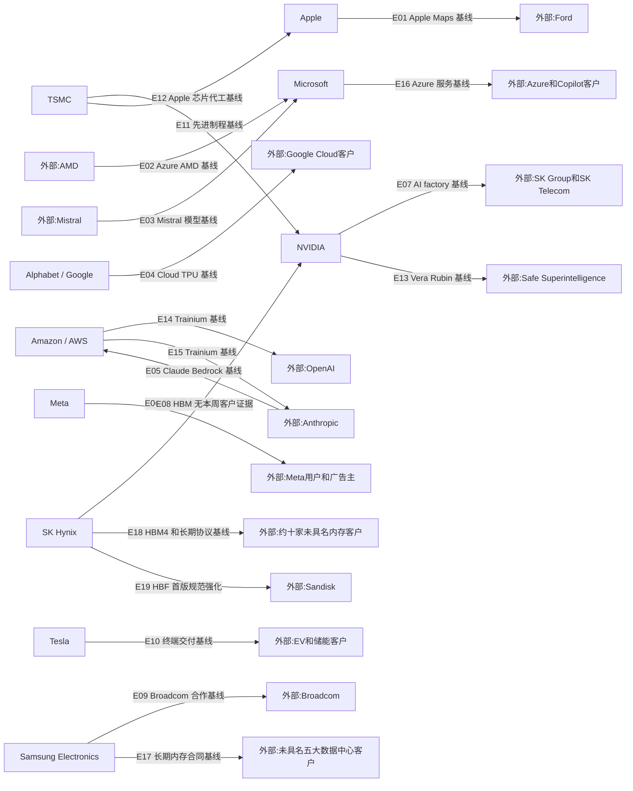

# 周一晨间科技巨头简报
- 覆盖期间：2026-08-03 至 2026-08-09（Asia/Shanghai）
- 生成时间：2026-08-11 13:37（Asia/Shanghai）
- 本期文件：reports/2026-08-10_weekly_morning_brief.md

## 1. 本周最重要的 5-8 件事
1. **SK Hynix：董事会批准约 54 万亿韩元新晶圆厂投资。** 其中 Yongin Y2 投资 35.2 万亿韩元、Cheongju M17 投资 19.1 万亿韩元，首个洁净室分别计划于 2029 年 6 月和 2028 年 12 月启用。重要性：这是对 AI 时代 DRAM/HBM 与 NAND/eSSD 中长期需求的重资产押注，但新增供给兑现仍有两至三年时滞。[SK Hynix](https://news.skhynix.com/en/fab-facility-investment-2026/)
2. **SK Hynix 与 Sandisk：发布首版开放 HBF 规范。** 规范经 OCP 披露，定义 8/16 层 NAND 堆叠、最高 512GB 容量、约 0.4-3.0TB/s 带宽及 UCIe 互连。重要性：HBF 试图在 HBM 与 SSD 之间建立面向 AI 推理的新内存层，关系到大模型 KV cache 的容量、功耗和成本结构。[SK Hynix](https://news.skhynix.com/en/hbf-at-fms-2026/)
3. **Samsung Electronics：在 FMS 2026 展示 zHBM、zNAND-O 与 BV-NAND 路线。** 专业媒体称三项方案均以晶圆键合为关键技术，其中 zHBM 设想把 HBM 堆叠置于逻辑芯片之上。重要性：Samsung 正把竞争从标准 HBM 延伸至定制化 3D 集成，但量产时间、客户和性能口径均未公布，现阶段应视为技术路线而非订单。[Tom's Hardware](https://www.tomshardware.com/pc-components/dram/samsung-debuts-three-next-generation-memory-technologies-for-ai-data-centers-zhbm-znand-o-and-bv-nand-all-rely-on-advanced-wafer-bonding-technologies)
4. **Alphabet / Google：参与 HBF 标准生态，但未形成采购承诺。** SK Hynix 官方披露 Google 与 Tenstorrent 已参与 HBF 联盟，Google DeepMind 工程师并与 SK Hynix、Sandisk 共同讨论 HBF 路线。重要性：超大规模云与模型方进入标准讨论，有助于 HBF 面向实际推理负载设计；但参与标准不等于采用、采购或独家合作。[SK Hynix](https://news.skhynix.com/en/hbf-at-fms-2026/)
5. **SK Hynix：首次展示第十代 375 层 4D NAND。** 公司称其每瓦性能较上一代提高 2.5 倍，并计划基于该 NAND 的高性能大容量企业级 SSD 于 2027 年初量产。重要性：AI 推理需求正把竞争从 HBM 扩展到 NAND、eSSD 与分层内存，M17 扩产与该产品路线形成中长期配套。[SK Hynix](https://news.skhynix.com/en/hbf-at-fms-2026/)

## 2. 影响力速览
| 公司 | 重大事件数量 | 本周影响判断 | 关键词 |
|---|---:|---|---|
| Apple | 0 | 无重大事件 | 官方信息空档、延续财报基线 |
| Microsoft | 0 | 无重大事件 | 官方信息空档、Azure 基线 |
| Alphabet / Google | 1 | 中性 | HBF 联盟、标准参与、无采购承诺 |
| Amazon / AWS | 0 | 无重大事件 | 财报后空档、Trainium 基线 |
| Meta | 0 | 无重大事件 | 财报后空档、AI capex 基线 |
| NVIDIA | 0 | 无重大事件 | 财报前空档、AI 计算平台基线 |
| Tesla | 0 | 无重大事件 | 无重大正式披露、需求基线 |
| Samsung Electronics | 1 | 中性 | zHBM、zNAND-O、BV-NAND、路线待验证 |
| SK Hynix | 3 | 正面 | 54 万亿韩元扩产、HBF、375 层 NAND |
| TSMC | 0 | 无重大事件 | 月度营收在报告期后、先进制程基线 |

## 3. 按公司分组
### Apple
- 日期：2026-08-03 至 2026-08-09
- 事件：未发现可确认重大事件；本周没有新的重大财报、正式产品发布、监管决定或供应链公告达到纳入标准。
- 影响：继续沿用 7 月 30 日季度业绩建立的 iPhone、Mac、服务与关税影响基线，不把对既有财报的重复报道或新品传闻计作本周事件。
- 可信度：已确认“未发现足够可靠的本周新增重大事件”。
- 来源：[Apple Newsroom](https://www.apple.com/newsroom/)

### Microsoft
- 日期：2026-08-03 至 2026-08-09
- 事件：未发现可确认重大事件；本周没有新的重大财报、并购、监管裁决或大型云基础设施合同达到纳入标准。
- 影响：继续沿用 FY2026 Q4 财报对 Azure、Copilot、商业剩余履约义务和 AI 资本开支的基线，不重复计算上周财报。
- 可信度：已确认“未发现足够可靠的本周新增重大事件”。
- 来源：[Microsoft Source](https://news.microsoft.com/source/)

### Alphabet / Google
- 日期：2026-08-04
- 事件：SK Hynix 官方披露 Google 与 Tenstorrent 已参与 HBF 联盟；Google DeepMind 代表参与了与 SK Hynix、Sandisk 的 HBF 技术讨论。
- 影响：Google 的参与可帮助 HBF 规范贴近 AI 推理和分层内存负载，但官方没有披露采购、样片采用、商业合同或排他安排，因此本期不建立 Google 客户级供应边。
- 可信度：已确认联盟参与；商业采用未确认。
- 来源：[SK Hynix Newsroom](https://news.skhynix.com/en/hbf-at-fms-2026/)

### Amazon / AWS
- 日期：2026-08-03 至 2026-08-09
- 事件：未发现可确认重大事件；本周没有新的重大财报、并购、Trainium 客户承诺或数据中心投资公告达到纳入标准。
- 影响：继续沿用上周 Q2 财报对 AWS 增长、OpenAI/Anthropic 多年多吉瓦 Trainium 承诺和自由现金流压力的基线。
- 可信度：已确认“未发现足够可靠的本周新增重大事件”。
- 来源：[Amazon Investor Relations](https://ir.aboutamazon.com/)

### Meta
- 日期：2026-08-03 至 2026-08-09
- 事件：未发现可确认重大事件；本周没有新的重大财报、正式 AI 基础设施合同、并购或监管裁决达到纳入标准。
- 影响：继续沿用上周 Q2 财报对广告变现、AI 资本开支、折旧和自由现金流的基线，不把分析师推测写成公司事实。
- 可信度：已确认“未发现足够可靠的本周新增重大事件”。
- 来源：[Meta Investor Relations](https://investor.atmeta.com/)

### NVIDIA
- 日期：2026-08-03 至 2026-08-09
- 事件：未发现可确认重大事件；本周没有新的重大财报、数据中心平台发布、具名客户订单或出口管制正式文件达到纳入标准。
- 影响：延续 Vera Rubin、SK Group 和 SSI 合作基线；SK Hynix 本周扩产及 HBF 发布不能据此推导为 NVIDIA 新订单。
- 可信度：已确认“未发现足够可靠的本周新增重大事件”。
- 来源：[NVIDIA Newsroom](https://nvidianews.nvidia.com/)

### Tesla
- 日期：2026-08-03 至 2026-08-09
- 事件：未发现可确认重大事件；本周没有新的重大财报、正式产品量产、监管决定或供应链合同达到纳入标准。
- 影响：继续沿用 Q2 财报对汽车需求、储能、FSD/Robotaxi、Optimus 和资本开支的观察，不采用社交媒体演示或市场猜测。
- 可信度：已确认“未发现足够可靠的本周新增重大事件”。
- 来源：[Tesla Investor Relations](https://ir.tesla.com/)

### Samsung Electronics
- 日期：2026-08-06
- 事件：专业媒体报道 Samsung 在 FMS 2026 展示 zHBM、zNAND-O 与 BV-NAND，其中 zHBM 设想将 HBM 直接堆叠于 AI 加速器逻辑芯片之上，三项路线均依赖晶圆键合。
- 影响：技术路线指向更高密度、更短互连和更低数据搬运能耗，有望拓展定制 HBM 与近存储计算能力；但 Samsung 未在可访问的公司公告中给出量产时间、客户或可比测试口径，本期不据此建立供应边。
- 可信度：媒体报道待确认；技术指标和商业时间表均有限制。
- 来源：[Tom's Hardware](https://www.tomshardware.com/pc-components/dram/samsung-debuts-three-next-generation-memory-technologies-for-ai-data-centers-zhbm-znand-o-and-bv-nand-all-rely-on-advanced-wafer-bonding-technologies)

### SK Hynix
- 日期：2026-08-07
- 事件：董事会批准约 54 万亿韩元新晶圆厂投资，其中 Yongin Y2 为 35.2 万亿韩元、Cheongju M17 为 19.1 万亿韩元；Y2 面向 HBM 等下一代 DRAM，M17 面向 NAND。
- 影响：Y2 和 M17 分别计划于 2029 年 6 月、2028 年 12 月启用首个洁净室，强化 DRAM/HBM 与 NAND/eSSD 双线产能基础；长建设周期、设备投入和需求兑现是主要风险。
- 可信度：已确认。
- 来源：[SK Hynix Newsroom](https://news.skhynix.com/en/fab-facility-investment-2026/)

- 日期：2026-08-04
- 事件：SK Hynix 与 Sandisk 发布首版 HBF 开放规范，覆盖最高 512GB 容量、约 0.4-3.0TB/s 带宽、UCIe 互连及封装、可靠性和软件 I/O 要求。
- 影响：HBF 面向 AI 推理建立介于 HBM 与 SSD 之间的高容量内存层；规范发布强化双方共研关系，但尚无量产时间、客户订单或系统部署承诺。
- 可信度：已确认；商业化节奏未确认。
- 来源：[SK Hynix Newsroom](https://news.skhynix.com/en/hbf-at-fms-2026/)

- 日期：2026-08-04
- 事件：公司在 FMS 首次展示第十代 375 层 4D NAND，并称其每瓦性能较上一代提高 2.5 倍，基于该产品的高性能大容量 eSSD 计划于 2027 年初量产。
- 影响：375 层 NAND 与 M17 投资共同指向 AI 推理、KV cache 和企业级 SSD 需求；当前指标与量产计划来自公司前瞻陈述，仍需后续样品、良率和客户验证。
- 可信度：已确认发布；量产计划为公司前瞻指引。
- 来源：[SK Hynix Newsroom](https://news.skhynix.com/en/hbf-at-fms-2026/)

### TSMC
- 日期：2026-08-03 至 2026-08-09
- 事件：未发现可确认重大事件；本周没有新的重大财报、董事会资本支出决定、客户订单或制程量产公告达到纳入标准。
- 影响：继续沿用 7 月 Q2 财报形成的先进制程、CoWoS/3DFabric、N2 与海外扩产基线；8 月 10 日发布的月度营收属于报告期后事项，不回填本周。
- 可信度：已确认“未发现足够可靠的本周新增重大事件”。
- 来源：[TSMC Press Center](https://pr.tsmc.com/english)

## 4. 跨公司与产业链观察
1. **AI 内存竞争从 HBM 单层扩展为分层架构。** HBF、zHBM、zNAND-O、CXL 与 eSSD 都在减少数据搬运瓶颈，但开放标准、定制 3D 集成和传统存储的商业成熟度差异很大，不能用概念性能替代量产证据。
2. **资本开支继续前置，供给释放明显滞后。** SK Hynix 的 Y2、M17 首个洁净室要到 2028-2029 年才启用，短期内不会直接缓解 HBM 或企业级 NAND 紧张，反而会提高设备、建设和折旧敏感度。
3. **超大规模客户正在更早介入内存定义。** Google 参与 HBF 联盟说明模型和云厂商希望从工作负载层影响内存接口与层级设计；但标准参与、联合讨论与真实采购是三个不同证据等级。
4. **本周供应链新增证据有限。** 除 E19 的 HBF 共研关系得到首版规范强化外，上一期 E01-E18 均未获得新的客户级订单、价格、产能分配或部署证据，因此统一保留为基线状态。

## 5. 下周需关注
1. **Made by Google 硬件发布：** 关注 8 月 12 日活动是否正式发布 Pixel 11、端侧 AI 功能及芯片供应变化；只有公司发布后才更新产品与供应关系。
2. **TSMC 月度营收与董事会事项：** 关注报告期后的 7 月营收、资本预算和产能安排是否改变全年 AI/先进制程判断；客户级推断仍需直接证据。
3. **SK Hynix 扩产执行：** 关注 Y2/M17 的开工许可、设备采购和资金安排；触发条件是公司或监管披露具体时间表与供应商。
4. **HBF 商业化：** 关注 OCP 是否公开完整规范、Sandisk 样品和 Google/Tenstorrent 是否披露采用计划；标准参与不能提前记作订单。
5. **Samsung 新内存路线：** 关注公司是否补发 zHBM、zNAND-O、BV-NAND 官方材料，并披露量产节点、客户验证或可比性能指标。

## 6. 十家公司供应关系图谱与周度变化
### 6.0 2026 年度主营产品上下游关系图

### 6.1 本周供应关系可视化

### 6.2 供应关系明细表
| Edge ID | 供应方 | 客户/使用方 | 具体产品/服务 | 关系类型 | 本周证据 | 长期基线证据/限制 | 本周状态 | 来源链接 |
|---|---|---|---|---|---|---|---|---|
| E01 | Apple | Ford | Apple Maps EV 路线规划和车载导航 | 车载软件服务 | 无本周直接证据 | 7 月由 Apple 官方确认；不是硬件供应关系 | 基线/无本周新增证据 | [Apple](https://www.apple.com/newsroom/2026/07/apple-maps-to-power-navigation-experience-for-ford-uev-platform/) |
| E02 | AMD | Microsoft | Helios、ND MI455X v7 与 EPYC 的 Azure AI/HPC 基础设施 | AI/HPC 基础设施供应 | 无本周订单或部署新增 | 7 月 Microsoft 官方确认，采购金额和节奏未披露 | 基线/无本周新增证据 | [Microsoft](https://news.microsoft.com/source/2026/07/20/microsoft-expands-azure-ai-and-hpc-infrastructure-with-amd/) |
| E03 | Mistral | Microsoft | Frontier AI 模型和受监管行业部署 | 模型平台合作 | 无本周直接证据 | 7 月 Microsoft 官方确认；不代表排他合作 | 基线/无本周新增证据 | [Microsoft](https://news.microsoft.com/source/2026/07/21/microsoft-and-mistral-expand-strategic-partnership-to-give-enterprises-and-regulated-industries-frontier-ai-they-can-control/) |
| E04 | Alphabet / Google | Google Cloud 客户 | Google Cloud AI、TPU pods 和云基础设施 | 云与 AI 基础设施服务 | 无本周客户订单证据 | Q2 财报确认需求与资本开支；不是单一客户订单 | 基线/无本周新增证据 | [Alphabet](https://abc.xyz/assets/5d/f4/15f364a84a6c9b70a59f9f38d3a1/2026q2-alphabet-earnings-release.pdf) |
| E05 | Anthropic | Amazon / AWS | Claude Opus 5 on Amazon Bedrock | 第三方模型托管 | 无本周直接证据 | 上周财报重申采用；非独家供应 | 基线/无本周新增证据 | [Amazon](https://ir.aboutamazon.com/news-release/news-release-details/2026/Amazon-com-Announces-Second-Quarter-Results/default.aspx) |
| E06 | Meta | Meta 用户和广告主 | Facebook、Instagram、WhatsApp、Threads 与广告系统 | 数字服务 | 无本周直接证据 | 上周财报建立需求与变现基线；不是硬件供货关系 | 基线/无本周新增证据 | [Meta](https://investor.atmeta.com/investor-news/press-release-details/2026/Meta-Reports-Second-Quarter-2026-Results/) |
| E07 | NVIDIA | SK Group / SK Telecom | NVIDIA AI infrastructure 与 AI factories | AI 计算平台供应 | 无本周新订单或部署数据 | 7 月 NVIDIA 官方确认；交付节奏与金额待披露 | 基线/无本周新增证据 | [NVIDIA](https://nvidianews.nvidia.com/news/sk-group-and-nvidia-expand-strategic-partnership-across-ai-factories-and-next-generation-memory) |
| E08 | SK Hynix | NVIDIA | HBM 与下一代 AI 内存生态 | 内存供应生态 | 无本周 NVIDIA 客户级订单证据 | 双方此前确认合作；不能把本周扩产或 HBF 发布归为 NVIDIA 新订单 | 基线/无本周新增证据 | [SK Hynix](https://news.skhynix.com/en/q2-2026-business-results/)、[NVIDIA](https://nvidianews.nvidia.com/news/sk-group-and-nvidia-expand-strategic-partnership-across-ai-factories-and-next-generation-memory) |
| E09 | Samsung Electronics | Broadcom | HBM、2nm 及以下代工、2.3D/2.5D 封装 | 内存代工封装 | 无本周新合同细节 | 7 月 Samsung 官方确认；节点、出货与收入确认仍待披露 | 基线/无本周新增证据 | [Samsung](https://news.samsung.com/global/samsung-electronics-and-broadcom-expand-strategic-collaboration-across-memory-and-foundry-technologies) |
| E10 | Tesla | EV 和储能客户 | 电动车、储能系统和能源服务 | 终端产品交付 | 无本周直接证据 | Q2 财报建立业务基线；不是新增客户关系 | 基线/无本周新增证据 | [Tesla](https://ir.tesla.com/press-release/tesla-releases-second-quarter-2026-financial-results) |
| E11 | TSMC | NVIDIA | AI GPU 的先进制程代工与先进封装 | 晶圆代工 | 无本周客户级直接证据 | 长期关键关系；本周未确认订单、价格或产能变化 | 基线/无本周新增证据 | [TSMC](https://investor.tsmc.com/english/annual-reports) |
| E12 | TSMC | Apple | A/M 系列芯片先进制程代工 | 晶圆代工 | 无本周客户级直接证据 | 长期关键关系；本周未确认订单、价格或产能变化 | 基线/无本周新增证据 | [TSMC](https://investor.tsmc.com/english/annual-reports)、[Apple](https://investor.apple.com/sec-filings/default.aspx) |
| E13 | NVIDIA | Safe Superintelligence | Vera Rubin 系统、长期算力供应和平台共研 | AI 算力与投资合作 | 无本周部署更新 | 上周双方官方确认；投资金额、系统数量和地点未披露 | 基线/无本周新增证据 | [NVIDIA](https://nvidianews.nvidia.com/news/ilya-sutskevers-safe-superintelligence-inc-and-nvidia-announce-long-term-strategic-partnership) |
| E14 | Amazon / AWS | OpenAI | Trainium 多年、多吉瓦 AI 计算承诺 | 自研 AI 芯片与云基础设施 | 无本周执行更新 | 上周财报确认；执行、供电和交付节奏未披露 | 基线/无本周新增证据 | [Amazon](https://ir.aboutamazon.com/news-release/news-release-details/2026/Amazon-com-Announces-Second-Quarter-Results/default.aspx) |
| E15 | Amazon / AWS | Anthropic | Trainium 多年、多吉瓦 AI 计算承诺 | 自研 AI 芯片与云基础设施 | 无本周执行更新 | 长期战略关系；执行、供电和交付节奏未披露 | 基线/无本周新增证据 | [Amazon](https://ir.aboutamazon.com/news-release/news-release-details/2026/Amazon-com-Announces-Second-Quarter-Results/default.aspx) |
| E16 | Microsoft | Azure 和 Copilot 客户 | Azure 云与 AI 服务、Microsoft 365 Copilot | 云与 AI 服务 | 无本周新增需求指标 | 上周财报建立增长与积压基线；不是单一新客户订单 | 基线/无本周新增证据 | [Microsoft](https://www.microsoft.com/en-us/Investor/earnings/FY-2026-Q4/press-release-webcast) |
| E17 | Samsung Electronics | 未具名五大数据中心客户 | 服务器内存和 AI 基础设施芯片长期供应合同 | 长期内存供应 | 无本周客户身份或合同更新 | 上周管理层披露合同；客户、金额、期限和产品组合未公开 | 基线/无本周新增证据 | [Samsung](https://images.samsung.com/is/content/samsung/assets/global/ir/docs/2026_2Q_conference_eng.pdf)、[AP](https://apnews.com/article/samsung-ai-profit-memory-chips-10c2c548a392988862d8c7bd3f6fae05) |
| E18 | SK Hynix | 约十家未具名关键客户 | HBM4、AI 服务器 DRAM、eSSD 与长期供货协议 | HBM 与内存长期供应 | 无本周客户身份或分配量更新 | 上周公司确认约 10 家客户 LTA；价格和具体期限未披露 | 基线/无本周新增证据 | [SK Hynix](https://news.skhynix.com/en/q2-2026-business-results/) |
| E19 | SK Hynix | Sandisk | 面向 AI 推理分层内存的首版开放 HBF 规范 | 内存标准共研 | 8 月 4 日官方确认首版规范经 OCP 披露，覆盖容量、带宽、UCIe、封装与软件要求 | 双方 2025 年已合作、2026 年 2 月启动 OCP 工作组；不是采购订单，量产时间未披露 | 强化/首版开放规范发布 | [本周发布](https://news.skhynix.com/en/hbf-at-fms-2026/)、[长期基线](https://news.skhynix.com/sk-hynix-and-sandisk-begin-global-standardization-ofnext-generation-memory-hbf/) |

### 6.3 与上周的区别
- **新增关系：**
  - 无。本周没有首次形成且获得高可信来源确认的供应或客户关系；Google 参与 HBF 联盟不等于采购，Samsung 的 zHBM 等技术路线也没有具名客户，因此均未建立新增供应边。

- **强化关系：**
  - E19 SK Hynix -> Sandisk：双方关系早于本周形成，本周首版 HBF 开放规范正式披露，使共研从标准化工作组推进到可描述的容量、带宽、互连和封装规范；仍无采购订单与量产时间表。

- **弱化或风险关系：**
  - E08 SK Hynix -> NVIDIA：本周海力士扩产与 HBF 发布提升整体 AI 内存能力，但没有 NVIDIA 客户级订单、分配量或价格证据，不能标记为增强。
  - Samsung 的 zHBM、zNAND-O 与 BV-NAND 尚无官方可访问材料补充量产时间和客户，属于技术路线验证风险；因此不进入供应图。
  - SK Hynix Y2/M17 的供给释放在 2028-2029 年以后，建设、设备、良率和需求周期可能影响资本回报；本周未发现既有客户砍单或转单的直接证据。

- **无明显变化但关键关系：**
  - E01-E18 均延续上一期基线，本周没有新的客户级订单、部署、价格或产能分配证据。
  - E11、E12 TSMC -> NVIDIA、Apple 仍是关键先进制程长期基线，但本周没有直接客户证据，不能写成新增或强化。
  - E17、E18 的未具名客户关系仍有效，但客户身份、具体产品分配和条款没有更新，继续保留限制标注。

## 7. 本期自检
- 日期范围已限定为 2026-08-03 至 2026-08-09，符合 2026-08-10 周一对应的上一完整自然周口径。
- 10 家公司全部覆盖；没有可靠重大新增的公司明确写明“未发现可确认重大事件”，未以小新闻补数。
- 每条事件和供应关系均附可点击来源；Samsung 技术路线、未具名客户和无本周客户级证据均明确标注限制。
- Mermaid 使用 `flowchart LR`，包含全部 10 家公司；E01-E19 在图、6.2 表格和 JSON 基线中使用同一 Edge ID。
- 完整质量闸门状态：通过；来源可达性、JSON、日期、latest 链接、SVG 与 Edge ID 一致性均已自动校验。
- GitHub 同步状态：完成；本期文件已同步到远端 `main`。
