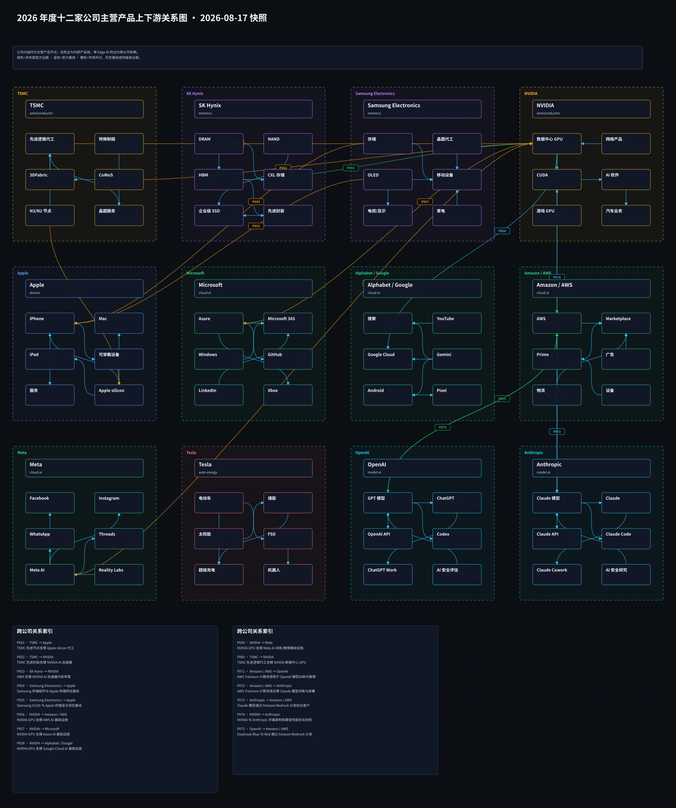
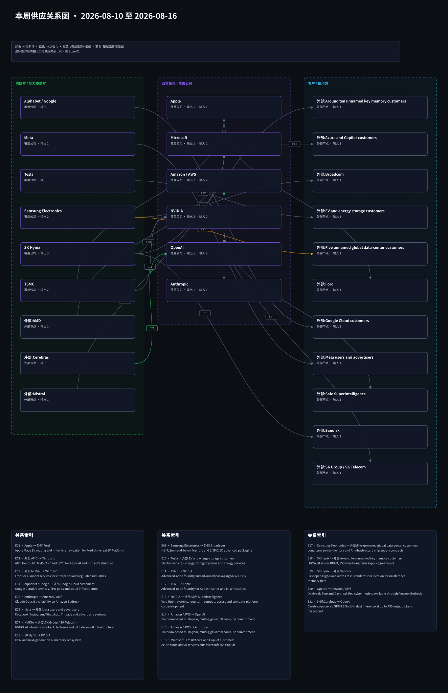
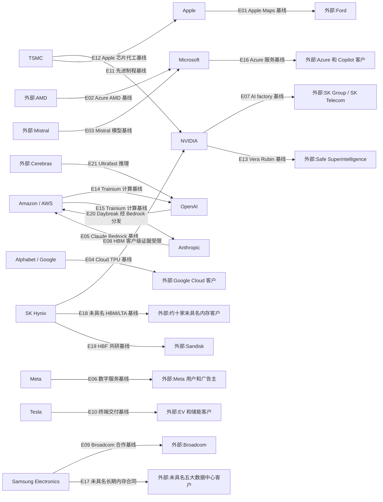

# 周一晨间科技巨头简报
- 覆盖期间：2026-08-10 至 2026-08-16（Asia/Shanghai）
- 生成时间：2026-08-17 13:24（Asia/Shanghai）
- 本期文件：reports/2026-08-17_weekly_morning_brief.md

## 1. 本周最重要的 10 件事
1. **OpenAI：** 8 月 10 日发布 GPT-5.6-Cyber，并以 Daybreak Blue/Red 分级向获批防御者开放；内部高级网络安全完成率为 95.0%，模型被评为 High、未达 Critical。**为什么重要：** 前沿模型的商业化开始与身份核验、用途限制和硬件密钥绑定，网络安全能力与治理门槛同步抬升。来源：[OpenAI](https://openai.com/index/expanding-daybreak-as-the-cyber-defense-window-narrows/)、[伙伴计划](https://openai.com/index/putting-frontier-cyber-models-in-more-trusted-hands/)、[Axios](https://www.axios.com/2026/08/10/openai-gpt-astra-restrictions-safety-hacking-defenders)。
2. **Anthropic：** 8 月 14 日风险报告将高风险场景错配风险由“Very Low”上调为“Low”，并披露内部 Model 2 暂无对外发布计划。**为什么重要：** 能力提升与近期网络安全事件正在迫使实验室提高风险估计，可能影响模型发布节奏与监管审查。来源：[Anthropic 风险报告](https://www-cdn.anthropic.com/f61d49fa5596956a5dec75fea0e973bf6a6a8378/Redacted%20Risk%20Report%20August%202026%20.pdf)、[Axios](https://www.axios.com/2026/08/14/anthropic-model-2-ai-risk)。
3. **Meta：** 8 月 10 日发布可在个人电脑运行的开放权重 Muse Glimmer，并预告向开发者提供更强的 Muse Spark 1.2。**为什么重要：** Meta 继续以低部署门槛和开放分发对抗闭源模型平台，强化端侧与开发者生态竞争。来源：[AP](https://apnews.com/article/df8a4e7d7825470d09e8090367457c2c)。
4. **OpenAI / Amazon AWS：** 8 月 11 日，Daybreak Blue 与 Red 正式通过 Amazon Bedrock 向符合资格的客户提供。**为什么重要：** AWS 不仅向 OpenAI 提供 Trainium 算力，也成为其高敏感网络安全模型的企业分发渠道，双方形成双向供应关系。来源：[OpenAI](https://openai.com/index/daybreak-models-are-now-available-on-aws/)。
5. **Alphabet / Google：** 8 月 12 日推出 Pixel 11、Pixel 11 Pro/Pro XL 与 Pro Fold，搭载 Tensor G6，并把 Gemini Intelligence 和 AI Pro 订阅纳入硬件销售。**为什么重要：** Google 正把自研芯片、端侧 AI 和订阅捆绑为完整终端栈，直接测试 AI 功能对高端手机换机和服务收入的拉动。来源：[Google Store](https://store.google.com/magazine/google_pixel_11?hl=en-US)、[AP](https://apnews.com/article/3bbad7afc4d25e15527477123415e50a)。
6. **OpenAI / Cerebras：** 8 月 13 日预览 Ultrafast 服务层，GPT-5.6 Sol 最高较标准处理快 14 倍、最高 750 输出 token/秒。**为什么重要：** 推理速度成为独立定价和产品维度，也验证 OpenAI 在 GPU 之外引入专用低延迟算力的多供应商策略。来源：[OpenAI](https://openai.com/index/previewing-ultrafast/)。
7. **TSMC：** 8 月 10 日披露 7 月合并营收新台币 4,675.8 亿元，同比增长 44.7%，1-7 月累计同比增长 37.0%。**为什么重要：** 先进制程与 AI 需求继续反映在收入高增中，但月度数据不提供客户拆分，不能直接推导 NVIDIA 或 Apple 订单变化。来源：[TSMC](https://investor.tsmc.com/english/monthly-revenue/2026)。
8. **OpenAI：** 8 月 11 日将 ChatGPT Ads 扩展至英国、墨西哥、巴西、日本和韩国。**为什么重要：** 广告从美国测试进入多市场商业化阶段，为免费层算力成本建立第二收入来源，同时引入隐私、答案独立性和监管执行风险。来源：[OpenAI](https://openai.com/index/testing-ads-in-chatgpt/)。
9. **OpenAI：** 8 月 10 日公布 ChatGPT Business Premium 席位，月付 125 美元或年付折合 100 美元，使用量为 Standard 的 5 倍。**为什么重要：** OpenAI 开始在同一企业工作区内按算力消耗和使用强度分层定价，有利于提升客单价并约束重度用户成本。来源：[OpenAI](https://openai.com/index/premium-seats-chatgpt-business/)。
10. **OpenAI：** 8 月 13 日任命 Dali Rajic 为首席营收官，并披露产品周活跃用户超过 10 亿、企业客户超过 200 万。**为什么重要：** 管理层调整与规模指标共同显示公司正从高速获客转向可重复的全球销售执行，Denise Dresser 将在过渡期后离任。来源：[OpenAI](https://openai.com/index/dali-rajic-chief-revenue-officer/)。

## 2. 影响力速览
| 公司 | 重大事件数量 | 本周影响判断 | 关键词 |
|---|---:|---|---|
| Apple | 0 | 中性 | 无可确认重大事件、供应基线 |
| Microsoft | 0 | 中性 | 无可确认重大事件、Azure 基线 |
| Alphabet / Google | 1 | 正面偏中性 | Pixel 11、Tensor G6、Gemini Intelligence |
| Amazon / AWS | 1 | 正面 | Amazon Bedrock、Daybreak、模型分发 |
| Meta | 1 | 正面偏高波动 | Muse Glimmer、开放权重、Spark 1.2 |
| NVIDIA | 0 | 中性 | 无可确认重大事件、HBM 证据边界 |
| Tesla | 0 | 中性 | 无可确认重大事件、交付基线 |
| OpenAI | 6 | 高影响/正面伴随治理风险 | GPT-5.6-Cyber、AWS、Ultrafast、广告、定价、CRO |
| Anthropic | 1 | 高影响/风险上升 | Risk Report、Model 2、错配风险 |
| Samsung Electronics | 0 | 中性 | 无可确认重大事件、内存基线 |
| SK Hynix | 0 | 中性 | 无可确认重大事件、HBM/HBF 基线 |
| TSMC | 1 | 正面 | 7 月营收、AI 需求、客户拆分限制 |

## 3. 按公司分组
### Apple
- **结论：** 未发现可确认重大事件。
- **核查范围与影响：** 本周未见达到财报、重大产品、监管、资本开支或供应链关系变化门槛的官方披露；既有 TSMC 与 Apple Maps 关系仅保留长期基线。
- **可信度：** 中高；结论受公开信息边界限制。
- **来源：** [Apple Newsroom](https://www.apple.com/newsroom/)、[Apple IR](https://investor.apple.com/sec-filings/default.aspx)。

### Microsoft
- **结论：** 未发现可确认重大事件。
- **核查范围与影响：** Azure、Copilot、AMD 和 Mistral 关系本周未出现可确认的新订单、部署规模或指引变化。
- **可信度：** 中高；结论受公开信息边界限制。
- **来源：** [Microsoft Source](https://news.microsoft.com/source/)、[Microsoft IR](https://www.microsoft.com/en-us/Investor/)。

### Alphabet / Google
- **日期：** 2026-08-12
- **事件：** 发布 Pixel 11 系列与 Pixel Watch 5；Pixel 11 系列采用 Tensor G6，强调 Gemini Intelligence、端侧隐私和七年更新。
- **影响：** Google 将自研芯片、移动操作系统、AI 模型和订阅组合在同一终端，有助于提高 Pixel 差异化，但硬件销量和 AI 订阅转化仍待后续披露。
- **可信度：** 高；官方商店已上线产品，AP 提供发布日交叉验证。
- **来源：** [Google Store](https://store.google.com/magazine/google_pixel_11?hl=en-US)、[AP](https://apnews.com/article/3bbad7afc4d25e15527477123415e50a)。

### Amazon / AWS
- **日期：** 2026-08-11
- **事件：** Amazon Bedrock 向获批客户提供 OpenAI Daybreak Blue 与 Red，可通过控制台或 `bedrock-mantle` Responses API 端点访问。
- **影响：** AWS 扩充高价值第三方模型目录，并与 OpenAI 形成“算力供应 + 模型分发”的双向关系；资格审批和未披露收入限制短期量化。
- **可信度：** 高；OpenAI 官方确认。
- **来源：** [OpenAI](https://openai.com/index/daybreak-models-are-now-available-on-aws/)。

### Meta
- **日期：** 2026-08-10
- **事件：** 发布开放权重 Muse Glimmer，可在个人电脑运行；同时预告开发者将可访问 Muse Spark 1.2。
- **影响：** 降低模型本地部署门槛，延续 Meta 以开放生态扩大开发者覆盖的路线；性能、安全评估与许可细节仍需官方材料补充。
- **可信度：** 中高；由 AP 报道，官方技术材料未能稳定访问。
- **来源：** [AP](https://apnews.com/article/df8a4e7d7825470d09e8090367457c2c)。

### NVIDIA
- **结论：** 未发现可确认重大事件。
- **核查范围与影响：** 本周未见公司确认新的 GPU 订单、Vera Rubin 部署、出口管制变化或具名 HBM 供应调整；市场报道不能替代客户级证据。
- **可信度：** 中高；结论受公开信息边界限制。
- **来源：** [NVIDIA Newsroom](https://nvidianews.nvidia.com/)、[NVIDIA IR](https://investor.nvidia.com/)。

### Tesla
- **结论：** 未发现可确认重大事件。
- **核查范围与影响：** 未发现覆盖期内达到重大产品、交付、监管、资本开支或供应链变化门槛的官方披露。
- **可信度：** 中高；结论受公开信息边界限制。
- **来源：** [Tesla IR](https://ir.tesla.com/)。

### OpenAI
- **日期：** 2026-08-10
- **事件：** 推出 GPT-5.6-Cyber 与 Daybreak Blue/Red，并扩大 Cyber Partner Program；模型在内部高级网络安全完成率评估中为 95.0%，被评为 High、未达 Critical。
- **影响：** 专用网络安全模型进入受控商业分发，同时强化身份、用途、监控和硬件密钥要求；能力与滥用风险同步上升。
- **可信度：** 高；两篇官方发布并由 Axios 交叉报道。
- **来源：** [OpenAI 模型发布](https://openai.com/index/expanding-daybreak-as-the-cyber-defense-window-narrows/)、[伙伴计划](https://openai.com/index/putting-frontier-cyber-models-in-more-trusted-hands/)、[Axios](https://www.axios.com/2026/08/10/openai-gpt-astra-restrictions-safety-hacking-defenders)。

- **日期：** 2026-08-10
- **事件：** 公布 ChatGPT Business Premium 席位，提供 Standard 五倍使用量并取消五小时限制，定价为月付 125 美元或年付折合 100 美元。
- **影响：** 企业套餐从统一席位转向按使用强度分层，有利于提升 ARPU 和算力成本匹配度；当前仍处候补与早期开放阶段。
- **可信度：** 高；OpenAI 官方定价信息。
- **来源：** [OpenAI](https://openai.com/index/premium-seats-chatgpt-business/)。

- **日期：** 2026-08-11
- **事件：** Daybreak Blue 与 Red 上架 Amazon Bedrock。
- **影响：** 新增企业云分发渠道，并与 AWS 既有 Trainium 算力承诺构成双向合作；需经 Daybreak Access 审批。
- **可信度：** 高；OpenAI 官方确认。
- **来源：** [OpenAI](https://openai.com/index/daybreak-models-are-now-available-on-aws/)。

- **日期：** 2026-08-11
- **事件：** ChatGPT Ads 正式扩展至英国、墨西哥、巴西、日本和韩国。
- **影响：** 广告收入覆盖更多市场，可能改善免费层单位经济性；隐私、广告标识和答案独立性将成为监管重点。
- **可信度：** 高；OpenAI 官方更新。
- **来源：** [OpenAI](https://openai.com/index/testing-ads-in-chatgpt/)。

- **日期：** 2026-08-13
- **事件：** 预览由 Cerebras 驱动的 GPT-5.6 Sol Ultrafast，最高 14 倍速度、750 输出 token/秒。
- **影响：** 低延迟推理形成独立服务层，扩大实时代理、金融研究和事故响应等场景；当前只面向初始客户，商业规模未披露。
- **可信度：** 高；OpenAI 官方确认，且与 1 月 Cerebras 750MW 合作基线一致。
- **来源：** [Ultrafast](https://openai.com/index/previewing-ultrafast/)、[Cerebras 合作基线](https://openai.com/index/cerebras-partnership/)。

- **日期：** 2026-08-13
- **事件：** 任命 Dali Rajic 为首席营收官；Denise Dresser 将在过渡期后离任，并披露周活跃用户超过 10 亿、企业客户超过 200 万。
- **影响：** 商业组织进入规模化执行阶段，销售管理、企业转化和收入质量的重要性上升。
- **可信度：** 高；OpenAI 官方任命公告。
- **来源：** [OpenAI](https://openai.com/index/dali-rajic-chief-revenue-officer/)。

### Anthropic
- **日期：** 2026-08-14
- **事件：** 发布 2026 年 8 月风险报告，将高风险场景的总体错配风险由 Very Low 上调至 Low；披露内部 Model 2，但暂无对外发布计划。
- **影响：** 公司承认能力与不确定性同步上升，发布治理和网络安全评估要求可能趋严；内部模型不应被误写成商业发布。
- **可信度：** 高；官方报告与 Axios 交叉验证。
- **来源：** [Anthropic 风险报告](https://www-cdn.anthropic.com/f61d49fa5596956a5dec75fea0e973bf6a6a8378/Redacted%20Risk%20Report%20August%202026%20.pdf)、[Axios](https://www.axios.com/2026/08/14/anthropic-model-2-ai-risk)。

### Samsung Electronics
- **结论：** 未发现可确认重大事件。
- **核查范围与影响：** 覆盖期内未发现官方确认的 HBM 客户、良率、量产节点或重大合同变化；既有 Broadcom 与未具名数据中心客户关系保持基线。
- **可信度：** 中高；结论受客户保密与公开信息边界限制。
- **来源：** [Samsung Newsroom](https://news.samsung.com/global/)、[Samsung IR](https://www.samsung.com/global/ir/)。

### SK Hynix
- **结论：** 未发现可确认重大事件。
- **核查范围与影响：** 覆盖期内未发现公司确认的具名 HBM 新订单、客户分配或 HBF 实施里程碑；上周 HBF 首版规范关系回归长期基线。
- **可信度：** 中高；结论受客户保密与公开信息边界限制。
- **来源：** [SK Hynix Newsroom](https://news.skhynix.com/)、[SK Hynix IR](https://www.skhynix.com/ir/UI-FR-IR01/)。

### TSMC
- **日期：** 2026-08-10
- **事件：** 7 月合并营收新台币 4,675.8 亿元，环比增长约 5.6%、同比增长 44.7%；1-7 月累计 2.872064 万亿元，同比增长 37.0%。
- **影响：** 收入增速继续支持先进制程和 AI 需求强劲的判断，但月报未经审计且不披露客户、节点或封装拆分，不能转化为具体供应边增强。
- **可信度：** 高；TSMC 官方月度数据。
- **来源：** [TSMC](https://investor.tsmc.com/english/monthly-revenue/2026)。

## 4. 跨公司与产业链观察
1. **前沿网络安全能力转向分级准入。** OpenAI 用 Blue/Red、资格审批和用途治理控制高风险能力；Anthropic 同周上调错配风险，显示实验室正在把“能力发布”与“访问控制”拆成两项决策。
2. **模型实验室与云厂商形成双向供应。** AWS 向 OpenAI 提供 Trainium 算力，OpenAI 又通过 Bedrock 向 AWS 客户分发 Daybreak；分析供应链时必须区分计算供给方向和模型分发方向。
3. **推理基础设施开始按延迟分层。** Cerebras 支撑 Ultrafast，表明前沿模型服务不再只按模型能力和 token 定价，速度、时延与专用硬件将成为独立竞争维度。
4. **AI 变现同时向广告、企业席位和硬件订阅展开。** OpenAI 扩大广告并推出高用量企业席位，Google 则将 Gemini 与 Pixel 11 捆绑；共同目标是把高昂推理成本映射到更清晰的付费层。
5. **半导体总量数据强、客户归因仍弱。** TSMC 月营收高增长不等于 Apple 或 NVIDIA 的当周订单变化；Samsung、SK Hynix 的客户与良率若无直接披露，也不能进入新增供应边。

## 5. 下周需关注
1. **Daybreak 落地：** 触发条件为 AWS 公布可用区域、价格、首批客户或企业部署案例；否则 E20 仍只记录分发渠道建立。
2. **Ultrafast 商业化：** 触发条件为 OpenAI 披露价格、容量、更多模型或一般可用时间，或 Cerebras 披露交付进度。
3. **Anthropic Model 2：** 触发条件为系统卡、第三方评估、发布计划或监管沟通更新；内部使用不等同于对外发布。
4. **Pixel 11 销售与 AI 转化：** 触发条件为预售、渠道库存、AI Pro 激活率或供应商信息披露。
5. **AI 芯片财报窗口：** 关注 NVIDIA 8 月 26 日财报前的正式指引、出口政策与 HBM/CoWoS 供给信息；仅有市场传闻不触发供应边变化。

## 6. 十二家公司供应关系图谱与周度变化
### 6.0 年度主营产品上下游图片

图片采用 Obsidian 图谱视图风格，基于 `state/product_relationships_2026.json` 和本年度可取得的公司年报、投资者关系页面与官方新闻稿生成；证据不足的关系继续标注为“官方基线_加市场共识_待直接证据”或“市场共识_待直接证据”，不写成 confirmed。

### 6.1 本周供应关系可视化

### 6.2 供应关系明细表
| Edge ID | 供应方 | 客户/使用方 | 具体产品/服务 | 关系类型 | 本周证据 | 长期基线证据/限制 | 本周状态 | 来源链接 |
|---|---|---|---|---|---|---|---|---|
| E01 | Apple | Ford | Apple Maps EV routing and in-vehicle navigation for Ford Universal EV Platform | 车载软件服务 | 无本周直接证据 | 7 月 Apple 官方确认；属于软件服务，不是硬件供货 | 基线/无本周新增证据 | [来源1](https://www.apple.com/newsroom/2026/07/apple-maps-to-power-navigation-experience-for-ford-uev-platform/) |
| E02 | AMD | Microsoft | AMD Helios, ND MI455X v7 and EPYC for Azure AI and HPC infrastructure | AI/HPC 基础设施供应 | 无本周订单或部署更新 | 7 月 Microsoft 官方确认；金额、站点与交付节奏未披露 | 基线/无本周新增证据 | [来源1](https://news.microsoft.com/source/2026/07/20/microsoft-expands-azure-ai-and-hpc-infrastructure-with-amd/) |
| E03 | Mistral | Microsoft | Frontier AI model services for enterprises and regulated industries | 模型平台合作 | 无本周直接证据 | 7 月 Microsoft 官方确认；不代表排他合作 | 基线/无本周新增证据 | [来源1](https://news.microsoft.com/source/2026/07/21/microsoft-and-mistral-expand-strategic-partnership-to-give-enterprises-and-regulated-industries-frontier-ai-they-can-control/) |
| E04 | Alphabet / Google | Google Cloud customers | Google Cloud AI services, TPU pods and cloud infrastructure | 云与 AI 基础设施服务 | Pixel 发布不构成云客户订单 | Q2 财报确认云与 TPU 需求；不是单一客户订单 | 基线/无本周新增证据 | [来源1](https://abc.xyz/assets/5d/f4/15f364a84a6c9b70a59f9f38d3a1/2026q2-alphabet-earnings-release.pdf) |
| E05 | Anthropic | Amazon / AWS | Claude Opus 5 availability on Amazon Bedrock | 第三方模型托管 | 无本周 Claude 托管变化 | 既有 Bedrock 分发关系；非独家供应 | 基线/无本周新增证据 | [来源1](https://ir.aboutamazon.com/news-release/news-release-details/2026/Amazon-com-Announces-Second-Quarter-Results/default.aspx) |
| E06 | Meta | Meta users and advertisers | Facebook, Instagram, WhatsApp, Threads and advertising systems | 数字服务 | Muse 发布不改变既有终端服务边 | Q2 财报建立用户与广告主需求基线 | 基线/无本周新增证据 | [来源1](https://investor.atmeta.com/investor-news/press-release-details/2026/Meta-Reports-Second-Quarter-2026-Results/) |
| E07 | NVIDIA | SK Group / SK Telecom | NVIDIA AI infrastructure for AI factories and SK Telecom AI infrastructure | AI 计算平台供应 | 无本周订单或部署数据 | 7 月 NVIDIA 官方确认；金额与交付节奏未披露 | 基线/无本周新增证据 | [来源1](https://nvidianews.nvidia.com/news/sk-group-and-nvidia-expand-strategic-partnership-across-ai-factories-and-next-generation-memory) |
| E08 | SK Hynix | NVIDIA | HBM and next-generation AI memory ecosystem | 内存供应生态 | 无本周 NVIDIA 客户级订单证据 | 既有合作基线；不能把媒体良率报道归为新订单 | 基线/无本周新增证据 | [来源1](https://nvidianews.nvidia.com/news/sk-group-and-nvidia-expand-strategic-partnership-across-ai-factories-and-next-generation-memory)、[来源2](https://news.skhynix.com/en/q2-2026-business-results/) |
| E09 | Samsung Electronics | Broadcom | HBM, 2nm-and-below foundry and 2.3D/2.5D advanced packaging | 内存、代工与封装 | 无本周合同更新 | 7 月 Samsung 官方确认；节点、出货与收入确认待披露 | 基线/无本周新增证据 | [来源1](https://news.samsung.com/global/samsung-electronics-and-broadcom-expand-strategic-collaboration-across-memory-and-foundry-technologies) |
| E10 | Tesla | EV and energy storage customers | Electric vehicles, energy storage systems and energy services | 终端产品交付 | 无本周直接证据 | Q2 财报建立业务基线；不是新增客户关系 | 基线/无本周新增证据 | [来源1](https://ir.tesla.com/press-release/tesla-releases-second-quarter-2026-financial-results) |
| E11 | TSMC | NVIDIA | Advanced-node foundry and advanced packaging for AI GPUs | 晶圆代工 | TSMC 月营收不提供客户拆分 | 长期关键关系；本周未确认订单、价格或产能变化 | 基线/无本周新增证据 | [来源1](https://investor.tsmc.com/english/annual-reports) |
| E12 | TSMC | Apple | Advanced-node foundry for Apple A-series and M-series chips | 晶圆代工 | TSMC 月营收不提供客户拆分 | 长期关键关系；本周未确认订单、价格或产能变化 | 基线/无本周新增证据 | [来源1](https://investor.tsmc.com/english/annual-reports)、[来源2](https://investor.apple.com/sec-filings/default.aspx) |
| E13 | NVIDIA | Safe Superintelligence | Vera Rubin systems, long-term compute access and compute-platform co-development | AI 算力与投资合作 | 无本周部署更新 | 7 月双方官方确认；投资金额与系统数量未披露 | 基线/无本周新增证据 | [来源1](https://nvidianews.nvidia.com/news/ilya-sutskevers-safe-superintelligence-inc-and-nvidia-announce-long-term-strategic-partnership) |
| E14 | Amazon / AWS | OpenAI | Trainium-based multi-year, multi-gigawatt AI compute commitment | 自研 AI 芯片与云基础设施 | Daybreak 分发为反向新边 E20 | Trainium 算力承诺不因模型上架自动增强 | 基线/无本周新增证据 | [来源1](https://ir.aboutamazon.com/news-release/news-release-details/2026/Amazon-com-Announces-Second-Quarter-Results/default.aspx) |
| E15 | Amazon / AWS | Anthropic | Trainium-based multi-year, multi-gigawatt AI compute commitment | 自研 AI 芯片与云基础设施 | 无本周容量或交付更新 | 长期 Trainium 计算基线；执行节奏未披露 | 基线/无本周新增证据 | [来源1](https://ir.aboutamazon.com/news-release/news-release-details/2026/Amazon-com-Announces-Second-Quarter-Results/default.aspx) |
| E16 | Microsoft | Azure and Copilot customers | Azure cloud and AI services plus Microsoft 365 Copilot | 云与 AI 服务 | 无本周新增需求指标 | FY2026 Q4 财报建立增长基线；不是单一订单 | 基线/无本周新增证据 | [来源1](https://www.microsoft.com/en-us/Investor/earnings/FY-2026-Q4/press-release-webcast) |
| E17 | Samsung Electronics | Five unnamed global data-center customers | Long-term server-memory and AI-infrastructure chip supply contracts | 长期内存供应 | 无客户身份或合同更新 | 客户、金额、期限和产品组合未公开 | 基线/客户仍未具名 | [来源1](https://images.samsung.com/is/content/samsung/assets/global/ir/docs/2026_2Q_conference_eng.pdf)、[来源2](https://apnews.com/article/samsung-ai-profit-memory-chips-10c2c548a392988862d8c7bd3f6fae05) |
| E18 | SK Hynix | Around ten unnamed key memory customers | HBM4, AI server DRAM, eSSD and long-term supply agreements | HBM 与内存长期供应 | 无客户身份或分配量更新 | 约十家客户 LTA 基线；价格和期限未披露 | 基线/客户仍未具名 | [来源1](https://news.skhynix.com/en/q2-2026-business-results/) |
| E19 | SK Hynix | Sandisk | First open High Bandwidth Flash standard specification for AI inference memory tiers | 内存标准共研 | 无本周采购或实施节点 | 首版 HBF 规范于上周发布；不是采购订单 | 基线/无本周新增证据 | [来源1](https://news.skhynix.com/en/hbf-at-fms-2026/)、[来源2](https://news.skhynix.com/sk-hynix-and-sandisk-begin-global-standardization-ofnext-generation-memory-hbf/) |
| E20 | OpenAI | Amazon / AWS | Daybreak Blue and Daybreak Red cyber models available through Amazon Bedrock | 第三方模型托管与分发 | 8 月 11 日 OpenAI 确认 Daybreak Blue、Red 可由 Amazon Bedrock 提供 | 需经 Daybreak Access 审批；客户数、收入与区域未披露 | 新增/模型托管与分发 | [来源1](https://openai.com/index/daybreak-models-are-now-available-on-aws/) |
| E21 | Cerebras | OpenAI | Cerebras-powered GPT-5.6 Sol Ultrafast inference at up to 750 output tokens per second | 低延迟推理基础设施 | 8 月 13 日 OpenAI 确认 Ultrafast 由 Cerebras 驱动，最高 750 输出 token/秒 | 限量预览；定价、容量和 GA 时间未披露 | 新增/低延迟推理基础设施 | [来源1](https://openai.com/index/previewing-ultrafast/)、[来源2](https://openai.com/index/cerebras-partnership/) |

### 6.3 与上周的区别
- **新增：**
  - E20 OpenAI -> Amazon / AWS：Daybreak Blue 与 Red 于 8 月 11 日进入 Amazon Bedrock，建立新的模型托管和企业分发边；资格审批、客户数和收入未披露。
  - E21 Cerebras -> OpenAI：8 月 13 日官方确认 Cerebras 驱动 Ultrafast 预览，形成可直接追踪的低延迟推理基础设施边；目前不是全面可用。

- **强化：**
  - 无可单独标记为强化的既有边。E14 AWS -> OpenAI 的 Trainium 计算承诺与 E20 的反向模型分发是不同产品和方向，不合并计为增强。

- **弱化/风险：**
  - 未发现既有关系被取消、砍单或转单的直接证据。E08、E09 的 HBM 关系缺少本周具名客户和订单证据；E11、E12 不能由 TSMC 月营收推导为客户边强化。
  - E20、E21 均处受限访问或预览阶段，商业规模、定价与容量尚未披露，关系成立不等于收入已经显著贡献。

- **无明显变化但关键关系：**
  - E01-E19 延续上一期基线，本周均未发现新的客户级订单、部署、价格或产能分配证据；E19 上周的规范发布已回归长期共研基线。
  - E05、E14、E15 继续体现 Anthropic/OpenAI 与 AWS 的既有模型托管和计算关系；新增 E20 后必须继续分开跟踪模型分发与底层算力供给。

## 7. 本期自检
- 日期范围：已限定为 2026-08-10 至 2026-08-16，符合 2026-08-17 周一对应的上一完整自然周和 Asia/Shanghai 口径。
- 12 家公司覆盖：全部覆盖；没有可靠重大新增的公司明确写明“未发现可确认重大事件”。
- 第 1 节：恰好 10 件重大事件，按重要性排序。
- 事件来源：每条事件至少包含一个官方来源或权威媒体来源；争议较大的网络安全与模型风险事件已尽量交叉验证。
- 两张 Obsidian 风格 SVG：均已由单入口质量闸门生成并通过文件引用校验。
- Mermaid/Table/JSON Edge ID：E01-E21 集合一致，已通过自动校验。
- 来源真实性审查：已完成；65 个 URL 全部可达或明确访问受限，0 个未分类来源，16 个核心事实 claim 全部通过。
- 质量闸门：`python3 scripts/run_quality_gate.py` 通过，包含两图生成、严格来源审查、主校验和 `git diff --check`。
- GitHub 同步状态：由提交记录确认。
