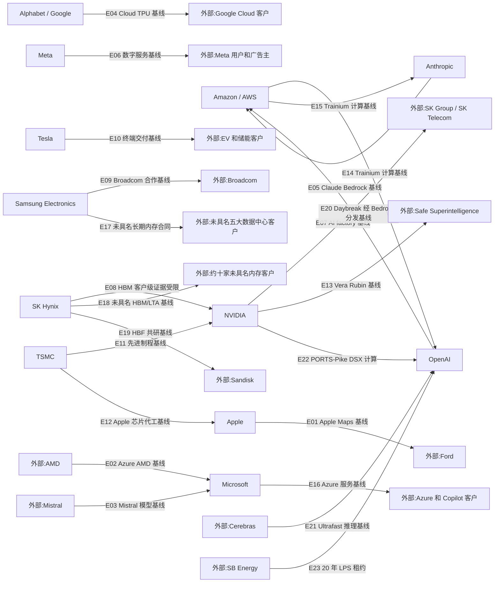

# 周一晨间科技巨头简报
- 覆盖期间：2026-08-17 至 2026-08-23（Asia/Shanghai）
- 生成时间：2026-08-24 10:15（Asia/Shanghai）
- 本期文件：reports/2026-08-24_weekly_morning_brief.md

## 1. 本周最重要的 10 件事
1. **NVIDIA、OpenAI｜PORTS-Pike 锁定约 8 IT-GW AI 基础设施。** NVIDIA 将成为该俄亥俄州园区的独家 AI 计算基础设施提供方，OpenAI 为约 8 IT-GW 客户，NVIDIA 同时向 SB Energy 投资 15 亿美元并为首期 4.25 IT-GW 提供信用支持。**为什么重要：** 交易把模型公司、GPU 全栈、土地电力与 20 年租约绑定到同一长期项目，说明前沿 AI 竞争正从单批芯片采购升级为多吉瓦园区融资与交付能力竞争；但首批容量预计 2028 年起分期上线，仍有建设与许可风险。**来源：** [NVIDIA 官方](https://nvidianews.nvidia.com/news/nvidia-guarantees-sb-energy-s-ports-pike-technology-campus-in-ohio-to-exclusively-host-nvidia-ai-compute)、[OpenAI 官方](https://openai.com/index/openai-joins-ports-pike-project/)
2. **OpenAI｜因 Astra 可能达到“Critical”网络能力门槛而放慢前沿训练。** OpenAI 披露曾暂停最新模型的强化学习训练两周，最大规模前沿 RL 训练仍处于暂停状态，并估计新增监控约消耗被监控推理算力的 20%。**为什么重要：** 这是能力门槛直接改变训练节奏、算力利用率和发布路径的少见官方披露，安全治理已成为模型产能和商业发布时间的现实约束。**来源：** [OpenAI 官方](https://openai.com/index/pacing-model-development-cyber-capabilities/)
3. **Samsung Electronics｜批准 2026 年约 90 万亿至 110 万亿韩元股东回报。** 方案包括约 30 万亿韩元现金分红及约 15 万亿韩元员工补偿用途回购，预计规模为公司此前纪录约五倍。**为什么重要：** 超大规模回报反映 AI 内存周期带来的现金创造能力，也将抬高市场对韩国半导体企业资本纪律和后续分红的预期。**来源：** [Samsung 官方](https://news.samsung.com/global/samsung-electronics-to-implement-largest-ever-shareholder-return-in-2026-estimated-at-krw-90-to-110-trillion)
4. **SK Hynix｜启动 40 万亿韩元股份回购并全部注销。** 公司计划自 8 月 20 日起约三个月内回购约 2,407 万股、约占已发行股份 3.3%，并把 2025-2027 年股东回报目标提高至累计自由现金流的 50% 以上。**为什么重要：** 这是韩国上市公司史上最大规模的库存股注销安排，显示 HBM 景气已从利润增长传导到现金回报。**来源：** [SK Hynix 官方](https://news.skhynix.com/en/share-buyback-and-retirement/)
5. **Apple｜重构欧盟 App 商业条款。** Apple 将欧盟开发者迁移到单一商业条款，自 10 月 1 日起调整 App Store、替代支付和替代分发收费，并以数字交易相关的 Core Technology Commission 取代原 Core Technology Fee。**为什么重要：** 变化直接影响欧盟 App Store 抽成结构、开发者渠道选择和 DMA 合规成本，也是其他地区监管者观察平台经济规则的重要样本。**来源：** [Apple Developer 官方](https://developer.apple.com/news/?id=gmws0jgp)、[Apple 支持说明](https://developer.apple.com/support/apps-in-the-eu/)
6. **Meta｜29 州青少年安全与隐私诉讼的首批联邦审判开庭。** 加州、科罗拉多州、肯塔基州和新泽西州作为首批四州寻求数十亿美元赔偿及平台运营方式变更；Meta 否认相关指控。**为什么重要：** 风险不只在一次性赔偿，法院若要求改变推荐、年龄识别或未成年人数据处理，可能冲击 Instagram 与 Facebook 的互动和广告模型；指控尚待裁判。**来源：** [AP](https://apnews.com/article/2b617764a8ddc4846f74f59d0c4516b8)、[AP 背景](https://apnews.com/article/32e8f19738eb77ab832e0f084dd677af)
7. **Anthropic｜把 Claude Mythos 5 网络安全能力扩大至企业防守场景。** Mythos 5 已进入 Claude Security 企业版公测，Anthropic 同时设立 3,500 万美元 Defender Advantage Fund，并计划扩大 Cyber Verification Program。**为什么重要：** 高能力模型正通过受控输出、身份核验和合作伙伴工具走向商业化，网络安全成为前沿模型能力释放与风险隔离的试验场。**来源：** [Anthropic 官方](https://claude.com/blog/bringing-claude-mythos-5-to-more-defenders)
8. **OpenAI｜ChatGPT Ads 将扩至 31 个欧洲市场。** 广告先覆盖 Free 与 Go 方案，付费方案保持无广告，并加入 OpenAI Pixel、Conversions API、转化优化和第三方测量。**为什么重要：** 这是 ChatGPT 从订阅与 API 之外建立大规模消费端收入的关键扩张，也把广告效果、隐私承诺与回答独立性置于更严格监管环境下。**来源：** [OpenAI 官方](https://openai.com/index/chatgpt-ads-expands-across-europe/)
9. **Anthropic｜Computer Use、Skills API 与 Files API 正式 GA。** 新版本支持多动作 computer use、浏览器结构化操作、技能上传与版本管理，以及每组织 1 TB 文件存储；Skills 和 Files API 同时可通过 Microsoft Foundry 使用。**为什么重要：** Claude 平台从模型调用扩展为可操作软件、复用企业知识并交付文件的生产级代理栈，直接影响企业自动化竞争。**来源：** [Anthropic 官方](https://claude.com/blog/computer-use-skills-api-files-api)
10. **Amazon / AWS｜承诺逾 5 亿美元扩大学生云与 AI 培训。** AWS 通过 Builder Center 推出全球 Student Rewards，为验证学生提供云额度、培训和认证券。**为什么重要：** 该投入强化 AWS 的开发者与人才入口，有利于降低早期使用成本并扩大未来云、AI 工具和认证生态的转化漏斗。**来源：** [Amazon 官方](https://www.aboutamazon.com/news/aws/aws-student-rewards-free-cloud-ai-training)

## 2. 影响力速览
| 公司 | 重大事件数量 | 本周影响判断 | 关键词 |
|---|---:|---|---|
| Apple | 1 | 中高，欧盟平台经济规则重置 | App Store、DMA、替代分发 |
| Microsoft | 0 | 中性，未见独立可确认重大事件 | 官方披露空窗、云基线 |
| Alphabet / Google | 1 | 中，Gemini Enterprise 区域可用性提升 | Gemini 3.6 Flash、GA、数据驻留 |
| Amazon / AWS | 1 | 中，开发者与人才生态长期投入 | 5 亿美元、Builder Center、认证 |
| Meta | 1 | 高负面风险，联邦诉讼或影响产品机制 | 青少年安全、隐私、赔偿 |
| NVIDIA | 1 | 高正面但执行期长，多吉瓦项目锁定 | PORTS-Pike、DSX、15 亿美元 |
| Tesla | 0 | 中性偏审慎，媒体报道缺少公司确认 | Cybercab、待确认、监管触发 |
| OpenAI | 4 | 高，算力扩张与安全约束并行 | 8 IT-GW、Astra、广告、ZDR |
| Anthropic | 2 | 高正面，代理平台与网络安全商业化 | Mythos 5、Computer Use、Skills API |
| Samsung Electronics | 2 | 高，现金回报与 AI 数据中心冷却投资并行 | 90-110 万亿韩元、HVAC、CDU |
| SK Hynix | 2 | 高，HBM 现金回报与系统级互连研发并行 | 40 万亿韩元、CPO、光互连 |
| TSMC | 0 | 中性，未见客户级订单或产能变化披露 | 先进制程、客户拆分、基线 |

## 3. 按公司分组
### Apple
- **日期：** 2026-08-18
- **事件：** Apple 宣布简化欧盟 App 商业条款，统一开发者条款并调整 App Store、替代支付和替代分发费用；新规则自 10 月 1 日起生效。
- **影响：** 欧盟开发者的分发、支付和获客经济性发生变化，平台服务收入与 DMA 合规风险需同步重估。
- **可信度：** 高；Apple 官方披露。具体开发者净成本仍取决于支付方式、分发渠道和适用费率。
- **来源：** [Apple Developer](https://developer.apple.com/news/?id=gmws0jgp)、[支持说明](https://developer.apple.com/support/apps-in-the-eu/)

### Microsoft
- **日期：** 2026-08-17 至 2026-08-23
- **事件：** 未发现可确认重大事件。
- **影响：** 本周无足以改变 Azure、Microsoft 365、AI 基础设施或资本配置判断的独立官方披露；Anthropic API 经 Microsoft Foundry 分发记录在 Anthropic 小节，不重复计为 Microsoft 重大事件。
- **可信度：** 高；按官方新闻与投资者关系页面检索，不能据此推断业务没有日常变化。
- **来源：** [Microsoft 官方博客](https://blogs.microsoft.com/)、[Microsoft 投资者关系](https://www.microsoft.com/en-us/Investor/)

### Alphabet / Google
- **日期：** 2026-08-18
- **事件：** Gemini Enterprise 3.6 Flash 在美国和欧盟多区域正式 GA，美国区域不再需要 allowlist。
- **影响：** 企业客户可在更明确的区域边界内启用模型，降低准入摩擦；但本次发布未披露客户数、价格或新增收入。
- **可信度：** 高；Google Cloud 官方发布说明。
- **来源：** [Gemini Enterprise release notes](https://docs.cloud.google.com/gemini/enterprise/docs/release-notes)

### Amazon / AWS
- **日期：** 2026-08-20
- **事件：** AWS 承诺逾 5 亿美元推出全球 Student Rewards，向验证学生提供最高 579 美元等值的额度、培训和认证资源组合。
- **影响：** 扩大云与 AI 人才入口和开发者黏性，属于长期生态投资，而不是本期云收入或基础设施订单。
- **可信度：** 高；Amazon 官方披露。
- **来源：** [Amazon 官方](https://www.aboutamazon.com/news/aws/aws-student-rewards-free-cloud-ai-training)

### Meta
- **日期：** 2026-08-18
- **事件：** 29 州青少年安全与隐私诉讼的首批四州联邦审判在加州开庭，原告寻求赔偿和平台运营方式变更。
- **影响：** 潜在后果覆盖赔偿、未成年人数据处理、年龄识别和产品设计；对收入影响取决于裁决与补救措施。
- **可信度：** 高（开庭事实）；责任与损害仍属争议，尚未裁判。
- **来源：** [AP](https://apnews.com/article/2b617764a8ddc4846f74f59d0c4516b8)、[AP 背景](https://apnews.com/article/32e8f19738eb77ab832e0f084dd677af)

### NVIDIA
- **日期：** 2026-08-17
- **事件：** NVIDIA 成为 PORTS-Pike 独家 AI 计算基础设施提供方；OpenAI 为约 8 IT-GW 客户，园区将使用 NVIDIA DSX 全栈，NVIDIA 对 SB Energy 投资 15 亿美元。
- **影响：** 增加长期 GPU、CPU、网络和软件需求可见度，也扩大 NVIDIA 对电力、园区融资和项目交付的资本暴露。
- **可信度：** 高；NVIDIA 与 OpenAI 官方材料交叉确认。首期 4.25 IT-GW 为计划容量，其余 3.75 IT-GW 涉及选择权，不等同于已交付算力。
- **来源：** [NVIDIA 官方](https://nvidianews.nvidia.com/news/nvidia-guarantees-sb-energy-s-ports-pike-technology-campus-in-ohio-to-exclusively-host-nvidia-ai-compute)、[OpenAI 官方](https://openai.com/index/openai-joins-ports-pike-project/)

### Tesla
- **日期：** 2026-08-17 至 2026-08-23
- **事件：** 未发现可确认重大事件。有关 Cybercab 可能在奥斯汀启动员工乘坐并随后公开运营的媒体报道缺少 Tesla 公司确认，本期标为“媒体报道待确认”，不计入重大事件数量，也不形成供应边。
- **影响：** 只有公司公告、公开载客记录或监管许可更新，才能改变 Cybercab 商业化进度判断。
- **可信度：** 对“无官方确认”的判断为高；对媒体所述时间表不作事实确认。
- **来源：** [Tesla 投资者关系](https://ir.tesla.com/)

### OpenAI
- **日期：** 2026-08-17
- **事件：** OpenAI 签署协议，在 PORTS-Pike 获取约 8 IT-GW 计算容量，与 SB Energy、NVIDIA 及美国能源部合作。
- **影响：** 扩大长期训练与推理供给，但首批预计 2028 年起上线，资本、建设、电力和执行条件仍是核心风险。
- **可信度：** 高；OpenAI 与 NVIDIA 官方材料交叉确认。
- **来源：** [OpenAI 官方](https://openai.com/index/openai-joins-ports-pike-project/)、[NVIDIA 官方](https://nvidianews.nvidia.com/news/nvidia-guarantees-sb-energy-s-ports-pike-technology-campus-in-ohio-to-exclusively-host-nvidia-ai-compute)

- **日期：** 2026-08-18
- **事件：** OpenAI 披露 Astra 可能达到 Preparedness Framework 的 Critical 网络能力门槛，最大前沿 RL 训练仍暂停，部分推理与工具工作负载迁移到更严格环境。
- **影响：** 安全门槛正在改变训练利用率、研究成本和发布节奏；约 20% 的监控算力开销也是推理经济性的新增变量。
- **可信度：** 高；OpenAI 官方披露，但 Astra 尚未对外发布，最终能力与发布时间未知。
- **来源：** [OpenAI 官方](https://openai.com/index/pacing-model-development-cyber-capabilities/)

- **日期：** 2026-08-18
- **事件：** ChatGPT Ads 宣布将于下一周扩至 31 个欧洲市场，覆盖 Free 和 Go 用户，付费方案保持无广告。
- **影响：** 扩大消费端变现覆盖，并把隐私、广告标识、测量归因和回答独立性带入更严格监管环境。
- **可信度：** 高；OpenAI 官方披露。实际收入、广告负载和用户反应尚未公布。
- **来源：** [OpenAI 官方](https://openai.com/index/chatgpt-ads-expands-across-europe/)

- **日期：** 2026-08-19
- **事件：** OpenAI 重申面向合资格 API 客户的 Zero Data Retention，并预览 Private Safety Processing，以在不向员工暴露底层内容的情况下识别跨交互风险。
- **影响：** 试图缓解金融、医疗等敏感行业在数据控制与代理安全之间的矛盾，有助于企业采用，但系统仍处早期客户测试阶段。
- **可信度：** 高；OpenAI 官方披露。技术白皮书和推广计划预计 9 月发布。
- **来源：** [OpenAI 官方](https://openai.com/index/offering-zero-data-retention-for-frontier-models/)

### Anthropic
- **日期：** 2026-08-20
- **事件：** Computer Use、Skills API 和 Files API 正式 GA，并新增 browser use、多动作执行、1 TB/组织文件存储及 Microsoft Foundry 分发。
- **影响：** Claude Platform 的价值从模型访问延伸到端到端代理工作流，增强医疗、保险和文档自动化场景竞争力。
- **可信度：** 高；Anthropic 官方披露。Vertex AI 的更新版 computer/browser use 仍为“即将推出”。
- **来源：** [Anthropic 官方](https://claude.com/blog/computer-use-skills-api-files-api)

- **日期：** 2026-08-21
- **事件：** Claude Mythos 5 进入 Claude Security 企业版公测，Anthropic 设立 3,500 万美元开源安全额度基金，并扩展受控网络安全访问计划。
- **影响：** 网络安全成为前沿能力商业化的重要入口，但 Mythos 的直接访问仍受严格限制，不能等同于全面 API 开放。
- **可信度：** 高；Anthropic 官方披露。
- **来源：** [Anthropic 官方](https://claude.com/blog/bringing-claude-mythos-5-to-more-defenders)

### Samsung Electronics
- **日期：** 2026-08-19
- **事件：** Samsung 将投资约 2,400 亿韩元，在韩国光州建设 FläktGroup HVAC 生产线，计划 2028 年投产，涵盖 AI 数据中心冷却产品。
- **影响：** 把并购获得的 HVAC 能力转化为韩国本地制造产能，扩展 AI 数据中心价值链至 CDU 与热管理；尚未披露具名客户订单。
- **可信度：** 高；Samsung 官方披露。
- **来源：** [Samsung 官方](https://news.samsung.com/global/samsung-electronics-to-establish-hvac-production-line-in-korea)

- **日期：** 2026-08-21
- **事件：** 董事会批准 2026 年约 90 万亿至 110 万亿韩元股东回报，预计三年累计回报达到 120 万亿至 140 万亿韩元。
- **影响：** 强化 AI 内存周期下的现金回报预期；最终剩余规模仍取决于 2026 年业绩和 2027 年 1 月董事会决定。
- **可信度：** 高；Samsung 官方披露。
- **来源：** [Samsung 官方](https://news.samsung.com/global/samsung-electronics-to-implement-largest-ever-shareholder-return-in-2026-estimated-at-krw-90-to-110-trillion)

### SK Hynix
- **日期：** 2026-08-19
- **事件：** 董事会批准 40 万亿韩元股份回购并全部注销，同时把三年股东回报目标提高至累计自由现金流的 50% 以上。
- **影响：** HBM 业务现金流开始形成超大规模股东回报，也提高市场对后续特别分红和资本支出的比较要求。
- **可信度：** 高；SK Hynix 官方披露，回购执行仍受市场条件和法定程序影响。
- **来源：** [SK Hynix 官方](https://news.skhynix.com/en/share-buyback-and-retirement/)

- **日期：** 2026-08-20
- **事件：** SK Hynix 与全球研究人员在 Nature Electronics 发布共封装光学 CPO 路线图，提出内存、先进封装与光学互连协同演进路径。
- **影响：** 研发重点从单颗 HBM 性能扩展到机架与 pod 级带宽墙，长期可能影响光互连、封装和内存池架构；这不是量产或客户订单公告。
- **可信度：** 高（论文与路线图发布）；商业化时间、客户和投资规模未披露。
- **来源：** [SK Hynix 官方](https://news.skhynix.com/en/cpo-in-nature-electronics/)

### TSMC
- **日期：** 2026-08-17 至 2026-08-23
- **事件：** 未发现可确认重大事件。
- **影响：** 本周未见足以确认先进制程、CoWoS 产能或 Apple/NVIDIA 客户分配变化的官方披露；不能由行业需求报道推导客户级订单变化。
- **可信度：** 高；按官方新闻与投资者关系页面检索，日常生产和客户沟通不在公开信息范围内。
- **来源：** [TSMC 新闻中心](https://pr.tsmc.com/english/latest-news)、[TSMC 投资者关系](https://investor.tsmc.com/english/)

## 4. 跨公司与产业链观察
1. **AI 算力合同从芯片采购升级为园区级资本结构。** PORTS-Pike 同时出现模型客户、独家计算栈、土地电力壳体、20 年租约、股权投资和信用支持，竞争优势开始取决于融资、并网与建设执行，而不只是 GPU 性能。
2. **网络安全既是前沿模型的发布闸门，也是新的商业入口。** OpenAI 因潜在 Critical 能力放慢训练，Anthropic 则通过受控工具、核验计划和安全产品释放 Mythos 5 能力，两个事件共同显示“能力越强、访问越分层”。
3. **韩国半导体现金回报显著上台阶，但资本开支方向继续外扩。** Samsung 与 SK Hynix 的超大回购/分红安排反映 AI 内存现金流，同时 HVAC、CPO 等投入把竞争范围延伸至冷却和系统互连。
4. **平台监管从罚款风险转向商业模型和产品机制。** Apple 直接调整欧盟收费与分发规则，Meta 面临可能要求改变青少年产品设计的联邦审判，监管结果可能影响收入质量而非只有一次性成本。
5. **AI 变现路径继续分化。** OpenAI 扩大广告，Anthropic 强化代理 API 与企业安全，AWS 投入人才入口；流量、工具调用和开发者生态正形成不同的获客与收入模型。

## 5. 下周需关注
1. **NVIDIA FY2027 Q2 财报（8 月 26 日）：** 触发条件为数据中心收入、毛利率、Blackwell/后续平台供给、出口限制或具名客户需求出现超预期变化；仅有分析师预估不改变供应边。[官方日程](https://investor.nvidia.com/events-and-presentations/events-and-presentations/default.aspx)
2. **Samsung Galaxy Event（8 月 27 日）：** 触发条件为新品正式规格、价格、上市区域或关键供应链信息披露；邀请函本身不计为本周重大产品发布。[Samsung 邀请函](https://news.samsung.com/global/invitation-galaxy-event-august-2026)
3. **ChatGPT Ads 欧洲上线：** 触发条件为 31 个市场按计划开放、广告负载或测量产品落地，及监管机构对隐私和广告标识提出正式要求。[OpenAI 公告](https://openai.com/index/chatgpt-ads-expands-across-europe/)
4. **Tesla Cybercab 时间表：** 触发条件为 Tesla 官方公告、真实公开载客、车辆安全许可或地方运营许可；媒体转述和员工内部测试不单独视为商业化完成。[Tesla 投资者关系](https://ir.tesla.com/)
5. **PORTS-Pike 执行节点：** 触发条件为融资交割、许可、并网、承包商、设备交付或首期容量时间表的正式更新；远期总容量不等同于已投产算力。[NVIDIA 官方](https://nvidianews.nvidia.com/news/nvidia-guarantees-sb-energy-s-ports-pike-technology-campus-in-ohio-to-exclusively-host-nvidia-ai-compute)

## 6. 十二家公司供应关系图谱与周度变化
### 6.0 年度主营产品上下游图片

图片采用 Obsidian 图谱视图风格，基于 `state/product_relationships_2026.json` 和本年度可取得的公司年报、投资者关系页面、监管披露与官方新闻稿生成。本期新增 NVIDIA -> OpenAI 的 PORTS-Pike 官方关系；证据不足的关系继续标注为“官方基线_加市场共识_待直接证据”或“市场共识_待直接证据”，不写成 confirmed。

### 6.1 本周供应关系可视化

### 6.2 供应关系明细表
| Edge ID | 供应方 | 客户/使用方 | 具体产品/服务 | 关系类型 | 本周证据 | 长期基线证据/限制 | 本周状态 | 来源链接 |
|---|---|---|---|---|---|---|---|---|
| E01 | Apple | Ford | Apple Maps EV routing and in-vehicle navigation for Ford Universal EV Platform | 车载软件服务 | 无本周直接证据 | 7 月 Apple 官方确认；属于软件服务，不是硬件供货 | 基线/无本周新增证据 | [来源1](https://www.apple.com/newsroom/2026/07/apple-maps-to-power-navigation-experience-for-ford-uev-platform/) |
| E02 | AMD | Microsoft | AMD Helios、ND MI455X v7 与 EPYC 用于 Azure AI/HPC | AI/HPC 基础设施供应 | 无本周订单或部署更新 | 7 月 Microsoft 官方确认；金额、站点与交付节奏未披露 | 基线/无本周新增证据 | [来源1](https://news.microsoft.com/source/2026/07/20/microsoft-expands-azure-ai-and-hpc-infrastructure-with-amd/) |
| E03 | Mistral | Microsoft | 面向企业与受监管行业的前沿 AI 模型服务 | 模型平台合作 | 无本周直接证据 | 7 月 Microsoft 官方确认；不代表排他合作 | 基线/无本周新增证据 | [来源1](https://news.microsoft.com/source/2026/07/21/microsoft-and-mistral-expand-strategic-partnership-to-give-enterprises-and-regulated-industries-frontier-ai-they-can-control/) |
| E04 | Alphabet / Google | Google Cloud customers | Google Cloud AI、TPU pod 与云基础设施 | 云与 AI 基础设施服务 | Gemini Enterprise GA 不构成客户订单 | Q2 财报确认云与 TPU 需求；不是单一客户订单 | 基线/无本周新增证据 | [来源1](https://abc.xyz/assets/5d/f4/15f364a84a6c9b70a59f9f38d3a1/2026q2-alphabet-earnings-release.pdf) |
| E05 | Anthropic | Amazon / AWS | Claude Opus 5 在 Amazon Bedrock 上提供 | 第三方模型托管 | 无本周 Bedrock 托管变化 | 既有分发关系；非独家供应 | 基线/无本周新增证据 | [来源1](https://ir.aboutamazon.com/news-release/news-release-details/2026/Amazon-com-Announces-Second-Quarter-Results/default.aspx) |
| E06 | Meta | Meta users and advertisers | Facebook、Instagram、WhatsApp、Threads 与广告系统 | 数字服务 | 诉讼不构成新增供应关系 | Q2 财报建立用户与广告主需求基线 | 基线/监管风险上升但关系未变 | [来源1](https://investor.atmeta.com/investor-news/press-release-details/2026/Meta-Reports-Second-Quarter-2026-Results/) |
| E07 | NVIDIA | SK Group / SK Telecom | NVIDIA AI 基础设施用于 AI factory | AI 计算平台供应 | 无本周订单或部署数据 | 7 月 NVIDIA 官方确认；金额与交付节奏未披露 | 基线/无本周新增证据 | [来源1](https://nvidianews.nvidia.com/news/sk-group-and-nvidia-expand-strategic-partnership-across-ai-factories-and-next-generation-memory) |
| E08 | SK Hynix | NVIDIA | HBM 与下一代 AI 内存生态 | 内存供应生态 | 无本周 NVIDIA 客户级订单证据 | 既有合作基线；不能把 CPO 路线图归为新 HBM 订单 | 基线/无本周新增证据 | [来源1](https://nvidianews.nvidia.com/news/sk-group-and-nvidia-expand-strategic-partnership-across-ai-factories-and-next-generation-memory)、[来源2](https://news.skhynix.com/en/q2-2026-business-results/) |
| E09 | Samsung Electronics | Broadcom | HBM、2nm 及以下代工与 2.3D/2.5D 先进封装 | 内存、代工与封装 | 无本周合同更新 | 7 月 Samsung 官方确认；节点、出货与收入确认待披露 | 基线/无本周新增证据 | [来源1](https://news.samsung.com/global/samsung-electronics-and-broadcom-expand-strategic-collaboration-across-memory-and-foundry-technologies) |
| E10 | Tesla | EV and energy storage customers | 电动车、储能系统与能源服务 | 终端产品交付 | 无本周直接证据 | Q2 财报建立业务基线；Cybercab 媒体报道未形成新边 | 基线/无本周新增证据 | [来源1](https://ir.tesla.com/press-release/tesla-releases-second-quarter-2026-financial-results) |
| E11 | TSMC | NVIDIA | AI GPU 的先进制程代工与先进封装 | 晶圆代工 | 无客户级披露 | 长期关键关系；本周未确认订单、价格或产能变化 | 基线/无本周新增证据 | [来源1](https://investor.tsmc.com/english/annual-reports) |
| E12 | TSMC | Apple | Apple A/M 系列芯片先进制程代工 | 晶圆代工 | 无客户级披露 | 长期关键关系；本周未确认订单、价格或产能变化 | 基线/无本周新增证据 | [来源1](https://investor.tsmc.com/english/annual-reports)、[来源2](https://investor.apple.com/sec-filings/default.aspx) |
| E13 | NVIDIA | Safe Superintelligence | Vera Rubin 系统、长期算力访问与平台共研 | AI 算力与投资合作 | 无本周部署更新 | 7 月双方官方确认；投资金额与系统数量未披露 | 基线/无本周新增证据 | [来源1](https://nvidianews.nvidia.com/news/ilya-sutskevers-safe-superintelligence-inc-and-nvidia-announce-long-term-strategic-partnership) |
| E14 | Amazon / AWS | OpenAI | 基于 Trainium 的多年、多吉瓦 AI 算力承诺 | 自研 AI 芯片与云基础设施 | 无本周容量或交付更新 | PORTS-Pike 为独立新边，不代表 AWS 算力关系弱化 | 基线/无本周新增证据 | [来源1](https://ir.aboutamazon.com/news-release/news-release-details/2026/Amazon-com-Announces-Second-Quarter-Results/default.aspx) |
| E15 | Amazon / AWS | Anthropic | 基于 Trainium 的多年、多吉瓦 AI 算力承诺 | 自研 AI 芯片与云基础设施 | Anthropic API GA 不改变底层算力边 | 长期 Trainium 计算基线；执行节奏未披露 | 基线/无本周新增证据 | [来源1](https://ir.aboutamazon.com/news-release/news-release-details/2026/Amazon-com-Announces-Second-Quarter-Results/default.aspx) |
| E16 | Microsoft | Azure and Copilot customers | Azure 云与 AI 服务及 Microsoft 365 Copilot | 云与 AI 服务 | 无本周新增需求指标 | FY2026 Q4 财报建立增长基线；不是单一订单 | 基线/无本周新增证据 | [来源1](https://www.microsoft.com/en-us/Investor/earnings/FY-2026-Q4/press-release-webcast) |
| E17 | Samsung Electronics | Five unnamed global data-center customers | 长期服务器内存与 AI 基础设施芯片供应合同 | 长期内存供应 | 无客户身份或合同更新 | 客户、金额、期限和产品组合未公开 | 基线/客户仍未具名 | [来源1](https://images.samsung.com/is/content/samsung/assets/global/ir/docs/2026_2Q_conference_eng.pdf)、[来源2](https://apnews.com/article/samsung-ai-profit-memory-chips-10c2c548a392988862d8c7bd3f6fae05) |
| E18 | SK Hynix | Around ten unnamed key memory customers | HBM4、AI server DRAM、eSSD 与长期供应协议 | HBM 与内存长期供应 | 无客户身份或分配量更新 | 约十家客户 LTA 基线；价格和期限未披露 | 基线/客户仍未具名 | [来源1](https://news.skhynix.com/en/q2-2026-business-results/) |
| E19 | SK Hynix | Sandisk | 面向 AI 推理内存层级的首个开放 HBF 标准规范 | 内存标准共研 | CPO 路线图与 HBF 为不同技术线 | 首版 HBF 规范已进入长期共研基线；不是采购订单 | 基线/无本周新增证据 | [来源1](https://news.skhynix.com/en/hbf-at-fms-2026/)、[来源2](https://news.skhynix.com/sk-hynix-and-sandisk-begin-global-standardization-ofnext-generation-memory-hbf/) |
| E20 | OpenAI | Amazon / AWS | Daybreak Blue 与 Red 通过 Amazon Bedrock 提供 | 第三方模型托管与分发 | 无本周客户、区域或收入更新 | 8 月 11 日建立的模型分发边；需经资格审批 | 基线/上周新增后无本周变化 | [来源1](https://openai.com/index/daybreak-models-are-now-available-on-aws/) |
| E21 | Cerebras | OpenAI | GPT-5.6 Sol Ultrafast 推理最高 750 输出 token/秒 | 低延迟推理基础设施 | 无本周容量、价格或 GA 更新 | 仍为初始客户限量预览 | 基线/上周新增后无本周变化 | [来源1](https://openai.com/index/previewing-ultrafast/)、[来源2](https://openai.com/index/cerebras-partnership/) |
| E22 | NVIDIA | OpenAI | PORTS-Pike 约 8 IT-GW 的 NVIDIA DSX 全栈 AI 计算 | AI 计算基础设施供应 | 8 月 17 日双方确认 OpenAI 客户角色及 DSX 平台 | 首期 4.25 IT-GW 预计 2028 年起分期部署；其余容量涉及选择权 | 新增/官方确认、分期交付 | [来源1](https://nvidianews.nvidia.com/news/nvidia-guarantees-sb-energy-s-ports-pike-technology-campus-in-ohio-to-exclusively-host-nvidia-ai-compute)、[来源2](https://openai.com/index/openai-joins-ports-pike-project/) |
| E23 | SB Energy | OpenAI | 约 8 IT-GW 土地、电力和机房壳体，20 年租约 | 数据中心 LPS 长期租赁 | 8 月 17 日官方确认 SB Energy 建设、持有和运营 | 属远期容量承诺；融资、许可、并网和建设仍是执行条件 | 新增/官方确认、长期租赁 | [来源1](https://nvidianews.nvidia.com/news/nvidia-guarantees-sb-energy-s-ports-pike-technology-campus-in-ohio-to-exclusively-host-nvidia-ai-compute)、[来源2](https://openai.com/index/openai-joins-ports-pike-project/) |

### 6.3 与上周的区别
- **新增：**
  - E22 NVIDIA -> OpenAI：建立 PORTS-Pike 约 8 IT-GW 的 DSX 全栈计算关系；首期 4.25 IT-GW 预计 2028 年起分期可用，其余 3.75 IT-GW 涉及选择权。
  - E23 SB Energy -> OpenAI：建立土地、电力与机房壳体的 20 年租赁关系；容量尚未交付，需继续追踪融资、许可、并网和建设。

- **强化：**
  - 无既有边获得足以单独标记“强化”的客户级订单、容量、价格或交付证据。E22/E23 是 PORTS-Pike 新边，不合并到 E14 AWS -> OpenAI 或 E21 Cerebras -> OpenAI。

- **弱化/风险：**
  - 未发现既有关系被取消、砍单或转单的直接证据。Meta 诉讼提高 E06 的产品与监管风险，但不代表用户或广告主关系本周已弱化。
  - E22/E23 的总容量为远期项目安排；建设、许可、电力、融资与分期交付可能改变时间表，不能把 8 IT-GW 视为现有投入运行容量。

- **无明显变化但关键关系：**
  - E01-E19 延续上一期基线，本周没有新的客户级订单、部署、价格或产能分配证据。
  - E20、E21 上周新增后进入基线，本周未见客户数量、收入、容量、价格或一般可用时间更新。

## 7. 本期自检
- 日期范围：已限定为 2026-08-17 至 2026-08-23，符合 2026-08-24 周一对应的上一完整自然周和 Asia/Shanghai 口径。
- 历史基线：已读取 `reports/latest.md` 与 `state/supply_graph_baseline.json`，历史基线存在，无需联网重建上一期。
- 12 家公司覆盖：全部覆盖；没有可靠重大新增的公司明确写明“未发现可确认重大事件”。
- 第 1 节：恰好 10 件重大事件，按重要性排序。
- 事件来源：每条事件至少包含一个官方来源或权威媒体来源；争议事项明确区分开庭事实、当事方主张和未确认报道。
- 两张 Obsidian 风格 SVG：均已由单入口质量闸门生成并通过文件引用校验。
- Mermaid/Table/JSON Edge ID：E01-E23 集合一致，已通过自动校验。
- 来源真实性审查：已完成严格审查；URL 可达性、来源域名分级和核心供应关系事实匹配结果详见 `logs/2026-08-24_source_audit.json`。
- 质量闸门：`python3 scripts/run_quality_gate.py` 通过，包含两图生成、严格来源审查、主校验和 `git diff --check`。
- GitHub 同步状态：由提交记录确认。
