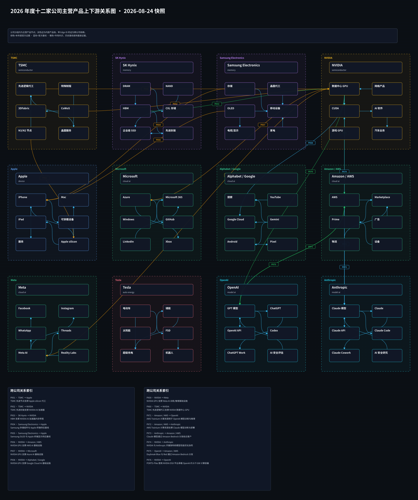
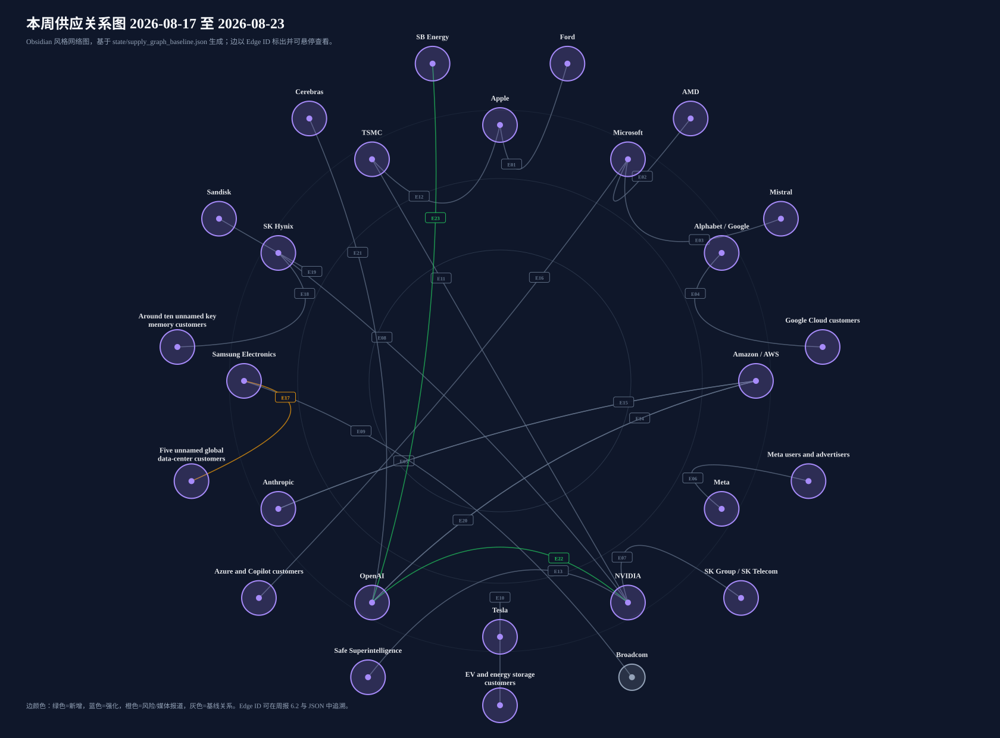

# 周一晨间科技巨头简报
<!-- weekly-brief-schema: 2 -->
- 覆盖期间：2026-08-17 至 2026-08-23（Asia/Shanghai）
- 生成时间：2026-08-24 10:15（Asia/Shanghai）
- 本期文件：reports/2026-08-24_weekly_morning_brief.md

## 1. 本周最重要的 10 件事
1. **NVIDIA、OpenAI｜PORTS-Pike 锁定约 8 IT-GW AI 基础设施。** NVIDIA 将成为该俄亥俄州园区的独家 AI 计算基础设施提供方，OpenAI 为约 8 IT-GW 客户，NVIDIA 同时向 SB Energy 投资 15 亿美元并为首期 4.25 IT-GW 提供信用支持。重要性：交易把模型公司、GPU 全栈、土地电力与 20 年租约绑定到同一长期项目，说明前沿 AI 竞争正从单批芯片采购升级为多吉瓦园区融资与交付能力竞争；但首批容量预计 2028 年起分期上线，仍有建设与许可风险。来源：[NVIDIA 官方](https://nvidianews.nvidia.com/news/nvidia-guarantees-sb-energy-s-ports-pike-technology-campus-in-ohio-to-exclusively-host-nvidia-ai-compute)、[OpenAI 官方](https://openai.com/index/openai-joins-ports-pike-project/)
2. **OpenAI｜因 Astra 可能达到“Critical”网络能力门槛而放慢前沿训练。** OpenAI 披露曾暂停最新模型的强化学习训练两周，最大规模前沿 RL 训练仍处于暂停状态，并估计新增监控约消耗被监控推理算力的 20%。重要性：这是能力门槛直接改变训练节奏、算力利用率和发布路径的少见官方披露，安全治理已成为模型产能和商业发布时间的现实约束。来源：[OpenAI 官方](https://openai.com/index/pacing-model-development-cyber-capabilities/)
3. **Samsung Electronics｜批准 2026 年约 90 万亿至 110 万亿韩元股东回报。** 方案包括约 30 万亿韩元现金分红及约 15 万亿韩元员工补偿用途回购，预计规模为公司此前纪录约五倍。重要性：超大规模回报反映 AI 内存周期带来的现金创造能力，也将抬高市场对韩国半导体企业资本纪律和后续分红的预期。来源：[Samsung 官方](https://news.samsung.com/global/samsung-electronics-to-implement-largest-ever-shareholder-return-in-2026-estimated-at-krw-90-to-110-trillion)
4. **SK Hynix｜启动 40 万亿韩元股份回购并全部注销。** 公司计划自 8 月 20 日起约三个月内回购约 2,407 万股、约占已发行股份 3.3%，并把 2025-2027 年股东回报目标提高至累计自由现金流的 50% 以上。重要性：这是韩国上市公司史上最大规模的库存股注销安排，显示 HBM 景气已从利润增长传导到现金回报。来源：[SK Hynix 官方](https://news.skhynix.com/en/share-buyback-and-retirement/)
5. **Apple｜重构欧盟 App 商业条款。** Apple 将欧盟开发者迁移到单一商业条款，自 10 月 1 日起调整 App Store、替代支付和替代分发收费，并以数字交易相关的 Core Technology Commission 取代原 Core Technology Fee。重要性：变化直接影响欧盟 App Store 抽成结构、开发者渠道选择和 DMA 合规成本，也是其他地区监管者观察平台经济规则的重要样本。来源：[Apple Developer 官方](https://developer.apple.com/news/?id=gmws0jgp)、[Apple 支持说明](https://developer.apple.com/support/apps-in-the-eu/)
6. **Meta｜29 州青少年安全与隐私诉讼的首批联邦审判开庭。** 加州、科罗拉多州、肯塔基州和新泽西州作为首批四州寻求数十亿美元赔偿及平台运营方式变更；Meta 否认相关指控。重要性：风险不只在一次性赔偿，法院若要求改变推荐、年龄识别或未成年人数据处理，可能冲击 Instagram 与 Facebook 的互动和广告模型；指控尚待裁判。来源：[AP](https://apnews.com/article/2b617764a8ddc4846f74f59d0c4516b8)、[AP 背景](https://apnews.com/article/32e8f19738eb77ab832e0f084dd677af)
7. **Anthropic｜把 Claude Mythos 5 网络安全能力扩大至企业防守场景。** Mythos 5 已进入 Claude Security 企业版公测，Anthropic 同时设立 3,500 万美元 Defender Advantage Fund，并计划扩大 Cyber Verification Program。重要性：高能力模型正通过受控输出、身份核验和合作伙伴工具走向商业化，网络安全成为前沿模型能力释放与风险隔离的试验场。来源：[Anthropic 官方](https://claude.com/blog/bringing-claude-mythos-5-to-more-defenders)
8. **OpenAI｜ChatGPT Ads 将扩至 31 个欧洲市场。** 广告先覆盖 Free 与 Go 方案，付费方案保持无广告，并加入 OpenAI Pixel、Conversions API、转化优化和第三方测量。重要性：这是 ChatGPT 从订阅与 API 之外建立大规模消费端收入的关键扩张，也把广告效果、隐私承诺与回答独立性置于更严格监管环境下。来源：[OpenAI 官方](https://openai.com/index/chatgpt-ads-expands-across-europe/)
9. **Anthropic｜Computer Use、Skills API 与 Files API 正式 GA。** 新版本支持多动作 computer use、浏览器结构化操作、技能上传与版本管理，以及每组织 1 TB 文件存储；Skills 和 Files API 同时可通过 Microsoft Foundry 使用。重要性：Claude 平台从模型调用扩展为可操作软件、复用企业知识并交付文件的生产级代理栈，直接影响企业自动化竞争。来源：[Anthropic 官方](https://claude.com/blog/computer-use-skills-api-files-api)
10. **Amazon / AWS｜承诺逾 5 亿美元扩大学生云与 AI 培训。** AWS 通过 Builder Center 推出全球 Student Rewards，为验证学生提供云额度、培训和认证券。重要性：该投入强化 AWS 的开发者与人才入口，有利于降低早期使用成本并扩大未来云、AI 工具和认证生态的转化漏斗。来源：[Amazon 官方](https://www.aboutamazon.com/news/aws/aws-student-rewards-free-cloud-ai-training)

## 2. 投资判断速览
| 公司 | 本周变化 | 影响指标 | 预期差 | 判断 | 验证条件 |
|---|---|---|---|---|---|
| Apple | Apple 宣布简化欧盟 App 商业条款，统一开发者条款并调整 App Store、替代支付和替代分发费用；新规则自 10 月 1 日起生效 | 合规成本、产品可用性与收入风险 | 新增量化基线，需与后续指引及一致预期比较 | 混合 | 跟踪法院文件、监管决定及公司风险披露 |
| Microsoft | 未发现可确认重大事件 | 沿用上期关键经营指标 | 无新增预期差 | 无重大变化 | 等待 Microsoft 官方公告或下次财报 |
| Alphabet / Google | Gemini Enterprise 3.6 Flash 在美国和欧盟多区域正式 GA，美国区域不再需要 allowlist | 活跃用户、API 调用量、付费转化与推理成本 | 新增量化基线，需与后续指引及一致预期比较 | 混合 | 跟踪 ASP、销量、毛利率与成本向客户传导情况 |
| Amazon / AWS | AWS 承诺逾 5 亿美元推出全球 Student Rewards，向验证学生提供最高 579 美元等值的额度、培训和认证资源组合 | 开发者新增、活跃使用、云消耗与付费转化 | 新增量化基线，需与后续指引及一致预期比较 | 混合 | 跟踪验证用户数、活跃使用、云额度消耗与付费转化 |
| Meta | 29 州青少年安全与隐私诉讼的首批四州联邦审判在加州开庭，原告寻求赔偿和平台运营方式变更 | 合规成本、产品可用性与收入风险 | 方向偏负面；市场定价程度需结合后续指引验证 | 负面 | 跟踪法院文件、监管决定及公司风险披露 |
| NVIDIA | NVIDIA 成为 PORTS-Pike 独家 AI 计算基础设施提供方；OpenAI 为约 8 IT-GW 客户，园区将使用 NVIDIA DSX… | 资本开支、算力上线量与利用率 | 新增量化基线，需与后续指引及一致预期比较 | 正面 | 跟踪资本开支执行、产能上线、具名客户与订单披露 |
| Tesla | 未发现可确认重大事件 | 沿用上期关键经营指标 | 无新增预期差 | 无重大变化 | 等待 Tesla 官方公告或下次财报 |
| OpenAI | OpenAI 签署协议，在 PORTS-Pike 获取约 8 IT-GW 计算容量，与 SB Energy、NVIDIA 及美国能源部合作 | 资本开支、算力上线量与利用率 | 新增量化基线，需与后续指引及一致预期比较 | 混合 | 跟踪资本开支执行、产能上线、具名客户与订单披露 |
| Anthropic | Computer Use、Skills API 和 Files API 正式 GA，并新增 browser use、多动作执行、1 TB/组织文件存… | 活跃用户、API 调用量、付费转化与推理成本 | 新增量化基线，需与后续指引及一致预期比较 | 正面 | 跟踪正式可用范围、定价、活跃使用、付费转化及第三方基准 |
| Samsung Electronics | Samsung 将投资约 2,400 亿韩元，在韩国光州建设 FläktGroup HVAC 生产线，计划 2028 年投产，涵盖 AI 数据中心冷… | 资本开支、算力上线量与利用率 | 新增量化基线，需与后续指引及一致预期比较 | 混合 | 跟踪资本开支执行、产能上线、具名客户与订单披露 |
| SK Hynix | 董事会批准 40 万亿韩元股份回购并全部注销，同时把三年股东回报目标提高至累计自由现金流的 50% 以上 | 自由现金流、回购执行、每股指标与股东回报率 | 新增量化基线，需与后续指引及一致预期比较 | 混合 | 跟踪回购完成量、注销进度、自由现金流与后续分红 |
| TSMC | 未发现可确认重大事件 | 沿用上期关键经营指标 | 无新增预期差 | 无重大变化 | 等待 TSMC 官方公告或下次财报 |

## 3. 发生变化的公司

### 3.1 Apple
- 日期：2026-08-18
- 事件：Apple 宣布简化欧盟 App 商业条款，统一开发者条款并调整 App Store、替代支付和替代分发费用；新规则自 10 月 1 日起生效。
- 投资影响：欧盟开发者的分发、支付和获客经济性发生变化，平台服务收入与 DMA 合规风险需同步重估。
- 影响指标：合规成本、产品可用性与收入风险
- 预期差：新增量化基线，需与后续指引及一致预期比较
- 验证条件：跟踪法院文件、监管决定及公司风险披露
- 可信度：高；Apple 官方披露。具体开发者净成本仍取决于支付方式、分发渠道和适用费率。
- 来源：[Apple Developer](https://developer.apple.com/news/?id=gmws0jgp)、[支持说明](https://developer.apple.com/support/apps-in-the-eu/)

### 3.2 Alphabet / Google
- 日期：2026-08-18
- 事件：Gemini Enterprise 3.6 Flash 在美国和欧盟多区域正式 GA，美国区域不再需要 allowlist。
- 投资影响：企业客户可在更明确的区域边界内启用模型，降低准入摩擦；但本次发布未披露客户数、价格或新增收入。
- 影响指标：活跃用户、API 调用量、付费转化与推理成本
- 预期差：新增量化基线，需与后续指引及一致预期比较
- 验证条件：跟踪 ASP、销量、毛利率与成本向客户传导情况
- 可信度：高；Google Cloud 官方发布说明。
- 来源：[Gemini Enterprise release notes](https://docs.cloud.google.com/gemini/enterprise/docs/release-notes)

### 3.3 Amazon / AWS
- 日期：2026-08-20
- 事件：AWS 承诺逾 5 亿美元推出全球 Student Rewards，向验证学生提供最高 579 美元等值的额度、培训和认证资源组合。
- 投资影响：扩大云与 AI 人才入口和开发者黏性，属于长期生态投资，而不是本期云收入或基础设施订单。
- 影响指标：开发者新增、活跃使用、云消耗与付费转化
- 预期差：新增量化基线，需与后续指引及一致预期比较
- 验证条件：跟踪验证用户数、活跃使用、云额度消耗与付费转化
- 可信度：高；Amazon 官方披露。
- 来源：[Amazon 官方](https://www.aboutamazon.com/news/aws/aws-student-rewards-free-cloud-ai-training)

### 3.4 Meta
- 日期：2026-08-18
- 事件：29 州青少年安全与隐私诉讼的首批四州联邦审判在加州开庭，原告寻求赔偿和平台运营方式变更。
- 投资影响：潜在后果覆盖赔偿、未成年人数据处理、年龄识别和产品设计；对收入影响取决于裁决与补救措施。
- 影响指标：合规成本、产品可用性与收入风险
- 预期差：方向偏负面；市场定价程度需结合后续指引验证
- 验证条件：跟踪法院文件、监管决定及公司风险披露
- 可信度：高（开庭事实）；责任与损害仍属争议，尚未裁判。
- 来源：[AP](https://apnews.com/article/2b617764a8ddc4846f74f59d0c4516b8)、[AP 背景](https://apnews.com/article/32e8f19738eb77ab832e0f084dd677af)

### 3.5 NVIDIA
- 日期：2026-08-17
- 事件：NVIDIA 成为 PORTS-Pike 独家 AI 计算基础设施提供方；OpenAI 为约 8 IT-GW 客户，园区将使用 NVIDIA DSX 全栈，NVIDIA 对 SB Energy 投资 15 亿美元。
- 投资影响：增加长期 GPU、CPU、网络和软件需求可见度，也扩大 NVIDIA 对电力、园区融资和项目交付的资本暴露。
- 影响指标：资本开支、算力上线量与利用率
- 预期差：新增量化基线，需与后续指引及一致预期比较
- 验证条件：跟踪资本开支执行、产能上线、具名客户与订单披露
- 可信度：高；NVIDIA 与 OpenAI 官方材料交叉确认。首期 4.25 IT-GW 为计划容量，其余 3.75 IT-GW 涉及选择权，不等同于已交付算力。
- 来源：[NVIDIA 官方](https://nvidianews.nvidia.com/news/nvidia-guarantees-sb-energy-s-ports-pike-technology-campus-in-ohio-to-exclusively-host-nvidia-ai-compute)、[OpenAI 官方](https://openai.com/index/openai-joins-ports-pike-project/)

### 3.6 OpenAI
- 日期：2026-08-17
- 事件：OpenAI 签署协议，在 PORTS-Pike 获取约 8 IT-GW 计算容量，与 SB Energy、NVIDIA 及美国能源部合作。
- 投资影响：扩大长期训练与推理供给，但首批预计 2028 年起上线，资本、建设、电力和执行条件仍是核心风险。
- 影响指标：资本开支、算力上线量与利用率
- 预期差：新增量化基线，需与后续指引及一致预期比较
- 验证条件：跟踪资本开支执行、产能上线、具名客户与订单披露
- 可信度：高；OpenAI 与 NVIDIA 官方材料交叉确认。
- 来源：[OpenAI 官方](https://openai.com/index/openai-joins-ports-pike-project/)、[NVIDIA 官方](https://nvidianews.nvidia.com/news/nvidia-guarantees-sb-energy-s-ports-pike-technology-campus-in-ohio-to-exclusively-host-nvidia-ai-compute)

- 日期：2026-08-18
- 事件：OpenAI 披露 Astra 可能达到 Preparedness Framework 的 Critical 网络能力门槛，最大前沿 RL 训练仍暂停，部分推理与工具工作负载迁移到更严格环境。
- 投资影响：安全门槛正在改变训练利用率、研究成本和发布节奏；约 20% 的监控算力开销也是推理经济性的新增变量。
- 影响指标：安全评估成本、发布节奏与产品可用性
- 预期差：方向偏负面；市场定价程度需结合后续指引验证
- 验证条件：跟踪系统卡、第三方评估、安全控制与正式发布时间
- 可信度：高；OpenAI 官方披露，但 Astra 尚未对外发布，最终能力与发布时间未知。
- 来源：[OpenAI 官方](https://openai.com/index/pacing-model-development-cyber-capabilities/)

### 3.7 Anthropic
- 日期：2026-08-20
- 事件：Computer Use、Skills API 和 Files API 正式 GA，并新增 browser use、多动作执行、1 TB/组织文件存储及 Microsoft Foundry 分发。
- 投资影响：Claude Platform 的价值从模型访问延伸到端到端代理工作流，增强医疗、保险和文档自动化场景竞争力。
- 影响指标：活跃用户、API 调用量、付费转化与推理成本
- 预期差：新增量化基线，需与后续指引及一致预期比较
- 验证条件：跟踪正式可用范围、定价、活跃使用、付费转化及第三方基准
- 可信度：高；Anthropic 官方披露。Vertex AI 的更新版 computer/browser use 仍为“即将推出”。
- 来源：[Anthropic 官方](https://claude.com/blog/computer-use-skills-api-files-api)

### 3.8 Samsung Electronics
- 日期：2026-08-19
- 事件：Samsung 将投资约 2,400 亿韩元，在韩国光州建设 FläktGroup HVAC 生产线，计划 2028 年投产，涵盖 AI 数据中心冷却产品。
- 投资影响：把并购获得的 HVAC 能力转化为韩国本地制造产能，扩展 AI 数据中心价值链至 CDU 与热管理；尚未披露具名客户订单。
- 影响指标：资本开支、算力上线量与利用率
- 预期差：新增量化基线，需与后续指引及一致预期比较
- 验证条件：跟踪资本开支执行、产能上线、具名客户与订单披露
- 可信度：高；Samsung 官方披露。
- 来源：[Samsung 官方](https://news.samsung.com/global/samsung-electronics-to-establish-hvac-production-line-in-korea)

### 3.9 SK Hynix
- 日期：2026-08-19
- 事件：董事会批准 40 万亿韩元股份回购并全部注销，同时把三年股东回报目标提高至累计自由现金流的 50% 以上。
- 投资影响：HBM 业务现金流开始形成超大规模股东回报，也提高市场对后续特别分红和资本支出的比较要求。
- 影响指标：自由现金流、回购执行、每股指标与股东回报率
- 预期差：新增量化基线，需与后续指引及一致预期比较
- 验证条件：跟踪回购完成量、注销进度、自由现金流与后续分红
- 可信度：高；SK Hynix 官方披露，回购执行仍受市场条件和法定程序影响。
- 来源：[SK Hynix 官方](https://news.skhynix.com/en/share-buyback-and-retirement/)

### 3.10 无重大变化公司
- Microsoft、Tesla、TSMC：未发现可确认重大事件；沿用上期基线，不写成新增事实。

## 4. 跨公司与产业链判断
1. **AI 算力合同从芯片采购升级为园区级资本结构。** PORTS-Pike 同时出现模型客户、独家计算栈、土地电力壳体、20 年租约、股权投资和信用支持，竞争优势开始取决于融资、并网与建设执行，而不只是 GPU 性能。
2. **网络安全既是前沿模型的发布闸门，也是新的商业入口。** OpenAI 因潜在 Critical 能力放慢训练，Anthropic 则通过受控工具、核验计划和安全产品释放 Mythos 5 能力，两个事件共同显示“能力越强、访问越分层”。
3. **韩国半导体现金回报显著上台阶，但资本开支方向继续外扩。** Samsung 与 SK Hynix 的超大回购/分红安排反映 AI 内存现金流，同时 HVAC、CPO 等投入把竞争范围延伸至冷却和系统互连。
4. **平台监管从罚款风险转向商业模型和产品机制。** Apple 直接调整欧盟收费与分发规则，Meta 面临可能要求改变青少年产品设计的联邦审判，监管结果可能影响收入质量而非只有一次性成本。
5. **AI 变现路径继续分化。** OpenAI 扩大广告，Anthropic 强化代理 API 与企业安全，AWS 投入人才入口；流量、工具调用和开发者生态正形成不同的获客与收入模型。

## 5. 下周催化与验证条件
1. **NVIDIA FY2027 Q2 财报（8 月 26 日）：** 触发条件：数据中心收入、毛利率、Blackwell/后续平台供给、出口限制或具名客户需求出现超预期变化；仅有分析师预估不改变供应边。[官方日程](https://investor.nvidia.com/events-and-presentations/events-and-presentations/default.aspx) 可能影响：收入增速、营业利润率、订单与指引可能重新定价。
2. **Samsung Galaxy Event（8 月 27 日）：** 触发条件：新品正式规格、价格、上市区域或关键供应链信息披露；邀请函本身不计为本周重大产品发布。[Samsung 邀请函](https://news.samsung.com/global/invitation-galaxy-event-august-2026) 可能影响：ASP、毛利率、销量与成本传导可能重新定价。
3. **ChatGPT Ads 欧洲上线：** 触发条件：31 个市场按计划开放、广告负载或测量产品落地，及监管机构对隐私和广告标识提出正式要求。[OpenAI 公告](https://openai.com/index/chatgpt-ads-expands-across-europe/) 可能影响：合规成本、产品可用性与收入风险可能重新定价。
4. **Tesla Cybercab 时间表：** 触发条件：Tesla 官方公告、真实公开载客、车辆安全许可或地方运营许可；媒体转述和员工内部测试不单独视为商业化完成。[Tesla 投资者关系](https://ir.tesla.com/) 可能影响：交付量、汽车毛利率、储能部署与库存可能重新定价。
5. **PORTS-Pike 执行节点：** 触发条件：融资交割、许可、并网、承包商、设备交付或首期容量时间表的正式更新；远期总容量不等同于已投产算力。[NVIDIA 官方](https://nvidianews.nvidia.com/news/nvidia-guarantees-sb-energy-s-ports-pike-technology-campus-in-ohio-to-exclusively-host-nvidia-ai-compute) 可能影响：资本开支、算力上线量与利用率可能重新定价。

## 6. 研究附录：产业链与图谱

### 6.1 图谱更新状态与可视化
- 产品图：本期更新（主营产品或跨公司产品关系发生实质变化）。
- 供应图：本期更新（存在实质变化关系：E22, E23）。

[打开产品关系 Canvas](../assets/2026-08-24_product_relationships.canvas)

[打开供应关系 Canvas](../assets/2026-08-24_supply_relationships.canvas)

### 6.2 本周供应关系变化表
| Edge ID | 供应方 | 客户/使用方 | 具体产品/服务 | 本周变化 | 证据与限制 | 来源 |
|---|---|---|---|---|---|---|
| E22 | NVIDIA | OpenAI | NVIDIA DSX full-stack AI compute for approximately 8 IT-GW at PORTS-Pike | new | 证据日 2026-08-17；可信度 high；NVIDIA and OpenAI official materials identify OpenAI as the approximately 8 IT-GW customer and NVIDIA DSX as the compute stack. | [来源1](https://nvidianews.nvidia.com/news/nvidia-guarantees-sb-energy-s-ports-pike-technology-campus-in-ohio-to-exclusively-host-nvidia-ai-compute)、[来源2](https://openai.com/index/openai-joins-ports-pike-project/) |
| E23 | SB Energy | OpenAI | Land, power and shell capacity for approximately 8 IT-GW under a 20-year lease | new | 证据日 2026-08-17；可信度 high；NVIDIA's official release states that SB Energy will build, own and operate the campus under a 20-year lease to OpenAI; OpenAI confirms the approximately 8 IT-GW agreement. | [来源1](https://nvidianews.nvidia.com/news/nvidia-guarantees-sb-energy-s-ports-pike-technology-campus-in-ohio-to-exclusively-host-nvidia-ai-compute)、[来源2](https://openai.com/index/openai-joins-ports-pike-project/) |

### 6.3 与上周的区别
- 新增关系：E22 NVIDIA→OpenAI：NVIDIA DSX full-stack AI compute for approximately 8 IT-GW at PORTS-P…；E23 SB Energy→OpenAI：Land, power and shell capacity for approximately 8 IT-GW under a 20-y…
- 强化关系：无。
- 弱化或风险关系：无。
- 基线修订/上周基线不足：无。
- 无明显变化但关键关系：E01 Apple→Ford：Apple Maps EV routing and in-vehicle navigation for Ford Universal EV…；E02 AMD→Microsoft：AMD Helios, ND MI455X v7 and EPYC for Azure AI and HPC infrastructure；E03 Mistral→Microsoft：Frontier AI model services for enterprises and regulated industries；E04 Alphabet / Google→Google Cloud customers：Google Cloud AI services, TPU pods and cloud infrastructure

## 7. 本期自检
- 日期范围：基线覆盖 2026-08-17 至 2026-08-23，与报告周一的上一完整自然周一致。
- 公司覆盖：完整覆盖当期 12 家公司；未把后续新增研究对象倒灌至早期报告。
- 事件与投资判断：10 条头条均保留 HTTPS 来源；详细事件补充影响指标、预期差和验证条件。
- 图谱策略：产品图 generate，供应图 generate；Canvas/SVG 均由对应历史 JSON 快照生成或沿用。
- 证据边界：无直接证据的关系未标为新增或强化；媒体报道和未确认事项保留原可信度限制。
- GitHub 同步：历史正文不回写可变同步状态，以本文件所在 Git 提交与远端记录为准。
