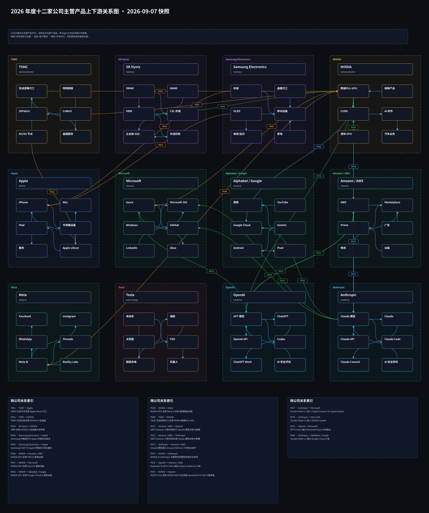
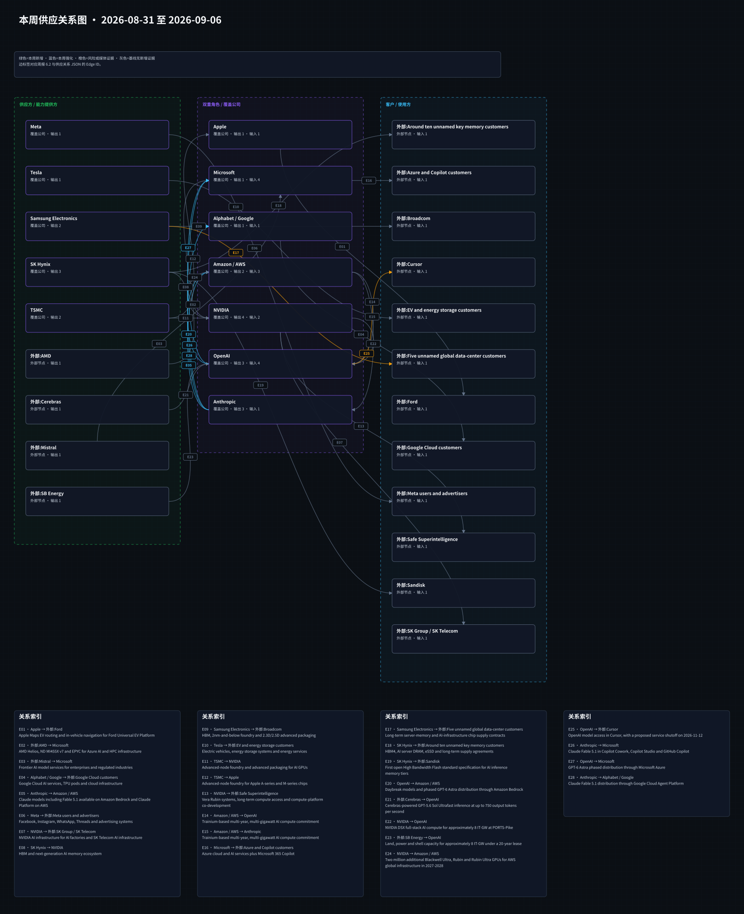

# 周一晨间科技巨头简报
<!-- weekly-brief-schema: 2 -->
- 覆盖期间：2026-08-31 至 2026-09-06（Asia/Shanghai）
- 生成时间：2026-09-07 09:43（Asia/Shanghai）
- 本期文件：reports/2026-09-07_weekly_morning_brief.md

## 1. 本周最重要的 10 件事
1. **NVIDIA：正式同意以约 129.3 亿美元收购 Hugging Face。** 重要性：上期传闻升级为签约公告，平台能力延伸至开源开发者入口；承诺保持多云、多加速器兼容，仍应区分签约与交割。[NVIDIA 公告](https://blogs.nvidia.com/blog/nvidia-to-acquire-hugging-face/)、[AP](https://apnews.com/article/d96d50e037a2ade479dcdf81cdf2afcf)
2. **OpenAI：GPT-6 Astra 开始分批发布，同时触及公司 Critical 网络能力门槛。** 重要性：企业代理能力与商业分发扩大，但强化监控和受限网络功能可能增加任务中断与部署成本；不能把公司基准测试等同于生产回报。[产品公告](https://openai.com/index/gpt-6-astra/)、[安全说明](https://openai.com/index/safety-overview-gpt-6-astra/)
3. **Anthropic：发布 Claude Fable 5.1 和受限开放的 Mythos 5.1，缓存读取降价 75%。** 重要性：输入、输出基础单价未变，降价主要惠及高缓存命中的长任务；公司估算典型工作负载成本下降约 25%，仍须实测验证。[Anthropic 公告](https://www.anthropic.com/claude-fable-and-mythos-5-1)、[官方价格与模型资料](https://platform.claude.com/docs/en/models/fable-5-1/overview)
4. **Alphabet / Google：推出 Gemini 3.8 Flash 与受限访问的 Flash Cyber。** 重要性：以每百万输入/输出 token 0.75/3.75 美元的入门价继续推进代理竞争；低单价可能刺激用量，也压缩同类模型溢价，任务总成本尚不可直接横比。[Google 公告](https://blog.google/innovation-and-ai/models-and-research/gemini-models/3-8-flash-and-3-8-flash-cyber/)
5. **Apple：John Ternus 于 9 月 1 日接任 CEO，Tim Cook 转任执行董事长。** 重要性：此前公布的接班安排在本周生效，秋季产品与 AI 商业化进入新管理层执行期；属于已知日程兑现，尚无新增财务指引。[原始任命公告](https://www.apple.com/newsroom/2026/04/tim-cook-to-become-apple-executive-chairman-john-ternus-to-become-apple-ceo/)、[现任领导资料](https://www.apple.com/leadership/john-ternus/)
6. **Microsoft、Amazon / AWS：把 Fable 5.1 接入企业工作流与云渠道。** 重要性：微软推进 Copilot Cowork、Studio、GitHub 分发，AWS 推进 Bedrock 与 Claude Platform；模型选择增加，但数据保留及管理员控制影响企业采购。[Microsoft](https://techcommunity.microsoft.com/blog/microsoft365copilotblog/available-today-anthropic-claude-fable-5-1-in-microsoft-copilot/4551974)、[AWS](https://aws.amazon.com/blogs/machine-learning/introducing-claude-fable-5-1-on-aws/)
7. **Meta：发布面向编码和长任务的 Muse Spark 1.3。** 重要性：公司内部对比称工具调用和 token 使用减少约 20%/25%，有利于改善代理经济性；并非已经验证的广告收入或整体推理成本改善。[Meta 官方](https://research.meta.ai/blog/introducing-muse-spark-1-3)
8. **Anthropic：据报道与 Lambda 达成 350 亿美元算力协议，仍待公司确认。** 重要性：Reuters 与 Bloomberg 均援引匿名信源，若属实将扩大 GPU 容量及长期付款压力；不与上期 Nscale 报道直接相加为已确认资本开支。[Reuters/CNA](https://www.channelnewsasia.com/business/anthropic-signs-us35-billion-cloud-deal-nvidia-backed-lambda-source-says-6353306)、[Bloomberg 转载](https://sg.finance.yahoo.com/news/anthropic-seals-us-35-bil-172504875.html)
9. **Tesla：中国制造车辆 8 月批发销量 86,166 辆，同比增长 3.6%、环比下降 7.9%。** 重要性：7 月较快增长后动能放缓；口径包含出口，不能当作中国终端零售或全球交付，也无法仅据销量推断毛利率。[Reuters 转载](https://www.boursorama.com/bourse/actualites/les-ventes-de-vehicules-electriques-tesla-fabriques-en-chine-ont-progresse-de-3-6-en-glissement-annuel-en-aout-cc1be1471d4a008f874e9d0c9117facb)
10. **TSMC：管理层披露设备需求预估到 7 月已升至去年末估计的 1.9 倍。** 重要性：本周公开发言强化产能瓶颈判断，但设备需求数量不等同于全年资本开支翻倍，更不是某家客户新增订单。[中央社现场报道](https://focustaiwan.tw/business/202609020027)、[专业媒体交叉报道](https://www.tomshardware.com/tech-industry/semiconductors/tsmc-fab-equipment-demand-nearly-doubles-in-six-months-ai-surge-pushes-2026-capex-toward-usd64b-amid-tool-shortages)

## 2. 投资判断速览
| 公司 | 本周变化 | 影响指标 | 预期差 | 判断 | 验证条件 |
| --- | --- | --- | --- | --- | --- |
| Apple | CEO 交接按已公告时间生效 | 产品周期、研发投入、ASP | 符合既定接班计划，未新增业绩指引 | 中性 | 9 月 10 日北京时间发布会的产品、定价及 AI 交付安排 |
| Microsoft | Fable 5.1 进入 Copilot 产品；Astra 宣布经 Azure 分批推出 | 付费席位、用量、单位服务成本 | 产品可用性改善，收入预期差未形成 | 正面 | 9 月逐组织上线、管理员启用及付费使用情况 |
| Alphabet / Google | Gemini 3.8 Flash/Cyber 发布；Fable 5.1 云分发升级 | API 用量、单位任务成本、云收入 | 维持前版入门价，性能收益为公司评估 | 正面 | 9 月同任务成本、成功率和企业采用数据 |
| Amazon / AWS | Fable 5.1 上线；Astra 宣布纳入 Bedrock 分批分发 | Bedrock 用量、留存、云毛利率 | 模型选择扩大，未披露新增营收规模 | 正面 | 9 月模型区域覆盖、数据保留条款和客户上线 |
| Meta | Muse Spark 1.3 发布 | API 用量、token 消耗、推理成本 | 公司自测效率改善，外部收益待验证 | 正面 | 9 月生产任务评测、不同推理档位和实际计费 |
| NVIDIA | Hugging Face 收购从传闻变为签约 | 现金支出、软件生态、整合成本 | 确定性提高，未形成可核验 EPS 增厚预期 | 混合 | 后续监管材料、交割公告和平台开放承诺落实 |
| Tesla | 中国制造车辆批发增速放缓 | 批发、出口、零售、汽车毛利率 | 较 7 月动能下降，缺少一致预期比较 | 混合 | 9 月内销/出口拆分及 10 月初全球 Q3 交付 |
| OpenAI | Astra 分批发布，前沿安全约束同步加强 | 付费转化、API 收入、成功任务成本 | 能力与风险均提高，商业收益尚未量化 | 混合 | 9 月扩围、服务可靠性及客户任务完成率 |
| Anthropic | Fable 5.1 降低缓存成本；Lambda 大额交易待确认 | 单位任务成本、留存、算力付款承诺 | 降价可核验，合同总额仍为媒体报道 | 混合 | 9 月真实账单、EFS 资格与交易方正式披露 |
| Samsung Electronics | 未发现可确认的公司级重大增量；关注韩美芯片谈判 | 美国投资、关税、HBM/DRAM 盈利 | 没有公司具名新承诺，不能量化预期差 | 中性 | 9 月两国政府协议及公司投资/订单公告 |
| SK Hynix | 未发现可确认的公司级重大增量；延续既有建设与回购基线 | HBM 产能、资本开支、股东回报 | 本周科普文章不构成新产能或订单 | 中性 | 9 月具名客户、设备到位或美国投资披露 |
| TSMC | 本周公开设备需求上修与建设瓶颈 | 设备交期、产能、折旧、资本开支 | 超出去年末内部设备估计，非市场一致预期 | 混合 | 9 月 10 日营收及后续正式资本开支指引 |

## 3. 发生变化的公司
### 3.1 Apple
- 日期：2026-09-01（生效日；原公告为 4 月 20 日）
- 事件：John Ternus 接任 CEO 并进入董事会，Tim Cook 转任执行董事长；当前官方领导页面确认新职务。
- 投资影响：降低交接落地的不确定性，下一步取决于产品与 AI 战略执行，不能仅凭任命上调盈利。
- 影响指标：产品交付周期、研发支出、ASP、服务收入。
- 预期差：符合此前公布时间表，不是本周突然宣布换帅。
- 验证条件：9 月 10 日北京时间发布会及随后季度的产品交付和管理层指引。
- 可信度：已确认；原始公告与现任领导资料相互印证。
- 来源：[Apple 任命公告](https://www.apple.com/newsroom/2026/04/tim-cook-to-become-apple-executive-chairman-john-ternus-to-become-apple-ceo/)、[领导资料](https://www.apple.com/leadership/john-ternus/)

### 3.2 Microsoft
- 日期：2026-09-01 至 2026-09-03（来源标注日期）
- 事件：Fable 5.1 开始进入 Copilot Cowork、Studio 和 GitHub Copilot；OpenAI 将 Azure 列为 Astra 分批推出渠道。
- 投资影响：企业入口可承接不同模型，提升工作流覆盖；默认数据保留与企业例外资格可能影响采用速度。
- 影响指标：付费席位、代理调用量、单位任务成本与续费。
- 预期差：可用产品增加，未披露增量订单；Astra 不是已确认全 Azure 区域上线。
- 验证条件：9 月组织级启用、各渠道可用范围与企业数据控制条款落地。
- 可信度：已确认；微软/GitHub 证实 Fable 分发，Astra 渠道来自 OpenAI 官方计划。
- 来源：[Microsoft](https://techcommunity.microsoft.com/blog/microsoft365copilotblog/available-today-anthropic-claude-fable-5-1-in-microsoft-copilot/4551974)、[GitHub](https://github.blog/changelog/2026-09-01-claude-fable-5-1-generally-available-in-github-copilot/)、[OpenAI](https://openai.com/index/gpt-6-astra/)

### 3.3 Alphabet / Google
- 日期：2026-09-02（来源标注日期）
- 事件：发布 Gemini 3.8 Flash 与经 Fairwind 向可信防御方提供的 Flash Cyber；常规 Flash 维持前版入门定价。
- 投资影响：低价代理模型有望扩大云与开发者采用；Cyber 的受限访问意味着能力提升不能直接换算成开放市场收入。
- 影响指标：API 用量、云收入、每个成功任务的成本和延迟。
- 预期差：标价延续，能力提升主要来自公司评估；没有可核验的收入超预期证据。
- 验证条件：9 月同一工作负载独立评测、企业采用和入门价格后续安排。
- 可信度：已确认；Google 官方发布，基准成绩按公司自测处理。
- 来源：[Google 公告](https://blog.google/innovation-and-ai/models-and-research/gemini-models/3-8-flash-and-3-8-flash-cyber/)

### 3.4 Amazon / AWS
- 日期：2026-09-01 至 2026-09-03（来源标注日期）
- 事件：Fable 5.1 在 Bedrock 和 Claude Platform on AWS 上线；Astra 公告同时列明 Bedrock 分批分发计划。
- 投资影响：扩大模型渠道覆盖；Fable 默认 AWS 安全复核可保留数据最长 30 天，符合 EFS 资格的内部使用有临时零保留安排。
- 影响指标：Bedrock 用量、付费客户、云毛利率与企业合规成本。
- 预期差：模型目录与数据控制条款有明确增量，未披露云收入或新增算力采购。
- 验证条件：9 月区域覆盖和资格审批；临时零保留至 12 月 31 日，年内 EFS 后续落地。
- 可信度：已确认；AWS 与模型提供方官方公告；Astra 尚属分批推出。
- 来源：[AWS 官方](https://aws.amazon.com/blogs/machine-learning/introducing-claude-fable-5-1-on-aws/)、[Bedrock 模型卡](https://docs.aws.amazon.com/bedrock/latest/userguide/model-card-anthropic-claude-fable-5-1.html)、[OpenAI](https://openai.com/index/gpt-6-astra/)

### 3.5 Meta
- 日期：2026-09-02（来源标注日期）
- 事件：Muse Spark 1.3 面向 Muse Code 与 Meta Model API 发布，重点改善长任务、编码和指令遵循。
- 投资影响：内部评测的 token 与工具调用下降提供成本改善线索；未确认整体基础设施成本下降或社交应用全面部署。
- 影响指标：生产任务成功率、token 消耗、API 用量与推理成本。
- 预期差：效率改善为公司内部比较，不据此判断领先所有竞争模型。
- 验证条件：9 月相同推理档位下的外部评测、实际计费与产品可用范围。
- 可信度：已确认；首发与后续页面的 max reasoning 可用性可能不同，不将高档位成绩视为所有用户首日体验。
- 来源：[Meta 官方](https://research.meta.ai/blog/introducing-muse-spark-1-3)

### 3.6 NVIDIA
- 日期：2026-09-03（正式公告日期）
- 事件：NVIDIA 宣布同意以 12,930,300,000 美元收购 Hugging Face，并承诺保留开放、多云及多加速器选择。
- 投资影响：扩张模型分发与开发者平台能力，同时增加整合、监管和生态中立性风险。
- 影响指标：交易现金支出、平台使用量、软件收入及整合成本。
- 预期差：相对上期相互冲突的媒体报道，签约确定性提高；尚无可核验盈利增厚指引。
- 验证条件：9 月起监管申报、正式交割及开放平台承诺的具体措施。
- 可信度：多源确认；官方与 AP 确认协议，未将其写成已完成交割或独家 GPU 供货。
- 来源：[NVIDIA 公告](https://blogs.nvidia.com/blog/nvidia-to-acquire-hugging-face/)、[AP](https://apnews.com/article/d96d50e037a2ade479dcdf81cdf2afcf)

### 3.7 Tesla
- 日期：2026-09-02（数据报道日期；对应 8 月）
- 事件：Reuters 援引行业协会数据，中国制造 Model 3/Y 批发销量 86,166 辆，同比增 3.6%、环比减 7.9%。
- 投资影响：上海工厂销量动能较 7 月放缓；出口和国内交付拆分决定需求解释，价格与产品组合决定盈利。
- 影响指标：中国制造批发、出口、终端零售、汽车毛利率。
- 预期差：低于 7 月同比增速，但缺少同口径市场一致预期，不能表述为低于分析师预测。
- 验证条件：9 月公布内销/出口细项，以及 10 月初全球 Q3 交付和随后财报。
- 可信度：权威媒体引述统计数据；非公司全球交付公告，不代表中国零售销量。
- 来源：[Reuters 转载](https://www.boursorama.com/bourse/actualites/les-ventes-de-vehicules-electriques-tesla-fabriques-en-chine-ont-progresse-de-3-6-en-glissement-annuel-en-aout-cc1be1471d4a008f874e9d0c9117facb)

### 3.8 OpenAI
- 日期：2026-09-03（来源标注日期）
- 事件：GPT-6 Astra 开始向有限组织推出，计划随后扩展至付费 ChatGPT、API、Azure 和 Bedrock；标准 API 输入/输出价为每百万 token 10/50 美元。
- 投资影响：扩大企业代理及科研用途；公司首次把广泛部署模型定为 Critical 网络能力等级，安全控制可能增加合法任务中断和运行成本。
- 影响指标：付费转化、API 收入、任务完成率、监控成本及服务可靠性。
- 预期差：从延后开发转向受控发布，但没有足够证据判断收入、毛利或客户 ROI 超预期。
- 验证条件：9 月分批扩围、企业启用、生产任务评测与网络能力访问政策变化。
- 可信度：已确认；能力评级及基准来自公司，安全缓解不等于风险消除。
- 来源：[产品公告](https://openai.com/index/gpt-6-astra/)、[安全说明](https://openai.com/index/safety-overview-gpt-6-astra/)

### 3.9 Anthropic
- 日期：2026-09-01（来源标注日期）
- 事件：发布 Fable 5.1 和限定获批组织使用的 Mythos 5.1；缓存读取降至每百万 token 0.25 美元，基础输入/输出价格仍为 10/50 美元。
- 投资影响：长任务成本可能下降；数据保留、客户自控 EFS 与模型安全限制共同影响受监管行业采用。
- 影响指标：缓存命中率、成功任务成本、API 收入、客户留存。
- 预期差：75% 是缓存读取单价降幅，并非所有 token 或账单降幅；典型成本降约 25% 为公司估算。
- 验证条件：9 月真实工作负载账单与完成率；秋季 EFS 分阶段部署和资格审批。
- 可信度：已确认；模型与定价有官方资料，Mythos 5.1 未全面开放。
- 来源：[Anthropic 公告](https://www.anthropic.com/claude-fable-and-mythos-5-1)、[模型与价格资料](https://platform.claude.com/docs/en/models/fable-5-1/overview)

- 日期：2026-08-31 至 2026-09-01（美国报道日及北京时间传播窗口）
- 事件：Reuters 与 Bloomberg 援引匿名信源称 Anthropic 与 Lambda 达成 350 亿美元计算协议；Reuters 报道涉及得州约 350MW 项目。
- 投资影响：若确认，将扩大 GPU 算力保障及长期付款、融资和建设风险；不等同于本期现金支出。
- 影响指标：合同期限、最低采购义务、可用 MW、上线率与融资成本。
- 预期差：金额重大但官方未确认，不能作为确定订单或新增已投产容量。
- 验证条件：9 月交易各方正式公告、合同条款、机房融资、并网和设备交付。
- 可信度：媒体报道待确认；两家媒体匿名信源是否独立无法核实，公司截至检索未有可核验确认材料。
- 来源：[Reuters/CNA](https://www.channelnewsasia.com/business/anthropic-signs-us35-billion-cloud-deal-nvidia-backed-lambda-source-says-6353306)、[Bloomberg 转载](https://sg.finance.yahoo.com/news/anthropic-seals-us-35-bil-172504875.html)

### 3.10 TSMC
- 日期：2026-09-02（公开发言日期；回顾年内设备需求）
- 事件：侯永清在 SEMICON Taiwan 表示，相对去年末设备需求估计，第一季度后升至 1.5 倍、7 月升至 1.9 倍。
- 投资影响：强化需求与建设瓶颈判断，设备和施工能力决定收入兑现速度；需求数量不能直接换算为资本预算。
- 影响指标：设备交期、产能上线、利用率、折旧和资本开支。
- 预期差：超过公司去年末内部设备估计，非相对市场一致预期；本周没有据此确认新资本开支指引。
- 验证条件：9 月 10 日 8 月营收、后续设备交付与正式财报资本开支披露。
- 可信度：权威媒体对管理层公开发言的报道；缺少客户级数量和预算明细，不推断具名订单。
- 来源：[中央社现场报道](https://focustaiwan.tw/business/202609020027)、[Tom's Hardware](https://www.tomshardware.com/tech-industry/semiconductors/tsmc-fab-equipment-demand-nearly-doubles-in-six-months-ai-surge-pushes-2026-capex-toward-usd64b-amid-tool-shortages)

### 3.11 无重大变化公司
- Samsung Electronics、SK Hynix：未发现可确认的公司级重大增量；官方本周主要为技术解读，韩美芯片投资谈判尚未落实为具名公司新承诺，不把既有产品上市、回购或建厂重复计为新增。[Samsung 新闻室](https://news.samsung.com/global/category/press-resources/press-release)、[SK Hynix 新闻室](https://news.skhynix.com/en/author/skhynixsys/)

## 4. 跨公司与产业链判断
1. **模型价格竞争应看成功任务成本。** 高缓存命中客户受益于 Fable 降价，低价代理客户可评估 Gemini；模型厂商的每 token 收入承压，是否由用量与效率弥补，需要同任务、同推理档位的账单和成功率验证。
2. **企业分发价值转向工作流与数据治理。** Microsoft、AWS、Google 可受益于多模型选择及企业控制；模型提供方承担更多渠道议价和安全审查成本。Fable 的默认数据保留、零保留例外及秋季 EFS 是验证采用速度的变量。
3. **算力需求增长与项目风险同步集中。** 设备与基础设施供应商可能受益，模型公司和云厂商承担长期付款与闲置风险。TSMC 的设备需求是容量压力信号；Lambda 报道、PORTS-Pike 与 AWS 远期 GPU 计划均须分别验证合同、融资和交付，不能相加为已投产容量。
4. **安全与跨境政策开始约束执行速度。** 企业安全工具可能受益，模型研发利用率和韩国存储厂的跨境资本效率承压。Anthropic 本周披露部分高风险训练环境仍暂停，其余训练和内外部网络评估已恢复；韩美投资讨论尚不是 Samsung/SK Hynix 新预算。以上为基于披露的研究判断。[Anthropic 整改说明](https://www.anthropic.com/news/improving-alignment-security-efforts)、[Reuters 韩美谈判报道](https://ca.marketscreener.com/news/south-korea-says-chip-investments-under-discussion-with-us-amid-tariff-concerns-ce785bdadc8af522)

## 5. 下周催化与验证条件
1. **Apple 秋季发布会。** 触发条件：9 月 9 日 10:00 PT，即北京时间 9 月 10 日 01:00，官方公布产品、价格和交付安排。可能影响：Apple ASP、换机需求与 AI 采用；会前泄露规格不当作已发布产品。[Apple 活动页](https://www.apple.com/apple-events/)
2. **TSMC 8 月营收。** 触发条件：官方日历列明 9 月 10 日 13:30（台北/北京时间）发布。可能影响：Q3 收入路径及产能紧张判断；月营收不能直接识别客户订单。[TSMC 财务日历](https://investor.tsmc.com/english/financial-calendar)
3. **新模型扩围和实际账单。** 触发条件：9 月 7-13 日 Astra 云渠道、Fable 企业资格或 Muse 推理档位出现正式更新及可复现客户数据。可能影响：模型收入、云用量和单位成功任务成本。
4. **交易与算力项目。** 触发条件：9 月 7-13 日 NVIDIA/Hugging Face 监管材料或 Anthropic/Lambda、Nscale 任一方发布具名合同、融资或交付证据。可能影响：并购整合预期、付款义务与 GPU 需求；无更新则维持原证据等级。
5. **汽车需求与韩国芯片政策。** 触发条件：9 月 7-13 日 Tesla 中国内销/出口拆分、韩美谈判结果或韩国两家存储厂正式投资公告。可能影响：汽车需求解释、存储资本开支及关税敞口。

## 6. 研究附录：产业链与图谱
### 6.1 图谱更新状态与可视化
- 产品图：本期更新，日期 2026-09-07。计划原因：主营产品或跨公司产品关系发生实质变化；扩充 Bedrock 模型范围，并补齐 Microsoft、Google 的产品分发边。新增入图不等于本周首次成为商业伙伴。

[Obsidian Canvas 源文件](../assets/2026-09-07_product_relationships.canvas)

- 供应图：本期更新，日期 2026-09-07。计划原因：存在实质变化关系 E05、E20、E26、E27、E28。

[Obsidian Canvas 源文件](../assets/2026-09-07_supply_relationships.canvas)

### 6.2 本周供应关系变化表
| Edge ID | 变化类型 | 供应方 -> 客户 | 产品/服务 | 投资影响 | 本周证据与限制 | 来源 |
| --- | --- | --- | --- | --- | --- | --- |
| E05 | 强化 | Anthropic -> Amazon / AWS | Fable 5.1 在 Bedrock、Claude Platform on AWS 上线 | 扩大企业模型用量，数据控制影响采用 | 9 月 1 日双方公告；默认安全复核、符合资格的临时零保留及后续 EFS 不可混同为普遍零保留 | [AWS](https://aws.amazon.com/blogs/machine-learning/introducing-claude-fable-5-1-on-aws/)、[Anthropic](https://www.anthropic.com/claude-fable-and-mythos-5-1) |
| E20 | 强化 | OpenAI -> Amazon / AWS | Bedrock 从原 Daybreak 基线扩展至 Astra 分批分发计划 | 增加分发机会，收入未量化 | 9 月 3 日供应方官方宣布；未确认全区域可用，不代表新增 GPU 采购 | [OpenAI](https://openai.com/index/gpt-6-astra/) |
| E26 | 强化；补记既有边 | Anthropic -> Microsoft | Fable 5.1 接入 Copilot Cowork、Studio、GitHub | 增加工作流覆盖，默认保留影响企业采用 | 9 月 1 日具名产品上线；区域、管理员及企业例外仍有限制，上期基线未收录此既有合作 | [Microsoft](https://techcommunity.microsoft.com/blog/microsoft365copilotblog/available-today-anthropic-claude-fable-5-1-in-microsoft-copilot/4551974)、[GitHub](https://github.blog/changelog/2026-09-01-claude-fable-5-1-generally-available-in-github-copilot/) |
| E27 | 强化；补记既有边 | OpenAI -> Microsoft | Azure 的 Astra 分批分发计划 | 扩充企业模型渠道，尚无收入规模 | 9 月 3 日 OpenAI 宣布；上期基线遗漏，非新签合作，未确认 Azure 全区域上线 | [OpenAI](https://openai.com/index/gpt-6-astra/) |
| E28 | 强化；补记既有边 | Anthropic -> Alphabet / Google | Fable 5.1 经 Google Cloud Agent Platform 分发 | 扩大云端模型选择 | 9 月 1 日提供方公告及模型资料；非新采购或 TPU 容量承诺，EFS 后续推出 | [Anthropic](https://www.anthropic.com/claude-fable-and-mythos-5-1)、[模型资料](https://platform.claude.com/docs/en/models/fable-5-1/overview) |

### 6.3 与上周的区别
- 新增关系：没有证据证明本周首次建立新的供应伙伴；E26-E28 为首次入图的既有合作，按本周产品上线/分批推出证据标记强化。
- 强化关系：E05、E20、E26-E28；年度图补充 P15-P17、PX77-PX80，并扩充 P13/PX75 的模型范围。
- 弱化或风险关系：没有新增具名供应边风险。E25 的 Cursor 拟停止服务风险继续存在，只将周度变化归零，未写成风险解除。
- 无明显变化：E24 的 2027-2028 年额外 GPU 计划、E22-E23 的 PORTS-Pike 远期容量及其他长期边沿用；完整 E01-E28 基线见 JSON，不重复全表。
- 证据升级与限制：Hugging Face 从收购传闻升为正式协议，尚不建立已交割供应边；Lambda 仍为媒体报道待确认。纠正上期 6.3 的文字映射：E08 是 SK Hynix -> NVIDIA，Samsung -> Broadcom 为 E09，E14/E15 是 AWS -> OpenAI/Anthropic 的算力关系，E12 是 TSMC -> Apple。

## 7. 本期自检
- 日期范围：2026-08-31 00:00 至 2026-09-06 23:59（Asia/Shanghai）；事件采用来源日期并明确生效日/统计期，不纳入下周结果。
- 公司与结构：固定 12 家公司；第 1 节恰好 10 件；第 3 节集中汇总无重大变化公司，事件均提供影响指标、预期差、时间窗口与来源。
- 证据边界：匿名信源交易、计划分发、正式签约和已完成交付分别表述；未以设备需求倍数冒充资本开支增幅，未把模型缓存降价写成全部账单降价。
- 图谱状态：按计划生成本期产品/供应图；E05、E20、E26-E28 为全部周度变化，E26-E28 是基线补录而非首次签约。
- 来源审查：73 个 URL 均可达或明确访问受限；23 条供应关系核心 claim 校验无失败，0 个未分类来源。受限数量随实时请求变化，最终状态见 [本期审计日志](../logs/2026-09-07_source_audit.json)；受限页面保留人工核查标记，周内核心事件已通过联网读取及交叉来源核实。自动匹配不代表全部新闻事实已由程序验证。
- 质量闸门：首次运行因旧版“最多 25 条关系”限制失败；已修正 schema v2 累积基线规则，保留唯一 ID、来源、周度变化与图表一致性校验。完整闸门重跑及 26 项回归测试均通过；命令为 `python3 scripts/run_quality_gate.py --report reports/2026-09-07_weekly_morning_brief.md`，审计日志与最终报告及两个 JSON 的哈希一致。
- 图像复核：修复同列边穿越节点及边号遮挡，Canvas/SVG 使用同一布局；结构校验与本期 SVG 标签碰撞检查共同确认可读性。
- Git 发布核验：提交信息为 `chore: add weekly brief 2026-09-07`；实际提交及远端同步状态以仓库 Git 记录与本次自动化运行结论为准。工作区原有两份未跟踪脚本副本不纳入本期发布。
