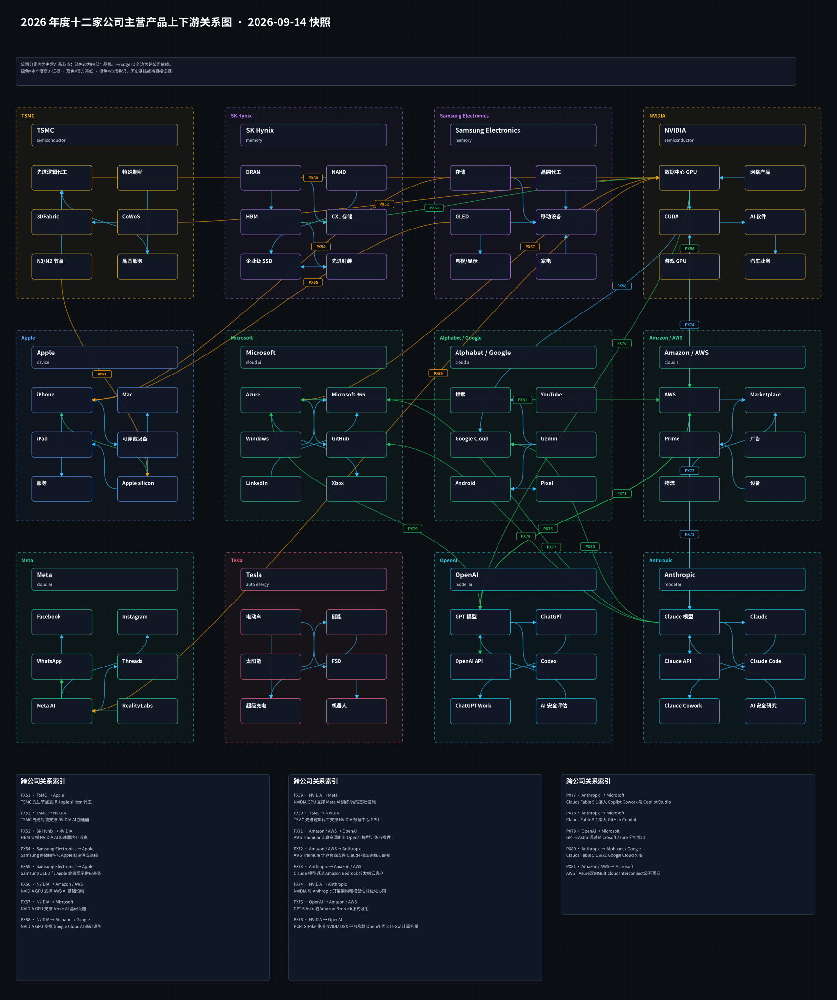
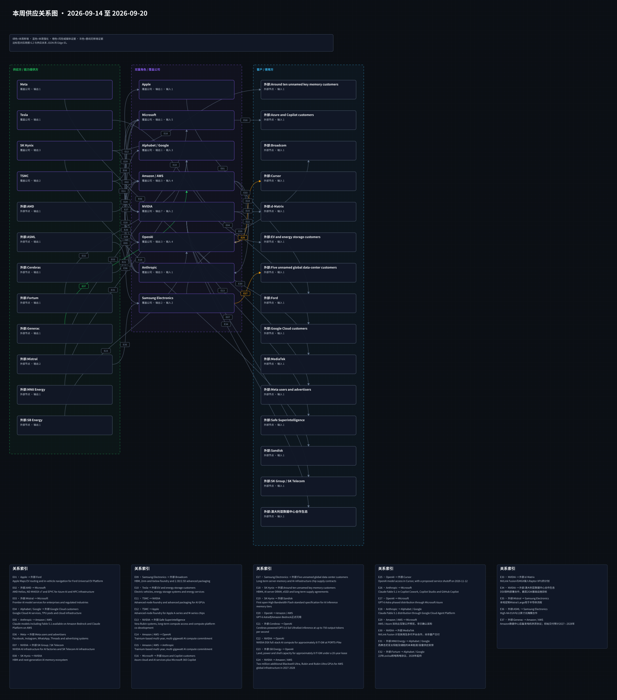

# 周一晨间科技巨头简报
<!-- weekly-brief-schema: 2 -->
<!-- company-selection: top5 -->
<!-- point-in-time-policy: 1 -->
- 覆盖期间：2026-09-14 至 2026-09-20（Asia/Shanghai）
- 生成时间：2026-09-22 14:34（Asia/Shanghai）
- 截止时点：2026-09-21 00:00（Asia/Shanghai，不含该时刻）
- 本期文件：reports/2026-09-21_weekly_morning_brief.md
- 阅读口径：12家公司各选0-5条重要独立事项；有限筛选而非零遗漏。消息、计划、自测与事实分别归因。
- 时点限制：本报告在截止后制作，不宣称成稿在截止时已存在。仅将截止前具日期具体版本纳入事实。

## 1. 本周最重要的 12 件事
1. **Amazon / AWS：Generac披露与Amazon的后备发电机供货协议。** 重要性：数据中心后备电力设备供应关系确定，但规模兑现仍在未来。 [来源](https://www.sec.gov/Archives/edgar/data/1474735/000143774926030550/gnrc20260915_8k.htm)
2. **Alphabet / Google：美国广告技术案救济细节公开。** 重要性：广告技术经营约束进一步明确，实施和上诉仍需跟踪。 [来源](https://www.justice.gov/opa/pr/department-justice-again-wins-substantial-relief-against-google)
3. **Anthropic：与Accenture合作开展嵌入式独立评估。** 重要性：安全评估投入承诺明确，但独立性和实际成果需制度化检验。 [来源](https://www.anthropic.com/news/accenture-embedded-evaluation)
4. **Microsoft：公布面向美国政府云的Microsoft 365 G7。** 重要性：政府AI套件采购入口将拓展，但本周尚未开始购买。 [来源](https://www.microsoft.com/en-us/microsoft-cloud/blog/industry-government/government-operations-and-infrastructure/2026/09/15/introducing-microsoft-365-g7-intelligence-trust-for-the-mission-ahead/)
5. **NVIDIA：Vera Rubin公布MLPerf Inference预览结果。** 重要性：展示下一代平台潜在推理效率，量产与实际成本待验证。 [来源](https://blogs.nvidia.com/blog/vera-rubin-nvl72-mlperf-inference/)
6. **OpenAI：发布模型失配报告框架。** 重要性：治理披露形式更具体，实际执行和外部可核验性仍待观察。 [来源](https://openai.com/index/model-misalignment-reporting-framework/)
7. **Meta：推出Meta One订阅服务。** 重要性：为AI功能增加付费入口，付费转化尚未由公告证实。 [来源](https://about.fb.com/news/2026/09/introducing-meta-one-subscription-service-more-features-ai/)
8. **Apple：iPhone 18 Pro系列进入门店销售。** 重要性：发布转入销售阶段，需求强度仍待经营数据。 [来源](https://www.apple.com/uk/newsroom/2026/09/the-latest-iphone-apple-watch-and-airpods-lineups-arrive-in-stores-worldwide/)
9. **Tesla：Cybercab认证调查答复要求进入公开报道。** 重要性：商业部署仍受认证审查和回应结果制约。 [来源](https://www.marketscreener.com/news/us-agency-orders-tesla-to-answer-questions-on-cybercab-certification-ce785bddde80f524)
10. **SK Hynix：回应与Intel美国内存制造洽谈报道。** 重要性：本地制造选项仍在早期，资本投入不能据传闻量化。 [来源](https://news.skhynix.com/en/fact-10/)
11. **Alphabet / Google：公布Gemini 3.8 Live系列。** 重要性：实时交互模型的产品竞争加快，商业采用仍待验证。 [来源](https://blog.google/innovation-and-ai/models-and-research/gemini-models/gemini-3-8-live-gemini-3-8-live-extended-thinking/)
12. **OpenAI：推出法律行业Astra试点。** 重要性：垂直行业工作流试水，采用范围与可靠性需观察。 [来源](https://openai.com/index/astra-for-law/)

## 2. 投资判断速览
| 公司 | 本周变化 | 影响指标 | 预期差 | 判断 | 验证条件 |
| --- | --- | --- | --- | --- | --- |
| Apple | iPhone 18 Pro系列进入门店销售 | 实际交付、产品组合 | 暂不可验证 | 事实与条件分列，不给买卖评级 | 核对公司销量或财报口径，不用现场照片外推。 |
| Microsoft | 公布面向美国政府云的Microsoft 365 G7；季度股息上调至每股0.98美元 | GCC采购、授权进度 | 暂不可验证 | 事实与条件分列，不给买卖评级 | 10月1日购买入口及后续授权工作负载。 |
| Alphabet / Google | 公布Gemini 3.8 Live系列；美国广告技术案救济细节公开 | 可用地区与层级、开发者使用 | 暂不可验证 | 事实与条件分列，不给买卖评级 | 分别核对API与应用的可用级别和后续采用。 |
| Amazon / AWS | Generac披露与Amazon的后备发电机供货协议 | 交付、付款 | 暂不可验证 | 事实与条件分列，不给买卖评级 | 跟踪实际采购付款及2027—2028年交付。 |
| Meta | 推出Meta One订阅服务 | 订阅采用、权益使用 | 暂不可验证 | 事实与条件分列，不给买卖评级 | 核对实际开放账户、价格与后续收入披露。 |
| NVIDIA | Vera Rubin公布MLPerf Inference预览结果 | 独立基准、交付 | 暂不可验证 | 事实与条件分列，不给买卖评级 | 核对正式产品交付和第三方同口径测试。 |
| Tesla | Cybercab认证调查答复要求进入公开报道 | 答复、调查结论 | 暂不可验证 | 事实与条件分列，不给买卖评级 | 查看NHTSA后续公开文件及Tesla答复。 |
| OpenAI | 发布模型失配报告框架；推出法律行业Astra试点；广告AI产品进入有限测试 | 披露频率、事件分类 | 暂不可验证 | 事实与条件分列，不给买卖评级 | 跟踪后续按框架披露及独立复核。 |
| Anthropic | 提出前沿实验室研发节奏指标；与Accenture合作开展嵌入式独立评估 | 方法公开、第三方核验 | 暂不可验证 | 事实与条件分列，不给买卖评级 | 等待共同方法和外部复核。 |
| Samsung Electronics | One UI 9开始向更多Galaxy设备推送 | 实际推送覆盖、功能使用 | 暂不可验证 | 事实与条件分列，不给买卖评级 | 按设备与地区核对推送及功能可用性。 |
| SK Hynix | 回应与Intel美国内存制造洽谈报道 | 双方正式协议、投资额 | 暂不可验证 | 事实与条件分列，不给买卖评级 | 等待公司公告或监管备案，不以匿名报道确认为合同。 |
| TSMC | 本期未筛选到经核实的重要更新；有限范围见3节 | 沿用观察，不新增判断 | 暂不可验证 | 不等于没有变化或风险解除 | 新的具日期重要披露再更新 |

## 3. 发生变化的公司
### 3.1 Apple
<!-- candidate: APL-STORE -->
- 日期：2026-09-18（来源日期与时区不确定性见证据账）
- 事件：Apple称iPhone 18 Pro和Pro Max于9月18日在其全球门店开售；活动照片和到店人流不能推算销量或收入。
- 投资影响：发布转入销售阶段，需求强度仍待经营数据。
- 影响指标：实际交付、产品组合、后续财报
- 预期差：无同口径一致预期，暂不可验证。
- 验证条件：核对公司销量或财报口径，不用现场照片外推。
- 可信度：Apple具日期现场公告；没有销售量结论。
- 来源：[原始来源](https://www.apple.com/uk/newsroom/2026/09/the-latest-iphone-apple-watch-and-airpods-lineups-arrive-in-stores-worldwide/)

### 3.2 Microsoft
<!-- candidate: MS-G7 -->
- 日期：2026-09-15（来源日期与时区不确定性见证据账）
- 事件：Microsoft宣布面向GCC的Microsoft 365 G7；G7和Agent 365计划10月1日起可购买，更多工作负载须分阶段完成GCC授权。
- 投资影响：政府AI套件采购入口将拓展，但本周尚未开始购买。
- 影响指标：GCC采购、授权进度、实际部署
- 预期差：无同口径一致预期，暂不可验证。
- 验证条件：10月1日购买入口及后续授权工作负载。
- 可信度：Microsoft官方9月15日公告；区分公告与可购买。
- 来源：[原始来源](https://www.microsoft.com/en-us/microsoft-cloud/blog/industry-government/government-operations-and-infrastructure/2026/09/15/introducing-microsoft-365-g7-intelligence-trust-for-the-mission-ahead/)

<!-- candidate: MS-DIV -->
- 日期：2026-09-15（来源日期与时区不确定性见证据账）
- 事件：董事会宣布每股0.98美元季度股息，较上一季度增加0.07美元、约8%；登记日为11月19日，支付日为12月10日。
- 投资影响：明确股东回报安排，不等同AI业务收入变化。
- 影响指标：每股股息、支付安排、自由现金流
- 预期差：无同口径一致预期，暂不可验证。
- 验证条件：按公司披露核对登记和支付，不混同已支付。
- 可信度：Microsoft官方9月15日公告；金额单位为美元/股。
- 来源：[原始来源](https://news.microsoft.com/source/2026/09/15/microsoft-announces-quarterly-dividend-increase-7/)

### 3.3 Alphabet / Google
<!-- candidate: GOO-LIVE -->
- 日期：2026-09-15（来源日期与时区不确定性见证据账）
- 事件：Google公布Gemini 3.8 Live与Live Extended Thinking，面向实时语音和更长推理；具体入口分产品和开发者渠道，不能把预览或订阅开放写成全面正式可用。
- 投资影响：实时交互模型的产品竞争加快，商业采用仍待验证。
- 影响指标：可用地区与层级、开发者使用、延迟
- 预期差：无同口径一致预期，暂不可验证。
- 验证条件：分别核对API与应用的可用级别和后续采用。
- 可信度：Google 9月15日具日期公告；页面9月17日更新，保留版本敏感性。
- 来源：[原始来源](https://blog.google/innovation-and-ai/models-and-research/gemini-models/gemini-3-8-live-gemini-3-8-live-extended-thinking/)

<!-- candidate: GOO-ADS -->
- 日期：2026-09-16（来源日期与时区不确定性见证据账）
- 事件：美国司法部9月16日公布广告技术案救济安排，涉及互操作、数据共享、自我优待限制及监督；本周增量是救济细节，不是9月2日已作出的不拆分结论。
- 投资影响：广告技术经营约束进一步明确，实施和上诉仍需跟踪。
- 影响指标：合规措施、监督期限、广告平台规则
- 预期差：无同口径一致预期，暂不可验证。
- 验证条件：核对法院命令实施、后续上诉与实际执行。
- 可信度：司法部官方9月16日公告；机构观点不扩大为终局无上诉裁判。
- 来源：[原始来源](https://www.justice.gov/opa/pr/department-justice-again-wins-substantial-relief-against-google)

### 3.4 Amazon / AWS
<!-- candidate: AWS-GEN -->
- 日期：2026-09-16（来源日期与时区不确定性见证据账）
- 事件：Generac在SEC 8-K披露Amazon后备发电机供货协议，初始约24亿美元交付预计在2027—2028年；同时授予Amazon附条件认股权证，潜在股份和付款门槛不等于已交付或已实现收入。
- 投资影响：数据中心后备电力设备供应关系确定，但规模兑现仍在未来。
- 影响指标：交付、付款、产能、认股权证归属
- 预期差：无同口径一致预期，暂不可验证。
- 验证条件：跟踪实际采购付款及2027—2028年交付。
- 可信度：Generac 9月16日SEC文件；未来交付与条件权益分列。
- 来源：[原始来源](https://www.sec.gov/Archives/edgar/data/1474735/000143774926030550/gnrc20260915_8k.htm)

### 3.5 Meta
<!-- candidate: META-ONE -->
- 日期：2026-09-15（来源日期与时区不确定性见证据账）
- 事件：Meta公布Meta One分层订阅，以更多AI功能和使用量为卖点，并称免费基本服务仍保留；开放节奏和权益按应用、地区与账号不同。
- 投资影响：为AI功能增加付费入口，付费转化尚未由公告证实。
- 影响指标：订阅采用、权益使用、地区扩展
- 预期差：无同口径一致预期，暂不可验证。
- 验证条件：核对实际开放账户、价格与后续收入披露。
- 可信度：Meta具日期公告；不将既有总订阅试用数当作Meta One新增用户。
- 来源：[原始来源](https://about.fb.com/news/2026/09/introducing-meta-one-subscription-service-more-features-ai/)

### 3.6 NVIDIA
<!-- candidate: NV-MLPERF -->
- 日期：2026-09-16（来源日期与时区不确定性见证据账）
- 事件：NVIDIA发布Vera Rubin NVL72在MLPerf Inference v6.1的预览提交结果，所列性能倍数针对特定模型和比较基线；这是厂商测试表现，不是客户部署、收入或通用工作负载优势。
- 投资影响：展示下一代平台潜在推理效率，量产与实际成本待验证。
- 影响指标：独立基准、交付、实际推理成本
- 预期差：无同口径一致预期，暂不可验证。
- 验证条件：核对正式产品交付和第三方同口径测试。
- 可信度：NVIDIA 9月16日博客的自报基准；明确预览。
- 来源：[原始来源](https://blogs.nvidia.com/blog/vera-rubin-nvl72-mlperf-inference/)

### 3.7 Tesla
<!-- candidate: TSLA-CERT -->
- 日期：2026-09-15（来源日期与时区不确定性见证据账）
- 事件：Reuters报道美国NHTSA要求Tesla就Cybercab自我认证问题在9月30日前答复；调查与问询不等于认定车辆违规，命令发出日期不误写为9月15日。
- 投资影响：商业部署仍受认证审查和回应结果制约。
- 影响指标：答复、调查结论、实际获准部署
- 预期差：无同口径一致预期，暂不可验证。
- 验证条件：查看NHTSA后续公开文件及Tesla答复。
- 可信度：Reuters 9月15日报道并引述NHTSA；不作违规裁决。
- 来源：[原始来源](https://www.marketscreener.com/news/us-agency-orders-tesla-to-answer-questions-on-cybercab-certification-ce785bddde80f524)

### 3.8 OpenAI
<!-- candidate: OA-MISALIGN -->
- 日期：2026-09-16（来源日期与时区不确定性见证据账）
- 事件：OpenAI公布报告框架并讨论过去六个月训练和评估中的六项历史观察；六项不是本周发生的六起生产事故，也不能据此估计总体发生率。
- 投资影响：治理披露形式更具体，实际执行和外部可核验性仍待观察。
- 影响指标：披露频率、事件分类、外部核验
- 预期差：无同口径一致预期，暂不可验证。
- 验证条件：跟踪后续按框架披露及独立复核。
- 可信度：OpenAI 9月16日原文；案例发生期与披露期分开。
- 来源：[原始来源](https://openai.com/index/model-misalignment-reporting-framework/)

<!-- candidate: OA-LAW -->
- 日期：2026-09-17（来源日期与时区不确定性见证据账）
- 事件：OpenAI公布Astra for Law，初期仅通过Trusted Access提供给选定律所；API计划稍后开放，产品测试或自测结果不代表所有法律场景已可用。
- 投资影响：垂直行业工作流试水，采用范围与可靠性需观察。
- 影响指标：准入律所、实际任务表现、API开放
- 预期差：无同口径一致预期，暂不可验证。
- 验证条件：核对Trusted Access扩围与API正式开放。
- 可信度：OpenAI 9月17日公告；保留试点准入和未来API边界。
- 来源：[原始来源](https://openai.com/index/astra-for-law/)

<!-- candidate: OA-ADS -->
- 日期：2026-09-16（来源日期与时区不确定性见证据账）
- 事件：OpenAI公布广告AI方案，其中Sponsored Agents在美国选定广告主中测试；Shopify与HubSpot相关入口按各自开放条件推进，不等于全面商用或确认广告收入。
- 投资影响：广告客户工作流增加AI入口，商业模式兑现待验证。
- 影响指标：测试范围、广告主采用、可确认收入
- 预期差：无同口径一致预期，暂不可验证。
- 验证条件：核对产品开放条件及后续收入披露。
- 可信度：OpenAI 9月16日公告；测试和可用入口分开。
- 来源：[原始来源](https://openai.com/index/reimagining-advertising-with-ai/)

### 3.9 Anthropic
<!-- candidate: AN-METRICS -->
- 日期：2026-09-17（来源日期与时区不确定性见证据账）
- 事件：Anthropic提出AI参与研发、自主代理监督和算力分配三类指标，并披露内部快照；其数据和评价方法由公司提出，跨实验室可比性与外部验证仍有限。
- 投资影响：提高治理透明度的可讨论口径，不能把自报数字当独立评估。
- 影响指标：方法公开、第三方核验、后续时间序列
- 预期差：无同口径一致预期，暂不可验证。
- 验证条件：等待共同方法和外部复核。
- 可信度：Anthropic官方9月17日新闻索引及具体研究正文；不外推公司内部样本。
- 来源：[原始来源](https://www.anthropic.com/institute/measuring-pace-of-ai-development)

<!-- candidate: AN-ACC -->
- 日期：2026-09-18（来源日期与时区不确定性见证据账）
- 事件：Anthropic称与Accenture合作开展嵌入式模型评估；双方各自预计五年投入至少10亿美元。安排非独家，访问和报告标准尚未确定，Anthropic将直接支付Accenture工作。
- 投资影响：安全评估投入承诺明确，但独立性和实际成果需制度化检验。
- 影响指标：实际支出、评估权限、公开报告
- 预期差：无同口径一致预期，暂不可验证。
- 验证条件：核对合同实施、资金来源与第三方报告。
- 可信度：Anthropic 9月18日官方公告；数额是各自预期非已支付。
- 来源：[原始来源](https://www.anthropic.com/news/accenture-embedded-evaluation)

### 3.10 Samsung Electronics
<!-- candidate: SS-UI -->
- 日期：2026-09-16（来源日期与时区不确定性见证据账）
- 事件：Samsung宣布9月16日起将One UI 9扩至Galaxy S26系列；此前已在Z Fold8 Ultra、Fold8和Flip8首发。功能按地区、型号和账号不同，不能宣称全部设备同步获得所有AI功能。
- 投资影响：既有设备的软件体验扩展，使用及留存效果待观察。
- 影响指标：实际推送覆盖、功能使用、设备留存
- 预期差：无同口径一致预期，暂不可验证。
- 验证条件：按设备与地区核对推送及功能可用性。
- 可信度：Samsung 9月16日官方公告；保留机型与地区限制。
- 来源：[原始来源](https://news.samsung.com/global/samsung-begins-official-rollout-of-one-ui-9-bringing-the-latest-galaxy-experiences-to-more-devices)

### 3.11 SK Hynix
<!-- candidate: SK-INTEL -->
- 日期：2026-09-16（来源日期与时区不确定性见证据账）
- 事件：SK Hynix称正探索多种方案，但就媒体所述与Intel在美国制造内存芯片的洽谈，尚无具体计划、安排或决定；不能当作合资或建厂协议。
- 投资影响：本地制造选项仍在早期，资本投入不能据传闻量化。
- 影响指标：双方正式协议、投资额、工厂决策
- 预期差：无同口径一致预期，暂不可验证。
- 验证条件：等待公司公告或监管备案，不以匿名报道确认为合同。
- 可信度：SK Hynix 9月16日官方回应，Reuters报道作报道对象。
- 来源：[原始来源](https://news.skhynix.com/en/fact-10/)

### 3.11 无重大变化公司
- TSMC：本期未筛选到经核实的重要更新。有限检查包括投资者官方入口、MediaTek 2nm产品公告及独立报道；MediaTek原文未明确具名TSMC供货，不能据此新增确认供应关系。

## 4. 跨公司与产业链判断
1. 公告、测试和商业交付必须分层。Microsoft G7的购买在10月、NVIDIA结果是预览基准、OpenAI法律与广告功能有选定用户边界；这些都不能合计为本周已实现收入。
2. 基础设施和供应协议的金额需要按期间和条件理解。Generac初始供货预计2027—2028年履行，Amazon的认股权证归属附带付款条件；不能把未来交付或潜在权益记为本期现金收入。
3. 治理消息的性质不同。Google广告技术案是救济细节，Tesla收到的是监管问询，OpenAI发布的是历史观察报告框架，Anthropic的嵌入式评估仍在设计标准。各项都需看执行证据。

## 5. 下周催化与验证条件
1. 触发条件：政府AI采购与有限试点。观察10月1日G7购买入口，以及Astra for Law和Sponsored Agents准入扩围；不预填付费转化。 可能影响：相应产品采用、经营约束或资本兑现；不预设结果。
2. 触发条件：数据中心后备设备。观察Generac与Amazon合同的实际付款、产能及未来交付进度；24亿美元仍为预计交付规模。 可能影响：相应产品采用、经营约束或资本兑现；不预设结果。
3. 触发条件：监管和治理。跟踪Google救济命令实施、Cybercab答复、OpenAI后续失配披露和Anthropic评估标准；问询不是违规裁决。 可能影响：相应产品采用、经营约束或资本兑现；不预设结果。
4. 触发条件：产品采用与测试复核。核对iPhone 18 Pro实际销售披露、Gemini渠道可用性、Meta One付费采用及Vera Rubin第三方同口径表现。 可能影响：相应产品采用、经营约束或资本兑现；不预设结果。

## 6. 研究附录：产业链与图谱
### 6.1 图谱更新状态与可视化
- 产品图：本期没有已核实的实质产品供应关系变化，沿用上周已核版本；沿用不表示重新认证所有旧边。

[Obsidian Canvas 源文件](../assets/2026-09-14_product_relationships.canvas)
- 供应图：本期更新E37，表示Generac与Amazon的后备发电机供货协议；未来交付不画成已完成。

[Obsidian Canvas 源文件](../assets/2026-09-21_supply_relationships.canvas)

### 6.2 本周供应关系变化表
| Edge ID | 变化类型 | 供应方 -> 客户 | 产品/服务 | 投资影响 | 本周证据与限制 | 来源 |
| --- | --- | --- | --- | --- | --- | --- |
| E37 | 新增 | Generac -> Amazon / AWS | 数据中心后备发电机供货协议 | 潜在供应链资本承诺，非本期收入确认 | 初始约24亿美元交付预计2027—2028年；Amazon附条件认股权证不代表已全部归属。 | [SEC文件](https://www.sec.gov/Archives/edgar/data/1474735/000143774926030550/gnrc20260915_8k.htm) |

### 6.3 与上周的区别
- E37是本期新增合同阶段关系；未把未来交付或潜在权益当作现有付款。
- 上周E20和E32—E36的本周变化标记归为历史基线，保留原证据日期与限定语。MediaTek产品公告未明确TSMC为供应方，不据此新增边。

## 7. 本期自检
- 本期16项独立入选事项，12家公司各0—5项，头条12项均来自入选事项。
- 官方有限筛选和独立重要性校准后冻结名单；未入选候选及活跃事项留在coverage账中，不宣称全量清零。
- 9月14日仅有日期而时区/公开时刻不足的候选不入本期新闻；Google Windows应用9月10日已公布，属于旧闻。
- 24亿美元是预计未来交付、10亿美元是Anthropic与Accenture双方各自五年预期；股息按美元/股及未来支付日期记载。
- 监管问询、法院救济、厂商基准与公司自报治理数据均保留性质和限制。机器闸门不能替代来源正文语义复核。
