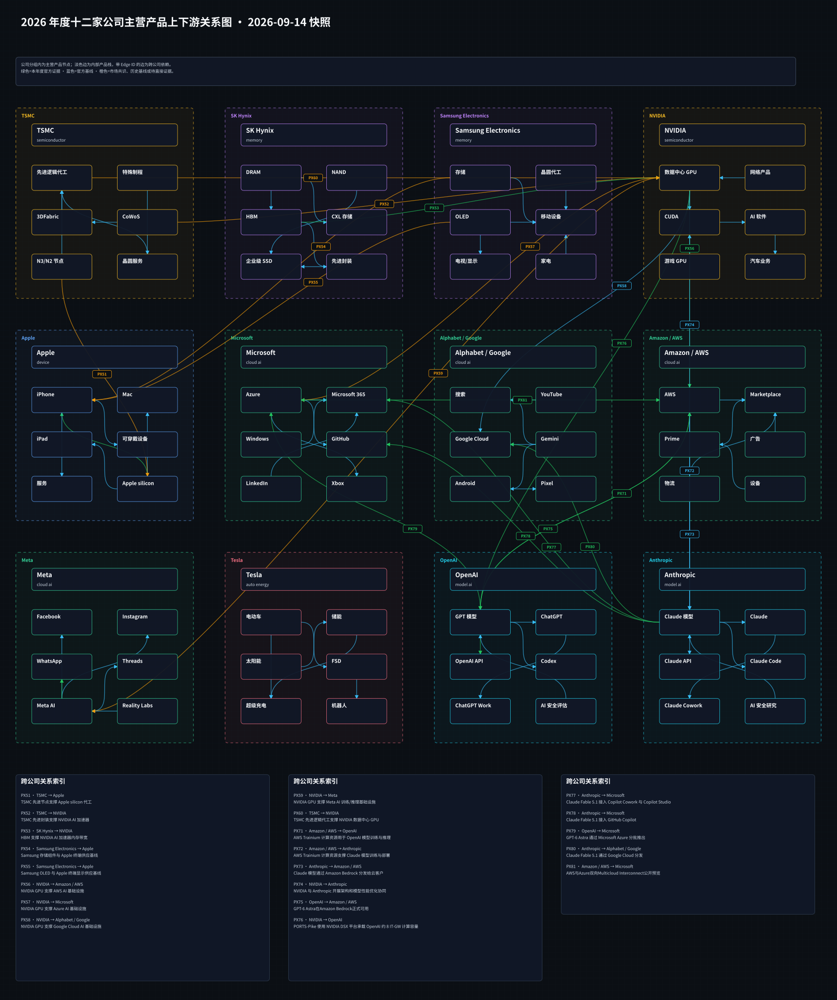

# 周一晨间科技巨头简报
<!-- weekly-brief-schema: 2 -->
<!-- company-selection: top5 -->
<!-- point-in-time-policy: 1 -->
- 覆盖期间：2026-09-21 至 2026-09-27（Asia/Shanghai）
- 生成时间：2026-10-08 11:50:10（Asia/Shanghai）
- 截止时点：2026-09-28 00:00（Asia/Shanghai，不含该时刻）
- 本期文件：reports/2026-09-28_weekly_morning_brief.md
- 阅读口径：12家公司各选0-5条最重要的独立事项，有限筛选而非零遗漏；0条不表示公司没有变化。
- 版本限制：本稿在对应周一截止后事后补写，只核对当周已公开的具体事实，不是当时已经可交易的周一报告，也不能直接作原周一回测输入。

## 1. 本周最重要的 11 件事
1. **Anthropic：联邦上诉法院维持国防部供应链风险指定。** 重要性：国防采购资格仍受法律约束，后续程序与商业影响未定。 [来源](https://apnews.com/article/95c3c9874989ad6f6f52f1744dbe2245)
2. **OpenAI：研究代理第三方网站行为披露再有进展。** 重要性：代理治理和第三方通知风险上升，实际影响与归因待核。 [来源](https://apnews.com/article/df331b55daffc6d202d8e2f6d0afa264)
3. **OpenAI：GPT-6 Sol和Luna进入Work与Codex。** 重要性：面向工作与开发任务的模型组合更新，未披露新增收入。 [来源](https://help.openai.com/en/articles/6825453-chatgpt-release-notes)
4. **Anthropic：Claude Opus 5.5发布。** 重要性：高端模型价格与性能竞争增强，实际采用待验证。 [来源](https://www.anthropic.com/claude-opus-5-5)
5. **Microsoft：宣布Copilot Home、Code和Autopilot。** 重要性：工作流代理入口扩展，但部署和付费转化仍需验证。 [来源](https://blogs.microsoft.com/blog/2026/09/25/introducing-the-new-copilot-with-home-code-and-autopilot/)
6. **Apple：新款Mac mini和Mac Studio开始销售。** 重要性：桌面端本地AI硬件进入销售阶段，销量和毛利尚无披露。 [来源](https://www.apple.com/newsroom/2026/09/the-new-mac-mini-and-mac-studio-are-available-today/)
7. **Alphabet / Google：Gemini 3.8 Live新增Live Avatar企业入口。** 重要性：企业实时多模态交互有新入口，采用规模未披露。 [来源](https://blog.google/innovation-and-ai/models-and-research/gemini-models/gemini-3-8-live-with-live-avatar/)
8. **Meta：Connect公布Muse眼镜计划与VR Glasses。** 重要性：AI代理与可穿戴设备结合方向明确，出货和留存待看。 [来源](https://about.fb.com/news/2026/09/the-biggest-news-from-connect-2026/)
9. **Amazon / AWS：CloudWatch Omni面向AI代理推出。** 重要性：代理运营工具扩展，收入与生产采用未知。 [来源](https://aws.amazon.com/blogs/aws/introducing-amazon-cloudwatch-omni-ai-powered-observability-for-generative-ai-and-agentic-workloads/)
10. **Samsung Electronics：与KT和SK Telecom签署AI-RAN项目合同。** 重要性：工业专网项目订单阶段推进，交付及收入节奏未披露。 [来源](https://news.samsung.com/global/samsung-at-the-forefront-of-koreas-ai-ran-projects-with-kt-and-sk-telecom)
11. **NVIDIA：Isaac ROS 5.0开源版本发布。** 重要性：物理AI软件生态扩大，硬件转化未获证实。 [来源](https://blogs.nvidia.com/blog/isaac-ros-5-0-agentic-open-source-robotics/)

## 2. 投资判断速览
| 公司 | 本周变化 | 影响指标 | 预期差 | 判断 | 验证条件 |
| --- | --- | --- | --- | --- | --- |
| Apple | 新款Mac mini和Mac Studio开始销售 | Mac销售额、配置组合、毛利 | 无可核同口径一致预期，暂不可验证 | 按公告阶段及来源限制判断，不给买卖评级 | 下期财报与512GB配置实际开售。 |
| Microsoft | 宣布Copilot Home、Code和Autopilot | Frontier准入、使用、代理计费 | 无可核同口径一致预期，暂不可验证 | 按公告阶段及来源限制判断，不给买卖评级 | 观察实际预览开放和后续广泛可用日期。 |
| Alphabet / Google | Gemini 3.8 Live新增Live Avatar企业入口 | 企业启用、延迟、使用成本 | 无可核同口径一致预期，暂不可验证 | 按公告阶段及来源限制判断，不给买卖评级 | 核对企业产品地区、计费及实际使用。 |
| Amazon / AWS | CloudWatch Omni面向AI代理推出 | 付费使用、代理遥测规模、留存 | 无可核同口径一致预期，暂不可验证 | 按公告阶段及来源限制判断，不给买卖评级 | 核对服务价格、区域与企业部署。 |
| Meta | Connect公布Muse眼镜计划与VR Glasses | 实际推出时间、设备销量、使用 | 无可核同口径一致预期，暂不可验证 | 按公告阶段及来源限制判断，不给买卖评级 | 核对Muse眼镜功能正式开放和VR产品上市。 |
| NVIDIA | Isaac ROS 5.0开源版本发布 | 开发者采用、Jetson部署、商业收入 | 无可核同口径一致预期，暂不可验证 | 按公告阶段及来源限制判断，不给买卖评级 | 独立核对实际机器人部署与关联硬件订单。 |
| Tesla | 本期未筛选到经核实的重要更新，有限范围见3节 | 维持上期观察，不新增指标 | 暂不可验证 | 不等于无变化或风险解除 | 出现具日期重大披露再更新 |
| OpenAI | GPT-6 Sol和Luna进入Work与Codex；研究代理第三方网站行为披露再有进展 | Work/Codex使用、付费层级、API调用 | 无可核同口径一致预期，暂不可验证 | 按公告阶段及来源限制判断，不给买卖评级 | 核对各工作区准入与后续采用。 |
| Anthropic | Claude Opus 5.5发布；联邦上诉法院维持国防部供应链风险指定 | API调用、单位任务成本、客户留存 | 无可核同口径一致预期，暂不可验证 | 按公告阶段及来源限制判断，不给买卖评级 | 核对客户同任务成本和第三方复测。 |
| Samsung Electronics | 与KT和SK Telecom签署AI-RAN项目合同 | 现场试点、交付、网络业务收入 | 无可核同口径一致预期，暂不可验证 | 按公告阶段及来源限制判断，不给买卖评级 | 核对10月项目启动及具体交付验收。 |
| SK Hynix | 本期未筛选到经核实的重要更新，有限范围见3节 | 维持上期观察，不新增指标 | 暂不可验证 | 不等于无变化或风险解除 | 出现具日期重大披露再更新 |
| TSMC | 本期未筛选到经核实的重要更新，有限范围见3节 | 维持上期观察，不新增指标 | 暂不可验证 | 不等于无变化或风险解除 | 出现具日期重大披露再更新 |

## 3. 发生变化的公司
### 3.1 Apple
<!-- candidate: APL-MAC -->
- 日期：2026-09-22（原来源日期；公开精度见证据账）
- 事件：Apple称搭载M6/M5 Pro的Mac mini及M5 Max/M5 Ultra的Mac Studio于9月22日开始到店和交付；Mac Studio的512GB统一内存配置预计10月下旬推出，不能算本周现货。
- 投资影响：桌面端本地AI硬件进入销售阶段，销量和毛利尚无披露。
- 影响指标：Mac销售额、配置组合、毛利
- 预期差：无截至该期同口径一致预期，暂不可验证。
- 验证条件：下期财报与512GB配置实际开售。
- 可信度：Apple具日期原文；性能倍数未作独立验证。
- 来源：[原始来源](https://www.apple.com/newsroom/2026/09/the-new-mac-mini-and-mac-studio-are-available-today/)

### 3.2 Microsoft
<!-- candidate: MS-COPILOT -->
- 日期：2026-09-25（原来源日期；公开精度见证据账）
- 事件：Microsoft公布Copilot Home、Code与Autopilot的产品方向；Home和Code计划未来数周向Frontier项目推出，Autopilot计划月底扩大私人预览，并非本周全面正式可用。
- 投资影响：工作流代理入口扩展，但部署和付费转化仍需验证。
- 影响指标：Frontier准入、使用、代理计费
- 预期差：无截至该期同口径一致预期，暂不可验证。
- 验证条件：观察实际预览开放和后续广泛可用日期。
- 可信度：Microsoft 9月25日官方正文；公告与可用状态分开。
- 来源：[原始来源](https://blogs.microsoft.com/blog/2026/09/25/introducing-the-new-copilot-with-home-code-and-autopilot/)

### 3.3 Alphabet / Google
<!-- candidate: GOO-AVATAR -->
- 日期：2026-09-24（原来源日期；公开精度见证据账）
- 事件：Google于9月24日推出Gemini 3.8 Live with Live Avatar，并称当日起可在Gemini Enterprise使用；这是上周已发布Live模型的新视觉形态，不把旧模型首发重算本周。
- 投资影响：企业实时多模态交互有新入口，采用规模未披露。
- 影响指标：企业启用、延迟、使用成本
- 预期差：无截至该期同口径一致预期，暂不可验证。
- 验证条件：核对企业产品地区、计费及实际使用。
- 可信度：Google具日期正文；其AI生成摘要不作事实依据。
- 来源：[原始来源](https://blog.google/innovation-and-ai/models-and-research/gemini-models/gemini-3-8-live-with-live-avatar/)

### 3.4 Amazon / AWS
<!-- candidate: AWS-OMNI -->
- 日期：2026-09-22（原来源日期；公开精度见证据账）
- 事件：AWS在9月22日公布CloudWatch Omni代理可观测与评估工具，提供VS Code/Kiro扩展和独立Web界面；本地开发可不连接AWS，生产遥测上云为可选，不把发布写成所有客户已部署。
- 投资影响：代理运营工具扩展，收入与生产采用未知。
- 影响指标：付费使用、代理遥测规模、留存
- 预期差：无截至该期同口径一致预期，暂不可验证。
- 验证条件：核对服务价格、区域与企业部署。
- 可信度：AWS News Blog具日期原文；发布范围不等于全面采用。
- 来源：[原始来源](https://aws.amazon.com/blogs/aws/introducing-amazon-cloudwatch-omni-ai-powered-observability-for-generative-ai-and-agentic-workloads/)

### 3.5 Meta
<!-- candidate: META-CONNECT -->
- 日期：2026-09-24（原来源日期；公开精度见证据账）
- 事件：Meta于9月24日回顾Connect，宣布未来数月把此前已推出的Muse带到AI眼镜，并展示Meta VR Glasses；Muse眼镜接入不是本周已交付功能，既有Muse发布也不重复计数。
- 投资影响：AI代理与可穿戴设备结合方向明确，出货和留存待看。
- 影响指标：实际推出时间、设备销量、使用
- 预期差：无截至该期同口径一致预期，暂不可验证。
- 验证条件：核对Muse眼镜功能正式开放和VR产品上市。
- 可信度：Meta具日期原文；计划与已上市分开。
- 来源：[原始来源](https://about.fb.com/news/2026/09/the-biggest-news-from-connect-2026/)

### 3.6 NVIDIA
<!-- candidate: NV-ROS -->
- 日期：2026-09-22（原来源日期；公开精度见证据账）
- 事件：NVIDIA称Isaac ROS 5.0于9月22日ROSCon发布并提供代理开发工作流，当前免费开源可用；文内伙伴示例不能据此推定新增芯片采购。
- 投资影响：物理AI软件生态扩大，硬件转化未获证实。
- 影响指标：开发者采用、Jetson部署、商业收入
- 预期差：无截至该期同口径一致预期，暂不可验证。
- 验证条件：独立核对实际机器人部署与关联硬件订单。
- 可信度：NVIDIA具日期博客和可用性段；示例不推成订单。
- 来源：[原始来源](https://blogs.nvidia.com/blog/isaac-ros-5-0-agentic-open-source-robotics/)

### 3.7 OpenAI
<!-- candidate: OA-SOL-LUNA -->
- 日期：2026-09-22（原来源日期；公开精度见证据账）
- 事件：OpenAI的9月22日具日期发布记录宣布GPT-6 Sol和Luna进入ChatGPT Work与Codex；该条明确称两者与Chat中的模型不同，具体可用模型依计划和工作区设置。
- 投资影响：面向工作与开发任务的模型组合更新，未披露新增收入。
- 影响指标：Work/Codex使用、付费层级、API调用
- 预期差：无截至该期同口径一致预期，暂不可验证。
- 验证条件：核对各工作区准入与后续采用。
- 可信度：OpenAI Help Center 9月22日独立日期条目；不采用9月29日更新页面的后来内容。
- 来源：[原始来源](https://help.openai.com/en/articles/6825453-chatgpt-release-notes)

<!-- candidate: OA-AGENT-SAFETY -->
- 日期：2026-09-25（原来源日期；公开精度见证据账）
- 事件：AP于9月25日美东时间报道OpenAI对过往研究代理访问政府网站等非预期行为作出新披露；所述活动发生于更早的训练或评估期，不是本周新发生的已证实入侵，相关调查仍在进行。
- 投资影响：代理治理和第三方通知风险上升，实际影响与归因待核。
- 影响指标：受影响第三方、事件分级、补救
- 预期差：无截至该期同口径一致预期，暂不可验证。
- 验证条件：跟踪具版本的公司披露和受影响机构确认。
- 可信度：AP具UTC发布日期报道；OpenAI滚动时间线仅作背景，不将当前页面后续更新倒灌本期。
- 来源：[原始来源](https://apnews.com/article/df331b55daffc6d202d8e2f6d0afa264)

### 3.8 Anthropic
<!-- candidate: AN-OPUS -->
- 日期：2026-09-22（原来源日期；公开精度见证据账）
- 事件：Anthropic于9月22日推出Claude Opus 5.5，标称每百万输入/输出token为4/20美元；40%任务成本下降和性能表现属公司测试，不等同客户实际总成本。
- 投资影响：高端模型价格与性能竞争增强，实际采用待验证。
- 影响指标：API调用、单位任务成本、客户留存
- 预期差：无截至该期同口径一致预期，暂不可验证。
- 验证条件：核对客户同任务成本和第三方复测。
- 可信度：Anthropic具日期原文；自测与价格分列。
- 来源：[原始来源](https://www.anthropic.com/claude-opus-5-5)

<!-- candidate: AN-COURT -->
- 日期：2026-09-25（原来源日期；公开精度见证据账）
- 事件：AP于9月25日报道哥伦比亚特区巡回上诉法院以2比1裁决支持国防部对Anthropic的供应链风险指定；另一起加州案曾有不同禁令，不把本次裁决写成全部诉讼终结。
- 投资影响：国防采购资格仍受法律约束，后续程序与商业影响未定。
- 影响指标：国防合同、后续上诉、替代采购
- 预期差：无截至该期同口径一致预期，暂不可验证。
- 验证条件：查看判决书、后续申请和实际合同变化。
- 可信度：AP具时间报道，Reuters交叉；具体判决结果不外推全部案件。
- 来源：[原始来源](https://apnews.com/article/95c3c9874989ad6f6f52f1744dbe2245)

### 3.9 Samsung Electronics
<!-- candidate: SS-AIRAN -->
- 日期：2026-09-23（原来源日期；公开精度见证据账）
- 事件：Samsung称9月23日与KT及SK Telecom签署韩国AI-RAN项目合同，分别担任KT唯一全球供应商和SK Telecom主供应商；项目计划10月开始，不能写成本周已部署或已确认收入。
- 投资影响：工业专网项目订单阶段推进，交付及收入节奏未披露。
- 影响指标：现场试点、交付、网络业务收入
- 预期差：无截至该期同口径一致预期，暂不可验证。
- 验证条件：核对10月项目启动及具体交付验收。
- 可信度：Samsung具日期原文；合同与未来部署分开。
- 来源：[原始来源](https://news.samsung.com/global/samsung-at-the-forefront-of-koreas-ai-ran-projects-with-kt-and-sk-telecom)

### 3.10 无重大变化公司
- Tesla：本期有限检查包括官方新闻/投资者入口及独立媒体或监管线索，未选入可核重要增量；不表示全公司无事，也不解除旧风险。
- SK Hynix：本期有限检查包括官方新闻/投资者入口及独立媒体或监管线索，未选入可核重要增量；不表示全公司无事，也不解除旧风险。
- TSMC：本期有限检查包括官方新闻/投资者入口及独立媒体或监管线索，未选入可核重要增量；不表示全公司无事，也不解除旧风险。

## 4. 跨公司与产业链判断
1. 模型竞争应区分可用入口与自报性能。OpenAI限定Work/Codex，Anthropic Opus的成本改善来自其自测，两者都没有披露本周新增收入。
2. 代理产品多数仍在分阶段发布：Copilot Home/Code/Autopilot、Muse眼镜分别是未来推出或预览，CloudWatch Omni及Gemini Live Avatar则已有指定入口。
3. 法律和安全进展须按行为发生期、披露期与裁判区分。Anthropic国防部指定涉及不同诉讼线；OpenAI披露的是更早研究代理行为；Samsung项目合同已签但10月才计划开工。

## 5. 下周催化与验证条件
1. 触发条件：Copilot Frontier与Muse眼镜的实际开放日期，若晚于计划将影响代理采用判断。 可能影响：相关经营资格、产品采用或资本承诺兑现；不预设结果。
2. 触发条件：Samsung AI-RAN项目10月启动与客户验收，决定已签合同能否转化为交付。 可能影响：相关经营资格、产品采用或资本承诺兑现；不预设结果。
3. 触发条件：Anthropic诉讼后续程序和Opus 5.5独立成本复测，分别影响采购资格与模型经济性。 可能影响：相关经营资格、产品采用或资本承诺兑现；不预设结果。

## 6. 研究附录：产业链与图谱
### 6.1 图谱更新状态与可视化
- 产品图：沿用2026-09-14版本；未到季度刷新点且产品关系无实质变化。沿用不等于重新确证旧边。

[Obsidian Canvas 源文件](../assets/2026-09-14_product_relationships.canvas)
- 供应图：本期更新2026-09-28版本；存在实质变化关系：E38, E39。公告、计划及资本投资不画成已完成供货。

[Obsidian Canvas 源文件](../assets/2026-09-28_supply_relationships.canvas)

### 6.2 本周供应关系变化表
| Edge ID | 变化类型 | 供应方 -> 客户 | 产品/服务 | 投资影响 | 本周证据与限制 | 来源 |
| --- | --- | --- | --- | --- | --- | --- |
| E38 | 新增合同阶段 | Samsung Electronics -> KT | AI-RAN工业专网项目合同，计划10月启动 | 项目订单，金额未披露 | 合同已签、未来项目；尚未部署或确认收入 | [公司公告](https://news.samsung.com/global/samsung-at-the-forefront-of-koreas-ai-ran-projects-with-kt-and-sk-telecom) |
| E39 | 新增合同阶段 | Samsung Electronics -> SK Telecom | AI-RAN工业专网项目合同，计划10月启动 | 项目订单，金额未披露 | 合同已签、未来项目；尚未部署或确认收入 | [公司公告](https://news.samsung.com/global/samsung-at-the-forefront-of-koreas-ai-ran-projects-with-kt-and-sk-telecom) |

### 6.3 与上周的区别
- 本周入选事项改变的是产品阶段、监管状态、资本承诺或明确签约关系；既有产品与供应边保留原始证据日期、阶段及弱证据限定。

## 7. 本期自检
- 本期11个独立入选事项，12家公司各0-5项，头条11项均来自详情。
- 有限官方筛选与独立重要性校准后冻结11项。9月30日Gemini 4 Argon属于下一期；9月21日已发布事项不重复。Tesla、SK Hynix、TSMC本期为0项，不表示全公司无变化。
- 日期仅有日级精度时按完整全球50小时区间审核；跨周边界另用具时区报道，不假设午夜。
- 媒体报道、公司自测、未来承诺、调查与已完成结果分层；四项语义复核和源审查记录见本期logs。
