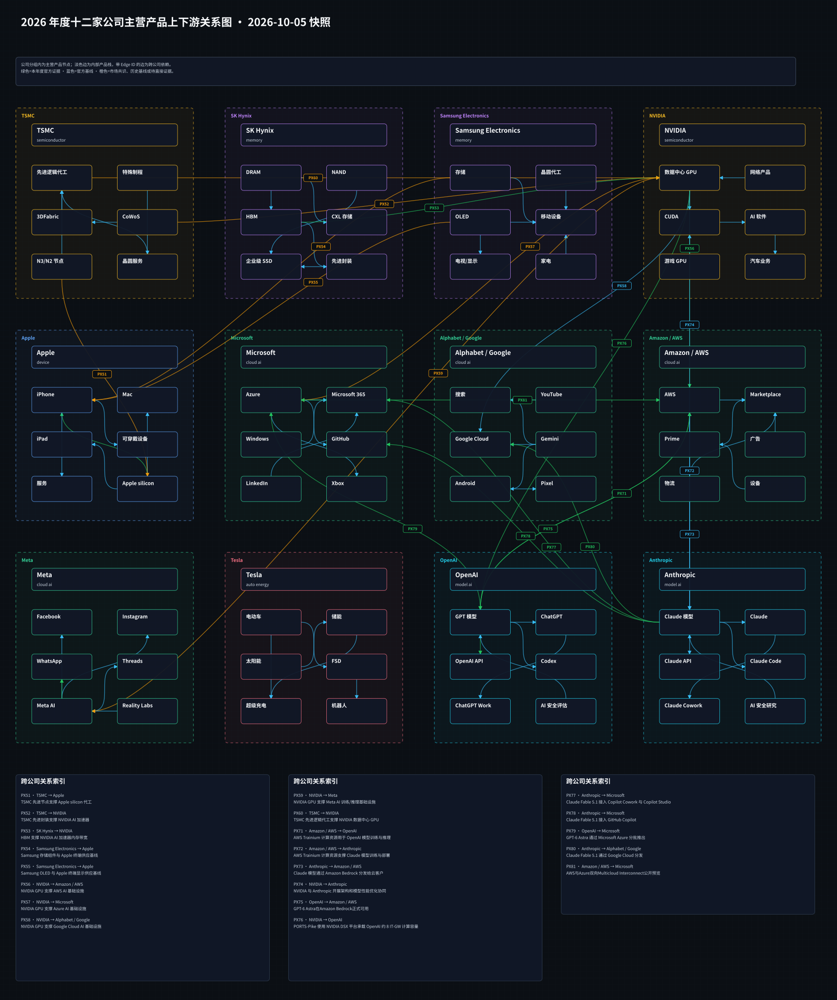
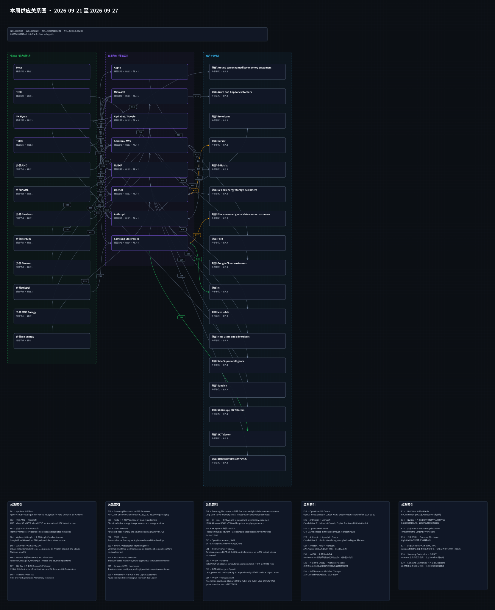

# 周一晨间科技巨头简报
<!-- weekly-brief-schema: 2 -->
<!-- company-selection: top5 -->
<!-- point-in-time-policy: 1 -->
- 覆盖期间：2026-09-28 至 2026-10-04（Asia/Shanghai）
- 生成时间：2026-10-08 13:16:18（Asia/Shanghai）
- 截止时点：2026-10-05 00:00（Asia/Shanghai，不含该时刻）
- 本期文件：reports/2026-10-05_weekly_morning_brief.md
- 阅读口径：12家公司各选0-5条最重要的独立事项，有限筛选而非零遗漏；0条不表示公司没有变化。
- 版本限制：本稿在对应周一截止后事后补写，只核对当周已公开的具体事实，不是当时已经可交易的周一报告，也不能直接作原周一回测输入。

## 1. 本周最重要的 12 件事
1. **Tesla：公布2026年第三季度产销和储能部署。** 重要性：交付规模可核，但财务质量与售价仍未知。 [来源](https://ir.tesla.com/press-release/tesla-third-quarter-2026-production-deliveries-and-deployments)
2. **NVIDIA：董事会增加1500亿美元回购授权。** 重要性：股东回报弹性增加，不应从授权额推算当期现金流出。 [来源](https://apnews.com/article/e695d7024ad68b0defd6fb2fc1aa25d7)
3. **OpenAI：FTC调查在本周获公开确认。** 重要性：代理安全与消费者保护监管不确定性增加。 [来源](https://apnews.com/article/89ac416717adbfb1d72f2d85e6ce83d1)
4. **Anthropic：FTC调查在本周获公开确认。** 重要性：消费者保护与国防采购属不同法律风险线，均需后续文件。 [来源](https://apnews.com/article/89ac416717adbfb1d72f2d85e6ce83d1)
5. **Alphabet / Google：公布Gemini 4 Argon有限开放。** 重要性：前沿模型进入有限安全部署，商业范围和成本待验证。 [来源](https://blog.google/innovation-and-ai/models-and-research/gemini-models/gemini-4-argon/)
6. **OpenAI：GPT-6.1 Sol进入Work、Codex和API。** 重要性：模型成本与能力竞争加剧，商业使用量仍待披露。 [来源](https://openai.com/index/introducing-gpt-6-1-sol/)
7. **Anthropic：Claude Sonnet 5.5发布。** 重要性：中档模型竞争更激烈，实际任务成本需复测。 [来源](https://www.marketscreener.com/news/anthropic-rolls-out-second-claude-5-5-model-as-it-builds-toward-ipo-ce785adcd18ef02d)
8. **Samsung Electronics：Samsung六家关联企业拟合计投资Helix 10亿美元。** 重要性：AI数据中心资本布局扩大，分部财务影响尚不清晰。 [来源](https://news.samsung.com/global/samsung-to-invest-usd-1-billion-in-ai-infrastructure-company-helix)
9. **SK Hynix：澄清Solidigm融资和上市传闻尚无决定。** 重要性：eSSD资本配置与股东摊薄风险成为观察重点，当前无已核交易。 [来源](https://news.skhynix.com/en/fact-11/)
10. **Amazon / AWS：宣布美国数据中心社区五年新增逾10亿美元承诺。** 重要性：数据中心扩张的社区成本与许可协调更受关注，支出确认待后续。 [来源](https://apnews.com/article/91b65ba1729540c1c0d92e35deef35d8)
11. **Microsoft：发布流式转录与新语音模型。** 重要性：语音代理基础模型竞争加快，客户付费量未知。 [来源](https://microsoft.ai/news/our-first-streaming-transcription-model/)
12. **Meta：Muse扩展小企业连接器。** 重要性：代理切入中小企业工作流，转化与广告增量未知。 [来源](https://about.fb.com/news/2026/09/introducing-muse-small-business/)

## 2. 投资判断速览
| 公司 | 本周变化 | 影响指标 | 预期差 | 判断 | 验证条件 |
| --- | --- | --- | --- | --- | --- |
| Apple | 本期未筛选到经核实的重要更新，有限范围见3节 | 维持上期观察，不新增指标 | 暂不可验证 | 不等于无变化或风险解除 | 出现具日期重大披露再更新 |
| Microsoft | 发布流式转录与新语音模型 | 音频处理量、每小时价格、质量 | 无可核同口径一致预期，暂不可验证 | 按公告阶段及来源限制判断，不给买卖评级 | 核对可用渠道及独立同任务评估。 |
| Alphabet / Google | 公布Gemini 4 Argon有限开放 | 开放层级、开发者可用性、单位任务成本 | 无可核同口径一致预期，暂不可验证 | 按公告阶段及来源限制判断，不给买卖评级 | 核对后续公开API或企业正式准入。 |
| Amazon / AWS | 宣布美国数据中心社区五年新增逾10亿美元承诺 | 实际支出、项目地点、建设许可 | 无可核同口径一致预期，暂不可验证 | 按公告阶段及来源限制判断，不给买卖评级 | 跟踪年度项目金额与地方审批。 |
| Meta | Muse扩展小企业连接器 | 企业接入、任务完成率、广告支出 | 无可核同口径一致预期，暂不可验证 | 按公告阶段及来源限制判断，不给买卖评级 | 核对实际可用地区、审批控制与付费采用。 |
| NVIDIA | 董事会增加1500亿美元回购授权 | 实际回购额、现金流、资本开支 | 无可核同口径一致预期，暂不可验证 | 按公告阶段及来源限制判断，不给买卖评级 | 跟踪SEC季报中的执行金额及现金流。 |
| Tesla | 公布2026年第三季度产销和储能部署 | Q3交付、储能GWh、后续财报毛利 | 无可核同口径一致预期，暂不可验证 | 按公告阶段及来源限制判断，不给买卖评级 | 10月21日核对实际营收、毛利和现金流。 |
| OpenAI | GPT-6.1 Sol进入Work、Codex和API；FTC调查在本周获公开确认 | API调用、推理成本、Work采用 | 无可核同口径一致预期，暂不可验证 | 按公告阶段及来源限制判断，不给买卖评级 | 独立同任务复测并核对Chat开放状态。 |
| Anthropic | Claude Sonnet 5.5发布；FTC调查在本周获公开确认 | API调用、同任务成本、客户留存 | 无可核同口径一致预期，暂不可验证 | 按公告阶段及来源限制判断，不给买卖评级 | 核对第三方复测和企业迁移。 |
| Samsung Electronics | Samsung六家关联企业拟合计投资Helix 10亿美元 | 实际出资、持股、设备订单 | 无可核同口径一致预期，暂不可验证 | 按公告阶段及来源限制判断，不给买卖评级 | 核对交割、持股及实际采购协议。 |
| SK Hynix | 澄清Solidigm融资和上市传闻尚无决定 | 融资结构、潜在摊薄、eSSD投资 | 无可核同口径一致预期，暂不可验证 | 按公告阶段及来源限制判断，不给买卖评级 | 等待董事会决定及监管申报，核对实际融资条款。 |
| TSMC | 本期未筛选到经核实的重要更新，有限范围见3节 | 维持上期观察，不新增指标 | 暂不可验证 | 不等于无变化或风险解除 | 出现具日期重大披露再更新 |

## 3. 发生变化的公司
### 3.1 Microsoft
<!-- candidate: MS-VOICE -->
- 日期：2026-10-01（原来源日期；公开精度见证据账）
- 事件：Microsoft于10月1日推出MAI-Transcribe-2-Streaming，并公布MAI-Voice-2.1和Flash语音模型；官方给出的流式转录支持60种语言及每小时0.54美元年内引入价，不是已实现收入。
- 投资影响：语音代理基础模型竞争加快，客户付费量未知。
- 影响指标：音频处理量、每小时价格、质量
- 预期差：无截至该期同口径一致预期，暂不可验证。
- 验证条件：核对可用渠道及独立同任务评估。
- 可信度：Microsoft AI具日期正文；排行榜及延迟属特定测试。
- 来源：[原始来源](https://microsoft.ai/news/our-first-streaming-transcription-model/)

### 3.2 Alphabet / Google
<!-- candidate: GOO-ARGON -->
- 日期：2026-09-30（原来源日期；公开精度见证据账）
- 事件：Google于9月30日宣布Gemini 4 Argon先向Fairwind计划的可信网络防御方逐步开放；开发者、企业与消费者更广泛开放尚在未来，不能写成全面GA。
- 投资影响：前沿模型进入有限安全部署，商业范围和成本待验证。
- 影响指标：开放层级、开发者可用性、单位任务成本
- 预期差：无截至该期同口径一致预期，暂不可验证。
- 验证条件：核对后续公开API或企业正式准入。
- 可信度：Google具日期正文第248-249行；未用页面AI生成摘要。
- 来源：[原始来源](https://blog.google/innovation-and-ai/models-and-research/gemini-models/gemini-4-argon/)

### 3.3 Amazon / AWS
<!-- candidate: AWS-COMMUNITY -->
- 日期：2026-10-02（原来源日期；公开精度见证据账）
- 事件：AP于10月2日报道Amazon宣布未来五年向美国数据中心社区新增投资逾10亿美元；这是未来承诺，不是本周已经支出，也与此前既有投入分开。
- 投资影响：数据中心扩张的社区成本与许可协调更受关注，支出确认待后续。
- 影响指标：实际支出、项目地点、建设许可
- 预期差：无截至该期同口径一致预期，暂不可验证。
- 验证条件：跟踪年度项目金额与地方审批。
- 可信度：AP具时间报道；Amazon公司原文核实五年新增承诺和美国起步范围。
- 来源：[原始来源](https://apnews.com/article/91b65ba1729540c1c0d92e35deef35d8)；[公司公告](https://www.aboutamazon.com/news/company-news/amazon-data-centers-built-together)

### 3.4 Meta
<!-- candidate: META-SMB -->
- 日期：2026-09-29（原来源日期；公开精度见证据账）
- 事件：Meta于9月29日宣布Muse for Small Business，加入Facebook/Instagram业务账户及第三方工具连接；公司称发布、发送和支出均须用户批准，不能写成无人监督自动投放。
- 投资影响：代理切入中小企业工作流，转化与广告增量未知。
- 影响指标：企业接入、任务完成率、广告支出
- 预期差：无截至该期同口径一致预期，暂不可验证。
- 验证条件：核对实际可用地区、审批控制与付费采用。
- 可信度：Meta具日期正文；既有Muse首发不重复。
- 来源：[原始来源](https://about.fb.com/news/2026/09/introducing-muse-small-business/)

### 3.5 NVIDIA
<!-- candidate: NV-BUYBACK -->
- 日期：2026-09-28（原来源日期；公开精度见证据账）
- 事件：AP于9月28日报道NVIDIA董事会追加1500亿美元股票回购授权，使剩余额度达2350亿美元；授权不是已执行回购，公司预计至2028财年执行剩余计划。
- 投资影响：股东回报弹性增加，不应从授权额推算当期现金流出。
- 影响指标：实际回购额、现金流、资本开支
- 预期差：无截至该期同口径一致预期，暂不可验证。
- 验证条件：跟踪SEC季报中的执行金额及现金流。
- 可信度：NVIDIA公告核金额与未来执行期；AP 9月28日具UTC时间报道证明边界日内可得。
- 来源：[原始来源](https://apnews.com/article/e695d7024ad68b0defd6fb2fc1aa25d7)；[公司公告](https://nvidianews.nvidia.com/news/nvidia-announces-a-150-billion-share-repurchase-authorization-increase/)

### 3.6 Tesla
<!-- candidate: TSLA-Q3 -->
- 日期：2026-10-02（原来源日期；公开精度见证据账）
- 事件：Tesla公布2026年第三季度生产464,391辆、交付486,532辆及储能部署13.7GWh；财务利润和现金流须等10月21日财报，交付不能直接当营收或利润。
- 投资影响：交付规模可核，但财务质量与售价仍未知。
- 影响指标：Q3交付、储能GWh、后续财报毛利
- 预期差：无截至该期同口径一致预期，暂不可验证。
- 验证条件：10月21日核对实际营收、毛利和现金流。
- 可信度：Tesla IR 10月2日原表；期间、单位、未发布财务结果分开。
- 来源：[原始来源](https://ir.tesla.com/press-release/tesla-third-quarter-2026-production-deliveries-and-deployments)

### 3.7 OpenAI
<!-- candidate: OA-SOL61 -->
- 日期：2026-09-29（原来源日期；公开精度见证据账）
- 事件：OpenAI 9月29日产品条目宣布GPT-6.1 Sol，适用于ChatGPT Work、Codex与API；官方原文称尚未在Chat开放，自测性能不是客户工作流结果。
- 投资影响：模型成本与能力竞争加剧，商业使用量仍待披露。
- 影响指标：API调用、推理成本、Work采用
- 预期差：无截至该期同口径一致预期，暂不可验证。
- 验证条件：独立同任务复测并核对Chat开放状态。
- 可信度：OpenAI新闻索引9月29日条目与产品正文可用性段；不引10月7日新版。
- 来源：[原始来源](https://openai.com/index/introducing-gpt-6-1-sol/)

<!-- candidate: OA-FTC -->
- 日期：2026-09-30（原来源日期；公开精度见证据账）
- 事件：AP于9月30日报道FTC发言人确认对OpenAI、Anthropic等AI企业的消费者风险调查；报道指出调查此前已进行数月，本周增量是公开确认，不是本周立案或已有违规认定。
- 投资影响：代理安全与消费者保护监管不确定性增加。
- 影响指标：FTC公开文件、补救要求、调查结论
- 预期差：无截至该期同口径一致预期，暂不可验证。
- 验证条件：等待FTC正式文件或公司具日期回应。
- 可信度：AP具UTC时间报道与FTC发言人确认；不推定指控成立。
- 来源：[原始来源](https://apnews.com/article/89ac416717adbfb1d72f2d85e6ce83d1)

### 3.8 Anthropic
<!-- candidate: AN-SONNET -->
- 日期：2026-09-28（原来源日期；公开精度见证据账）
- 事件：Reuters于9月28日美东14:01报道Anthropic发布Claude Sonnet 5.5；官方价格为每百万输入/输出token 2/10美元，性能及任务成本改善为公司测试，非客户普遍结果。
- 投资影响：中档模型竞争更激烈，实际任务成本需复测。
- 影响指标：API调用、同任务成本、客户留存
- 预期差：无截至该期同口径一致预期，暂不可验证。
- 验证条件：核对第三方复测和企业迁移。
- 可信度：Anthropic具日期模型页与Reuters精确时刻；边界日不使用未知时区50小时区间硬判。
- 来源：[原始来源](https://www.marketscreener.com/news/anthropic-rolls-out-second-claude-5-5-model-as-it-builds-toward-ipo-ce785adcd18ef02d)；[公司公告](https://www.anthropic.com/claude-sonnet-5-5)

<!-- candidate: AN-FTC -->
- 日期：2026-09-30（原来源日期；公开精度见证据账）
- 事件：AP于9月30日报道FTC发言人确认对Anthropic、OpenAI等AI企业的消费者风险调查；本周公开的是既有调查，不是违规裁决，也不表示9月25日国防部指定争议已解决。
- 投资影响：消费者保护与国防采购属不同法律风险线，均需后续文件。
- 影响指标：FTC文件、合规成本、后续裁判
- 预期差：无截至该期同口径一致预期，暂不可验证。
- 验证条件：分别跟踪FTC和国防部诉讼，不混为一案。
- 可信度：AP具UTC时间报道；与上期国防部程序严格区分。
- 来源：[原始来源](https://apnews.com/article/89ac416717adbfb1d72f2d85e6ce83d1)

### 3.9 Samsung Electronics
<!-- candidate: SS-HELIX -->
- 日期：2026-09-29（原来源日期；公开精度见证据账）
- 事件：Samsung公告六家关联企业合计投资Helix 10亿美元，其中Samsung Electronics为5亿美元，其余由五家关联企业承担；这是投资公告，不等于已取得Helix设备供应合同或已实现收入。
- 投资影响：AI数据中心资本布局扩大，分部财务影响尚不清晰。
- 影响指标：实际出资、持股、设备订单
- 预期差：无截至该期同口径一致预期，暂不可验证。
- 验证条件：核对交割、持股及实际采购协议。
- 可信度：Samsung 9月29日原文具公司分摊；不把集团10亿美元全部记到电子公司。
- 来源：[原始来源](https://news.samsung.com/global/samsung-to-invest-usd-1-billion-in-ai-infrastructure-company-helix)

### 3.10 SK Hynix
<!-- candidate: SK-SOLIDIGM -->
- 日期：2026-10-01（原来源日期；公开精度见证据账）
- 事件：SK Hynix于10月1日就Solidigm融资和可能双重上市的市场关切正式澄清：内部或外部融资方案均未确定，未来将比较对现有股东经济价值的影响；这是对传闻的新澄清，不是已决定IPO、融资或新增产能。
- 投资影响：eSSD资本配置与股东摊薄风险成为观察重点，当前无已核交易。
- 影响指标：融资结构、潜在摊薄、eSSD投资
- 预期差：无截至该期同口径一致预期，暂不可验证。
- 验证条件：等待董事会决定及监管申报，核对实际融资条款。
- 可信度：SK Hynix具日期FACT原文；Yonhap同日14:55韩国时间报道交叉，均只证明尚无决定。
- 来源：[原始来源](https://news.skhynix.com/en/fact-11/)；[独立报道](https://en.yna.co.kr/view/AEN20261001007600320)

### 3.11 无重大变化公司
- Apple：本期有限检查包括官方新闻/投资者入口及独立媒体或监管线索，未选入可核重要增量；不表示全公司无事，也不解除旧风险。
- TSMC：本期有限检查包括官方新闻/投资者入口及独立媒体或监管线索，未选入可核重要增量；不表示全公司无事，也不解除旧风险。

## 4. 跨公司与产业链判断
1. 财务与资本数字只按当期口径理解：Tesla交付与储能不代表利润，NVIDIA的2350亿美元是剩余授权而非已回购，Samsung Electronics在Helix的承诺为5亿美元而非集团10亿美元；SK Hynix对Solidigm融资尚无决定。
2. 前沿模型发布节奏加快但可用范围不同。Gemini 4 Argon仍是可信防御方有限开放；GPT-6.1 Sol进入Work/Codex/API而非Chat；Sonnet 5.5成本改善主要是公司自测。
3. FTC调查公开确认应与旧调查启动时间分离；OpenAI和Anthropic均尚无公开违规认定，Anthropic的国防部诉讼则是另一条程序。

## 5. 下周催化与验证条件
1. 触发条件：下周监测Tesla第三季度产销数据有无更正；营收、毛利和现金流须等10月21日财报，不把该日期说成下周。 可能影响：数据更正会改变交付基数，财务质量判断留待财报。
2. 触发条件：FTC若发布正式调查文件，再核消费者风险调查的范围与对象；没有文件不推定处罚或结案。 可能影响：OpenAI和Anthropic的合规成本判断。
3. 触发条件：Gemini 4 Argon若扩大准入、GPT-6.1 Sol若在Chat开放，分别核对实际可用用户群。 可能影响：当前有限开放的竞争判断。
4. 触发条件：Helix若披露出资或采购协议、Amazon若披露社区计划支出、Solidigm若有正式融资决定，再更新相应资本口径。 可能影响：资本承诺兑现和现有股东潜在摊薄。

## 6. 研究附录：产业链与图谱
### 6.1 图谱更新状态与可视化
- 产品图：本期更新2026-10-05版本；季度首个周一例行刷新，刷新不自动升级旧边证据。

[Obsidian Canvas 源文件](../assets/2026-10-05_product_relationships.canvas)
- 供应图：沿用2026-09-28版本；本周无新增、强化、弱化或风险关系。公告、计划及资本投资不画成已完成供货。

[Obsidian Canvas 源文件](../assets/2026-09-28_supply_relationships.canvas)

### 6.2 本周供应关系变化表
本周无供应关系实质变化；资本投资和产品发布不画成现货供应。

### 6.3 与上周的区别
- 相较9月28期，本期新增模型准入、FTC调查公开确认、回购授权及资本承诺等观察点；未核得新的供应合同或交付。供应图沿用9月28日冻结版，产品图仅按季度规则刷新，旧边继续保留原证据日期与阶段。

## 7. 本期自检
- 本期12个独立入选事项，12家公司各0-5项，头条12项均来自详情。
- 在9月28日已冻结事项基础上仅选本周增量12项。Apple、TSMC有限官方与独立筛选后无入选事项；10月1日SK Hynix对Solidigm融资传闻的澄清是本周新声明，不将未决定的方案写成IPO。10月5日上海零点以后内容及10月7/8日更新不倒填。
- 日期仅有日级精度时按完整全球50小时区间审核；跨周边界另用具时区报道，不假设午夜。
- 媒体报道、公司自测、未来承诺、调查与已完成结果分层；四项语义复核和源审查记录见本期logs。
